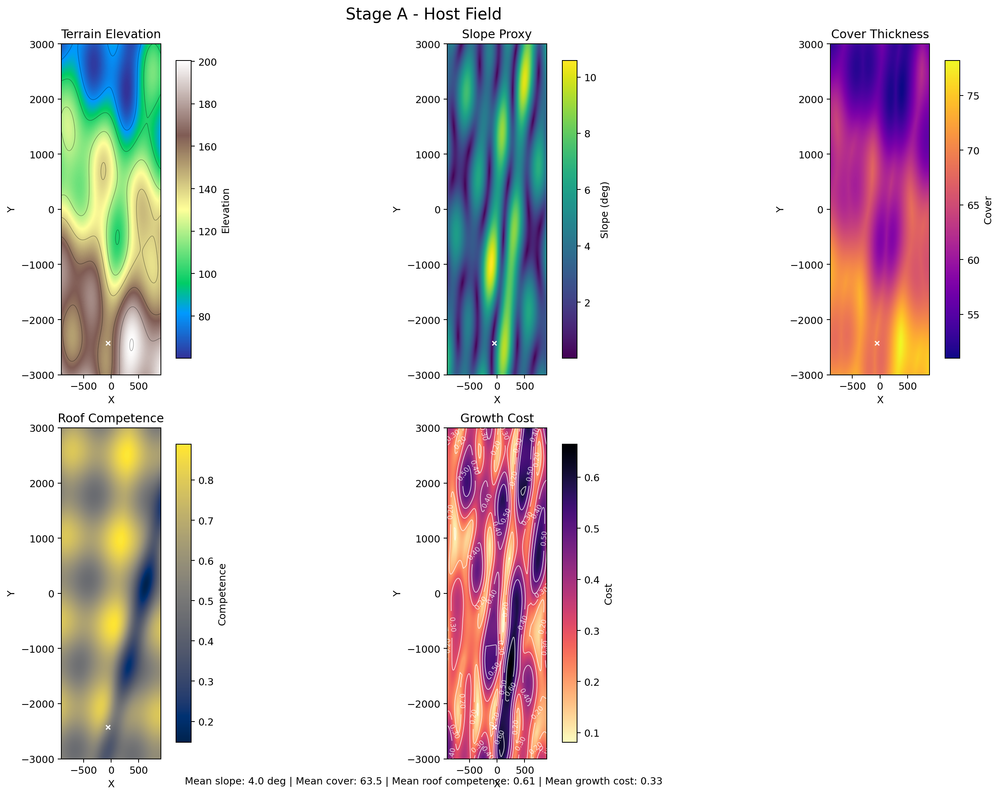
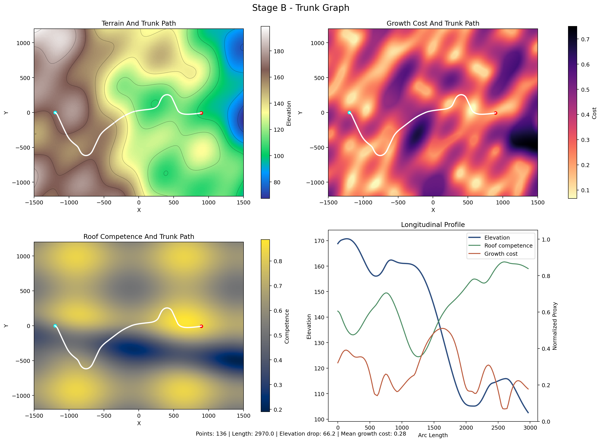
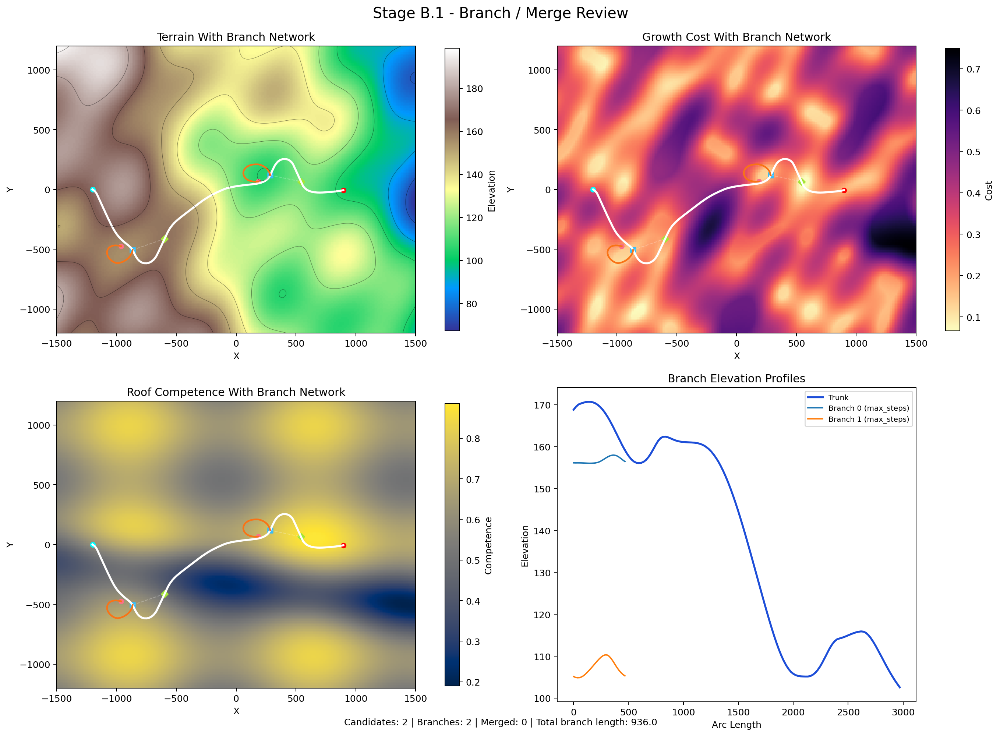

# PLUME-Advanced

`PLUME-Advanced` is a staged procedural pyroduct / lava-tube prototype.

The current implementation focuses on the part that matters before mesh
generation: build a readable terrain substrate, derive a few structural layers,
and grow a first downhill centerline graph. The later geometry and texturing
stages are intentionally not implemented yet.

## Pipeline

| Stage | Status | Purpose | Current Output |
|---|---|---|---|
| A. Host Field | Implemented | Build terrain and structural layers | `outputs/stage_a_host_field.png` |
| B. Graph | Implemented | Grow a first downhill trunk centerline | `outputs/stage_b_trunk_graph.png` |
| B.1 Branch / Merge Sub-Stage | Implemented, isolated | Generate side branches and reconnections without changing the stable trunk stage | `outputs/stage_b1_branch_merge.png` |
| C. Section Field | Placeholder | Width, height, and orientation along arc length | TODO |
| D. Geometry | Placeholder | Sweep sections into a continuous volume / mesh | TODO |
| E. Geological Events | Placeholder | Skylights, choke points, collapse, infill | TODO |
| F. Surface Detail / Texturing | Placeholder | Wall detail, floor variation, material masks | TODO |

## Current Outputs

### Stage A: Host Field



Stage A produces the terrain substrate and the main scalar layers used by later
stages: elevation, slope, cover thickness, roof competence, and growth cost.

### Stage B: Trunk Graph



Stage B grows a first downhill trunk path over the host field and visualizes it
in plan view and in longitudinal profile.

### Stage B.1: Branch / Merge Review



Stage B.1 visualizes a loop-heavy branch mix around the stable trunk: local
bypass loops, longer downstream reconnect loops, and shorter dead-end spurs.

## How It Works

### Stage A: Host Field

Implemented in `src/stages/host_field.py`.

The terrain is not a full volcanic edifice. It is a simplified pyroduct-oriented
host slab:

- high on the left, low on the right
- shaped by a broad central corridor
- perturbed by a few low-frequency directional waves

Conceptually:

```text
terrain = large-scale directional grade
        - corridor depression
        + low-frequency waves
```

Once the terrain exists, the remaining host-field layers are either derived from
it or authored on top of it.

| Layer | Built From | Used Now | Intended Later Use |
|---|---|---|---|
| `elevation` | directional grade + corridor + waves | terrain profile, downhill direction | surface interaction, skylights |
| `gradient_x`, `gradient_y` | `np.gradient(elevation)` | downhill steering for graph growth | path-cost and event logic |
| `slope_degrees` | gradient magnitude | cover thickness, diagnostics, growth cost | gating unstable or unrealistic zones |
| `cover_thickness` | base thickness + relief bonus - slope penalty | growth cost, graph diagnostics | collapse and skylight rules |
| `roof_competence` | structural bands + fracture corridor + edge weathering | growth cost, graph diagnostics | ceiling roughness, collapse, material masks |
| `growth_cost` | weighted slope, cover, and competence penalties | visualization, summaries | future explicit path scoring |

The `HostField` API currently exposes:

- `sample(x, y)`: bilinear sample of all fields
- `contains(x, y, margin=0.0)`: map bounds check
- `downhill_direction(x, y, fallback_angle_degrees=None)`: normalized downhill vector

### Stage B: Graph

Implemented in `src/stages/graph.py`.

Stage B currently generates a single trunk only:

- no branches yet
- no merges yet
- no spline fitting yet
- no geometry yet

The trunk starts from `host_field.config.seed_point` and advances one step at a
time. At each step, the tangent is built from these components:

| Steering Component | Role |
|---|---|
| downhill direction | follows the local terrain gradient |
| global flow bias | preserves large-scale left-to-right progression |
| corridor pull | keeps the path near the broad host corridor |
| meander | adds smooth lateral variation without random jitter |
| tangent blend | smooths turning from one step to the next |
| forward-flow constraint | prevents local backward reversal |

The trunk stops when:

- `max_steps` is reached
- the next step would leave the map margin
- the next step climbs more than `max_uphill_step`

Important implementation detail: Stage B does **not** use `growth_cost`
directly for steering yet. It currently uses terrain gradient and flow control,
while `growth_cost` is visualized and sampled for later stages.

### Stage B.1: Branch / Merge Sub-Stage

Implemented in `src/stages/branching.py`.

This sub-stage is intentionally separated from `src/stages/graph.py` so the
current trunk generator remains stable. The branch/merge generator works from:

- the existing `HostField`
- the already-generated `TrunkGraph`

It currently:

- scores candidate junctions along the trunk
- builds a loop-heavy branch plan with separate local-bypass loops, downstream reconnect loops, and spurs
- generates reconnecting loops in `src/stages/branching_loop_astar.py` using an off-trunk waypoint plus two A* legs
- generates dead-end spurs in `src/stages/branching_spur.py` with a lighter local-growth solver
- records merge events only for the reconnecting loop classes

The key design choice is structural isolation: branch and merge experimentation
can evolve independently without destabilizing the central trunk stage.

## Configuration

The single source of truth is:

```text
config/project.toml
```

It is loaded by `src/config.py`, which converts TOML sections into dataclass
configs for the generators.

Execution flow:

1. load `config/project.toml`
2. build `HostFieldConfig` and `GraphConfig`
3. run the stage generator
4. run the stage plotter
5. write the image in `outputs/`

### Host Field Config

| Key Group | Purpose |
|---|---|
| `seed_point` | starting region for the graph |
| `high_side_elevation`, `longitudinal_drop`, `flow_angle_degrees` | define the large-scale terrain grade |
| `corridor_depth`, `corridor_width` | shape the broad host corridor |
| `volcanic_layer_thickness`, `minimum_stable_cover` | control the cover-thickness proxy |
| `roof_competence_baseline`, `roof_competence_variation` | control the base structural field |
| `fracture_zone_*` | carve the weakened roof corridor |
| `[host_field.grid]` | map dimensions and sample resolution |
| `[[host_field.waves]]` | low-frequency terrain deformation layers |

### Graph Config

| Key Group | Purpose |
|---|---|
| `step_length`, `max_steps`, `boundary_margin` | control graph growth length and bounds |
| `tangent_blend` | smooth directional updates |
| `downhill_weight`, `flow_bias_weight`, `corridor_pull_weight` | steering weights |
| `meander_amplitude_degrees`, `meander_wavelength` | lateral wandering pattern |
| `minimum_flow_component` | enforce forward motion |
| `max_uphill_step` | reject overly uphill moves |

### Branch / Merge Config

| Key Group | Purpose |
|---|---|
| `max_branch_count`, `candidate_pool_multiplier`, `junction_margin_points`, `min_junction_arc_separation` | control candidate density and total branch budget |
| `minimum_local_bypass_count`, `minimum_downstream_loop_count` | guarantee that both loop classes appear in the review stage |
| `local_bypass_weight`, `downstream_reconnect_weight`, `spur_weight` | bias the branch-kind mix |
| `[branching.loop]` | configure reconnecting-loop pathfinding, waypoint search, clearance, detour, and area thresholds |
| `[branching.spur]` | configure local dead-end spur growth and stop conditions |

## Project Layout

- `config/`: project configuration
- `scripts/`: stage entrypoints
- `src/config.py`: TOML loader
- `src/stages/`: stage implementations
- `src/visualization/`: stage visualizations
- `outputs/`: generated images
- `tests/`: smoke tests

## Run

Install dependencies:

```bash
python -m pip install -e .
```

Generate the current cave network with the single entrypoint:

```bash
python scripts/generate_cave.py
```

Optional:

```bash
python scripts/generate_cave.py --config config/project.toml --output outputs/stage_b_cave_network.png
```

Legacy stage-specific scripts remain available:

```bash
python scripts/render_host_field.py
python scripts/render_graph.py
python scripts/render_branching.py
python scripts/render_network.py
```

All scripts read `config/project.toml` by default.

## Planned Stages

These are placeholders for the next implementation passes.

### Stage B: Cave Network

Alternative implementation path now available.

Implemented role:

- generate a braided cave network from an occupancy-first field rather than a single trunk
- allow repeated split/merge behavior and internal islands
- support nested scales with a fine local braid plus medium and large bypass-loop structure
- derive the dominant route after the network is built instead of assuming it upfront
- rasterize a cave occupancy mask and keep a graph representation for later stages

Entrypoint:

```bash
python scripts/render_network.py
```

The older `branching` sub-stage remains in the repository, but the default
project configuration is now tuned for the network-first Stage B path.

### Stage C: Section Field

Placeholder.

Planned role:

- assign width, height, and section orientation along the graph
- keep radius evolution smooth over arc length
- prepare the data needed for swept geometry

### Stage D: Geometry

Placeholder.

Planned role:

- sweep the section field along the centerline
- build an implicit volume / SDF
- extract a continuous mesh

### Stage E: Geological Events

Placeholder.

Planned role:

- inject skylights, choke points, collapse, and infill
- tie those events to graph position and host-field conditions

### Stage F: Surface Detail / Texturing

Placeholder.

Planned role:

- add wall and floor detail
- derive texturing masks from competence, events, and geometry
- avoid using detail noise to define topology

## Summary

The current project state is intentionally narrow:

- Stage A builds the terrain and structural substrate
- Stage B builds the first readable downhill trunk graph
- stages C-F are kept as explicit placeholders for the next passes

That keeps the pipeline inspectable while still leaving a clear path toward the
final pyroduct mesh and texture stages.
