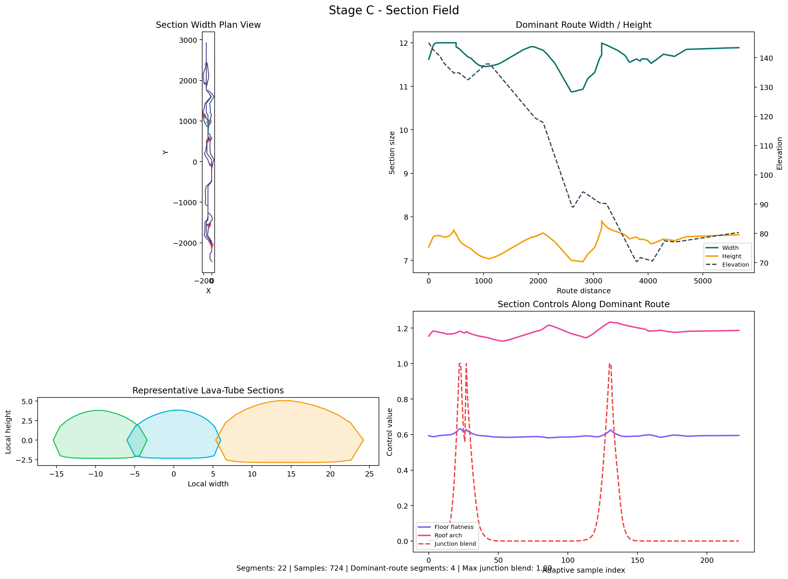
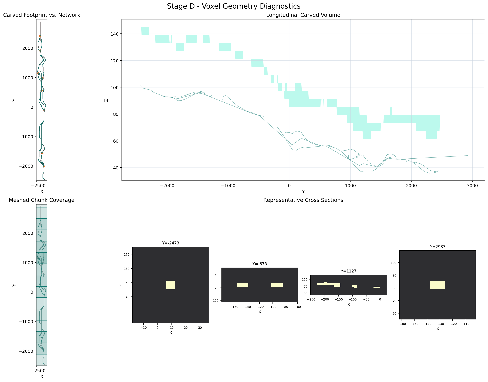
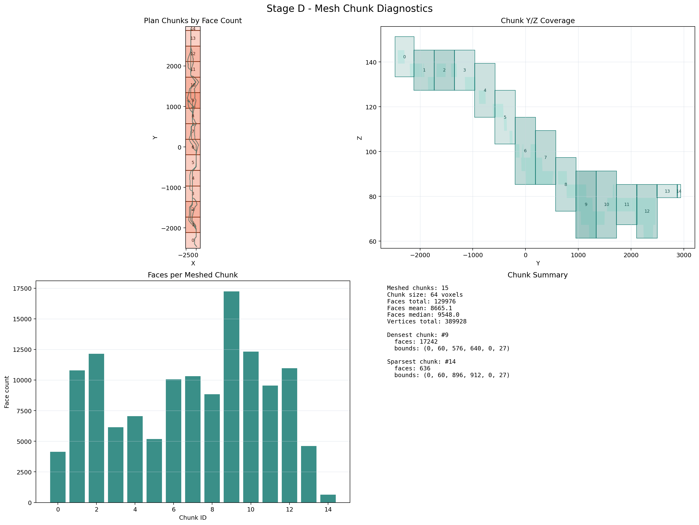
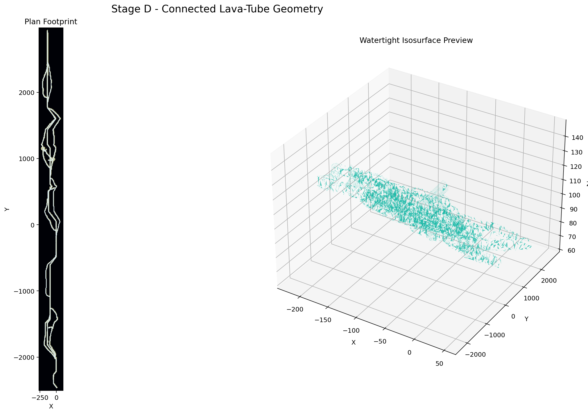

# PLUME-Advanced

`PLUME-Advanced` is a staged procedural pyroduct / lava-tube prototype.

The current implementation focuses on the full inspectable cave-shape pipeline:
build a readable terrain substrate, derive a cave-network skeleton, generate a
geometry-ready section field around that skeleton, stamp that network into a
voxel density grid, and mesh the carved volume. Later surface/texturing stages
are still intentionally incomplete.

## Pipeline

| Stage | Status | Purpose | Current Output |
|---|---|---|---|
| A. Host Field | Implemented | Build terrain and structural layers | `outputs/stage_a_host_field.png` |
| B. Cave Network | Implemented | Generate a host-driven braided cave-network skeleton | `outputs/stage_b_cave_network.png` |
| C. Section Field | Implemented | Build adaptive lava-tube cross-sections around the skeleton | `outputs/stage_c_section_field.png` |
| D. Geometry | Implemented | Stamp the cave network into a voxel grid and polygonize the density field | `outputs/stage_d_geometry.png`, `outputs/stage_d_geometry_chunks.png`, `outputs/stage_d_geometry_presentation.png` |
| E. Geological Events | Placeholder | Skylights, choke points, collapse, infill | TODO |
| F. Surface Detail / Texturing | Placeholder | Wall detail, floor variation, material masks | TODO |

## Current Outputs

### Stage A: Host Field


Stage A produces the terrain substrate and the main scalar layers used by later
stages: elevation, slope, cover thickness, roof competence, and growth cost.

### Stage B: Cave Network


Stage B generates the current default output: a host-driven braided cave-network
skeleton with split/rejoin structure, islands, chamber-like expansions, and
segment metadata for later geometry stages.

### Stage C: Section Field



Stage C generates geometry-ready cross-section samples along the network:
adaptive sample spacing, underground centerline placement, 3D local frames,
lava-tube profile controls, and junction-aware blending through split/merge
regions.

### Stage D: Geometry







Stage D converts the Stage-C samples into a carved density field. It stamps
capsule tunnels and widened junction/chamber regions into a voxel grid, then
meshes the zero-density isosurface in chunks. The diagnostic render focuses on
footprint alignment, longitudinal continuity, chunk coverage, and section
slices. The chunk render isolates chunk coverage, face-count distribution, and
Y/Z chunk spans. The presentation render gives a cleaner plan/mesh preview.

## How It Works

### Stage A: Host Field

Implemented in `src/stages/host_field.py`.

The terrain is not a full volcanic edifice. It is a simplified pyroduct-oriented
host slab:

- high on the left, low on the right
- shaped by a broad central corridor
- perturbed by a few low-frequency directional waves

Conceptually:

```text
terrain = large-scale directional grade
        - corridor depression
        + low-frequency waves
```

Once the terrain exists, the remaining host-field layers are either derived from
it or authored on top of it.

| Layer | Built From | Used Now | Intended Later Use |
|---|---|---|---|
| `elevation` | directional grade + corridor + waves | terrain profile, downhill direction | surface interaction, skylights |
| `gradient_x`, `gradient_y` | `np.gradient(elevation)` | downhill steering for graph growth | path-cost and event logic |
| `slope_degrees` | gradient magnitude | cover thickness, diagnostics, growth cost | gating unstable or unrealistic zones |
| `cover_thickness` | base thickness + relief bonus - slope penalty | growth cost, graph diagnostics | collapse and skylight rules |
| `roof_competence` | structural bands + fracture corridor + edge weathering | growth cost, graph diagnostics | ceiling roughness, collapse, material masks |
| `growth_cost` | weighted slope, cover, and competence penalties | visualization, summaries | future explicit path scoring |

The `HostField` API currently exposes:

- `sample(x, y)`: bilinear sample of all fields
- `contains(x, y, margin=0.0)`: map bounds check
- `downhill_direction(x, y, fallback_angle_degrees=None)`: normalized downhill vector

### Stage B: Cave Network

Implemented in `src/stages/network.py`.

Stage B now builds the cave skeleton directly instead of starting from a single
trunk. The generator:

- uses the host field and the configured `procedural_seed`
- traces a downhill backbone with host-guided branch motifs
- builds localized asymmetric braid zones
- supports `backbone`, `island_bypass`, `chamber_braid`, `ladder`, `spur`, and `underpass` segment kinds
- records graph metadata such as `z_level`, `merge_behavior`, `crossing_group_id`, `island_id`, and `chamber_id`
- clusters morphologically meaningful split/merge/crossing regions into explicit junction objects
- derives occupancy and graph summaries from the resulting network

### Stage C: Section Field

Implemented in `src/stages/section_field.py`.

Stage C wraps a lava-tube-shaped section field around the Stage-B skeleton.
The generator:

- resamples each segment adaptively based on curvature, width gradient, and junction proximity
- moves the section centerline below the host surface using cover thickness and roof-thickness heuristics
- builds geometry-ready local frames (`tangent`, `normal`, `binormal`)
- derives smooth section controls such as width, height, floor flattening, roof arch, and lateral skew
- uses explicit Stage-B junction regions to blend split/merge morphology without hard jumps at nodes
- records per-sample junction influences for later split/merge volume construction
- stores closed local 2D section contours and scalar profile controls for the voxel geometry stage

### Stage D: Geometry

Implemented in `src/stages/geometry.py`.

Stage D turns the section field into a voxel-first mesh. The generator currently:

- stamps capsule tunnel densities along every segment, with higher density meaning carved space
- stamps widened junction/chamber regions into the same field
- processes the field in 3D chunks
- polygonizes chunk meshes for review and welds one assembled OBJ-ready mesh

## Configuration

The single source of truth is:

```text
config/project.toml
```

It is loaded by `src/config.py`, which converts TOML sections into dataclass
configs for the generators.

Execution flow:

1. load `config/project.toml`
2. build `HostFieldConfig`, `CaveNetworkConfig`, `SectionFieldConfig`, and `GeometryConfig`
3. generate the host field
4. render the host-field plot
5. generate the cave network
6. render the network plot
7. generate the section field
8. render the section-field plot
9. generate the geometry stage
10. render the geometry diagnostic and presentation plots
11. export the assembled geometry OBJ
12. write the artifacts in `outputs/`

`procedural_seed` is the top-level seed for the active pipeline. By default it
feeds the host-field, cave-network, and section-field generators, so changing
one value produces a different geology and a different cave family.

### Host Field Config

| Key Group | Purpose |
|---|---|
| `seed_point` | starting region for the cave system |
| `high_side_elevation`, `longitudinal_drop`, `flow_angle_degrees` | define the large-scale terrain grade |
| `corridor_depth`, `corridor_width` | shape the broad host corridor |
| `volcanic_layer_thickness`, `minimum_stable_cover` | control the cover-thickness proxy |
| `roof_competence_baseline`, `roof_competence_variation` | control the base structural field |
| `fracture_zone_*` | carve the weakened roof corridor |
| `[host_field.grid]` | map dimensions and sample resolution |
| `[[host_field.waves]]` | low-frequency terrain deformation layers |

### Network Config

| Key Group | Purpose |
|---|---|
| `source_*`, `sink_margin`, `trace_max_steps` | control network source/sink setup and trace extent |
| `*_alignment_weight`, `elevation_drop_weight`, `growth_cost_weight`, `roof_weight`, `cover_weight`, `slope_penalty_weight` | bias path selection through the host field |
| `small_*`, `medium_*`, `large_*` | control multi-scale trace counts, attraction, congestion, and flux thresholds |
| `prune_iterations`, `occupancy_smoothing_passes` | simplify the network and clean occupancy artifacts |
| `chamber_*`, `base_passage_radius` | control chamber detection and occupancy painting |
| `spur_*`, `channel_count_samples` | control terminal spur generation and braid sampling |

### Section Field Config

| Key Group | Purpose |
|---|---|
| `base_height_ratio`, `minimum_height_ratio`, `maximum_height_ratio` | control the default lava-tube width/height relationship |
| `minimum_sample_spacing`, `maximum_sample_spacing` | bound adaptive section-sample spacing |
| `curvature_spacing_weight`, `width_gradient_spacing_weight`, `junction_spacing_weight` | make sampling denser where the skeleton or morphology changes faster |
| `profile_resolution` | control local section contour resolution |
| `floor_flatness_*`, `roof_arch_*`, `lateral_skew_amplitude` | shape the lava-tube profile |
| `junction_*_gain` | control how strongly junction regions widen or stay tight through splits/merges |

### Geometry Config

| Key Group | Purpose |
|---|---|
| `voxel_size`, `density_margin` | control field resolution and padding around the stamped cave network |
| `chunk_size` | controls how much of the density grid is polygonized at once |
| `iso_level` | defines the density threshold used for the cave wall surface |
| `tunnel_radius_scale`, `junction_radius_scale`, `chamber_radius_scale` | control how section samples widen while stamping |
| `minimum_radius`, `weld_tolerance` | keep thin passages meshable and weld repeated isosurface vertices |

## Project Layout

- `config/`: project configuration
- `scripts/`: stage entrypoints
- `src/config.py`: TOML loader
- `src/stages/`: stage implementations
- `src/visualization/`: stage visualizations
- `outputs/`: generated images
- `tests/`: smoke tests

## Run

Install dependencies:

```bash
python -m pip install -e .
```

Generate the current cave network with the single entrypoint:

```bash
python scripts/generate_cave.py
```

The generator prints progress bars for configuration loading, stages A-C,
detailed Stage-D voxel/mesh generation, Stage-D visualization, and OBJ export.
Geometry progress reports stamp counts, chunk meshing status, assembled face
counts, and final component counts.

That one command produces:

- `outputs/stage_a_host_field.png`
- `outputs/stage_b_cave_network.png`
- `outputs/stage_c_section_field.png`
- `outputs/stage_d_geometry.png`
- `outputs/stage_d_geometry_chunks.png`
- `outputs/stage_d_geometry_presentation.png`
- `outputs/stage_d_geometry.obj`

Optional:

```bash
python scripts/generate_cave.py \
  --config config/project.toml \
  --output outputs/stage_b_cave_network.png \
  --host-output outputs/stage_a_host_field.png \
  --section-output outputs/stage_c_section_field.png \
  --geometry-output outputs/stage_d_geometry.png \
  --geometry-chunk-output outputs/stage_d_geometry_chunks.png \
  --geometry-presentation-output outputs/stage_d_geometry_presentation.png \
  --geometry-mesh-output outputs/stage_d_geometry.obj
```

Optional host-field debug render:

```bash
python scripts/render_host_field.py
```

Both scripts read `config/project.toml` by default.

## Planned Stages

These are placeholders for the next implementation passes.

### Stage D: Geometry

Implemented as a voxel-density meshing pass.

What exists now:

- one density grid containing the full stamped tunnel network
- chunked isosurface generation for review/progress visualization
- diagnostic, chunk-focused, and presentation Stage-D render artifacts
- OBJ export of one assembled mesh for simulation engines

Still deferred:

- watertight versus blend-ready export modes
- higher-quality normal generation and surface cleanup
- detail/event carving for skylights, collapse, choke points, and infill

### Stage E: Geological Events

Placeholder.

Planned role:

- inject choke points, collapse debris, and infill
- tie those events to graph position and host-field conditions

### Stage F: Surface Detail / Texturing

Placeholder.

Planned role:

- add wall and floor detail
- derive texturing masks from competence, events, and geometry
- avoid using detail noise to define topology

## Summary

The current project state is intentionally narrow:

- Stage A builds the terrain and structural substrate
- Stage B builds the current braided cave-network skeleton
- Stage C builds adaptive lava-tube cross-sections around that skeleton
- Stage D stamps that network into a voxel density field and meshes the isosurface
- stages E-F and watertight/detail work remain for the next passes

That keeps the pipeline inspectable while still leaving a clear path toward the
final pyroduct mesh and texture stages.
