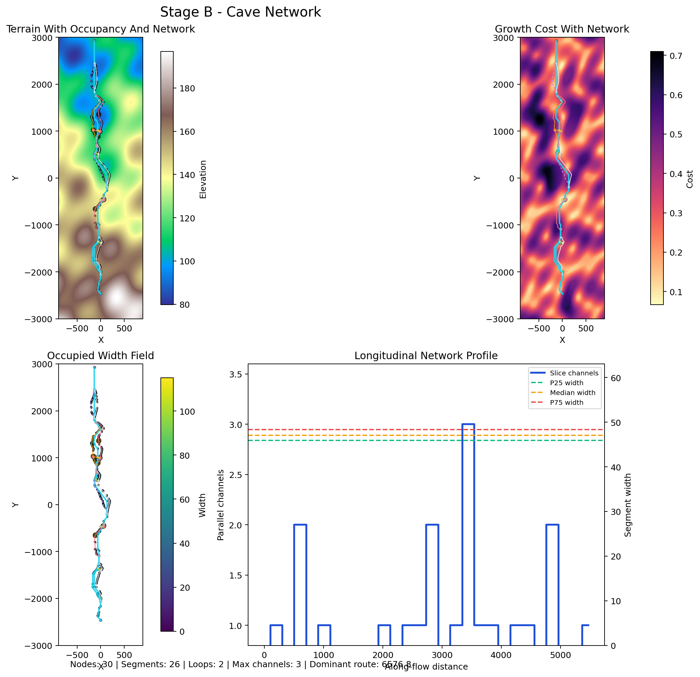

# PLUME-Advanced

`PLUME-Advanced` is a staged procedural pyroduct / lava-tube prototype.

The current implementation focuses on the part that matters before mesh
generation: build a readable terrain substrate, derive a cave-network skeleton,
and keep enough structural metadata to support later geometry work. The later
geometry and texturing stages are intentionally not implemented yet.

## Pipeline

| Stage | Status | Purpose | Current Output |
|---|---|---|---|
| A. Host Field | Implemented | Build terrain and structural layers | `outputs/stage_a_host_field.png` |
| B. Cave Network | Implemented | Generate a host-driven braided cave-network skeleton | `outputs/stage_b_cave_network.png` |
| B. Graph | Legacy | Earlier single-trunk centerline experiment kept for reference | `outputs/stage_b_trunk_graph.png` |
| B.1 Branch / Merge Sub-Stage | Legacy | Earlier trunk-relative loop and spur experiment kept for reference | `outputs/stage_b1_branch_merge.png` |
| C. Section Field | Placeholder | Width, height, and orientation along arc length | TODO |
| D. Geometry | Placeholder | Sweep sections into a continuous volume / mesh | TODO |
| E. Geological Events | Placeholder | Skylights, choke points, collapse, infill | TODO |
| F. Surface Detail / Texturing | Placeholder | Wall detail, floor variation, material masks | TODO |

## Current Outputs

### Stage A: Host Field


Stage A produces the terrain substrate and the main scalar layers used by later
stages: elevation, slope, cover thickness, roof competence, and growth cost.

### Stage B: Cave Network



Stage B generates the current default output: a host-driven braided cave-network
skeleton with split/rejoin structure, islands, chamber-like expansions, and
segment metadata for later geometry stages.

## How It Works

### Stage A: Host Field

Implemented in `src/stages/host_field.py`.

The terrain is not a full volcanic edifice. It is a simplified pyroduct-oriented
host slab:

- high on the left, low on the right
- shaped by a broad central corridor
- perturbed by a few low-frequency directional waves

Conceptually:

```text
terrain = large-scale directional grade
        - corridor depression
        + low-frequency waves
```

Once the terrain exists, the remaining host-field layers are either derived from
it or authored on top of it.

| Layer | Built From | Used Now | Intended Later Use |
|---|---|---|---|
| `elevation` | directional grade + corridor + waves | terrain profile, downhill direction | surface interaction, skylights |
| `gradient_x`, `gradient_y` | `np.gradient(elevation)` | downhill steering for graph growth | path-cost and event logic |
| `slope_degrees` | gradient magnitude | cover thickness, diagnostics, growth cost | gating unstable or unrealistic zones |
| `cover_thickness` | base thickness + relief bonus - slope penalty | growth cost, graph diagnostics | collapse and skylight rules |
| `roof_competence` | structural bands + fracture corridor + edge weathering | growth cost, graph diagnostics | ceiling roughness, collapse, material masks |
| `growth_cost` | weighted slope, cover, and competence penalties | visualization, summaries | future explicit path scoring |

The `HostField` API currently exposes:

- `sample(x, y)`: bilinear sample of all fields
- `contains(x, y, margin=0.0)`: map bounds check
- `downhill_direction(x, y, fallback_angle_degrees=None)`: normalized downhill vector

### Stage B: Cave Network

Implemented in `src/stages/network.py`.

Stage B now builds the cave skeleton directly instead of starting from a single
trunk. The generator:

- uses the host field and the configured `procedural_seed`
- traces a downhill backbone with host-guided branch motifs
- builds localized asymmetric braid zones
- supports `backbone`, `island_bypass`, `chamber_braid`, `ladder`, `spur`, and `underpass` segment kinds
- records graph metadata such as `z_level`, `merge_behavior`, `crossing_group_id`, `island_id`, and `chamber_id`
- derives occupancy and graph summaries from the resulting network

The older trunk and branch/merge implementations remain in the repository as
legacy reference stages. They are no longer the primary pipeline.

## Configuration

The single source of truth is:

```text
config/project.toml
```

It is loaded by `src/config.py`, which converts TOML sections into dataclass
configs for the generators.

Execution flow:

1. load `config/project.toml`
2. build `HostFieldConfig` and `CaveNetworkConfig`
3. generate the host field
4. generate the cave network
5. render the network plot
6. write the image in `outputs/`

`procedural_seed` is the top-level seed for the active pipeline. By default it
feeds both the host-field generator and the cave-network generator, so changing
one value produces a different geology and a different cave family.

### Host Field Config

| Key Group | Purpose |
|---|---|
| `seed_point` | starting region for the cave system |
| `high_side_elevation`, `longitudinal_drop`, `flow_angle_degrees` | define the large-scale terrain grade |
| `corridor_depth`, `corridor_width` | shape the broad host corridor |
| `volcanic_layer_thickness`, `minimum_stable_cover` | control the cover-thickness proxy |
| `roof_competence_baseline`, `roof_competence_variation` | control the base structural field |
| `fracture_zone_*` | carve the weakened roof corridor |
| `[host_field.grid]` | map dimensions and sample resolution |
| `[[host_field.waves]]` | low-frequency terrain deformation layers |

### Network Config

| Key Group | Purpose |
|---|---|
| `source_*`, `sink_margin`, `trace_max_steps` | control network source/sink setup and trace extent |
| `*_alignment_weight`, `elevation_drop_weight`, `growth_cost_weight`, `roof_weight`, `cover_weight`, `slope_penalty_weight` | bias path selection through the host field |
| `small_*`, `medium_*`, `large_*` | control multi-scale trace counts, attraction, congestion, and flux thresholds |
| `prune_iterations`, `occupancy_smoothing_passes` | simplify the network and clean occupancy artifacts |
| `chamber_*`, `base_passage_radius` | control chamber detection and occupancy painting |
| `spur_*`, `channel_count_samples` | control terminal spur generation and braid sampling |

### Legacy Config

`[graph]` and `[branching]` are still parsed and tested, but they exist for the
older trunk-first experimental path rather than the default cave-network
pipeline.

## Project Layout

- `config/`: project configuration
- `scripts/`: stage entrypoints
- `src/config.py`: TOML loader
- `src/stages/`: stage implementations
- `src/visualization/`: stage visualizations
- `outputs/`: generated images
- `tests/`: smoke tests

## Run

Install dependencies:

```bash
python -m pip install -e .
```

Generate the current cave network with the single entrypoint:

```bash
python scripts/generate_cave.py
```

Optional:

```bash
python scripts/generate_cave.py --config config/project.toml --output outputs/stage_b_cave_network.png
```

Legacy stage-specific scripts remain available for the older exploratory path:

```bash
python scripts/render_host_field.py
python scripts/render_graph.py
python scripts/render_branching.py
python scripts/render_network.py
```

All scripts read `config/project.toml` by default.

## Planned Stages

These are placeholders for the next implementation passes.

### Stage C: Section Field

Placeholder.

Planned role:

- assign width, height, and section orientation along the graph
- keep radius evolution smooth over arc length
- prepare the data needed for swept geometry

### Stage D: Geometry

Placeholder.

Planned role:

- sweep the section field along the centerline
- build an implicit volume / SDF
- extract a continuous mesh

### Stage E: Geological Events

Placeholder.

Planned role:

- inject skylights, choke points, collapse, and infill
- tie those events to graph position and host-field conditions

### Stage F: Surface Detail / Texturing

Placeholder.

Planned role:

- add wall and floor detail
- derive texturing masks from competence, events, and geometry
- avoid using detail noise to define topology

## Summary

The current project state is intentionally narrow:

- Stage A builds the terrain and structural substrate
- Stage B builds the current braided cave-network skeleton
- legacy trunk and branch/merge stages remain available for comparison and regression coverage
- stages C-F are kept as explicit placeholders for the next passes

That keeps the pipeline inspectable while still leaving a clear path toward the
final pyroduct mesh and texture stages.
