# PLUME-Advanced

Procedural lava-tube environments with explicit physical context, inspectable intermediate stages, and portable 3D outputs.

**Version:** 0.1.0 · **Python:** 3.12+ · **Configuration schema:** 3 · **License:** BSD 3-Clause

## Introduction

PLUME generates lava-tube networks and their interior geometry for exploration, robotics simulation, and controlled scientific experiments. Its purpose is to make many reproducible cave environments whose topology, passage shapes, geology, and celestial setting can be varied independently and examined at every stage.

The workflow starts with a possible physical host: terrain, available cover, rock competence, fractures, and emplacement conditions. It grows a formation network, samples cross-sections along that network, constructs a volumetric cave, and exports its surface. The current command line generates the host from a TOML description; the Python API exposes the host-field interface for external integrations. There is no general-purpose measured-DEM import command yet.

### Purpose and scientific contribution

The project's contribution is an integrated, testable generation method:

- **Connect physical context to multiple geometric scales.** Body and material parameters influence the host, network, passage profiles, and roof screening rather than simply resizing an exported mesh.
- **Carry formation information through the pipeline.** Branch identity, emplacement phases, flux, temperature, and lava age remain available when constructing sections and placing geology.
- **Separate proposed formation from surviving cavity geometry.** Gravity, rock strength, cover, and unsupported span constrain which candidate passages remain open; optional events can further change the resulting cave.
- **Make synthetic environments measurable and reproducible.** Named random seeds, semantic network artifacts, section arrays, floor atlases, export manifests, and evaluation tools support comparisons and ablation studies.

These are implemented capabilities of a research prototype. The formation and stability models are interpretable procedural approximations; PLUME does not solve lava thermofluid dynamics or full rock mechanics. Terrestrial observations guide development, while Mars and Moon presets currently represent controlled extrapolations. A believable render or a watertight mesh does not establish geological accuracy.

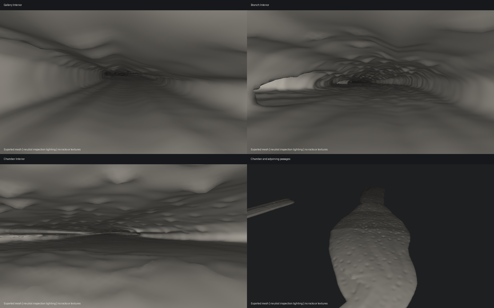

*Figure 1. A complete Earth network generated with the current tube inspection settings and seed 4. These views render the exported geometry with neutral lighting, without rock props or textures. They show selected locations within one cave, not four separately generated tubes.*

[Installation](#installation) · [Usage](#usage) · [Configuration](#configuration) · [Development and evaluation](#development-and-evaluation) · [Scientific model and generation](#scientific-model-and-generation)

## Installation

### Core environment

Install [Git](https://git-scm.com/) and [uv](https://docs.astral.sh/uv/getting-started/installation/), then run:

```bash
git clone https://github.com/Gabryss/P.L.U.M.E-Advanced.git
cd P.L.U.M.E-Advanced
uv python install 3.12
uv sync --locked --no-dev
```

This installs the project and its core dependencies into `.venv`, using the versions recorded in `uv.lock`. Blender and a GPU are not required to generate or export a cave. The examples below run from the repository root; `uv run --no-sync` uses the environment already installed, without changing its optional dependencies.

Alternatively, with an existing Python 3.12+ installation:

```bash
python3.12 -m venv .venv
source .venv/bin/activate
python -m pip install --upgrade pip
python -m pip install -e .
```

On Windows, activate the environment with `.venv\Scripts\Activate.ps1` in PowerShell. With an activated environment, replace `uv run --no-sync python` with `python` and `uv run --no-sync plume-generate` with `plume-generate`. The pip route uses the version constraints in `pyproject.toml`; it does not reproduce the uv lockfile exactly.

### Dependencies and optional features

The authoritative dependency declarations are in [pyproject.toml](pyproject.toml).

| Dependency | Minimum version | Role |
|---|---:|---|
| NumPy | 1.26 | Arrays, geometry, deterministic sampling |
| SciPy | 1.12 | Interpolation, spatial queries, filtering, connectivity |
| scikit-image | 0.23 | Isosurface extraction |
| Trimesh | 4.4 | Mesh handling and interchange formats |
| xatlas | 0.0.11 | UV atlas generation for prepared visual surfaces |
| Matplotlib | 3.8 | Scientific plots and diagnostics |
| Pillow | 10.0 | Images and material maps |
| Rich | 13.7 | Command-line progress and reports |

Install only the additional features you need:

| Feature | Installation | Additional requirements |
|---|---|---|
| Development and tests | `uv sync --locked --group dev` | pytest, pytest-cov, Ruff, mypy |
| Rocky rock props | `uv sync --locked --extra rocks` | Pinned [Rocky](https://github.com/Gabryss/Rocky) Git dependency; Git/network access during installation |
| Reference data and paper experiments | `uv sync --locked --extra paper` | laspy/lazrs, psutil, openpyxl; reference data obtained separately |
| Explanatory animations | `uv sync --locked --extra video` | Manim 0.21.x; system setup in the [video project](paper/media/video/README.md) |

Combine selections in one command when needed, for example `uv sync --locked --group dev --extra rocks --extra paper`. The equivalent pip extras are `.[rocks]`, `.[paper]`, and `.[video]`; `dev` is a uv dependency group, not a pip extra.

**Textures are separate assets.** The general project configuration references the [Poly Haven Dark Rock material](https://polyhaven.com/a/dark_rock) under `texture/dark_rock_8k/textures/`. Provide the configured files or change the paths. The configured EXR maps require an ImageMagick installation exposing the `convert` executable with EXR support. The tube-only workflow below bypasses material loading and does not need these assets or Rocky.

Generation runs on the CPU. Memory and export size depend strongly on spatial extent and voxel size. Sparse tiles reduce empty-space storage, but fine full-network meshes still require substantial working memory. Start with development mode and inspect a geometry-only result before enabling large prop populations or every export target.

## Usage

### Generate a full tube for inspection

Start from the dedicated low Earth scenario, which includes the current surface relief and disables optional events and rocks:

```bash
uv run --no-sync python scripts/generate_tube_only.py \
  --config config/earth_tube_only.toml \
  --output-directory outputs/my_earth_tube

uv run --no-sync python scripts/render_tube_views.py outputs/my_earth_tube
uv run --no-sync python scripts/check_tube_sections.py outputs/my_earth_tube --shallow-count 6
```

This generates **the complete network and cave mesh for that run**, not a local patch. It writes:

| File | Contents |
|---|---|
| `lava_tube_geometry.glb` | Single cave-wall mesh object, neutral double-sided material, no rocks or texture maps |
| `network.json` | Formation graph, centerlines, connectivity, and history metadata |
| `sections.npz`, `sections.json` | Cross-section arrays, local frames, flow state, and stability metadata |
| `resolved_config.json` | Effective configuration after seed and body resolution |
| `geometry_report.json` | Volume, meshing, junction, and stability information |
| `export_checks.json` | Reloaded GLB integrity checks, counts, and SHA-256 |
| `resolution_checks.json` | Profiles with too few samples across their smallest dimension |
| `inspection_views.png`, `inspection_cameras.json` | Views rendered from the GLB and their reproducible cameras |
| `mesh_section_checks.json` | Transverse spot checks through the exported surface |

The helper refuses configurations with `events.enabled` or `events.include_rock_props` enabled. Mandatory roof screening still runs. It does not run the main command's checkpoint, floor-atlas, material, or target-package stages. Choose a fresh output directory: this helper does not implement the main command's overwrite confirmation.

For a different realization, copy `config/earth_tube_only.toml` to `config/my_earth_tube.toml`, change the **top-level** `procedural_seed`, and pass that file to `--config`. The README example uses seed 4; the bundled inspection configuration retains seed 2 for comparison. Keep copies inside `config/`, or adjust relative asset paths when moving them elsewhere.

To retain the generated volume for a later local resolution study, add `--checkpoint outputs/my_earth_tube/geometry.pkl`. This optional file can be much larger than the GLB. It is a local Python pickle, not a portable interchange format; load only checkpoints you trust.

### Inspect it in Blender

Import `lava_tube_geometry.glb` through **File → Import → glTF 2.0**. Select `cave_wall` and frame the selection, then use viewport walk/fly navigation or the saved inspection images to examine the interior. The GLB uses metres and glTF's Y-up convention; Blender's importer handles the axis conversion.

The visible exterior is the boundary of the cave void. It is not a freestanding rock tube or the surrounding terrain. The current exporter does not construct a finite-thickness host-rock shell. Closed chain ends are procedural terminations, not automatically generated surface entrances. A single mesh object can also contain disconnected surfaces; consult mesh connectivity and section checks when that distinction matters.

### Run the full environment pipeline

The main command adds floor atlases, configured geological events, surface preparation, application packages, and resumable stage checkpoints:

```bash
uv run --no-sync plume-generate \
  --config config/project.toml \
  --output outputs/full_earth/stage_b_cave_network.png
```

`config/project.toml` is the **general environment scenario**: it enables Rocky props, structural events, texture displacement, diagnostics, and all application exports. Install the rocks extra and provide its textures before running it. Its height distribution and resolution differ from `earth_tube_only.toml`; the general default is not the low Earth inspection scenario.

For an untextured full pipeline, copy a configuration and set the following keys **inside its existing tables**; do not append duplicate TOML tables:

```toml
[events]
enabled = false
include_rock_props = false

[geometry]
cave_diffuse_texture = ""
cave_normal_texture = ""
cave_roughness_texture = ""
cave_displacement_texture = ""
cave_displacement_scale_m = 0.0

[export]
target = "neutral"
format = "glb"
generate_collision = true
```

This is an edit guide, not a replacement for the full scenario file. Other geometry and section controls remain those of the file you copied.

**`--output` is a network-diagnostic PNG path, not a directory or mesh path.** Its parent determines the default location of sibling artifacts even when diagnostic rendering is disabled. The selected scene is written under `export_<target>/` in that directory. For the general all-target configuration, packages live under `outputs/full_earth/export_all/`.

```bash
# Select another body and its default material.
uv run --no-sync plume-generate --config config/project.toml \
  --body mars --output outputs/full_mars/stage_b_cave_network.png

# Resume the same run after an interruption.
uv run --no-sync plume-generate --config config/project.toml \
  --output outputs/full_earth/stage_b_cave_network.png --resume

uv run --no-sync plume-generate --help
```

`--body` accepts `earth`, `mars`, and `moon`. It changes the body and default material; other explicit overrides in the TOML remain in effect. Check the resolved configuration when adapting an Earth scenario to another body.

The main command asks before using a nonempty output directory. `--force-overwrite` or `run.overwrite_outputs = true` authorizes replacement. `--resume` also bypasses that prompt and reuses only matching checkpoints: configuration, inputs, Python version, and production source fingerprint must agree. Checkpoints default to `.plume-checkpoints/` beside the outputs; change this with `--checkpoint-directory`.

### Output packages

| `export.target` | `export.format` | Package |
|---|---|---|
| `neutral` | `glb` or `obj` | Portable scene; the neutral GLB package also includes an OBJ fallback |
| `blender` | `glb` or `obj` | Scene, import helper, and package metadata |
| `ue5` | `glb` or `obj` | Scene and Unreal import guidance |
| `unity` | `glb` or `obj` | Scene and Unity import guidance |
| `gazebo` | `obj` | OBJ/MTL assets and SDF model package |
| `omniverse` | `usd` | USD scene and material package |
| `all` | `auto` | All five application packages from one prepared scene |

Target adapters convert canonical right-handed, Z-up metre geometry to their required conventions. They do not invoke the target applications. `generate_collision` requests dedicated simplified collision geometry; it is distinct from the prepared visual surface. Verify important imports in the destination application using the [export verification protocol](docs/paper/EXPORT_VERIFICATION_PROTOCOL.md).

The full pipeline also writes `stage_a_host_influence.json`, `stage_b_network_report.json`, `stage_b_network.json`, `stage_c_sections.{npz,json}`, `stage_c_floor_map.{npz,json}`, `stage_d_geometry_report.json`, `stage_e_event_report.json`, `resolved_project_config.json`, and `run_manifest.json`. The manifest records inputs, outputs, provenance, timings, and completion or failure status. PNG diagnostics depend on `run.render_diagnostics`; dense Stage-D raster diagnostics are skipped for sparse tiled volumes.

### Inspect early stages without meshing

```bash
uv run --no-sync python scripts/render_host_field.py \
  --config config/earth_tube_only.toml --output outputs/host_review.png

uv run --no-sync python scripts/generate_network_diagnostics.py \
  --config config/earth_tube_only.toml --output outputs/network_review \
  --density-sweep ""
```

The second command generates stages A–C and figures only. An empty density sweep avoids additional network realizations. Its output directory contains no full cave mesh. Use this workflow to tune topology and passage proportions before paying for full-volume generation.

### Several systems growing together

PLUME can grow several independently seeded arterial systems in the same host.
They merge into a single shared passage and can split downstream into separate
outlets or rejoin later. Flow is solved over the combined graph, so merging sums
the incoming discharge and splitting divides the available supply. Source
identities remain traceable after mixing.

```bash
uv run --no-sync python scripts/generate_network_diagnostics.py \
  --config config/earth_interacting_systems.toml \
  --output outputs/systems_review --density-sweep ""
```

The example requests three systems, keeps rocks disabled, and checks both the
network and cross sections. Its network figure marks merges, splits and shared
passages. Use the same config with `plume-generate` for a full mesh.
The [interaction model and controls](docs/network_systems.md) explain the distributed
arterial mode. For a compact gallery with independent sources **and** formation
history, use the integrated mode below. The general single-system lobe grammar
remains available with `network.systems.count = 1` (the default).

### Persistent parallel systems

Use [earth_short_interconnected.toml](config/earth_short_interconnected.toml) for a
400 m downstream reach or [earth_long_interconnected.toml](config/earth_long_interconnected.toml)
for 3 km. These presets grow three systems through a shared host with several broad
terrain corridors. Substantial passages can remain separate, merge pairwise, split
again and join other routes downstream. They retain the common section, stability,
formation-history and export stages; rocks are disabled.

```bash
uv run --no-sync python scripts/generate_network_diagnostics.py \
  --config config/earth_short_interconnected.toml \
  --output outputs/interconnected_short_preview --density-sweep ""

uv run --no-sync python scripts/validate_interconnected.py \
  --config config/earth_long_interconnected.toml \
  --output outputs/interconnected_long_validation
```

The first command produces Stage A–C figures, including actual passage envelopes
over the host and a downstream channel-count plot. Long footprints are divided into
500 m reaches without stretching the lateral axis. The second screens three seeds
on one fixed host and replays the first in a fresh process with a different Python
hash seed. Neither command builds a mesh.

For full meshes, use [earth_short_interconnected_full.toml](config/earth_short_interconnected_full.toml)
or [earth_long_interconnected_full.toml](config/earth_long_interconnected_full.toml).
The short preset retains the primary preview's host, network and sections at 8 cm
voxel spacing. The long preset retains its host, uses a 0.9 section width-scale
median and a 1.2 m minimum section-height control, and revalidates its network before
meshing at 20 cm. These controls precede terminal taper and surface relief; they do
not guarantee a minimum clearance everywhere in the final mesh.

```bash
uv run --no-sync plume-generate \
  --config config/earth_short_interconnected_full.toml \
  --output outputs/interconnected_short_full/stage_b_cave_network.png
uv run --no-sync python scripts/check_mesh_topology.py outputs/interconnected_short_full
uv run --no-sync python scripts/render_run_diagnostics.py outputs/interconnected_short_full
```

Use a new output directory. Full meshing and export can take tens of minutes, and
the high-resolution short preset can contain millions of triangles. The separate
mesh check rejects unwanted surface handles and lost rock islands; Stage A–C
acceptance alone does not guarantee a correct final mesh. See the
[inspection output guide](outputs/README.md) for packaged Blender scenes, engine
assets, stage figures and the validation records of delivered runs.

The [full inspection report](docs/interconnected_full_inspection_2026-09-11.md)
records the two accepted meshes, four rejected intermediate attempts, export and
Blender checks, and the source/configuration snapshot saved with the results.

`network.topology.style = "interconnected"` and
`generation_mode = "independent_growth"` enable this mode. Its acceptance rules
require physically separated parallel passages through the network, distributed
interactions and sufficient independent travel by each source. The gallery's
38 m lateral-span limit does not apply; individual passage and roof limits still do.
See [the model, controls and validation scope](docs/interconnected_systems.md).

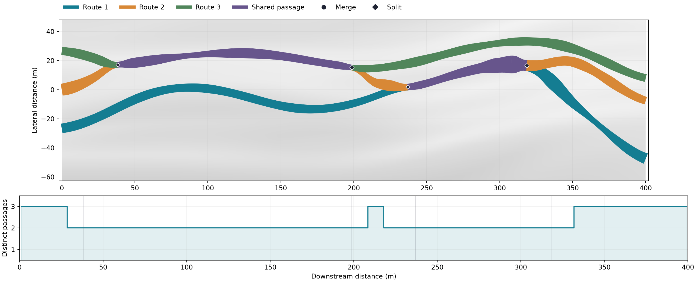

*Actual section envelopes for the 400 m preset. Purple passages carry multiple
routing fronts; circles mark merges and diamonds mark splits. The lower trace
counts passages separated by the configured minimum rock gap. These are Stage A–C
results, before surface relief and meshing. The [3 km preview](docs/figures/readme/interconnected_long.png)
shows the same mode over consecutive 500 m reaches.*

The [six-case validation report](docs/interconnected_validation_2026-09-11.md)
records accepted/rejected candidates, physical parallel coverage and fresh-process
reproducibility for the short and long presets.

### Independent systems with gallery validation and history

[config/earth_independent_gallery.toml](config/earth_independent_gallery.toml) is the
recommended preset for the current compact, rock-free inspection. Three independently
seeded systems share a host, merge according to their route preferences, and can split
and rejoin around local rock islands. Four formation phases add finite-budget blind
breakouts, inactive intervals, passage reuse and conditional drained pools.

```bash
uv run --no-sync plume-generate \
  --config config/earth_independent_gallery.toml \
  --output outputs/independent_gallery/stage_b_network.png
```

For a network/section preview, pass the same config to
`scripts/generate_network_diagnostics.py` with `--density-sweep ""`.
The preset requests a 380 m route, one or two islands and one or two blind branches.
This is a compact scenario: the earlier general Earth preset requests a 5,000 m
route. Completing the full pipeline does not imply the same network extent.
Basic stage figures are enabled in this preset. To produce the complete gallery,
including sparse-volume mesh sheets and multiple-system connections, run the
following after generation. It also restores missing figures for an existing
completed run without changing its cave, using its trusted local checkpoints:

```bash
uv run --no-sync python scripts/render_run_diagnostics.py outputs/independent_gallery
```

The command writes the stage PNGs, `STAGE_FIGURES.md` and a separate figure manifest.
It checks the saved network and section identity and leaves the exported scenes
and original generation manifest unchanged. Disabled events are identified in the
index rather than illustrated as if rocks had been generated.

Its 51 acceptance checks include surviving section-level islands, independent source
lineage and conserved per-phase discharge. The deterministic search accepts the first
passing candidate and records the rejected attempts.

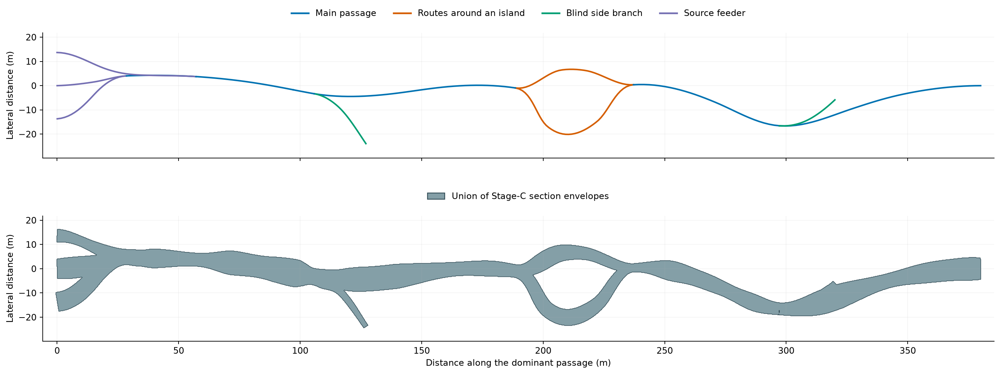

*The three inlets merge at independently determined stations. This accepted seed
contains one local split-and-rejoin island and two blind breakouts. These are
network and section envelopes; the full mesh is checked separately.*

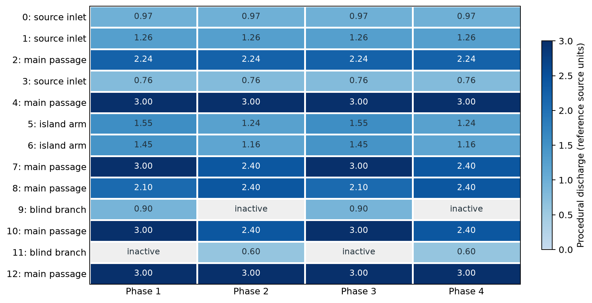

*Inactive gaps are retained before branch reoccupation. Values are procedural
source units, not measured lava discharge.*

[Validation results and the separate general-preset test failure](docs/independent_gallery_validation_2026-09-10.md)
record the scope and remaining limits.

The [generation model and feature matrix](docs/independent_gallery_growth.md) explain
which controls are active. This combines independent routing with the supported
formation-history mechanisms. Stacked levels, vertical capture, the legacy cell-based
lobe grammar and deposition feedback are not executed in this mode. Rocks, events,
textures and collision generation are disabled in this preset. An explicit one-cell
density-closing step repairs narrow voxel fissures before roof checks;
[its limits and final mesh checks](docs/independent_gallery_growth.md#grid-scale-fissure-repair)
are documented separately.

### A dominant gallery with local rock islands

For the compact topology illustrated by the Valentine Cave reference, use
[config/earth_valentine_topology.toml](config/earth_valentine_topology.toml):

```bash
uv run --no-sync python scripts/generate_network_diagnostics.py \
  --config config/earth_valentine_topology.toml \
  --output outputs/valentine_review --density-sweep ""
```

The earlier layout option (`network.topology.style = "trunk_dominated"`,
`generation_mode = "layout"`) generates one main
gallery with irregular widening, short split-and-rejoin routes around rock
islands, and short blind branches. It can also accept several upstream inlets
that coalesce into the gallery. The general interacting-systems mode above
remains available for distributed networks.

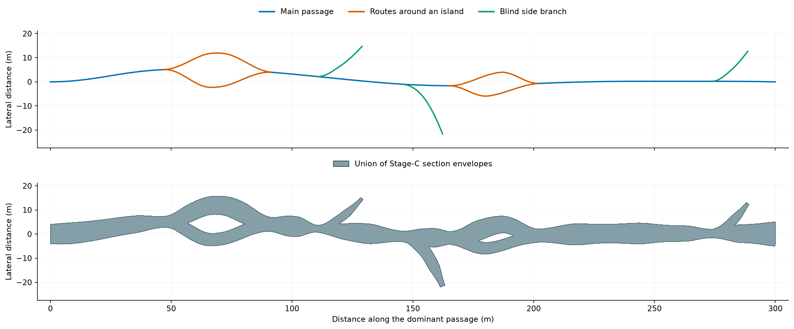

*The upper panel shows connectivity; the lower panel shows the union of sampled
passage envelopes at equal horizontal and vertical scale. White enclosed regions
are rock islands. This is a generated network and section preview, not a finished
mesh or a reconstruction of the survey.*

The preset requests a 300 m route, two islands, two to three blind branches, and
no rocks. The scale is a scenario choice; the reference screenshot has no scale
bar. Its acceptance checks require the islands to survive cross-section
generation and reject excessive parallel passage, lateral spread and disconnected
footprints. See [gallery generation, controls and validation](docs/trunk_topology.md).

## Configuration

### Files, units, and resolution of values

Use [config/project.toml](config/project.toml) for the general environment and [config/earth_tube_only.toml](config/earth_tube_only.toml) for the current low Earth geometry study. The loader is [config.py](src/plume_advanced/config.py); body/material defaults are in [world.py](src/plume_advanced/world.py).

Without `--config`, the main command first looks for `config/project.toml` in the working directory, then in the source checkout, then uses the packaged default. Always pass a configuration explicitly for a reproducible experiment.

- `schema_version = 3` is current. Versions 1 and 2 have compatibility migrations; unknown keys and invalid parameter combinations are rejected.
- Distances use metres unless stated otherwise; gravity uses m/s², density kg/m³, temperatures K, and ages s. Some controls and recorded flow quantities are procedural scales rather than calibrated physical measurements.
- The root `procedural_seed` derives separate named seeds for host, network, sections, events, and geometry. Explicit stage `random_seed` values override the derived values. Keeping the configuration, code, dependencies, and inputs fixed is necessary for reproducibility.
- Omitted values come from dataclass and body defaults. Some supplied distances are also scaled by the body or flow regime. Development mode then crops generation extent. The resolved JSON, rather than the handwritten TOML alone, describes the actual run.
- Texture and Rocky paths resolve relative to the TOML file's directory. They are not resolved relative to the shell's working directory.

### Network acceptance before meshing

The generator now evaluates and repairs candidate networks, with a deterministic
sequence of alternative seeds when a candidate remains invalid. It checks bends,
crossings, width saturation, branch endings, repeated motifs and final 3D section
geometry as well as topology and flow. The first passing candidate proceeds;
exhausting the attempt limit stops generation before meshing.

`network_quality_report.json` records every verdict, repair and seed. The defaults
allow eight candidates and three repairs each. These are explicit morphology
heuristics, not geological certification. See [network acceptance](docs/network_acceptance.md)
for all thresholds, reproduction rules and the inexpensive preview workflow.

### Main tables

| Table | What it controls | Useful settings |
|---|---|---|
| `[world]` | Body, material, gravity, formation limits, strength | `body`, `material`, `gravity_m_s2`, `maximum_passage_width_m`, `maximum_room_width_m`, `roof_safety_factor` |
| `[flow_regime]` | Dimensionless eruption scenario | `supply_rate_scale`, `duration_scale`, `inflation`, `distributary_tendency`, `cooling_rate_scale` |
| `[run]` | Extent, quality, plots, overwrite behavior | `dev_mode`, `dev_max_route_length_m`, `quality`, `render_diagnostics` |
| `[export]` | Destination package and collision output | `target`, `format`, `generate_collision` |
| `[host_field]` and nested tables | Host domain, terrain variation, routing contributions | `apply_body_scaling`, `grid`, `ranges`, `wave_ranges`, `routing_weights` |
| `[network]` | Sources, branch opportunities, growth backend | `growth_model`, `emplacement_backend`, `network_density`, `lobe_launch_rate`, `loop_probability`, `capture_probability`, `chamber_gain` |
| `[network.quality]` | Deterministic morphology acceptance before meshing | `enabled`, `max_attempts`, `repair_passes`, bend, width, repetition, crossing and grade limits |
| `[network.systems]` | Several arterial systems growing together | `count`, source spacing, routing variation, capture/release distances, minimum passage persistence |
| `[network.topology]` | General, dominant-gallery or interconnected morphology | `style`, `generation_mode`, width variation; gallery-specific island and dominance rules |
| `[network.interconnection]` | Sustained parallel routes and distributed connections | Parallel fraction and persistence, per-window coverage, maximum single-channel run, source independence, junction angles and event spacing over distance |
| `[network.lobe_growth]` | Breakout paths, competition, cooling, coalescence | `path_count`, growth weights, flux budgets, thermal thresholds |
| `[network.emplacement_history]` | Successive phases, reoccupation, stacking, pools | Phase count, stacked-level fraction, retirement, `drained_pool_*` |
| `[network.braid_grammar]` | Explicit legacy network mode | Compatibility controls for `growth_model = "legacy_braid"` |
| `[section_field]` | Sample spacing, profile shapes, vertical placement | `sampling_policy`, height ratios, width variation, floor/roof shape, junction transitions |
| `[floor_map]` | Intrinsic floor sampling and clearance filtering | `lateral_spacing_m`, `plan_resolution_m`, `minimum_clearance_m` |
| `[events]` | Optional structural modifiers and loose debris | `enabled`, `include_rock_props`, `enabled_kinds`, density, sizes, `use_rocky_meshes` |
| `[geometry]` | Volume resolution, sweeps, relief, meshing, visual finish | `resolution_policy`, `voxel_size`, `storage_mode`, `surface_*`, `cave_*` |

The normal network path is `growth_model = "hybrid_lobe"` with `emplacement_backend = "internal"`. `downflow_reference` is a lightweight perturbed-terrain comparator. `flowy` requires a compatible external executable configured with `flowy_executable`; it is not installed by the core environment. In the general single-system grammar, `network_density` ranges from 0 to 3: zero disables lobe branches, while source/backbone geometry can remain. Branch-opportunity controls alter stochastic tendencies, not guaranteed branch counts. The `trunk_dominated` style requires internal emplacement. Its default `generation_mode = "layout"` uses prescribed topology construction; `generation_mode = "independent_growth"` uses independent routes plus the supported history controls listed in [the integrated-mode guide](docs/independent_gallery_growth.md). Other legacy lobe/braid controls are inactive in that mode.

### Body defaults versus physical limits

| Preset | Gravity (m/s²) | Material | Ordinary passage width setting (m) | Room width setting (m) |
|---|---:|---|---:|---:|
| `earth` | 9.80665 | `terrestrial_basalt` | 10 | 28 |
| `mars` | 3.71 | `martian_basalt` | 50 | 100 |
| `moon` | 1.62 | `mare_basalt` | 100 | 200 |

These are configurable **formation controls**, not observed universal maxima or promises about the final span at a merged junction. Roof screening is a separate constraint involving cover, strength, density, gravity, and geometry. There is no single maximum height for each planet.

`[world]` also accepts overrides such as `bulk_density_kg_m3`, `intact_tensile_strength_mpa`, `rock_mass_quality`, and `weathering`. Keep these physically consistent with the chosen material. Other Jovian/Saturnian moons and cryovolcanic materials have no dedicated validated presets; substituting a gravity value alone does not establish a realistic formation model.

### Passage shape and surface detail

The current Earth inspection file deliberately favors low passages. It uses `base_height_ratio = 0.30`, height-ratio bounds `0.12–0.36`, and `profile_resolution = 40`. These controls act alongside width variability, morphology families, flow history, and chamber rules. A 1–3 m passage range is a scenario objective, not a hard guarantee at every station or an Earth-wide law.

| Desired change | Controls to inspect | Consequence |
|---|---|---|
| Taller or flatter passages | `base_height_ratio`, height-ratio bounds/variation | Changes profile proportions; taller roofs consume cover at a fixed floor depth |
| More width diversity | `width_scale_median`, `width_scale_log_sigma`, `width_longitudinal_variation` | Changes section scale within formation constraints |
| Broad changes along a tube | `morphology_correlation_length`, `morphology_regime_strength`, `morphology_family_spread` | Changes longitudinal coherence and profile families |
| Flatter floors, benches, channels | `floor_flatness_base`, `floor_relief_base`, `bench_strength`, `floor_incision_ratio` | Changes the cross-section envelope |
| Asymmetric roofs/walls | `roof_arch_base`, `profile_shape_variation`, `lateral_skew_amplitude`, `wall_roughness_base` | Changes contour shape before meshing |
| More actual surface relief | `surface_wall_relief_m`, `surface_roof_relief_m`, `surface_floor_relief_m`, `surface_crust_relief_m` | Adds inward geometric accretion in metres |
| Larger/smaller relief features | `surface_feature_scale_m` | Changes spatial scale; small features require fine voxels |
| A softer visual finish | `cave_smoothing_iterations`, `surface_normal_filter_voxels` | Smooths vertices or shading normals; does not replace resolved geometry |

The inspection file's wall/roof/floor/crust relief bounds are **0.55 / 0.65 / 0.22 / 0.10 m**, with a base feature scale of **0.85 m**. These are maximum procedural amplitudes: patch strength, orientation, resolution, and local clearance reduce the realized offsets. They are not measured means. Library defaults for these accretion amplitudes are zero, so other scenarios do not silently inherit the Earth study's relief.

`wall_roughness_amplitude` is an older density-space roughness control, distinct from metre-based relief. Texture-driven `cave_displacement_scale_m` belongs to export preparation; it is zero in the tube inspection scenario.

### Resolution and cost

For an explicit voxel size:

```toml
[geometry]
resolution_policy = "fixed"
voxel_size = 0.20
storage_mode = "auto"
```

For body-dependent quality, set `resolution_policy = "body"` and **remove `voxel_size`**. The loader rejects supplying both. The current resolved voxel sizes are:

| `run.quality` | Earth | Mars | Moon |
|---|---:|---:|---:|
| `preview` | 1.0 m | 2.0 m | 4.0 m |
| `standard` | 0.6 m | 1.2 m | 2.4 m |
| `production` | 0.5 m | 1.0 m | 2.0 m |

These body policies use characteristic **width**, so they may underresolve shallow galleries. The Earth inspection scenario deliberately uses a finer fixed 0.20 m grid. Even that grid does not resolve every crawlway or centimetre-scale feature.

Use `resolution_checks.json` to locate profiles with fewer than eight voxels across their smaller dimension. This is a screening heuristic applied before 3D relief, not a clearance certificate. Local refinement studies can then compare actual mesh cuts. They currently produce standalone bounded patches; they do not automatically refine or stitch replacements into the full mesh.

`storage_mode` accepts `dense`, `tiled`, or `auto`. Auto switches to sparse overlapping tiles when the dense lattice would exceed `max_dense_voxels` (80 million in the shipped scenarios). Halving voxel size increases a fixed dense volume's cell count by approximately eight; sparse working costs depend on the occupied tiles. `chunk_size` controls meshing partition size, not physical detail. `run.dev_mode` shortens the host and limits growth opportunities without shrinking passages; it does not guarantee a particular total network length.

### Events and rocks

`events.enabled = false` disables the optional event stage. `include_rock_props = false` suppresses loose rocks while allowing configured structural events when the stage is enabled. `enabled_kinds` can include `rock`, `boulder`, `collapse`, `choke`, and `infill`.

`use_rocky_meshes = true` selects the optional Rocky provider. With `strict_optional_provider = true`, a missing requested provider is an error. Set `use_rocky_meshes = false` to select the built-in simpler prop geometry explicitly. None of these switches disable mandatory gravity-based roof screening.

## Development and evaluation

### Check a change

```bash
uv sync --locked --group dev
uv run --no-sync ruff check .
uv run --no-sync mypy src/plume_advanced
uv run --no-sync pytest
```

Tests cover stages, config validation, network semantics, interpolation, dense/tiled continuity, stability, surface relief, exports, and evaluation helpers. Marked integration or performance cases may take longer; check [pyproject.toml](pyproject.toml) for test settings.

For a **full-pipeline prepared GLB**, use the portable asset validator:

```bash
uv run --no-sync plume-validate \
  outputs/full_earth/export_all/blender/plume_cave_scene.glb \
  --run-manifest outputs/full_earth/run_manifest.json \
  --output-dir outputs/full_earth/validation
```

Its checks include prepared-scene attributes and packaging expectations. For the intentionally bare tube-only GLB, use its `export_checks.json`, inspection renders, and `check_tube_sections.py` instead of treating missing PBR preparation as a geometry failure.

### Scientific experiments

The [evaluation workflow](paper/README.md) and [experiment declarations](paper/experiments.toml) cover morphometry, controllability, host and sampling ablations, scalability, determinism, and export consistency.

```bash
uv sync --locked --group dev --extra paper
uv run --no-sync plume-evaluate --config paper/experiments.toml audit

# Point to your separately downloaded PDC v2 TXT tree.
export PLUME_PDC_ROOT=/absolute/path/to/PDC-v2
uv run --no-sync plume-evaluate --config paper/experiments.toml pdc-audit

# Bounded development comparison; use calibration caves for tuning.
uv run --no-sync plume-evaluate --config paper/experiments.toml morphometry \
  --reference-partition calibration --max-seeds 3
```

The frozen split reserves **76 caves for calibration and 19 for confirmation**. The declared morphometry default uses the evaluation partition; select `calibration` explicitly during development. `plume-evaluate all` runs a substantial campaign, including full geometry and scalability experiments. It is not a quick test or a statement that the campaign has already passed.

Completed cases are reused only when their recorded source, configuration, dependencies, data, and input fingerprints match. Failed cases remain visible. The [claim/evidence matrix](docs/paper/CLAIM_EVIDENCE_MATRIX.md) distinguishes implementation checks from scientific validation.

The [dated evaluation campaign](paper/campaigns/2026-09-07/README.md) preserves the source, protocol, execution record and reporting workflow for the current paper. Its standard mesh benchmarks include reconstruction through the final mesh at 0.6 m resolution, with explicit time and memory limits. These measurements are separate from the higher-resolution inspection illustrations and from application import tests.

The campaign has now attempted all **2,076 cases**: 2,071 completed and five dense
5 km benchmarks reached the memory limit. See the [results report](paper/campaigns/2026-09-07/REPORT.md)
for the measured effects and limits. The findings include remaining size mismatch,
no median cycle-rank response to distributary tendency, and larger adaptive-sampling
point discrepancies; completed cases do not imply that every hypothesis was supported.


### Source map and documentation

| Location | Role |
|---|---|
| `src/plume_advanced/stages/` | Host, network, sections, volume, relief, events, floor atlas |
| `src/plume_advanced/stability.py` | Coupled roof-span screening |
| `src/plume_advanced/exporters/` | Shared prepared scene and target adapters |
| `src/plume_advanced/pipeline/` | Validated stage checkpoints |
| `src/plume_advanced/evaluation/` | Artifacts, datasets, metrics, local studies, experiment runner |
| `scripts/` | Inspection, comparison, diagnostic and media entry points |
| `config/` | Editable generation scenarios |
| `tests/` | Regression and integration checks |
| `paper/` | Experiment declarations, fixed splits, paper/media assets |
| `docs/` | Focused design, validation, and scientific notes |

The [geometry corrections](docs/geometry_artifact_fixes.md), [surface relief notes](docs/surface_relief.md), and [7 September 2026 validation report](docs/geometry_validation_2026-09-07.md) explain the recent geometry work. Dated reports preserve their own configurations and results; they are not promises about every new seed. The [pipeline animation](docs/media/FullPipeline.mp4) is a historical explanatory visualization built from frozen artifacts, not a current-mesh benchmark or physical flow simulation.

README figures are saved under [docs/figures/readme](docs/figures/readme/README.md), with input hashes and reproduction instructions. Code is distributed under the [BSD 3-Clause license](LICENSE); third-party textures, reference data, and optional providers retain their own licenses.

## Scientific model and generation

### The actual execution order

The stage letters describe responsibilities. The full command interleaves geometry and floor-map work because geological events need the base floor, and the final atlas must reflect structural changes.

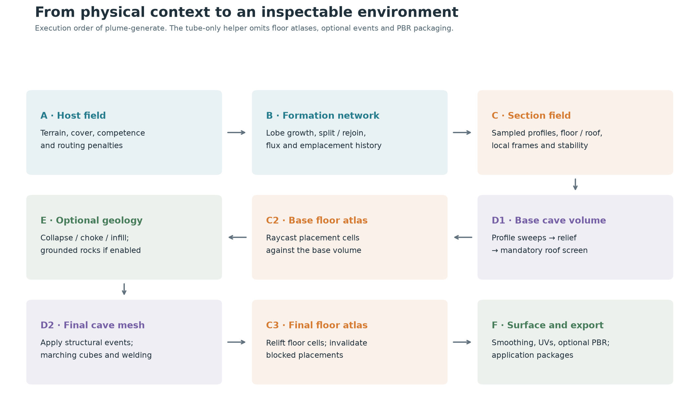

*Figure 2. The full pipeline first builds a cave volume, samples an event-placement floor atlas, then applies optional geology before producing the final mesh and relifting the atlas. Surface preparation follows the final geometry. Mandatory roof screening belongs to base-volume construction and runs even when optional events are disabled.*

### A. Host conditions

[HostFieldGenerator](src/plume_advanced/stages/host_field.py) constructs a regular terrain grid and correlated scalar fields. These include elevation, slope, cover, roof competence, fracture intensity, flow capacity, cooling, and emplacement/deposit proxies. Routing combines weighted slope, cover, fracture, capacity, and stability penalties.

A generated field is a hypothesized substrate, not a measured geological reconstruction. The stored influence report exposes each routing term's variation and contribution, making it possible to test whether a term affects generation. Body scaling and eruption controls alter this substrate before network growth.

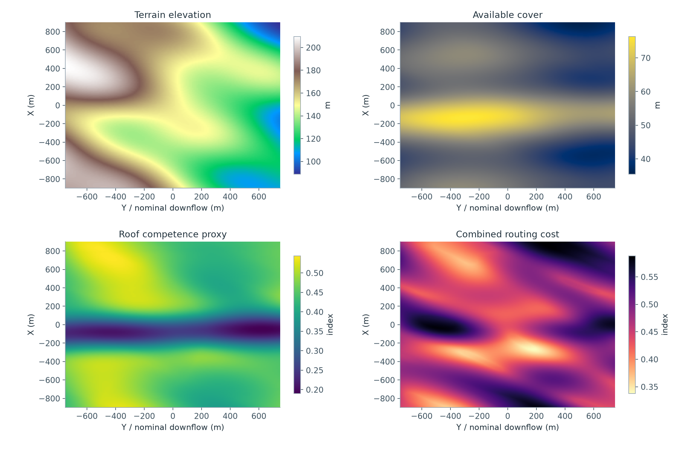

*Figure 3. Four fields from the new Earth seed-4 host. Each panel shows the full host domain, with Y displayed horizontally. Competence and cost are procedural indices, not material strength measurements.*

### B. Formation network and history

The default `general` topology uses the formation grammar described below.
The optional [dominant-gallery grammar](docs/trunk_topology.md) instead places
local island bypasses and blind branches along a smooth host-biased route.
It adds an explicit floor-plan target and checks the resulting section envelopes;
it does not infer that target from the host alone.

[CaveNetworkGenerator](src/plume_advanced/stages/network.py) combines a downhill backbone with finite-flux lobe breakouts. Candidate paths respond to perturbed terrain, momentum, host suitability, existing channels, and an evolving emplacement surface. Lobes may diverge, cool, retire, or coalesce downstream. Successive phases can reuse or abandon routes and assign relative vertical levels.

The graph records sources, segment roles, split/rejoin relationships, phase history, flux, temperature, and age. Conservation and ordering checks test the internal consistency of those quantities. Their presence does not make this a conservation-law thermofluid solver. Source supply and cooling controls remain simplified, and a formation graph's connectivity is distinct from final accessibility after collapse or infill.

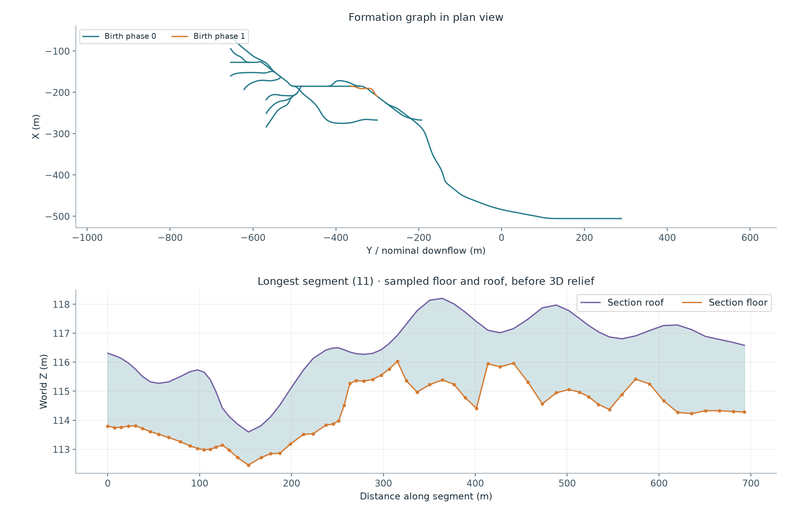

*Figure 4. The formation network colored by birth phase, followed by the sampled floor and roof of its longest segment. The lower panel exaggerates vertical differences. The upper graph does not itself show whether the final void is passable.*

### C. Cross-sections and vertical placement

[SectionFieldGenerator](src/plume_advanced/stages/section_field.py) samples each route with `adaptive`, `uniform`, or denser `reference` spacing policies. Adaptive sampling responds to curvature, width changes, and junction proximity. Local frames turn each 2D contour into a 3D passage profile.

Widths, height ratios, roof arches, floor flatness, skew, benches, floor channels, and roughness vary through correlated morphology fields and inherited flow state. Drained-pool metadata creates selected broad, low regions with graded transitions. Floor placement is handled separately from roof height so a floor drop does not automatically produce the same displacement in the ceiling. Stacked-level offsets are constrained by cover and grade; a requested graph level is not proof of an independently separated physical layer.

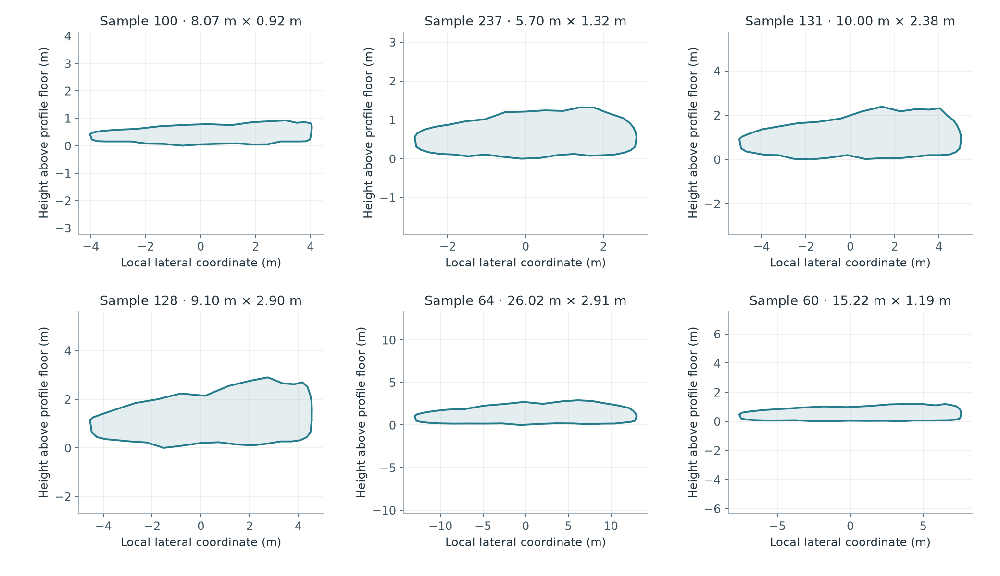

*Figure 5. Actual Stage-C contours before 3D accretion, smoothing, or export displacement. Profile dimensions must be distinguished from final mesh clearances; panel limits vary, but each panel preserves equal horizontal and vertical scale.*

### Gravity, roof thickness, and collapse

[RoofStabilityModel](src/plume_advanced/stability.py) screens a simply supported, unit-width roof beam under self-weight. Let:

| Symbol | Meaning | Unit |
|---|---|---|
| `w`, `h` | Unsupported width and cavity height | m |
| `d`, `t = d − h` | Floor depth below local ground and roof thickness | m |
| `ρ`, `g` | Rock density and gravity | kg/m³, m/s² |
| `σ_eff`, `F` | Effective tensile strength and safety factor | Pa, dimensionless |

The implemented relations are:

```text
required roof thickness = 3 F ρ g w² / (4 σ_eff)
demand ratio            = required roof thickness / t
maximum width           = sqrt(4 σ_eff t / (3 F ρ g))
maximum height          = max(d − required roof thickness, 0)
```

A candidate passes if it has positive roof thickness and demand no greater than one. At a **fixed floor depth**, increasing height consumes cover. Width and height limits are therefore coupled. At fixed material and cover, allowable width scales as `1 / sqrt(g)`; formation controls still determine what sizes the generator proposes.

Effective strength is derived from intact tensile strength, rock-mass quality, and a weathering reduction. The current default safety factor is 1.5. This roof screen does not solve arching, regional stresses, stratification, fracture propagation, sidewall failure, or pillar load sharing. More complete structural research, such as [Blair et al. (2017)](https://www.sciencedirect.com/science/article/pii/S0019103516303566), treats a richer problem.

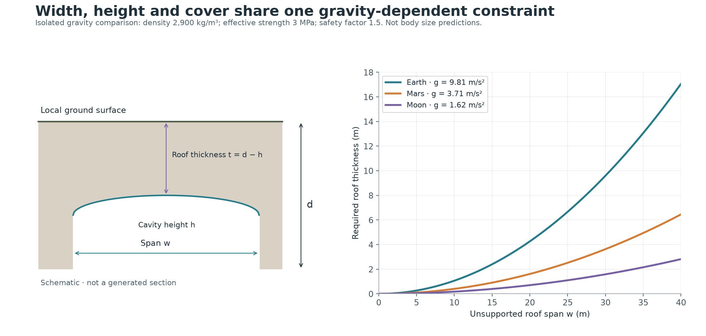

*Figure 6. A controlled comparison holding density, effective strength, and safety factor fixed. The curves show required roof rock, not predicted Earth/Mars/Moon passage heights. The built-in material presets differ and are deliberately not used in this gravity-only comparison.*

Section metadata records conditional limits and collapse flags. Geometry construction reassesses profile and junction envelopes; failed regions receive solid breakdown plugs. This represents a blocked end state, not dynamically falling rubble or an automatically opened skylight. Screening remains local to the sampled envelopes, not a pointwise structural certification of the final smoothed/displaced mesh.

### D. Continuous volume, relief, and meshing

[GeometryGenerator](src/plume_advanced/stages/geometry.py) refines the sampled centerlines and profiles, sweeps the contours into a shared scalar volume, and joins overlapping passages. Profile-based generation is the default: chambers are built from widened section sweeps. It does not add a second cylindrical room on top of an already widened profile. The explicit legacy primitive mode remains available through `use_section_profiles = false`.

Continuous interpolation across shared section planes and shape-preserving centerline refinement limit the stepped joins and repeated ribs that arise from independent coarse stamps. The implementation preserves the floor separately during refinement. Dense and overlapping tiled grids share the same density-query convention and reconcile boundary samples before polygonization.

The [surface relief pass](src/plume_advanced/stages/surface_relief.py) adds spatially varying inward wall accretion, roof projections, floor lobes, and crust. It uses seeded world-space fields, so features do not restart at section or chunk boundaries. Relief is limited near shallow passages and attenuated when requested features are unresolved. Tiny isolated numerical pockets are repaired before mandatory roof screening.

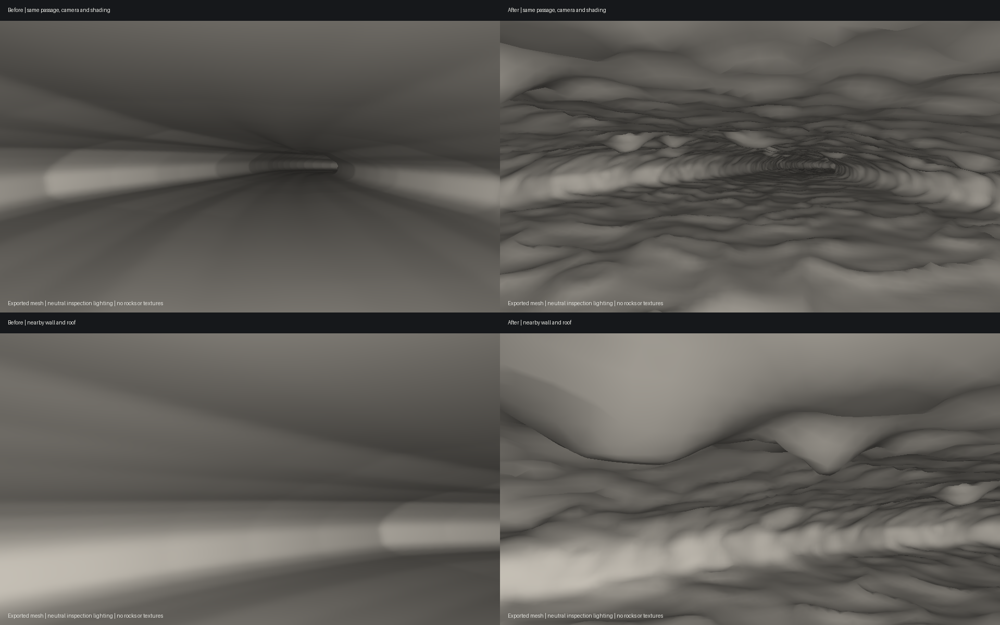

*Figure 7. Controlled geometry comparison on a separate 64 m Earth test reach at 0.10 m voxels. Camera, material, smoothing, and normal settings are held fixed. This is a bounded reach with artificial closed ends, not the new seed-4 full tube. The change is in geometry, not a texture overlay.*

Marching cubes extracts the isosurface in chunks, and shared boundaries are welded into the cave surface. Structural events modify the density before final meshing. The geometry-only exporter then applies modest smoothing and density-derived normals; the full export path additionally prepares UVs, tangents, optional displacement and PBR maps. Surface relief, normal shading, and texture displacement are separate operations with different effects on actual clearance.

### Floor atlas, optional geology, and export

The [floor atlas](src/plume_advanced/stages/floor_map.py) addresses cells by `(segment_id, distance_along_m, lateral_offset_m)` and stores their world position, surface normal, clearance, and graph level. This preserves distinct stacked passages at the same plan coordinate. The atlas is sampled against the base density, then relifted after structural events; blocked cells are invalidated instead of projected through rock.

[Geological events](src/plume_advanced/stages/events.py) place optional rock/boulder props against the floor and represent collapse, choke, and infill as structural volume modifiers. Flow state, host information, and local clearance influence their placement. Loose debris remains separate geometry, while structural modifiers alter the cave topology. A simplified collision mesh and the finished visual mesh are exported from the common prepared scene.

### What has been checked, and what remains uncertain

The [dated validation report](docs/geometry_validation_2026-09-07.md) records a bounded development study:

- Nine complete **network and section** cases—three seeds each for Earth, Mars, and Moon—passed graph/profile checks. Each case also had **one local junction mesh** checked. This was not nine full-network meshes.
- Six shallow locations in the earlier Earth seed-2 full mesh were studied at progressively finer local resolutions. Heights stabilized; five met all final criteria, while one retained approximately 6 cm of contour/width variation. These local patches were not stitched into the full model.
- Comparison with 1,286 accepted sections from 76 PDC calibration caves showed remaining differences: the chosen low Earth scenario is flatter, and its input roof shapes are more symmetric than the calibration population. No held-out evaluation cave coordinates were used in that pass.
- A separate Valentine surface comparison found improved sub-metre geometric relief, with sampling and surface-coverage limitations.

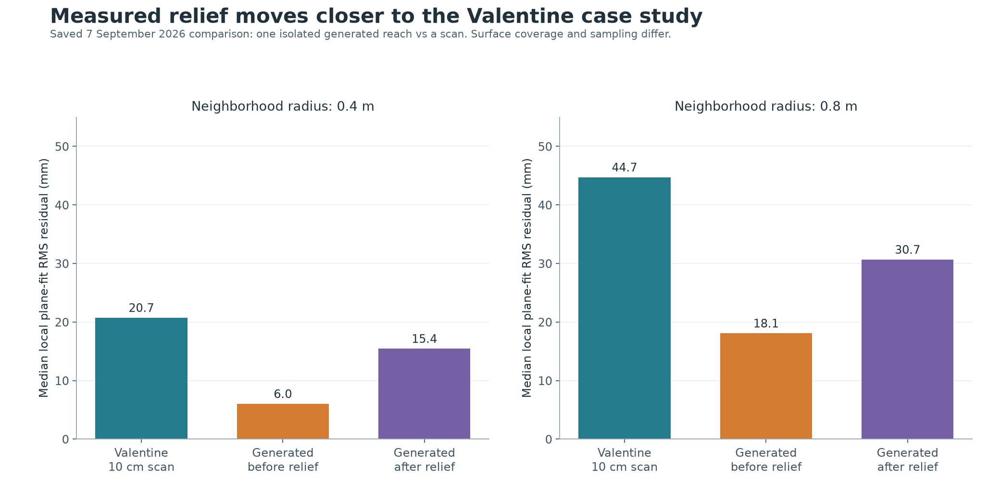

*Figure 8. Median local plane-fit residuals at 0.4 m and 0.8 m neighborhood radii, using saved comparison results. The generated after-relief case moves toward the reference at these scales. Plane residuals also include curvature and edges; the 1.6 m results are omitted here because neighborhoods can span opposing floor and roof surfaces. These bars are not a geological validation score.*

For a new run, inspect three separate things: semantic network consistency, the final mesh and its clearances, and correspondence to surveyed morphology. A closed surface alone proves neither access nor realistic geology. Remaining work includes broader terrestrial shape calibration, route-wide resolution assessment, more complete material/formation models for other bodies, and quantitative validation of fine roof/floor features. Automatic adaptive patch stitching, finite host-rock shells, and visual LOD generation are not implemented.

### Scientific references and figure provenance

- **Terrestrial cave morphology:** Waters, Donnelly-Nolan and Rogers, [*Selected caves and lava-tube systems in and near Lava Beds National Monument*, USGS Bulletin 1673](https://pubs.usgs.gov/publication/b1673). Field descriptions motivate benches, floor changes, compound chambers, and contrasting wall/roof/floor forms; PLUME approximates these features procedurally.
- **Cross-section reference:** Romio et al., [*Pyroduct Digital Catalog*, version 2](https://zenodo.org/records/17750755). Use the frozen cave-level partitions for comparison. Station order is available, but it generally does not establish physical spacing in metres, so it cannot directly calibrate a longitudinal correlation length.
- **Valentine 3D measurements:** Whelley et al., [*NASA TubeX Valentine Cave: 2018 Valentine LiDAR*](https://www.usgs.gov/data/nasa-tubex-valentine-cave-2018-valentine-lidar), released in 2026, DOI 10.5066/P14AC3J5. The local comparison used the explicitly downsampled 10 cm cloud.
- **Interactive reference supplied during development:** Whelley's [*Valentine Cave Lava Tube 5cm*](https://sketchfab.com/3d-models/valentine-cave-lava-tube-5cm-8e8cd77139b54f3d8912c00881af7214). This is a point cloud with intensity colors, not a triangle mesh; its 5 cm sampling should not be confused with the 10 cm USGS comparison product or PLUME's voxel size.
- **Structural context:** Blair et al., [*The structural stability of lunar lava tubes*](https://www.sciencedirect.com/science/article/pii/S0019103516303566), Icarus 282 (2017), 47–55. This motivates treating stability as dependent on roof/material assumptions; PLUME does not reproduce that study's structural solver.

All README result images come from saved PLUME artifacts or measured comparison tables. The pipeline diagram and roof schematic are explanatory illustrations. Input hashes and exact figure sources are recorded in [figure provenance](docs/figures/readme/provenance.json).
