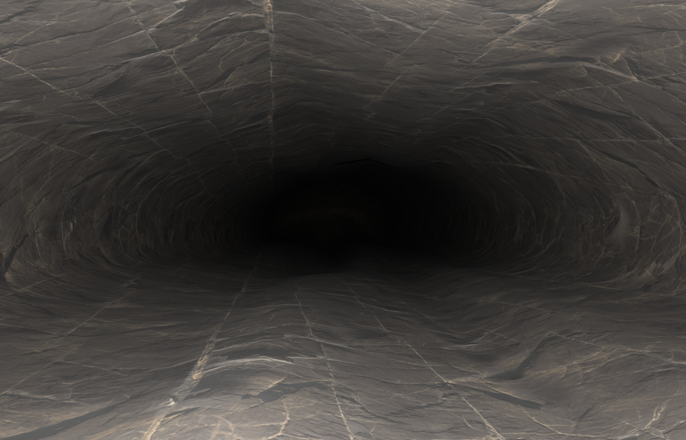
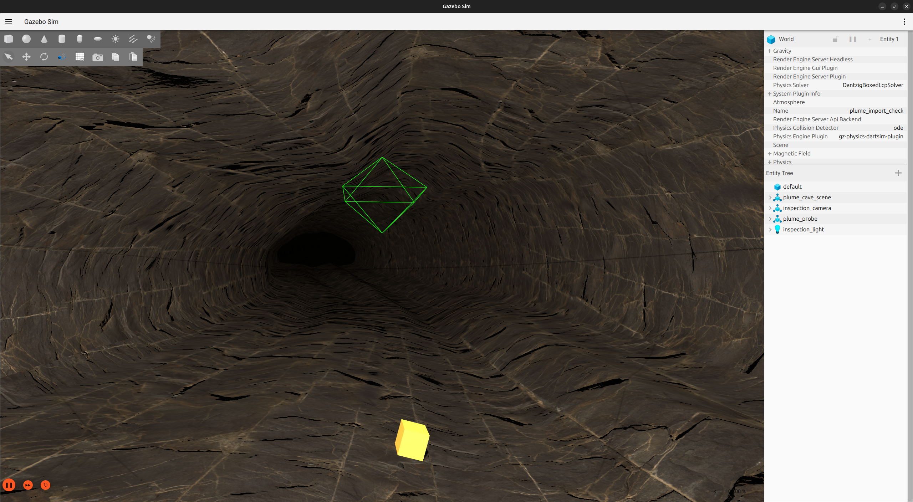
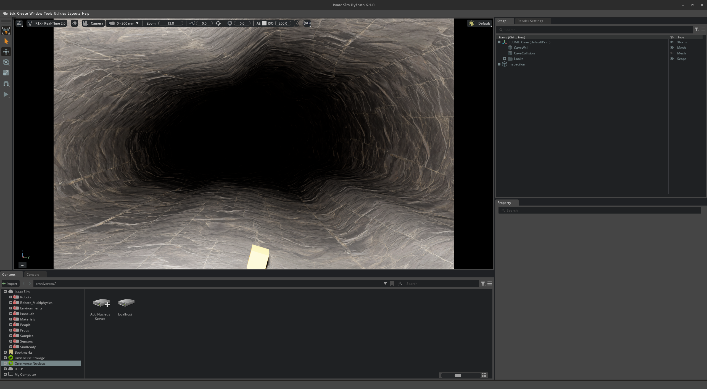

# PLUME-Advanced

**Generate reproducible lava-tube environments for simulation and procedural research.**

PLUME grows single or interacting passage networks inside a physical host field,
builds gravity-constrained cross-sections, and exports textured meshes and static
colliders. Generation includes inspection and bounded repair. Earth, Mars and
Moon scenarios are available.

[Installation](#installation) · [Usage](#usage) · [Simulators](#simulators) · [Documentation](#documentation)



*Example with a reusable rock texture. The basic command below produces an untextured cave;
[add textures when ready](docs/usage.md#textured-caves).*

## Installation

Install [Git](https://git-scm.com/downloads) and
[uv](https://docs.astral.sh/uv/getting-started/installation/), then run:

```bash
git clone https://github.com/Gabryss/P.L.U.M.E-Advanced.git
cd P.L.U.M.E-Advanced
uv sync --locked
```

Python 3.12+ is required; uv can install it automatically. No simulator is needed
to generate a cave. [Optional dependencies and alternative installation](docs/installation.md).

## Usage

From the project directory, generate your first cave:

```bash
uv run plume-generate --output outputs/first_cave/network.png
```

This uses [config/project.toml](config/project.toml): a small Earth cave with a
250 m route target, no textures and no loose rocks. The mesh, stage figures and
inspection reports are saved in `outputs/first_cave/`.

| Next step | Guide |
|---|---|
| Change the seed, size, body or number of networks | [Configuration](docs/configuration.md) |
| Add rock textures or resume a run | [Generation and materials](docs/usage.md) |
| Open the cave in a simulator | [Simulator imports](docs/simulators.md) |

## Simulators

| Application | Tested version | Import guide |
|---|---|---|
| Blender | 4.0.1 | [GLB and native materials](docs/simulators.md#blender) |
| Unity | 6000.6.0f1 | [URP setup](docs/simulators.md#unity) |
| Unreal Engine | 5.8.2 | [UE5 setup](docs/simulators.md#unreal-engine-5) |
| Gazebo Harmonic | Sim 8.15.0 | [SDF / OBJ](docs/simulators.md#gazebo-harmonic) |
| NVIDIA Isaac Sim | 6.1.0-rc.26, source build | [USD](docs/simulators.md#nvidia-isaac-sim) |

| Gazebo Harmonic | NVIDIA Isaac Sim |
|---|---|
|  |  |

[Application screenshots and tested scope](docs/simulators.md).
Import checks do not certify that a ground robot can traverse every generated cave.

## Documentation

| Topic | What you will find |
|---|---|
| [Installation details](docs/installation.md) | Dependencies, optional tools, pip and how uv works |
| [Generation and materials](docs/usage.md) | Recipes, textures, output files and resume |
| [Configuration](docs/configuration.md) | Everyday parameters and advanced controls |
| [Architecture](docs/architecture.md) | Host fields, network growth, meshing, inspection and repair, with figures |
| [Evaluation](docs/evaluation.md) | Seed campaigns, tests, scientific comparisons and native qualification |

## Limits

PLUME is a process-informed procedural model, not a CFD or rock-mechanics solver.
Some seeds may exhaust their repair budget and be rejected. Ground-robot dynamics,
sensors and target-hardware performance need validation in the chosen simulator.
See [model and validation limits](docs/architecture.md#limits).

Code: [BSD 3-Clause](LICENSE). External textures and datasets retain their own licenses.
