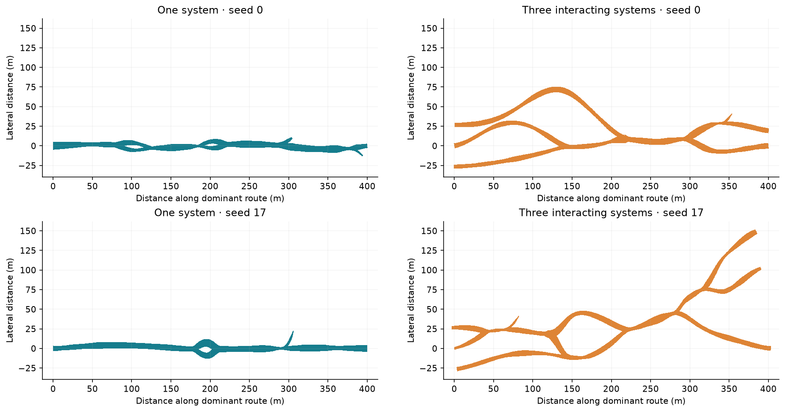
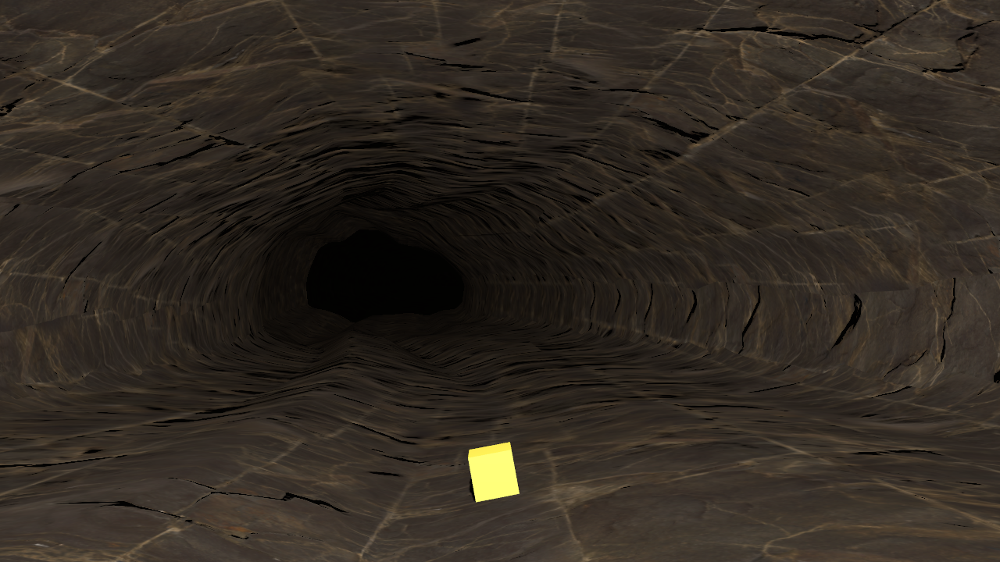
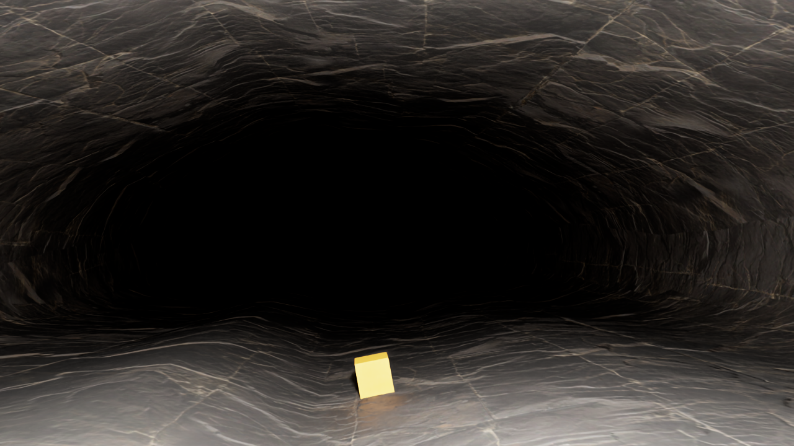
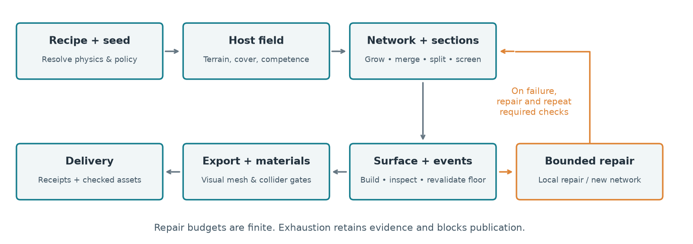
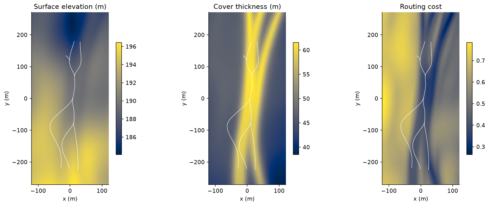
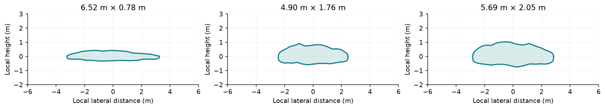
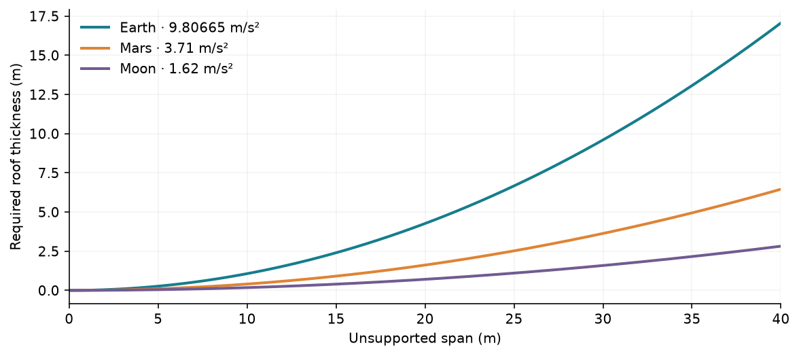

# PLUME-Advanced

**Reproducible lava-tube environments, from a physical host field to inspected 3D assets.**

[Introduction](#introduction) · [Generation examples](#generation-examples) · [Installation & usage](#installation--usage) · [Simulators](#simulators) · [Config file](#config-file) · [Architecture](#architecture) · [Limits](#limits)

## Introduction

PLUME-Advanced generates underground passage networks for visual inspection,
procedural environment studies and robotics simulation preparation. A celestial
body and a seeded host field determine the setting; networks grow within that
field, cross-sections define the cavity, and volumetric meshing produces a
continuous surface. Optional geological events, reusable rock materials and
application-specific exports complete the environment.

The scientific contribution is the **coupling of host-conditioned topology,
spatially varying passage shape, gravity-dependent roof screening and auditable
inspection/repair** in one reproducible pipeline. Named random streams separate
terrain, network, sections, events and geometry. The intermediate fields and
measurements remain available for controlled experiments rather than being lost
inside a final mesh.

| Input | Generated representation | Evidence kept with the run |
|---|---|---|
| Body, material, eruption controls, seed | Terrain and subsurface suitability fields | Resolved physical parameters and host diagnostics |
| One or several interacting systems | Directed passage graph, flow history and junctions | Network checks, selected seeds and repair decisions |
| Local flux, cover and roof constraints | Asymmetric cross-sections, floors and surface relief | Profiles, section resolution and actual-mesh measurements |
| Appearance and export requirements | Visual surface, static collider and material package | Geometry/material checks, budgets and file receipts |

Earth, Mars and Moon profiles are implemented. The model is **process-informed
procedural generation**, not a thermofluid simulation or a calibrated structural
solver. Its outputs are candidates for simulation: passing a generation policy
and qualifying an asset inside a simulator are different steps. See [Limits](#limits).

## Generation examples


*The seed-3 inspection cave rendered in Blender Cycles, using a reusable rock
tile and the native blended material. See [Simulators](#simulators) for versions,
import instructions and the render receipt.*



*Current Stage A–C generation: the same two root seeds with the short single-system
and interconnected presets. Equal metric scales show the difference between local
island bypasses and several passages growing, merging and splitting. These are
unions of sampled section envelopes, not final triangle meshes.*


*Historical Earth seed-4 mesh views without textures or rocks, rendered at 20 cm
voxel resolution. The outside view shows the cavity boundary; PLUME does not build
a surrounding solid rock massif.*

The current diagrams can be regenerated without meshing or downloading textures:

```bash
uv run --no-sync python scripts/generate_readme_figures.py
```

[Current figure provenance](docs/figures/readme/current_provenance.json) records
recipes, seeds, resolved settings, accepted network attempts and content hashes.
[Historical figure provenance](docs/figures/readme/provenance.json) records the
older geometry views.

## Installation & usage

### Install

Use **Python 3.12 or newer**. The checked-in `uv.lock` fixes the dependency set
used by the project; `uv` is the simplest way to reproduce it.

```bash
GIT_LFS_SKIP_SMUDGE=1 git clone https://github.com/Gabryss/P.L.U.M.E-Advanced.git
cd P.L.U.M.E-Advanced
uv sync --locked --no-dev
```

The clone command leaves optional LFS texture masters unfetched.
The default run needs no Blender, engine installation, optional rock provider or
external texture files. For development and scientific evaluation:

```bash
uv sync --locked --group dev --extra rocks --extra paper
```

| Component | Dependencies / installation | When needed |
|---|---|---|
| Core generation | NumPy, SciPy, scikit-image, trimesh | Host fields, networks and meshes |
| Asset preparation | fast-simplification, xatlas, Pillow | Mesh reduction, UV charts, portable images |
| Figures and progress | Matplotlib, Rich | Diagnostics and terminal reporting |
| Development | `--group dev`: pytest, pytest-cov, Ruff, mypy | Tests, coverage and static checks |
| Detailed rock props | `--extra rocks`: pinned Rocky source | When `events.use_rocky_meshes` is enabled |
| Scientific datasets | `--extra paper`: laspy/lazrs, psutil | LiDAR data and resource experiments |
| Source rock textures | Git LFS; ImageMagick `convert` with EXR support | The supplied textured recipes use JPEG/EXR masters |
| Native inspection | Blender; Unity URP / Unreal Editor | Application-side imports, materials and qualification |

Dependencies and version constraints live in [pyproject.toml](pyproject.toml).
If using pip instead, `python -m pip install -e .` installs the core package,
but does not reproduce the locked environment automatically.

### Generate a first cave

**This quickstart generates an untextured cave.** Its GLB contains a plain material
and no image textures; a grey/brown surface in Blender Material Preview is expected.
For the rock-textured appearance shown above, use the material step immediately below.

```bash
uv run --no-sync plume-generate \
  --config config/project.toml \
  --output outputs/first_cave/network.png
```

Edit **[config/project.toml](config/project.toml)** for everyday use. Its default
is a small, neutral, rock-free inspection case with a 250 m route target and
stage figures enabled. The installed package has the same default. A route
target is neither a guarantee of achieved length nor the sum of every branch.

To texture this same cave after generation, fetch the source maps and create a
separate material revision. This keeps the existing passage geometry and adds
embedded 4K color, normal and roughness maps:

```bash
git lfs install
git lfs pull
uv run --no-sync python scripts/texture_inspection.py outputs/first_cave \
  --config config/short-multi.toml --output outputs/first_cave_textured
```

Here `short-multi.toml` supplies **only its appearance settings**; it does not
change the first cave into a multi-system network. Import
`outputs/first_cave_textured/export_blender/plume_cave_scene.glb` into Blender.
The GLB embeds its textures. For seamless native projection, follow the adjacent
`continuous_material/SETUP.txt`. Changing only `export.target` does not enable
textures: the selected recipe must supply image paths.

`--output` names the network figure; its **parent directory** receives the run's
other artifacts. Use a fresh directory for each experiment. The progress display
reports individual operations, work counts when known, elapsed time and repair
attempts; `progress.jsonl` keeps the detailed record.

```bash
# Inspect every resolved setting without generating anything.
uv run --no-sync plume-generate --config config/project.toml --show-config

# See all named presets.
uv run --no-sync plume-generate --list-presets

# Resume an interrupted run with matching inputs, code and dependencies.
uv run --no-sync plume-generate \
  --config config/project.toml --output outputs/first_cave/network.png --resume
```

Generation already includes evaluation, inspection and bounded repair. A failed
required check stops publication and retains its diagnosis. Resume verifies
checkpoint identities and repeats downstream inspections; it cannot turn an old
report into evidence for changed geometry. Local checkpoints contain trusted
Python pickle data and are not an interchange format.

### Single, multi-system and textured cases

| Recipe | Route target | Systems / topology | Initial voxel size | Appearance / policy |
|---|---:|---|---:|---|
| [project](config/project.toml), preset `preview` | 250 m | One gallery, local bypass | 0.20 m | Neutral; inspection |
| [short-single](config/short-single.toml) | 400 m | One gallery | 0.20 m | Neutral; inspection |
| [short-multi](config/short-multi.toml) | 400 m | Three persistent interacting systems | 0.08 m | 4K PBR; inspection |
| [long-single](config/long-single.toml) | 3 km | One gallery | 0.20 m | Neutral; inspection |
| [long-multi](config/long-multi.toml) | 3 km | Three persistent interacting systems | 0.20 m | 4K PBR; inspection |
| [simulation-single](config/simulation-single.toml) / [simulation-multi](config/simulation-multi.toml) | 250 m | One / three systems | 0.04 m, bounded 0.02 m retry | 4K PBR; simulation + reference ground robot |

**Simulation recipes are evaluation inputs, not prequalified environments.**
Their fine grids can be expensive. The short multi preset is also more detailed
than the short single preset; match `geometry.voxel_size` explicitly when comparing
mesh costs between them.

For the supplied textured examples, fetch the LFS master images first:

```bash
git lfs install
git lfs pull
uv run --no-sync plume-check --configs config/short-multi.toml --seeds 17 --scope full --preflight
uv run --no-sync plume-generate --config config/short-multi.toml --output outputs/multi/network.png
```

Preflight checks configuration and required inputs; it does not test mesh quality
or prove that a seed will succeed. Cave textures and loose rock props are
independent: a rock-free cave can be fully textured.

### Inspect and import

| Artifact in a successful run | Purpose |
|---|---|
| `resolved_project_config.json` | Effective physical and procedural settings |
| Stage A–C data and figures | Host, accepted network, section contours and floor samples |
| `pipeline_quality_report.json`, `pipeline_recovery.json` | Required checks, repairs and effective settings |
| `pipeline_inspection.png`, `section_resolution_report.json` | Measured passages and input sampling evidence |
| `export_TARGET/` | Target visual asset, collider, import instructions and material evidence |
| `texture_recovery.json` inside the export | Map normalization and package repair journal |
| `run_manifest.json`, `progress.jsonl` | Completion/failure status, identities, timings and progress |

Exact output names are recorded in the manifest. Stage figures are optional;
inspection reports are still produced when `run.render_diagnostics = false`.

| Target | Recipe setting | How to inspect |
|---|---|---|
| Blender | `export.target = "blender"` | Import the GLB; use Material Preview or Rendered shading |
| Unity | `export.target = "unity"` | Use a glTF importer and the supplied URP material installer |
| Unreal | `export.target = "ue5"` | Use Interchange import and the supplied material builder |
| Gazebo | `export.target = "gazebo"` | Follow the generated model/SDF instructions |
| Omniverse | `export.target = "omniverse"` | Use the generated USD package |
| All supported targets | `export.target = "all"` | Creates each target package from the same canonical scene |

Recipes choose a compatible default format when the target is overridden.
For complete PBR GLBs, `continuous_material/` contains shared maps and **native
blended projection shaders**. Apply them to avoid directional texture seams at UV
chart boundaries. Ordinary GLB import uses its portable UV material; custom
shaders are not transferred automatically.

| Application | Continuous material setup |
|---|---|
| Blender | Run the bundle's `apply_blender_material.py` on the cave; images are packed |
| Unity URP | Copy the bundle under `Assets`; use **Tools → PLUME → Create continuous rock material (URP)** |
| Unreal | Enable Python Editor Script Plugin; execute the bundle's `unreal/create_material.py`, then assign the material |

Detached export bundles include `SETUP.txt` with application-specific details.
For an existing run, `scripts/create_blender_inspection.py` can create a lit
inspection scene; choose `--mapping triplanar` for the continuous material.
A plain grey render may be the neutral package or Solid shading. Persistent
sparkles can be sampling noise: inspect the material and lighting, enable
appropriate Cycles denoising and allow sufficient samples before blaming UVs.

### Evaluate a change

```bash
# Ten A-C cases, each with a separate cold reproducibility replay.
uv run --no-sync plume-check \
  --configs config/short-single.toml config/short-multi.toml \
  --seeds 0 17 42 20260912 4294967295 --scope sections \
  --timeout 600 --memory-limit-mib 8192 --output outputs/section_campaign

# Full generation, material and export checks for one textured seed.
uv run --no-sync plume-check \
  --configs config/short-multi.toml --seeds 17 --scope full \
  --timeout 7200 --memory-limit-mib 24576 --output outputs/full_campaign
```

Open the campaign's offline `report.html`. The JSON summary retains failures,
resource limits, repair decisions and replay results. Ten requested cases plus
cold replays means twenty worker runs. `--no-replay` is an explicit exploratory
tradeoff, recorded in the report. Workers run sequentially; memory and timeout
limits are not increased by repair.

```bash
uv run --no-sync plume-check --output outputs/full_campaign --resume --timeout 10800
uv run --no-sync plume-check --output outputs/full_campaign --resume --report-only
```

`--report-only` checks saved receipts without generating anything. A resumed
campaign verifies its original source/runtime/input identity; code or configuration
changes require a new campaign directory. A stage-only success says nothing about
meshing, floor contact, materials or native import.

For development:

```bash
uv run --no-sync ruff check .
uv run --no-sync mypy src/plume_advanced
uv run --no-sync pytest -q
```

Tests include measured failure crops, synthetic geometry controls, deterministic
replays and policy failures. Optional native application tests require their
external tools; a skipped test is not evidence of engine compatibility.

### Native engine qualification

```bash
uv run --no-sync python scripts/qualify_simulation.py \
  --config config/simulation-single.toml --seed 0 \
  --output outputs/simulation_trial \
  --unity /path/to/Unity --unreal /path/to/UnrealEditor
```

This source-checkout workflow runs numerical generation, a cold replay, native
material views and collision controls. Every supplied editor is mandatory.
**Only `ready/` is the promoted delivery**, created after all requested checks
pass. `qualification.json` explains a rejection; working results remain in
`generation/` and `native/`.

The maintained native harness targets Unity 6000.6 URP and Unreal 5.8 on Linux,
with GPU access. Unity's initial project setup also needs package-registry access
and a valid license. Its current input contract is one rock-free, untransformed
cave primitive with three 4K maps. The numerical API's `require_native = true`
remains unavailable; the separate qualifier supplies the native promotion gate.

To check an existing accepted 4K generation, including normal CLI
`export_blender/` or `export_all/blender/` output, run:

```bash
uv run --no-sync python scripts/check_native_engines.py outputs/my_cave \
  --output outputs/my_cave_native \
  --unity /path/to/Unity --unreal /path/to/UnrealEditor
```

This imports the existing cave and records material and collision checks. It does
not perform the qualifier's cold replay or create a `ready/` delivery.

Use the checked native scene and its **separate static collider**. PLUME metadata
uses right-handed Z-up metres. The supplied glTFast adapter maps points to Unity
`(-x, z, -y)` metres; the Unreal adapter maps to `(100x, -100y, 100z)` centimetres.
The raw collider OBJ does not carry glTF conversion. Alternative importers require
their own axis/bounds check. Configure simulator gravity separately from importing
geometry. Nanite, collision reduction, texture streaming and compression require
performance validation in the target simulation.

## Simulators

The images and their receipts are kept under **[`docs/simulators`](docs/simulators)**,
outside the disposable `outputs/` directory. The
[gallery index](docs/simulators/gallery.json) records each image's origin, capture
date and checksum.

The Blender, Gazebo and Isaac checks below use the **120 m route-target, seed-3,
rock-free cave** with 1K rock maps from the
[simulator recipe](config/simulator-check.toml). Unity and Unreal images are
archived native captures of an earlier 4K inspection cave. They illustrate their
respective materials; different caves, cameras and lighting prevent a direct
image-to-image comparison. These checks do not certify ground-robot traversability.

| Simulator | Version exercised | Package and check |
|---|---|---|
| Blender | **4.0.1**, Cycles validation runtime | GLB import, packed maps, preserved bounds/triangle count and native blended-material render; 16 September 2026 |
| Unity | **6000.6.0f1**, Vulkan | Archived 4K GLB import and native material/clearance checks; 13 September 2026 |
| Unreal Engine | **5.8.2-56702186**, Linux | Archived 4K import and native material/clearance checks; 13 September 2026 |
| Gazebo Harmonic | **Gazebo Sim 8.15.0**, SDFormat 14.9.0 | SDF 1.10 + OBJ; Ogre2 camera capture and DART/ODE box-to-cave contacts passed |
| NVIDIA Isaac Sim | **6.1.0-rc.26**, source build (`main.0.7c206f75.local`) | USD + UsdPreviewSurface; all three maps resolved, RTX capture and PhysX box-to-cave collision passed |

The test machine runs Ubuntu 24.04 with an RTX 3070 (8 GB) and NVIDIA driver
580.173.02. Results apply to this fixture and these versions; importing a different
seed or running a vehicle requires its own checks. The
[campaign receipt](docs/simulators/2026-09-16/campaign.json) records the tested
asset hashes, build repair and check versions (16 September 2026).

Generate the shared small fixture once before running the Blender, Gazebo or
Isaac inspection commands:

```bash
git lfs pull  # Fetch the optional texture masters once.
uv run --no-sync plume-generate --config config/simulator-check.toml \
  --output outputs/simulator_check/network.png
```

### Blender


*Native Cycles render of the current small cave, using the reusable 1K maps and
Blender's blended projection material.
[Import and render receipt](docs/simulators/2026-09-16/blender.json).*

For an ordinary import, choose **File → Import → glTF 2.0** and open
`export_all/blender/plume_cave_scene.glb`. Its embedded UV textures are visible
in Material Preview or Rendered shading. To create the illuminated inspection
scene with the native material and interior views, run from the repository root:

```bash
/path/to/blender --background --python-exit-code 1 \
  --python scripts/create_blender_inspection.py -- outputs/simulator_check \
  --mapping triplanar --quality standard --interior-only
```

Open `export_all/blender/plume_continuous_inspection.blend` inside that run.
The script packs the maps into the scene. Use `--mapping uv` to inspect the
portable GLB material instead. The same script also accepts a Blender-only
generation with its `export_blender/` directory.

### Unity


*Actual Unity capture from 13 September 2026, using the native continuous rock
shader and 4K maps. This is the earlier inspection cave, not a rerun of the current
small fixture. [Native result](docs/simulators/2026-09-13/unity.json).*

Use the GLB and separate collision mesh from `export_all/unity/`, together with
the supplied `continuous_material/unity/` installer and shader. Follow the
exported `README_IMPORT_UNITY.txt` and `continuous_material/SETUP.txt` for the
render-pipeline setup. The GLB alone carries the portable UV material; it cannot
install the native shader. The [native qualifier](#native-engine-qualification)
creates and tests a Unity project for a new simulation delivery.

### Unreal Engine 5


*Actual UE 5.8.2 capture from 13 September 2026, using the native continuous rock
material and 4K maps. The original capture is retained, including its brighter
foreground exposure. [Native result](docs/simulators/2026-09-13/unreal.json).*

Use `export_all/ue5/` and follow its `README_IMPORT_UE5.txt`; the material builder
is in `continuous_material/unreal/`. Retain the separate static collision mesh
and verify the import settings before enabling Nanite or changing mesh reduction.
Use the [native qualifier](#native-engine-qualification) to validate a new cave
with the supplied Unreal adapter. The archived image is a visualization example,
not evidence that an arbitrary new seed is simulation-ready.

### Gazebo Harmonic



*Actual Ogre2 camera output. The box is a temporary physics probe, not generated
geology. [Native result](docs/simulators/2026-09-16/gazebo.json).*

Gazebo receives separate visual and static triangle-collision meshes in metres,
with Z up. Explicit SDF PBR bindings carry base color, normal and roughness maps.
Collider normals are exported because Harmonic's DART/ODE mesh path requires
them. Keep the complete model directory together.

```bash
# Uses Gazebo's system Python bindings (gz.transport13, gz.msgs10) and Pillow.
/usr/bin/python3 scripts/check_gazebo.py \
  outputs/simulator_check/export_all/gazebo/plume_cave_scene \
  --view docs/simulators/2026-09-16/view.json \
  --output outputs/simulator_check/gazebo_native
```

For interactive use, follow `README_RUN_GAZEBO.txt` in the export directory.
The checker adds an interior camera, point light and contact probe to its own
`inspection.world.sdf`; it does not modify the exported cave. Its renderer uses
[Gazebo's headless Ogre2 path](https://gazebosim.org/api/sim/8/headless_rendering.html).

### NVIDIA Isaac Sim



*Actual RTX camera output from the same cave and camera position. The checker
adjusts its light exposure to obtain an inspectable image; the captured pixels
are saved directly. [Native result](docs/simulators/2026-09-16/isaac.json).*

Use `export_all/omniverse/plume_cave_scene.usd` (or `export.target = "omniverse"`)
and keep its texture directory beside it. The stage declares metres and Z up,
uses repeated UV textures, and marks the hidden static collider with
`PhysicsMeshCollisionAPI` and `approximation = "none"`. Convex-hull collision
would fill the cave interior.

```bash
ISAAC_SIM_DIR=/path/to/isaacsim/_build/linux-x86_64/release
"$ISAAC_SIM_DIR/python.sh" --no-ros-env scripts/check_isaac_sim.py \
  outputs/simulator_check/export_all/omniverse/plume_cave_scene.usd \
  --view docs/simulators/2026-09-16/view.json \
  --output outputs/simulator_check/isaac_native
```

The checker loads the USD in Isaac Sim, checks texture resolution and material
binding, simulates a small dropped box with PhysX, and saves an RTX camera image.
It requires a working Isaac runtime and GPU access; ordinary Python tests do not
launch either simulator.

Open the checker's `isaac_native/inspection.usda` to inspect its camera, light
and probe interactively. The original exported cave has no inspection lighting.
The supplied `view.json` belongs to this fixed recipe; select a new interior
position and floor height when checking a different cave.

For this source checkout, SDL's isolated build accidentally discovered optional
host text/input libraries. The [local recipe patch](docs/simulators/2026-09-16/isaac-sdl.patch)
disables those undeclared options. After freeing disk space, the release build
succeeded. The earlier disk-full interruption had also left a truncated PhysX
extension, which was quarantined and downloaded again. Keep sufficient free
space for dependencies, extension unpacking and build artifacts before starting
a source build.

Both adapters currently use their portable **UV materials**. The blended
projection shaders supplied for Blender, Unity and Unreal do not automatically
transfer to Gazebo or Isaac Sim, so UV-chart seams and differences in lighting
can remain visible. The screenshots show those actual results.

## Config file

### One small recipe, one resolved configuration

The user-facing file is [config/project.toml](config/project.toml). Its core is:

```toml
recipe_version = 1
preset = "preview"
procedural_seed = 3

[world]
body = "earth"

[run]
render_diagnostics = true

[export]
target = "neutral"
```

A recipe expands **in memory**: shared calibration → named preset → your TOML
overrides → explicit CLI/evaluation overrides → body/stage defaults and validation.
It never rewrites another config file. The internal calibration is stored once
in [presets.json](src/plume_advanced/presets.json); users do not need to edit it.
The same loader serves generation, evaluation and qualification.

| Everyday control | Meaning |
|---|---|
| `recipe_version = 1` | Compact recipe format; do not combine with `schema_version` |
| `preset` | Selects a coherent host domain, topology, resolution and acceptance policy |
| `procedural_seed` | Nonnegative integer; controls all named stage streams and sampled ranges |
| `world.body` | `earth`, `mars` or `moon`; an edit selects that body's default rock material unless explicitly overridden |
| `run.render_diagnostics` | Produces stage figures in addition to mandatory inspection evidence |
| `export.target` | Target package; changing it selects the corresponding format unless one is supplied |
| `acceptance.profile` | `research`, `inspection` or `simulation`; requirements are explained below |

Relative asset paths are resolved against **the recipe's directory**. Paths in
the bundled textured examples assume `config/` beside `texture/`. If you move a
recipe, update its paths or use absolute paths. Unknown keys, invalid versions,
non-finite numbers and contradictory acceptance controls fail explicitly.
Tables merge recursively; arrays such as `[min, max]` replace the entire array.
`--show-config` displays the resulting values before any allocation or generation.

### Focused overrides

Add only the tables you need. For example, change the mesh resolution and
triangle budget while retaining the calibrated network:

```toml
[geometry]
resolution_policy = "fixed"
voxel_size = 0.10

[export]
target = "unity"
max_visual_triangles = 2000000
max_asset_bytes = 268435456
```

Edit an existing table rather than declaring it twice in TOML. `run.quality`
selects resolution only with `geometry.resolution_policy = "body"`; it does not
supersede a fixed voxel size. `run.dev_mode` crops a body-scaled domain rather than
shrinking passage dimensions. Use `short-*` / `long-*` for the supplied Earth
extents. Changing only `network.target_route_length_m` does not resize the host:
longer or wider systems also need sufficient grid extent and source placement.

The specialised `trunk`, `gallery`, `gallery-long` and `interacting` recipes expose
distinct active network models. `body-study` uses body-scaled host conditions;
`research` retains the general scientific scenario and optional events used by
`src/plume_advanced/evaluation/resources/experiments.toml`. Short/long inspection domains are explicitly metric:
a `world.body` edit changes physics and passage defaults but does not automatically
widen those fixed host grids. Inspect the resolved domain for large Moon/Mars tubes.

### Appearance, rocks and route requirements

| Settings | Effect / units |
|---|---|
| `events.enabled`, `events.include_rock_props` | Geological modifications and separate loose-rock props; both off in inspection examples |
| `events.use_rocky_meshes` | Requests the optional Rocky provider; otherwise built-in prop meshes are used |
| `geometry.cave_diffuse_texture`, `cave_normal_texture`, `cave_roughness_texture` | PBR source paths; empty paths select a neutral material |
| `geometry.embedded_texture_max_size` | Maximum image edge in pixels; 4K has one quarter the pixels of 8K |
| `geometry.cave_texture_scale_m` | Metres per repeated tile, independent of cave length |
| `geometry.cave_normal_scale` | Fine shading strength; does not change collision or passage clearance |
| `geometry.cave_normal_convention` | `opengl` or explicitly declared `directx`; no guess from filenames |
| `geometry.texture_repair_attempts` | `0` inspects only; `1` permits bounded map repair and one package rebuild |
| `acceptance.route_height_m`, `route_width_m`, `route_margin_m` | Required inspection envelope, metres; defaults 0.5 × 0.5 with 0.02 margin |
| `acceptance.require_ground_routes` | Adds floor support, slope, step and finite chassis checks |
| `acceptance.robot_length_m`, `robot_max_slope_deg`, `robot_max_step_m` | Reference chassis limits: 0.7 m, 20°, 0.10 m |

The supplied 4K recipes reuse [Poly Haven Dark Rock](https://polyhaven.com/a/dark_rock)
from the repository's LFS master textures. This is an appearance asset, not a
measured or body-specific lava-tube calibration. Color is sRGB; normal and
roughness maps are linear data. In portable GLB, roughness is packed into green
and metallic into blue. Native continuous shaders decode raw normal RGB themselves;
use the installers' import settings rather than automatic normal-map swizzling.

<details>
<summary><strong>Advanced configuration map</strong> — open for scientific controls and repair budgets</summary>

A standalone advanced file starts with `schema_version = 4` instead of a recipe.
This remains the active experiment interface, not a historical schema adapter.
No old-schema migration or unknown-key fallback is provided.

| Table / controls | Role | Implementation reference |
|---|---|---|
| `world.gravity_m_s2`, `bulk_density_kg_m3`, strength/quality fields | Explicit physical scenario parameters | [world.py](src/plume_advanced/world.py) |
| `flow_regime` | Supply, duration, inflation, distributary tendency and cooling; dimensionless | [world.py](src/plume_advanced/world.py) |
| `host_field.grid`, `ranges`, `wave_ranges` | Domain size/resolution and seeded terrain/geology variation | [host_field.py](src/plume_advanced/stages/host_field.py) |
| `host_field.routing_weights` | Relative influence of slope, cover, fracture, capacity and stability | [host_field.py](src/plume_advanced/stages/host_field.py) |
| `network.topology`, `systems`, `interconnection` | Network style, independently growing systems, parallel persistence and interactions | [network_topology.py](src/plume_advanced/stages/network_topology.py), [network_interconnected.py](src/plume_advanced/stages/network_interconnected.py) |
| `network.emplacement_history`, `lobe_growth` | Formation phases, reuse, retirement, breakout and pool controls | [network.py](src/plume_advanced/stages/network.py) |
| `network.quality.max_attempts`, `repair_passes` | Finite pre-mesh morphology search; repeatable candidate streams | [network_quality.py](src/plume_advanced/stages/network_quality.py) |
| `section_field` | Sampling spacing, asymmetry, floor/roof shape, longitudinal variation and cover limits | [section_field.py](src/plume_advanced/stages/section_field.py) |
| `floor_map`, `events` | Floor sampling, structural events and debris placement | [floor_map.py](src/plume_advanced/stages/floor_map.py), [events.py](src/plume_advanced/stages/events.py) |
| `geometry.storage_mode`, `chunk_size`, `max_dense_voxels` | Dense versus tiled volume storage and allocation controls | [geometry_types.py](src/plume_advanced/stages/geometry_types.py) |
| `geometry.recovery_local_attempts`, `recovery_network_attempts` | Upstream local adjustments and replacement networks in the same host | [recovery.py](src/plume_advanced/pipeline/recovery.py) |
| `geometry.resolution_refinement_attempts`, `resolution_max_allocated_voxels` | Explicit bounded grid refinement; never an unlimited memory retry | [resolution.py](src/plume_advanced/pipeline/resolution.py) |
| `geometry.surface_*`, `cave_smoothing_iterations`, `cave_displacement_scale_m` | Geometric relief, smoothing and image displacement; reinspection required | [geometry.py](src/plume_advanced/stages/geometry.py) |
| `geometry.collision_target_reduction`, `collision_max_error_m` | Collider reduction target and measured error budget | [collision.py](src/plume_advanced/exporters/collision.py) |
| `export.max_visual_triangles`, `max_asset_bytes`, `visual_max_error_m` | Published asset cost and reduction error limits | [scene.py](src/plume_advanced/exporters/scene.py) |

Defaults, types and units are documented next to the consuming dataclasses.
Some are derived from the body or acceptance policy, so a dataclass default alone
is not the effective run setting. Always inspect the resolved configuration.
`network.source_count` places inlet samples; `network.systems.count` is the number
of independently interacting systems. They are not interchangeable.

</details>

## Architecture

### Execution and data flow



*The accepted network, sections and base mesh travel together. A replacement
network causes downstream data to be rebuilt; old figures are not attached to a
new mesh. Export failures likewise cannot overwrite a previously accepted package.*

| Phase | Representation and operation | Main checks / outputs |
|---|---|---|
| Resolve | Recipe, body, material, stage seeds and acceptance policy | Strict configuration; input and runtime identities |
| A · Host | 2D fields for elevation, slope, volcanic-layer cover, competence, fractures and growth cost | Grid extent, viable source region; host influence report |
| B · Network | Directed graph with passage polylines, systems and formation metadata | Connectivity, crossings, turn/grade/width limits and topology-specific morphology |
| C · Sections | Local frames and asymmetric contours along each passage | Roof/host constraints; adaptive sample spacing and section footprint |
| D · Base geometry | Swept implicit cavity field; tiled or dense sampling; isosurface extraction | Closed/oriented mesh, intended components/handles, passage and resolution checks |
| Floor / E · Events | Ray-sampled base floor; supported debris and structural modifications | Local support, spacing, required-route protections |
| D · Final geometry | Event-aware surface and final floor revalidation | Repeat geometry/clearance checks after changes |
| Export | Visual preparation, material/UV work, collider reduction and serialization | Actual prepared/serialized surfaces, textures, budgets and atomic publication |
| Native qualification | Cold replay plus imported-engine material/collision controls | Separate `ready/` receipt only after all requested gates pass |

[`cli.py`](src/plume_advanced/cli.py) coordinates stages;
[`pipeline/`](src/plume_advanced/pipeline/) owns checkpoints, inspection and
recovery. Numerical representations live in [`stages/`](src/plume_advanced/stages/),
asset preparation in [`exporters/`](src/plume_advanced/exporters/), and campaigns
and scientific measurements in [`evaluation/`](src/plume_advanced/evaluation/).
[`scripts/`](scripts/) contains optional inspection, figure and native-editor tools.

### Host-conditioned growth and topology



*Elevation, available cover and routing cost from the short multi-system case,
seed 0. White polylines show the accepted routes in world coordinates. A shared
physical host influences all systems; multi-system generation does not simply
duplicate and offset a finished tube.*

The host combines a regional downhill trend, seeded terrain waves, corridors,
volcanic-layer thickness, fracture preferences and competence variation. Weighted
suitability terms guide path growth. A seed affects both the host and the network;
controlled experiments can hold one stream fixed while varying the other.

| Active topology | Construction | Intended use |
|---|---|---|
| General emplacement | Main routing with lobe growth and optional stacked history | Eruption-control and body-scale studies |
| Trunk-dominated layout | Dominant gallery, local split/rejoin islands and short side passages | A compact Valentine-inspired topology |
| Independent gallery growth | Several source systems with conserved per-phase discharge and shared passages | Interacting systems with a dominant-gallery criterion |
| Interconnected growth | Independent systems following multiple host corridors with persistent parallel reaches | Repeated merge/split behaviour along a broad network |

A merge becomes a **shared graph passage**, not two coincident tunnels. Split
confirmation and minimum shared/independent lengths prevent rapid switching.
Interconnected checks also measure parallel occupancy over downstream windows;
adding multiple sources that immediately collapse into one route does not satisfy
that model's intended behaviour.

Formation metadata tracks phase activity, discharge, cooling/age proxies,
reoccupation and optional drained pools. Pools are selected from local conditions
and become elongated widenings; junctions do not receive arbitrary spherical rooms.
These are procedural formation rules, not a simulation of molten lava transport.

### Sections, gravity and roof screening



*Low-junction samples near the 10th, 50th and 90th height percentiles of the current
short multi case, seed 0. These input contours precede volumetric relief, smoothing
and event modifications. They are not measured final clearances.*

Local passage width and height vary with host conditions, flux/history metadata,
correlated morphology and seeded asymmetry. Separate floor, roof and wall controls
avoid a constant elliptical extrusion. Adaptive sampling becomes denser near
curvature, width changes and junctions. Junction envelopes and frames must agree
before the surface is built.

Roof thickness couples width and height. At a fixed floor depth `d`, a cavity of
height `h` leaves a roof `t = d − h`. The current conservative, simply supported
beam surrogate requires:

$$t \ge \frac{3 S \rho g w^2}{4\sigma_{\mathrm{eff}}}$$

Here `w` is unsupported span, `S` the safety factor, `ρ` rock density, `g` gravity
and `σ_eff` effective fractured-rock tensile strength. Widening increases demand
quadratically; increasing height reduces the available roof thickness. Body width
caps are additional procedural constraints, not universal maximum cave sizes.



*Only gravity varies: density 2,900 kg/m³, effective strength 3 MPa, safety factor
1.5. These conditional model curves are not observed tube dimensions. Arching,
layering and stress confinement require a more complete structural model.*

### Surface construction and simulation cost

Geometry sweeps section envelopes into an implicit field, combines junctions and
structural features, and extracts triangles with marching cubes. Sparse tiles
limit empty-space allocation; shared boundaries and welding must preserve a
continuous surface. Coherent wall/roof/floor relief supplies larger physical
variation. Normal maps supply fine shading detail without adding collision faces.

| Control | Quality effect | Cost / caveat |
|---|---|---|
| Smaller voxels | Resolves narrower passages and smaller relief | Halving spacing can approach 8× dense sample memory |
| More section samples | Better local interpolation near sharp changes | More profile and field-evaluation work |
| Tiled storage | Avoids allocating a full empty bounding box | Tile halos and extraction still consume memory |
| Visual reduction | Smaller render mesh | Must preserve topology, routes and sampled surface-error bounds |
| Dedicated collider | Fewer collision triangles where acceptable | Checked independently; may retain the master if reduction fails |
| One repeated PBR tile | Texture allocation independent of cave length | Geometry/draw costs still grow; image file size is not GPU memory |
| Continuous projection | Removes UV chart boundaries from material sampling | Nine texture samples instead of three; no added polygons |

Serialized float32 coordinates are checked, including metre/centimetre
representations, because a mesh valid in float64 can degenerate on import.
Export limits constrain the delivered asset; they are not a frame-rate guarantee.

### Embedded inspection and repair

| Layer | Inspection | Permitted response |
|---|---|---|
| Network / sections | Shape, connectivity, overlaps, host/stability limits, intended topology | Deterministic local repairs and a bounded candidate search |
| Base surface | Components, orientation, handles, protected routes and thin features | Bounded local field repair, policy-permitted relief adjustment, upstream recovery |
| Resolution | Input samples across passages; declared refinement/convergence probes | Finer consistent grids only within explicit allocation/attempt limits |
| Mobility | Continuous capsule clearance; optional chassis/floor/slope/step checks | Bounded route placement/detours and constrained local geometry repair |
| Visual / collider | Prepared surface, float precision, reduction deviation and route preservation | Safer reduction/precision candidates; reject when checks still fail |
| Textures / package | Decoding, normal vectors, color/data bindings, exact embedded maps and adapter files | Normalize usable vectors; declared DirectX conversion; one package rebuild |
| Publication | All required policy checks and integrity receipts | Atomic replacement only after acceptance |

Missing input images, corrupt data, unsupported capabilities, programming errors
and resource exhaustion are not fixed by trying random seeds. Repairs retain their
original failure, attempted actions, effective settings and final result. Acceptance
is never automatically weakened to make a seed pass.

| Policy | Required beyond ordinary pipeline checks |
|---|---|
| `research` | Exploratory numerical outputs; clearance/export budgets are not implied |
| `inspection` | Required capsule route, dedicated checked collision and finite export budgets |
| `simulation` | Inspection requirements plus resolution evidence and positive retained-relief policy |
| `require_ground_routes = true` | Additional finite chassis, floor support, slope, step and junction-turn checks |
| `require_textures = true` | Complete accepted PBR maps and package evidence |

The reference ground contract is 0.7 m long × 0.5 m wide × 0.5 m high, a 0.02 m
margin, 20° maximum slope and 0.10 m maximum step. Required paths and junction
connectors are checked on raw, visual and collision surfaces. Optional side
passages may remain narrower. These checks do not simulate wheel or track dynamics.

### Scientific evaluation and reproducibility

The bundled [experiment declaration](src/plume_advanced/evaluation/resources/experiments.toml) separates morphometry,
controllability, host/sampling ablations, scalability, export consistency and
reproducibility. Data analysis uses generated graph/profile measurements, not
screenshots as quantitative evidence.

| Reference | What it informs | What it cannot establish |
|---|---|---|
| [Pyroduct Digital Catalog v2](https://doi.org/10.5281/zenodo.17750755) | Terrestrial cross-section shape and size distributions | Full network topology or extraterrestrial calibration |
| [USGS/NASA TubeX Valentine Cave](https://doi.org/10.5066/P14AC3J5) | One cave's planform, local widening and surface comparisons | A universal morphology target; plan envelopes are not single-passage sections |

The [bundled PDC cave partitions](src/plume_advanced/evaluation/resources/splits/) contain 76
calibration caves and 19 confirmatory caves. The split ranked SHA-256 of
`pdc-v2.0:20260831:<cave-id>` and reserved the first 19. Do not tune on the
confirmatory set. An exploratory whole-catalog summary predates the split, so it
is not claimed to have been historically unseen.

```bash
export PLUME_PDC_ROOT=/absolute/path/to/extracted/PDC-v2
uv run --no-sync plume-evaluate audit
uv run --no-sync plume-evaluate pdc-audit
uv run --no-sync plume-evaluate morphometry \
  --reference-partition calibration --max-seeds 3
```

External reference archives remain outside Git. The maintained loader retains
source identities and rejection reasons. Bundled experiments write results under
`outputs/evaluation/` in the working directory. Their research recipe resolves
relative assets as the public `config/research.toml` does: from `config/` in that
working directory, with rock maps under `texture/`. External textures are not
included in the Python wheel. The audit returns a failure and lists missing input
files when they are unavailable.

Pass `--config path/to/experiments.toml` before the subcommand to use a custom
declaration. Its paths resolve beside that file; the selected project recipe's
assets resolve beside the recipe. Optional `general.asset_directory` overrides
the base for relative texture and Rocky scratch paths without moving the recipe.
Experiment tables reject unknown keys, invalid types, unsupported choices and
nonfinite or out-of-range values before starting work.

Export evaluation checks every target's descriptor and visual bounds in metres.
Completed exports are reused only while the complete package still matches its
file hashes. Missing, modified or extra files trigger regeneration; the previous
attempt is retained, and a failed regeneration replaces its success claim.
`plume-evaluate --help` lists the full
experiment suite; the complete campaign is much more expensive than a smoke test.

A repeatable run requires the **seed, resolved configuration, source/material
resources, external inputs and dependency runtime**. The source identity includes
the shared preset catalog and shipped material adapters. Cold replays use a
separate process and a different Python hash seed. No finite test campaign proves
that every possible seed succeeds.

## Limits

| Area | Current limit |
|---|---|
| Geological fidelity | Procedural rules and conservative surrogates; no CFD, cooling PDE or full rock-mechanics solution |
| Celestial coverage | Earth/Mars/Moon scenarios only; Jupiter/Saturn moons and cryovolcanic materials are not implemented |
| Seed reliability | Some seeds exhaust repair or resource budgets. A clean rejection is expected behaviour, not a valid environment |
| Ground mobility | Clearance/support/slope/step screening is implemented; traction, suspension, steering, wheel/track dynamics and sensors remain simulator responsibilities |
| Numerical coverage | Sampled checks do not prove the absence of every self-intersection or geometric defect |
| Appearance | One reusable rock tile is not measured basalt calibration; valid maps do not guarantee natural appearance in every view |
| Geometry extent | Cavity boundary with closed numerical ends; no surrounding massif, automatic entrances or complete terrain shell |
| Runtime performance | File/triangle budgets and checked reduction are implemented; streaming, LOD policy, frame time and engine memory need target-hardware profiling |
| Native scope | Unity/Unreal have route qualification checks; Gazebo/Isaac have separate import smoke checks described in [Simulators](#simulators). Other versions and robot behavior require separate verification |

Code is distributed under the [BSD 3-Clause license](LICENSE). External datasets and
texture assets retain their own licenses and attribution requirements.
