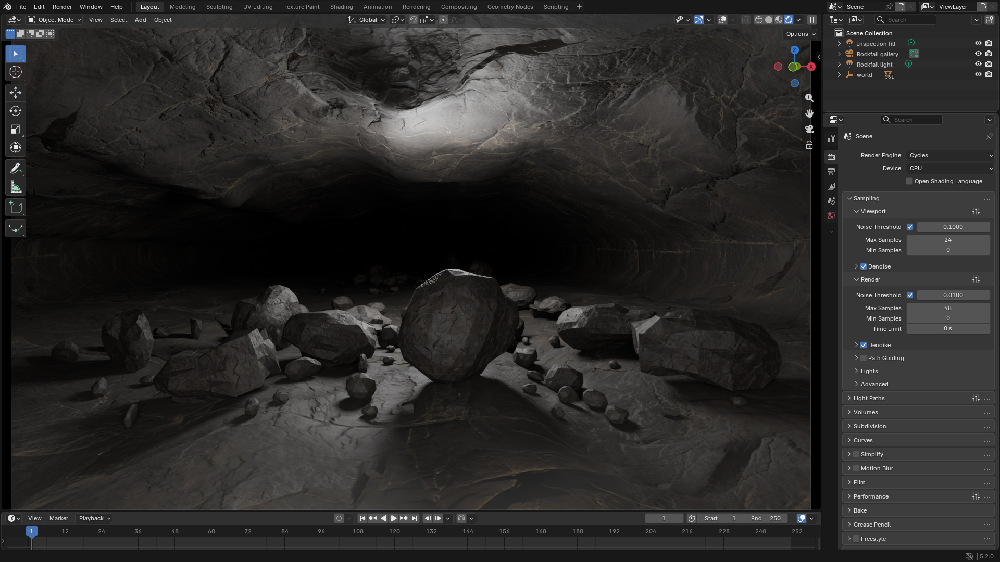
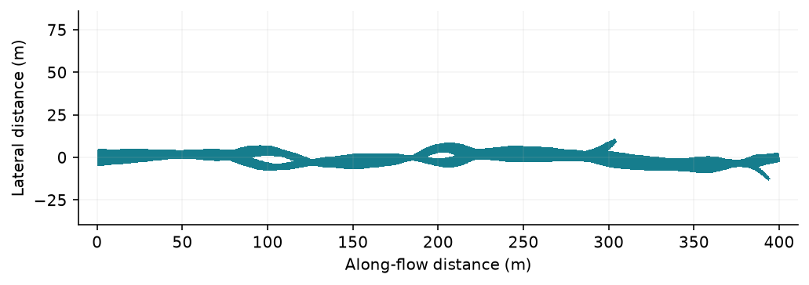
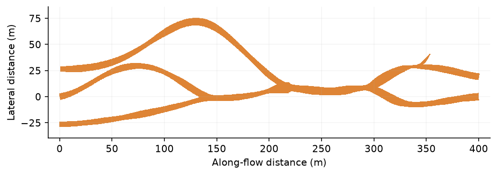
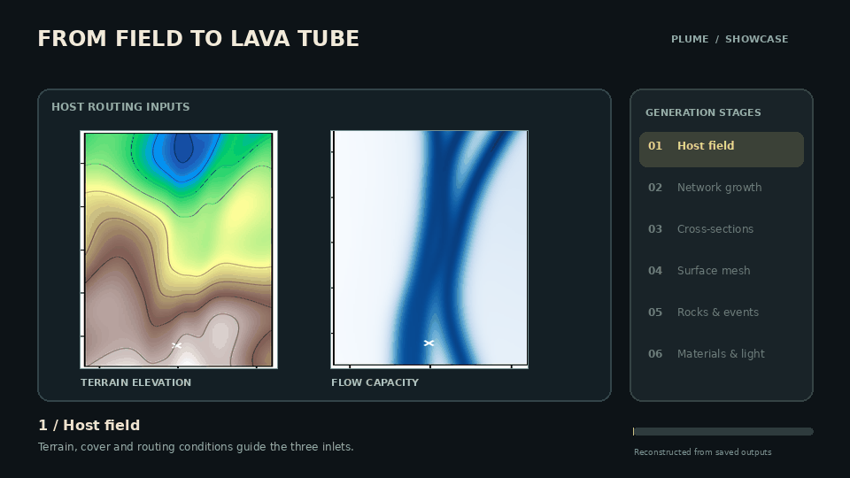
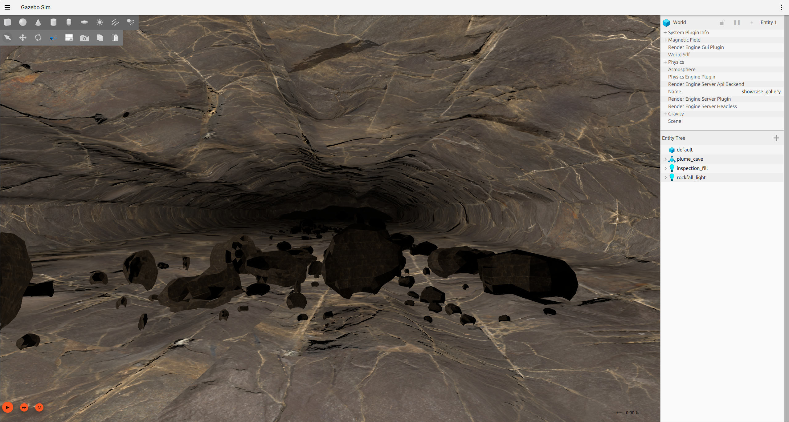
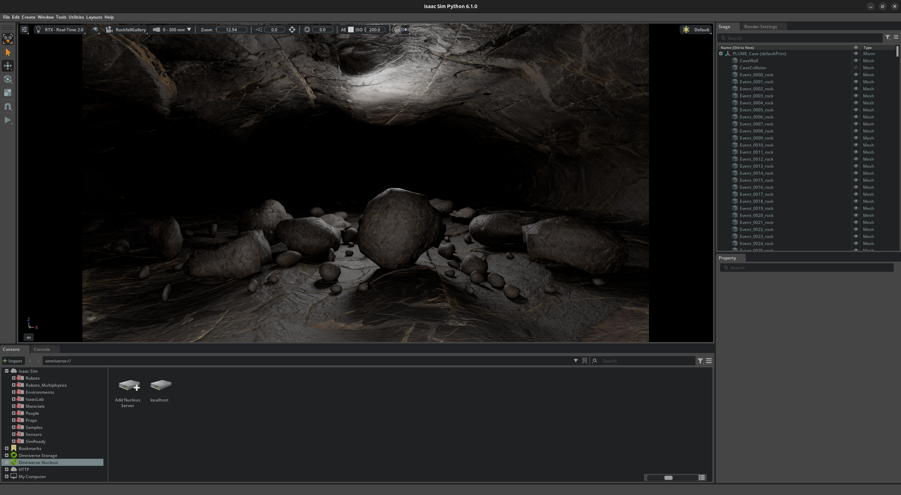
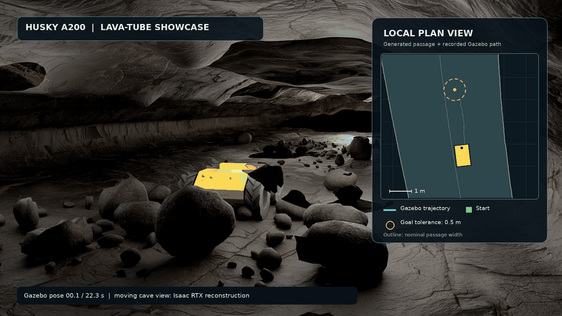

<p align="center">
  
</p>

# PLUME-Advanced

**Generate reproducible lava-tube environments for simulation and procedural research.**

PLUME grows single or interacting passage networks inside a physical host field,
builds gravity-constrained cross-sections, and exports textured meshes and static
colliders. Generation includes inspection and bounded repair. Earth, Mars and
Moon scenarios are available.

[Installation](#installation) · [Usage](#usage) · [Simulators](#simulators) · [Documentation](#documentation)



*Multi-network showcase with rocks and 8K textures. [Showcase recipe](docs/usage.md#showcase-generation)
· [The same rockfall in five applications](docs/simulators.md). The basic command below produces an untextured cave.*

| Single system — top down | Three interacting systems — top down |
|---|---|
|  |  |

*400 m route targets · seed 0 · same metric scale. Generated section footprints;
[more examples and how they grow](docs/architecture.md#single-and-multi-network-top-down-views).*

### See the showcase grow



*The network grows according to saved centerline ages from the accepted showcase.
The animation then shows section widths, the surface stage, grounded events, and
the finished Blender render. This is a reconstruction from saved outputs, not a
screen recording of a generation run.*

## Installation

Install [Git](https://git-scm.com/downloads) and
[uv](https://docs.astral.sh/uv/getting-started/installation/), then run:

```bash
git clone https://github.com/Gabryss/P.L.U.M.E-Advanced.git
cd P.L.U.M.E-Advanced
uv sync --locked
```

Python 3.12+ is required; uv can install it automatically. No simulator is needed
to generate a cave. [Optional dependencies and alternative installation](docs/installation.md).

## Usage

From the project directory, generate your first cave:

```bash
uv run plume-generate --output outputs/first_cave/network.png
```

This uses [config/project.toml](config/project.toml): a small Earth cave with a
250 m route target, no textures and no loose rocks. The mesh, stage figures and
inspection reports are saved in `outputs/first_cave/`.

**Ordinary runs export a cave labelled not robot-qualified.** To require reference
robot checks, set `acceptance.require_ground_routes = true` in the recipe.
Generation then tries reproducible seeds within the configured budgets;
[qualification, retry limits and seed history](docs/usage.md#ordinary-generation-or-robot-qualification).

| Next step | Guide |
|---|---|
| Change the seed, size, body or number of networks | [Configuration](docs/configuration.md) |
| Add rock textures or resume a run | [Generation and materials](docs/usage.md) |
| Generate a detailed multi-network showcase with rocks | [Showcase recipe](docs/usage.md#showcase-generation) |
| Require robot qualification or replay a tried seed | [Generation modes](docs/usage.md#ordinary-generation-or-robot-qualification) |
| Open the cave in a simulator | [Simulator imports](docs/simulators.md) |

## Simulators

| Application | Import guide |
|---|---|
| Blender | [GLB and native materials](docs/simulators.md#blender) |
| Unity | [URP setup](docs/simulators.md#unity) |
| Unreal Engine | [UE5 setup](docs/simulators.md#unreal-engine-5) |
| Gazebo Harmonic | [SDF / OBJ](docs/simulators.md#gazebo-harmonic) |
| NVIDIA Isaac Sim | [USD](docs/simulators.md#nvidia-isaac-sim) |

| Gazebo Harmonic | NVIDIA Isaac Sim |
|---|---|
|  |  |

[Showcase screenshots, application versions and import instructions](docs/simulators.md).
Import checks do not certify that a ground robot can traverse every generated cave.



*One recorded short Husky A200 route in Gazebo. The plan inset animates the logged
position and heading; the cave view shows Isaac RTX visual reconstructions at
the same logged poses. The near-stationary opening interval is condensed for
playback. This animation does not represent an Isaac dynamics run.*

## Documentation

These guides describe the same pipeline. Start with installation and generation;
use the remaining chapters for configuration, internals and validation.

| Topic | What you will find |
|---|---|
| [Installation details](docs/installation.md) | Dependencies, optional tools, pip and how uv works |
| [Generation and materials](docs/usage.md) | Recipes, textures, robot qualification, seed retries and resume |
| [Configuration](docs/configuration.md) | Everyday parameters and advanced controls |
| [Architecture](docs/architecture.md) | Host fields, network growth, meshing, inspection and repair, with figures |
| [Simulator imports](docs/simulators.md) | Showcase previews, application versions, materials and import steps |
| [Evaluation](docs/evaluation.md) | Seed campaigns, tests, scientific comparisons and native qualification |

## Limits

PLUME is a process-informed procedural model, not a CFD or rock-mechanics solver.
Failed candidates can exhaust local repair and trigger a new seed. Search can be
capped with `run.max_seed_attempts`; a passing cave is not guaranteed for arbitrary
settings, and configuration/resource errors still stop generation. Ground-robot
dynamics, sensors and target-hardware performance need validation in the simulator.
See [model and validation limits](docs/architecture.md#limits).

Code: [BSD 3-Clause](LICENSE). External textures and datasets retain their own licenses.
