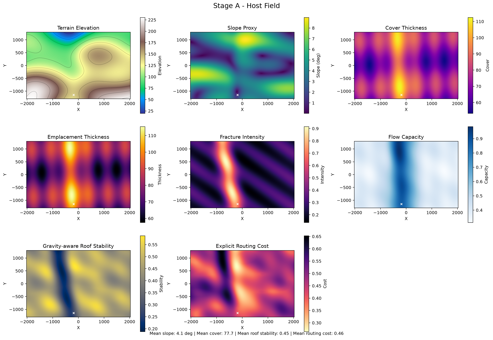
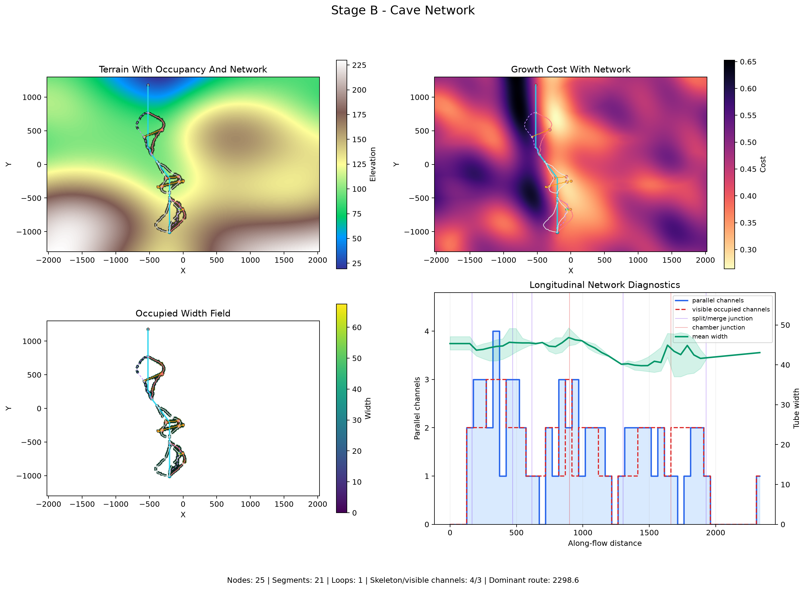
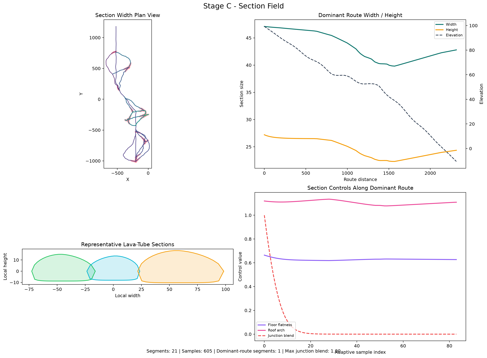
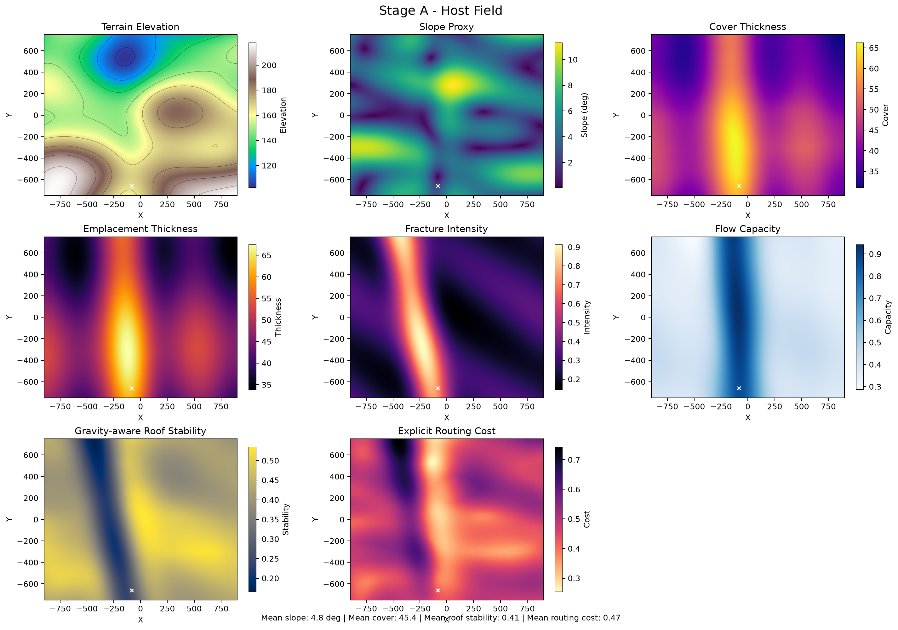
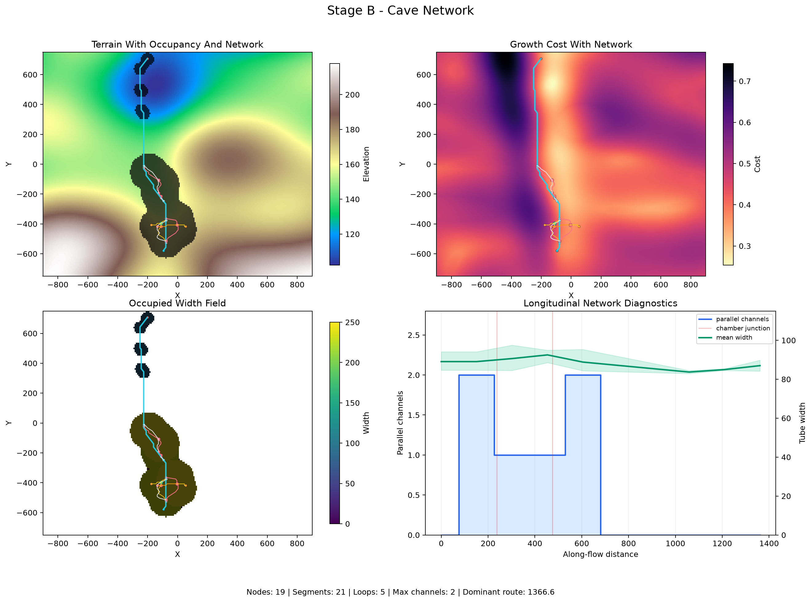
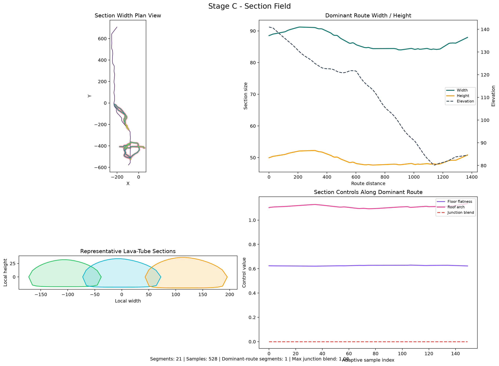

# Celestial-body generation gallery

These figures are generated from the same flow-regime configuration and
procedural seed. Only the celestial-body preset and its default geological
material change. The preset changes host correlation lengths, vertical and
fracture scales, route guidance, passage/room limits, section sampling, and
floor-map resolution. This makes differences in gravity, stability, passage
scale, terrain, network growth, and geological events directly comparable
without merely inflating one shared footprint.

The gallery uses preview-quality body-aware geometry resolution: 1 m voxels
for Earth, 2 m for Mars, and 4 m for the Moon. This keeps the narrowest
generated sections sampled by approximately 8, 19, and 20 voxels respectively
while avoiding one wasteful shared resolution.

Refresh the complete gallery with:

```bash
.venv/bin/python scripts/generate_body_figures.py
```

If the gallery already exists, confirm the interactive prompt or use
`--force-overwrite` for an intentional unattended refresh.

## Earth

| Pipeline view | Figure |
|---|---|
| Host field |  |
| Cave network |  |
| Section field |  |
| Floor map |  |
| Geometry diagnostics |  |
| Chunk diagnostics |  |
| Geometry presentation |  |
| Geological events |  |

## Mars

| Pipeline view | Figure |
|---|---|
| Host field |  |
| Cave network |  |
| Section field |  |
| Floor map |  |
| Geometry diagnostics |  |
| Chunk diagnostics |  |
| Geometry presentation |  |
| Geological events |  |

## Moon

| Pipeline view | Figure |
|---|---|
| Host field |  |
| Cave network |  |
| Section field |  |
| Floor map |  |
| Geometry diagnostics |  |
| Chunk diagnostics |  |
| Geometry presentation |  |
| Geological events |  |
