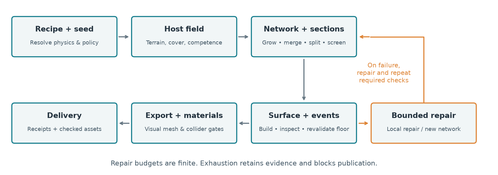
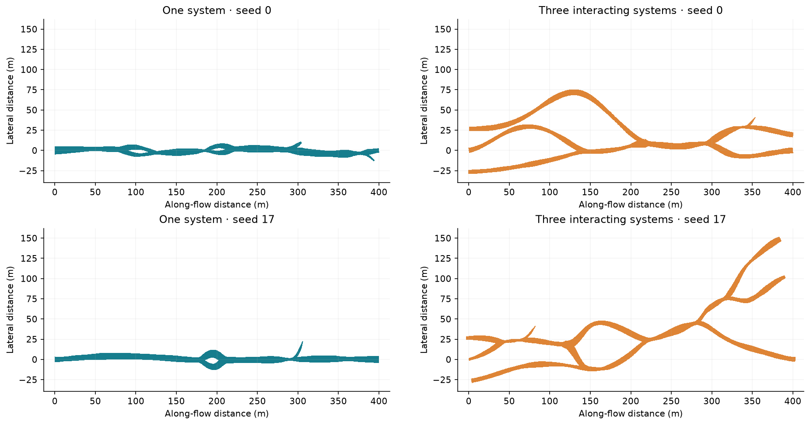
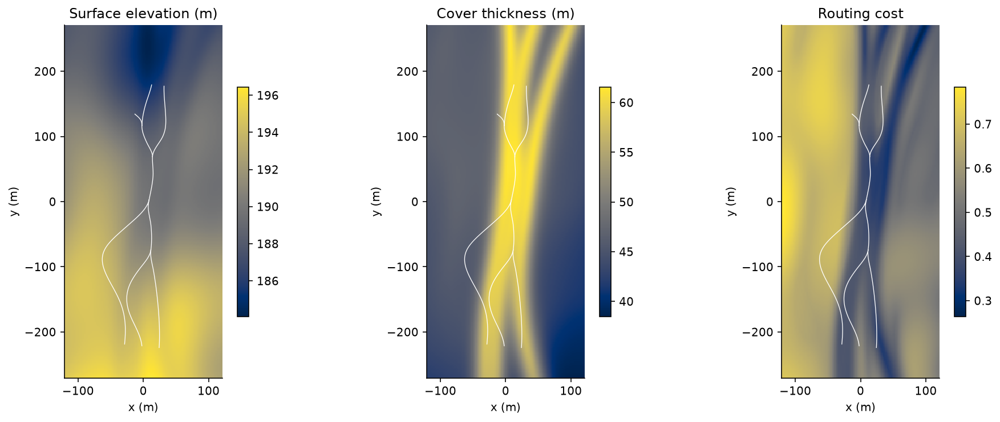
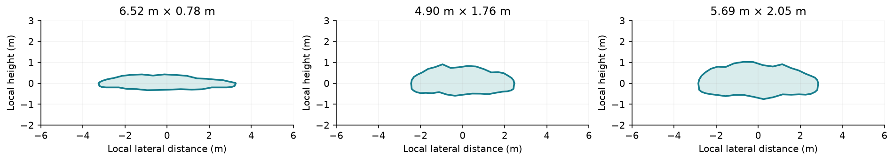
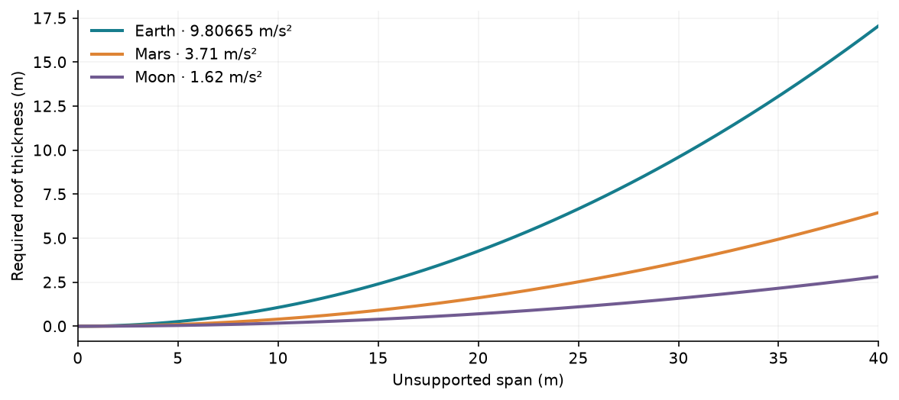
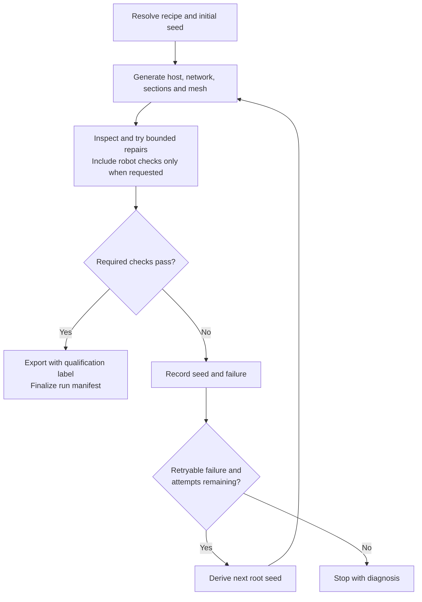
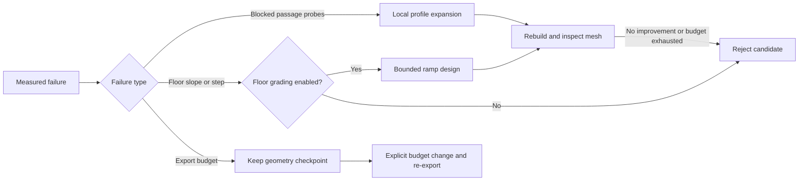

# Architecture and scientific model

[← Project overview](../README.md) · [Configuration](configuration.md) · [Evaluation](evaluation.md)

PLUME-Advanced generates underground passage networks for visual inspection,
procedural environment studies and robotics simulation preparation. A celestial
body and a seeded host field determine the setting; networks grow within that
field, cross-sections define the cavity, and volumetric meshing produces a
continuous surface. Optional geological events, reusable rock materials and
application-specific exports complete the environment.

The scientific contribution is the **coupling of host-conditioned topology,
spatially varying passage shape, gravity-dependent roof screening and auditable
inspection/repair** in one reproducible pipeline. Named random streams separate
terrain, network, sections, events and geometry. The intermediate fields and
measurements remain available for controlled experiments rather than being lost
inside a final mesh.

| Input | Generated representation | Evidence kept with the run |
|---|---|---|
| Body, material, eruption controls, seed | Terrain and subsurface suitability fields | Resolved physical parameters and host diagnostics |
| One or several interacting systems | Directed passage graph, flow history and junctions | Network checks, selected seeds and repair decisions |
| Local flux, cover and roof constraints | Asymmetric cross-sections, floors and surface relief | Profiles, section resolution and actual-mesh measurements |
| Appearance and export requirements | Visual surface, static collider and material package | Geometry/material checks, budgets and file receipts |

Earth, Mars and Moon profiles are implemented. The model is **process-informed
procedural generation**, not a thermofluid simulation or a calibrated structural
solver. Its outputs are candidates for simulation: passing a generation policy
and qualifying an asset inside a simulator are different steps. See [Limits](#limits).

## Execution and data flow

*The accepted network, sections, mesh and figures share one candidate identity.
Replacing the network rebuilds downstream data. The outer seed search is shown
[below](#embedded-inspection-and-repair); export publication requires acceptance.*

| Phase | Representation and operation | Main checks / outputs |
|---|---|---|
| Resolve | Recipe, body, material, stage seeds and acceptance policy | Strict configuration; input and runtime identities |
| Candidate search | Record root/stage seeds; regenerate after retryable rejection | `seed_attempts.json`; optional total-attempt cap |
| A · Host | 2D fields for elevation, slope, volcanic-layer cover, competence, fractures and growth cost | Grid extent, viable source region; host influence report |
| B · Network | Directed graph with passage polylines, systems and formation metadata | Connectivity, crossings, turn/grade/width limits and topology-specific morphology |
| C · Sections | Local frames and asymmetric contours along each passage | Roof/host constraints; adaptive sample spacing and section footprint |
| D · Base geometry | Swept implicit cavity field; tiled or dense sampling; isosurface extraction | Closed/oriented mesh, intended components/handles, passage and resolution checks |
| Floor / E · Events | Ray-sampled base floor; supported debris and structural modifications | Local support, spacing, required-route protections |
| D · Final geometry | Event-aware surface and final floor revalidation | Repeat geometry/clearance checks after changes |
| Export | Visual preparation, material/UV work, collider reduction and serialization | Actual prepared/serialized surfaces, textures, budgets and atomic publication |
| Native qualification | Cold replay plus imported-engine material/collision controls | Separate `ready/` receipt only after all requested gates pass |

[`cli.py`](../src/plume_advanced/cli.py) coordinates stages;
[`pipeline/`](../src/plume_advanced/pipeline/) owns checkpoints, inspection and
recovery. Numerical representations live in [`stages/`](../src/plume_advanced/stages/),
asset preparation in [`exporters/`](../src/plume_advanced/exporters/), and campaigns
and scientific measurements in [`evaluation/`](../src/plume_advanced/evaluation/).
[`scripts/`](../scripts/) contains optional inspection, figure and native-editor tools.

## Host-conditioned growth and topology

### Single and multi-network top-down views

*Left: [short-single](../config/short-single.toml). Right:
[short-multi](../config/short-multi.toml), with three interacting systems. Rows use
seeds 0 and 17; every panel has the same metric limits and equal x/y scale.*

The single system has a dominant gallery with local bypasses and side passages.
The multi-system examples keep parallel passages over longer distances, with
shared reaches, merges and later splits. Each preset grows in its configured
host field; this comparison illustrates the presets, rather than isolating
source count as the only changed parameter.

These are plan projections of generated section envelopes from stages A–C.
Surface relief, geological events and final mesh inspection come later.
[Figure provenance](figures/readme/current_provenance.json) records the seeds,
resolved settings, generated-data identities and image hashes. The figures live
under `docs/figures/readme/`, independently of disposable generation outputs.

### Host influence

*Elevation, available cover and routing cost from the short multi-system case,
seed 0. White polylines show the accepted routes in world coordinates. A shared
physical host influences all systems; multi-system generation does not simply
duplicate and offset a finished tube.*

The host combines a regional downhill trend, seeded terrain waves, corridors,
volcanic-layer thickness, fracture preferences and competence variation. Weighted
suitability terms guide path growth. A seed affects both the host and the network;
controlled experiments can hold one stream fixed while varying the other.

| Active topology | Construction | Intended use |
|---|---|---|
| General emplacement | Main routing with lobe growth and optional stacked history | Eruption-control and body-scale studies |
| Trunk-dominated layout | Dominant gallery, local split/rejoin islands and short side passages | A compact Valentine-inspired topology |
| Independent gallery growth | Several source systems with conserved per-phase discharge and shared passages | Interacting systems with a dominant-gallery criterion |
| Interconnected growth | Independent systems following multiple host corridors with persistent parallel reaches | Repeated merge/split behaviour along a broad network |

A merge becomes a **shared graph passage**, not two coincident tunnels. Split
confirmation and minimum shared/independent lengths prevent rapid switching.
Interconnected checks also measure parallel occupancy over downstream windows;
adding multiple sources that immediately collapse into one route does not satisfy
that model's intended behaviour.

Formation metadata tracks phase activity, discharge, cooling/age proxies,
reoccupation and optional drained pools. Pools are selected from local conditions
and become elongated widenings; junctions do not receive arbitrary spherical rooms.
These are procedural formation rules, not a simulation of molten lava transport.

## Sections, gravity and roof screening

*Low-junction samples near the 10th, 50th and 90th height percentiles of the
short multi case, seed 0. These input contours precede volumetric relief, smoothing
and event modifications. They are not measured final clearances.*

Local passage width and height vary with host conditions, flux/history metadata,
correlated morphology and seeded asymmetry. Separate floor, roof and wall controls
avoid a constant elliptical extrusion. Adaptive sampling becomes denser near
curvature, width changes and junctions. Junction envelopes and frames must agree
before the surface is built.

Roof thickness couples width and height. At a fixed floor depth `d`, a cavity of
height `h` leaves a roof `t = d − h`. The conservative, simply supported
beam surrogate requires:

$$t \ge \frac{3 S \rho g w^2}{4\sigma_{\mathrm{eff}}}$$

Here `w` is unsupported span, `S` the safety factor, `ρ` rock density, `g` gravity
and `σ_eff` effective fractured-rock tensile strength. Widening increases demand
quadratically; increasing height reduces the available roof thickness. Body width
caps are additional procedural constraints, not universal maximum cave sizes.

*Only gravity varies: density 2,900 kg/m³, effective strength 3 MPa, safety factor
1.5. These conditional model curves are not observed tube dimensions. Arching,
layering and stress confinement require a more complete structural model.*

## Surface construction and simulation cost

Geometry sweeps section envelopes into an implicit field, combines junctions and
structural features, and extracts triangles with marching cubes. Sparse tiles
limit empty-space allocation; shared boundaries and welding must preserve a
continuous surface. Coherent wall/roof/floor relief supplies larger physical
variation. Normal maps supply fine shading detail without adding collision faces.

| Control | Quality effect | Cost / caveat |
|---|---|---|
| Smaller voxels | Resolves narrower passages and smaller relief | Halving spacing can approach 8× dense sample memory |
| More section samples | Better local interpolation near sharp changes | More profile and field-evaluation work |
| Tiled storage | Avoids allocating a full empty bounding box | Tile halos and extraction still consume memory |
| Visual reduction | Smaller render mesh | Must preserve topology, routes and sampled surface-error bounds |
| Dedicated collider | Fewer collision triangles where acceptable | Checked independently; may retain the master if reduction fails |
| One repeated PBR tile | Texture allocation independent of cave length | Geometry/draw costs still grow; image file size is not GPU memory |
| Continuous projection | Removes UV chart boundaries from material sampling | Nine texture samples instead of three; no added polygons |

Serialized float32 coordinates are checked, including metre/centimetre
representations, because a mesh valid in float64 can degenerate on import.
Export limits constrain the delivered asset; they are not a frame-rate guarantee.

## Embedded inspection and repair

Full-generation search surrounds the bounded local repair stages. Only an explicit
`acceptance.require_ground_routes = true` requests robot qualification; otherwise
exports are labelled not robot-qualified. Rejected candidate seeds are journalled
and replaced deterministically, with no relaxation of acceptance limits.
The [run settings](configuration.md#one-small-recipe-one-resolved-configuration)
control attempt and cooperative time limits. Scientific evaluation workers
measure their requested seeds without replacing rejected cases.

The outer search changes all seeded stages, including the host. Bounded upstream
network recovery **within one attempt** retains that attempt's host. Both levels
preserve acceptance limits and record their decisions. The journal is written
before generation starts; resume reuses an interrupted seed and skips rejected
ones. Only the accepted candidate supplies the final mesh and stage figures.

| Layer | Inspection | Permitted response |
|---|---|---|
| Network / sections | Shape, connectivity, overlaps, host/stability limits, intended topology | Deterministic local repairs and a bounded candidate search |
| Base surface | Components, orientation, handles, protected routes and thin features | Bounded local field repair, policy-permitted relief adjustment, upstream recovery |
| Resolution | Input samples across passages; declared refinement/convergence probes | Finer consistent grids only within explicit allocation/attempt limits |
| Mobility | Continuous capsule clearance; optional chassis/floor/slope/step checks | Lateral detours, then up to two bounded local ramp designs if floor grading is explicitly enabled; final mesh checks remain mandatory |
| Visual / collider | Prepared surface, float precision, reduction deviation and route preservation | Safer reduction/precision candidates; reject when checks still fail |
| Textures / package | Decoding, normal vectors, color/data bindings, exact embedded maps and adapter files | Normalize usable vectors; declared DirectX conversion; one package rebuild |
| Publication | All required policy checks and integrity receipts | Atomic replacement only after acceptance |

Longitudinal ramp design minimizes floor elevation changes subject to grade,
transition curvature, headroom and edit bounds. Failed support contacts also
provide a measured floor gradient: excess sideways incline is corrected near the
route and the edit tapers toward the walls. The design slope target is 80% of the
robot's maximum grade, leaving some room for discretization and relief. Combined
edits stay within the configured vertical bound and fade to zero at the roof
crest. Section centres/frames and junction profiles remain fixed; terminal profiles can change.
This does not erase fine relief or certify the resulting terrain without
inspection. Host, cover,
aspect and stability guards can reject a proposal before meshing. The recorded
intervention describes an engineered simulation floor rather than natural
formation. Each repair family is scheduled at most once per recovery invocation,
preventing alternating failures from creating an unbounded repair loop.

Blocked-probe failures return to profile repair instead of escalating the whole
volume to a finer grid. A local expansion that improves neither blocked probes
nor their density deficit stops that strategy early. Resolution/resource and
export-budget failures stop seed search; they do not become lottery retries.

Missing input images, corrupt data, unsupported capabilities, programming errors
and resource exhaustion are not fixed by trying random seeds. Repairs retain their
original failure, attempted actions, effective settings and final result. Acceptance
is never automatically weakened to make a seed pass.

| Policy | Required beyond ordinary pipeline checks |
|---|---|
| `research` | Exploratory numerical outputs; clearance/export budgets are not implied |
| `inspection` | Required capsule route, dedicated checked collision and finite export budgets |
| `simulation` | Inspection requirements plus resolution evidence and positive retained-relief policy |
| `require_ground_routes = true` | Additional finite chassis, floor support, slope, step and junction-turn checks |
| `require_textures = true` | Complete accepted PBR maps and package evidence |

The reference ground contract is 0.7 m long × 0.5 m wide × 0.5 m high, a 0.02 m
margin, 20° maximum slope and 0.10 m maximum step. Required paths and junction
connectors are checked on raw, visual and collision surfaces. Optional side
passages may remain narrower. These checks do not simulate wheel or track dynamics.

## Limits

| Area | Current limit |
|---|---|
| Geological fidelity | Procedural rules and conservative surrogates; no CFD, cooling PDE or full rock-mechanics solution |
| Celestial coverage | Earth/Mars/Moon scenarios only; Jupiter/Saturn moons and cryovolcanic materials are not implemented |
| Seed reliability | Individual seeds can exhaust local repair. Generation retries eligible failures; finite attempt caps and operational/resource errors can stop delivery. Unlimited attempts do not guarantee a feasible cave |
| Ground mobility | Clearance/support/slope/step screening is implemented; traction, suspension, steering, wheel/track dynamics and sensors remain simulator responsibilities |
| Numerical coverage | Sampled checks do not prove the absence of every self-intersection or geometric defect |
| Appearance | One reusable rock tile is not measured basalt calibration; valid maps do not guarantee natural appearance in every view |
| Geometry extent | Cavity boundary with closed numerical ends; no surrounding massif, automatic entrances or complete terrain shell |
| Runtime performance | File/triangle budgets and checked reduction are implemented; streaming, LOD policy, frame time and engine memory need target-hardware profiling |
| Native scope | Unity/Unreal have route qualification checks; Gazebo/Isaac have separate import smoke checks described in [Simulators](simulators.md). Other versions and robot behavior require separate verification |

Code is distributed under the [BSD 3-Clause license](../LICENSE). External datasets and
texture assets retain their own licenses and attribution requirements.
