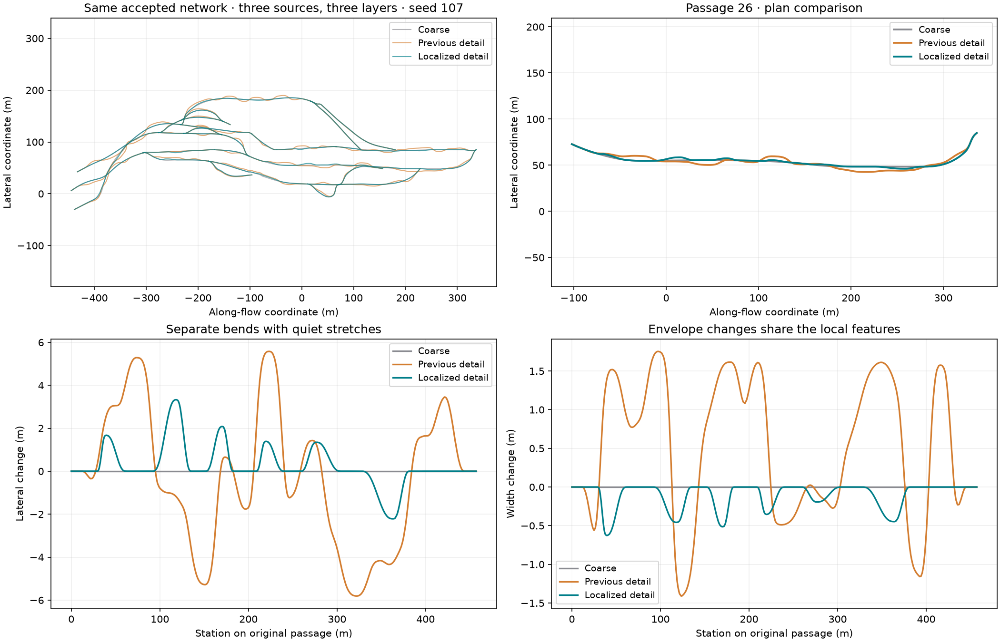
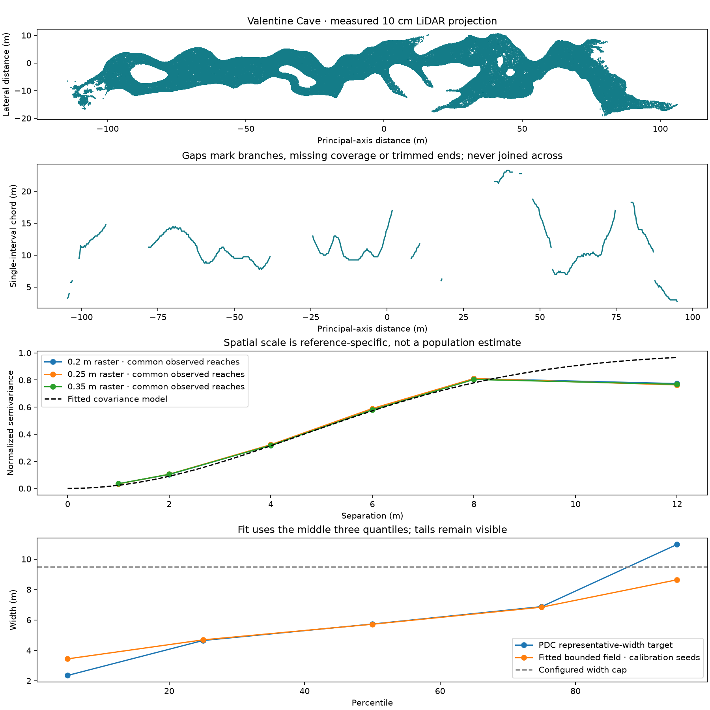
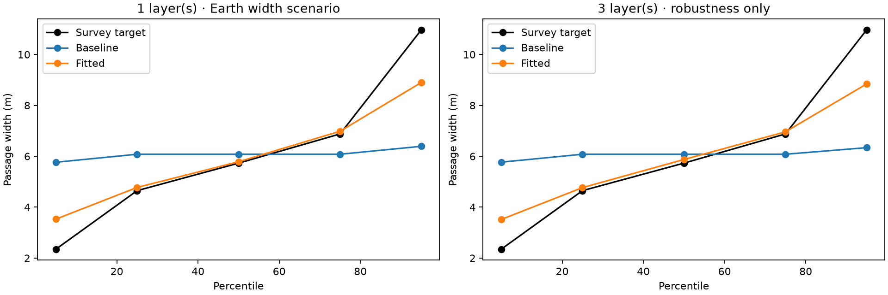
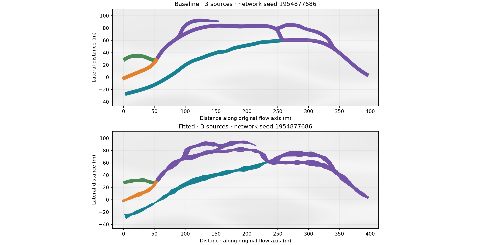

# Generator evaluation and simulator showcases

[← Project overview](../README.md) · [Generation](usage.md) · [Simulator imports](simulators.md)

Choose the check that matches the claim you need to make:

| Question | Workflow | Evidence |
|---|---|---|
| Does this change preserve behavior? | [Development checks](#development-checks) | Regression and policy tests |
| How often do fixed seeds succeed? | [Seed campaigns](#seed-campaigns) | Per-case failures, repairs, timing and cold replay |
| Does this cave import and collide correctly? | [Native qualification](#native-engine-qualification) / [Gazebo and Isaac checks](#gazebo-and-isaac-import-checks) | Native material, bounds and contact results |
| How do morphology and controls compare? | [Scientific evaluation](#scientific-evaluation-and-reproducibility) | Declared experiments and measurements |

The [simulator gallery](simulators.md) demonstrates visual imports. Treat its
screenshots separately from these measured checks.

**A robot is an application showcase, not a validation criterion for the generator.**
Report requested-cave delivery, geometric checks and native import/contact outcomes
separately from robot-specific routes. A cave may legitimately contain terrain a
chosen robot cannot traverse. Neither a successful drive nor a rejected route
establishes geological realism. Only an explicit
`acceptance.require_ground_routes = true` makes that robot's geometric checks a
requirement for that generation; floor grading additionally requires
`acceptance.repair_ground_routes = true`.

## Seed campaigns

Campaigns evaluate the **requested seeds**, including their failures. They do not
use `plume-generate`'s outer seed search or its `run.max_seed_attempts` setting;
each case retains its bounded inspection and repair stages. This keeps failure
counts meaningful instead of replacing difficult cases with passing ones.

To evaluate ground routes, explicitly enable `acceptance.require_ground_routes = true`
in the campaign recipe. The `simulation-*` presets alone do not request robot
qualification. See [generation modes](usage.md#ordinary-generation-or-robot-qualification).

```bash
# Ten A-C cases, each with a separate cold reproducibility replay.
uv run plume-check \
  --configs config/short-single.toml config/short-multi.toml \
  --seeds 0 17 42 20260912 4294967295 --scope sections \
  --timeout 600 --memory-limit-mib 8192 --output outputs/section_campaign

# Full generation, material and export checks for one textured seed.
uv run plume-check \
  --configs config/short-multi.toml --seeds 17 --scope full \
  --timeout 7200 --memory-limit-mib 24576 --output outputs/full_campaign
```

Open the campaign's offline `report.html`. The JSON summary retains failures,
resource limits, repair decisions and replay results. Ten requested cases plus
cold replays means twenty worker runs. `--no-replay` is an explicit exploratory
tradeoff, recorded in the report. Workers run sequentially; memory and timeout
limits are not increased by repair.

```bash
uv run plume-check --output outputs/full_campaign --resume --timeout 10800
uv run plume-check --output outputs/full_campaign --resume --report-only
```

`--report-only` checks saved receipts without generating anything. A resumed
campaign verifies its original source/runtime/input identity; code or configuration
changes require a new campaign directory. A stage-only success says nothing about
meshing, floor contact, materials or native import.

## Development checks

Install the development dependencies with `uv sync --locked` before running:

```bash
uv run ruff check .
uv run mypy src/plume_advanced
uv run pytest -q
```

Tests include measured failure crops, synthetic geometry controls, deterministic
replays and policy failures. Optional native application tests require their
external tools; a skipped test is not evidence of engine compatibility.

For changes to the browser network viewer, also run
`node --test tests/network_viewer.test.cjs` (Node.js 20 or later; no npm packages).
These checks cover true 3D measurements, sample preservation, layer filtering,
camera transforms and picking identifiers. Inspect the page in a WebGL-capable
browser as well: numerical checks do not verify rendered appearance or controls.

### Traversability map checks

`tests/test_traversability.py` uses analytic floors, smooth slopes, steps,
low ceilings, sub-cell props and vertically coincident cavities. It checks layer
separation, rejection reasons, deterministic replay, image/array orientation,
allocation failure and atomic package preservation. Export integration covers
collision and visual fallback surfaces, all-target file registration, saved-run
mapping and rejection of modified source data.

`tests/test_traversability_plots.py` checks shared physical colour scales,
zero versus missing values, coincident rejection flags, no-prop labels, image
registration, unit labels, file hashes and rendering progress. Separate views
must preserve the raw NPZ measurements and reference classifications.

For experimental use, compare saved floor/ceiling samples against independent
triangle queries on the delivered collision surface, and repeat at finer mesh
and map resolutions. Keep the map manifest with the experiment: it records
surface and implementation hashes, reference limits and coordinate conventions.
Passing these checks supports sampled geometric correctness; it does not certify
robot dynamics or an executable path. [Map interpretation](traversability.md).

`tests/test_vector_maps.py` also reconstructs random raster masks from vector
rings, preserving holes, islands, diagonal separation and world registration.
Analytic mesh controls cover closed ramps, overlapping but disconnected layers,
thin partitions at shared graph nodes, open boundaries and duplicated UV-seam
vertices. Changing robot dimensions must leave physical arrays, vector outlines
and the graph unchanged. Package tests reject modified vector and physical-raster
files as well as modified reference maps.

### Retrospective review after changes

Finish each implementation pass with a review and an evaluation sized to the
change. Freeze code and inputs before running a campaign; use a new output
directory after further edits. Keep run-specific findings with the evidence in
`outputs/`, rather than adding historical reports to the repository.

| Review | Required evidence |
|---|---|
| Compare the intended behavior with what changed | Scope, remaining gaps and regressions found during review |
| Challenge the implementation | Tests that reproduce the defect, boundary cases and unchanged-behavior controls |
| Evaluate beyond the development examples | Declared additional seeds, original failures retained and deterministic replays |
| Inspect the result | Actual generated figures plus measurements; timing and output size where relevant |
| State the conclusion | Passed, failed and skipped checks; exact scope of the result and unresolved limitations |

For network growth changes, compare fixed-destination (`detour`) and endpoint-free
(`front`) recipes on the same root seeds, host and thresholds. Report actual
births, accepted additions, loops, blind ends, branch lengths, grid alignment,
local search work and runtime. Do not equate filling a branch quota with realism.
Inspect the galleries even when every numerical check passes. Preserve rejected
candidate reports and distinguish a bounded repair failure from a crash.
For front refinements, also compare against the previous front implementation.
Audit capture work separately from repair work, and check that route relaxation
leaves junctions, accepted passages and the host unchanged. A lower routing
objective does not replace full-network acceptance. If candidate selection differs,
report the comparison as an end-to-end outcome rather than an isolated shape change.

Separate first-candidate success from recovery through repairs or later candidates.
Do not tune on additional evaluation seeds and then describe those same seeds as
unseen validation. A network-only result does not validate meshes or simulators;
documentation-only edits instead need link, command and visual checks.

## Paired network detail evaluation

```bash
uv run python scripts/evaluate_network_detail.py --config config/varied-network.toml --seeds 0 17 23 53 --layers 1 3 --output outputs/detail-evaluation
```

Each pair starts from the **same accepted coarse network and immutable host**.
The campaign stores coarse/detailed artifacts, quality reports, figures, elapsed
times and an offline `viewer.html`, then performs a cold replay through normal
generation with detail enabled. It checks preservation of original routes and nodes, host
immutability, final acceptance and semantic replay. New encounter junctions are
reported separately from unchanged topology. Independent measurements use a common
0.5 m grid to compare heading, width and grade variation, host cost, bending,
maximum grade, width gradient and sample count. Added variety is the objective;
a lower bending value is not inherently an improvement. Use `--strength 0.8`
to evaluate the stronger amplitude used by the detail example.

Regression fixtures additionally exercise shared nodes at crossings and touching
envelopes, source mixing and conservation, separated layers, incompatible flows,
cycle rejection, sample slivers and transactional rollback. Generated campaigns
need not contain a newly added junction; report that honestly rather than treating
existing regional junctions as evidence of detail-stage merging.



The comparison uses the same accepted graph and host (seed 107). It illustrates
where local edits occur; matching these profiles is not a scientific calibration.

The campaign also reports **locality diagnostics**, rather than treating greater
curvature as success:

| Measurement | Interpretation |
|---|---|
| Quiet length fraction | Original-route length with at most 5 cm lateral and 3 cm width change |
| Quiet/changed reach lengths | Whether detail is localized or spread throughout the network |
| Bend/width profile correlation | Whether a localized bend and envelope change share a profile |
| Width-peak spacing variation | Diagnostic for repeated spacing; `null` when fewer than three spacings exist on a route |

These describe plan and width, not vertical relief, and are **not naturalness
scores or acceptance thresholds**. An isolated feature may have regular spacing
simply because very few peaks exist. All geometric safety checks remain unchanged.

To compare against an earlier saved paired campaign, add
`--previous outputs/earlier-detail-evaluation`. The runner first verifies identical
coarse nodes and segments, then records diagnostics and hashes of the previous
artifacts. It never reactivates the old generator. Preserve that campaign directory.

In the viewer, select the coarse and detailed versions of a seed and enable
**Keep view when switching networks** for a comparison using the same camera
and world origin. Changes are deliberately local, so inspect individual passages
as well as the complete network. No meshes or simulation qualification are run.
Regional growth currently requires multiple source systems; `--layers 1`
means one layer, not one source.

## Native engine qualification

The workflow below checks one specified seed and its cold replay. It tests
materials and collision in the supplied editors; ground-route checks are added
only when `acceptance.require_ground_routes = true` is set in the recipe. To
qualify a candidate found by generation, use its `accepted_seed` from
`seed_attempts.json` with the same recipe. Native qualification can still reject
a cave that passed numerical checks.

```bash
uv run python scripts/qualify_simulation.py \
  --config config/simulation-single.toml --seed 0 \
  --output outputs/simulation_trial \
  --unity /path/to/Unity --unreal /path/to/UnrealEditor
```

This source-checkout workflow runs numerical generation, a cold replay, native
material views and collision controls. Every supplied editor is mandatory.
**Only `ready/` is the promoted delivery**, created after all requested checks
pass. `qualification.json` explains a rejection; working results remain in
`generation/` and `native/`.

The maintained native harness targets Unity 6000.6 URP and Unreal 5.8 on Linux,
with GPU access. Unity's initial project setup also needs package-registry access
and a valid license. Its current input contract is one rock-free, untransformed
cave primitive with three 4K maps. The numerical API's `require_native = true`
remains unavailable; the separate qualifier supplies the native promotion gate.

To check an existing accepted 4K generation, including normal CLI
`export_blender/` or `export_all/blender/` output, run:

```bash
uv run python scripts/check_native_engines.py outputs/my_cave \
  --output outputs/my_cave_native \
  --unity /path/to/Unity --unreal /path/to/UnrealEditor
```

This imports the existing cave and records material and collision checks. It does
not perform the qualifier's cold replay or create a `ready/` delivery.

Use the checked native scene and its **separate static collider**. PLUME metadata
uses right-handed Z-up metres. The supplied glTFast adapter maps points to Unity
`(-x, z, -y)` metres; the Unreal adapter maps to `(100x, -100y, 100z)` centimetres.
The raw collider OBJ does not carry glTF conversion. Alternative importers require
their own axis/bounds check. Configure simulator gravity separately from importing
geometry. Nanite, collision reduction, texture streaming and compression require
performance validation in the target simulation.

## Gazebo and Isaac import checks

These helpers inspect an existing textured package and drop a small collision
probe. Start with the [small textured recipe](usage.md#textured-caves). Select an
unobstructed viewpoint inside **that generated cave**, then save
`outputs/textured_cave/view.json` with these fields:

| Field | Value |
|---|---|
| `position` | Camera `[x, y, z]` in right-handed Z-up metres |
| `direction` | Nonzero viewing direction `[dx, dy, dz]` |
| `floor_z` | Measured mesh floor height directly below that position |

Camera and floor coordinates are specific to a cave; a different seed or repaired
mesh requires a new selection. The showcase camera is not a default for this recipe.

For Gazebo Harmonic, use the system Python with `gz.transport13`, `gz.msgs10`
and Pillow available:

```bash
/usr/bin/python3 scripts/check_gazebo.py \
  outputs/textured_cave/export_all/gazebo/plume_cave_scene \
  --view outputs/textured_cave/view.json \
  --output outputs/textured_cave/gazebo_native
```

For Isaac Sim, use its bundled Python runtime:

```bash
ISAAC_SIM_DIR=/path/to/isaacsim/_build/linux-x86_64/release
"$ISAAC_SIM_DIR/python.sh" --no-ros-env scripts/check_isaac_sim.py \
  outputs/textured_cave/export_all/omniverse/plume_cave_scene.usd \
  --view outputs/textured_cave/view.json \
  --output outputs/textured_cave/isaac_native
```

Inspect each output's `result.json`, `interior.png` and native logs. The helpers
check material inputs and floor contact; they do not certify robot routes.
Gazebo writes its own `inspection.world.sdf`; Isaac adds instruments in a session
layer and saves `inspection.usda`. The original export remains unchanged.
For large Isaac stages, `--skip-inspection-export` avoids the additional flattened
inspection file. Collider cooking can still fail on a visually valid large mesh.

## Scientific evaluation and reproducibility

The bundled [experiment declaration](../src/plume_advanced/evaluation/resources/experiments.toml) separates morphometry,
controllability, host/sampling ablations, scalability, export consistency and
reproducibility. Data analysis uses generated graph/profile measurements, not
screenshots as quantitative evidence.

| Reference | What it informs | What it cannot establish |
|---|---|---|
| [Pyroduct Digital Catalog v2](https://doi.org/10.5281/zenodo.17750755) | Terrestrial cross-section shape and size distributions | Full network topology or extraterrestrial calibration |
| [USGS/NASA TubeX Valentine Cave](https://doi.org/10.5066/P14AC3J5) | One cave's planform, local widening and surface comparisons | A universal morphology target; plan envelopes are not single-passage sections |

The [bundled PDC cave partitions](../src/plume_advanced/evaluation/resources/splits/) contain 76
calibration caves and 19 confirmatory caves. The split ranked SHA-256 of
`pdc-v2.0:20260831:<cave-id>` and reserved the first 19. Do not tune on the
confirmatory set. An exploratory whole-catalog summary predates the split, so it
is not claimed to have been historically unseen.

```bash
export PLUME_PDC_ROOT=/absolute/path/to/extracted/PDC-v2
uv run --extra paper plume-evaluate audit
uv run --extra paper plume-evaluate pdc-audit
uv run --extra paper plume-evaluate morphometry \
  --reference-partition calibration --max-seeds 3
```

External reference archives remain outside Git. The maintained loader retains
source identities and rejection reasons. Bundled experiments write results under
`outputs/evaluation/` in the working directory. Their research recipe resolves
relative assets as the public `config/research.toml` does: from `config/` in that
working directory, with rock maps under `texture/`. External textures are not
included in the Python wheel. The audit returns a failure and lists missing input
files when they are unavailable.

Pass `--config path/to/experiments.toml` before the subcommand to use a custom
declaration. Its paths resolve beside that file; the selected project recipe's
assets resolve beside the recipe. Optional `general.asset_directory` overrides
the base for relative texture and Rocky scratch paths without moving the recipe.
Experiment tables reject unknown keys, invalid types, unsupported choices and
nonfinite or out-of-range values before starting work.

Export evaluation checks every target's descriptor and visual bounds in metres.
Completed exports are reused only while the complete package still matches its
file hashes. Missing, modified or extra files trigger regeneration; the previous
attempt is retained, and a failed regeneration replaces its success claim.
`plume-evaluate --help` lists the full
experiment suite; the complete campaign is much more expensive than a smoke test.

A repeatable run requires the **seed, resolved configuration, source/material
resources, external inputs and dependency runtime**. The source identity includes
the shared preset catalog and shipped material adapters. Cold replays use a
separate process and a different Python hash seed. No finite test campaign proves
that every possible seed succeeds.

Branch-site selection rounds its dimensionless ranking keys to 12 decimal places
and gives equal keys their mean rank. This prevents CPU-level rounding of equal
grid bends from changing their relative preference; the physical measurements
and geometry acceptance thresholds are unchanged. Regression tests exercise
fused and unfused vector arithmetic on two failure seeds, requiring the same
accepted candidate, graph and centreline coordinates within 1 nm. This is a
numerical consistency check, not a geological accuracy claim or a guarantee of
byte-identical output across every runtime.

For generation searches, keep the original recipe, `seed_attempts.json` and
`run_manifest.json` together. The journal identifies the request, each attempted
root/stage seed, its outcome and the winner. `resolved_project_config.json`
describes the accepted candidate, rather than every failed candidate. Use
[replay or resume](usage.md#seed-history-replay-and-resume) to reproduce a
candidate or continue the same search; use a campaign to measure fixed-seed
reliability.

## Earth network width calibration

The optional [Earth survey recipe](../config/earth-survey-network.toml) replaces
the repeating regional width modulation with a seeded spatial log-width field.
**This is partial statistical calibration, not geological validation of the whole
network.** It uses two distinct measurements:

| Evidence | Used for | Cannot establish |
|---|---|---|
| [Pyroduct Digital Catalog v2](https://doi.org/10.5281/zenodo.17750755), 76 calibration caves / 1,286 usable sections | Representative passage width and central relative-width distribution; each cave has equal weight | Branching, source count, physical station spacing, roof strength |
| [USGS/NASA TubeX Valentine Cave LiDAR](https://www.usgs.gov/data/nasa-tubex-valentine-cave-2018-valentine-lidar), the 10 cm file | A local spatial scale from projected single-interval chords | Universal lava-tube morphology, true cross-sectional width everywhere, multi-layer frequencies |
| 19 reserved PDC caves / 200 usable sections | Audit of the frozen width fit, with no parameter changes | Independent confirmation of Valentine-derived spatial scale |



*Projected gaps remain gaps. The middle width quantiles are fitted; the two tails
are displayed to expose the discrepancy rather than hidden by truncation.*

For PDC, divide every section width by its own cave's median, pool with equal cave
weights, and rescale by the median of cave medians (5.73 m). This constructs a
representative-size scenario. It is not the distribution of all Earth tube sizes.
The target 25th / 50th / 75th percentiles are **4.65 / 5.73 / 6.88 m**.

Valentine is projected into its measured principal-axis plane and rasterized at
0.20, 0.25 and 0.35 m. A 0.5 m closing radius and filling holes smaller than 1 m²
reduce sampling shadows; larger holes remain. Only stations with one occupied
interval enter the scale fit; multiple passages are never combined into one
wide chord. The terminal 5% at each end is excluded. All three resolutions are
then compared on their **common observed support**, sampled at 1 m. Variogram
pairs must stay within the same uninterrupted reach. The fitted correlation
length is **4.6 m** (4.6–4.7 m across those rasters on common support).

The common-support restriction matters: using different reaches at each
resolution gave estimates from 4.4 to 13 m. Both raw and common-support results
are retained in the fit report. The narrow final range is a numerical sensitivity
result, **not a geological confidence interval**. One cave, occlusion, footprint
processing and the chosen covariance model still limit this estimate.

The amplitude and median are fitted over a finite grid using 16 field seeds.
The actual 1–9.5 m width bounds and 0.54 m/m gradient limiter are included in the
objective. Parameters are frozen before generating evaluation networks. Fitting
refuses an unresolved optimum, a search-bound optimum, or unstable raster scales.
The resulting `base_passage_radius = 3.671394`, `width_log_sigma = 0.30` and
`width_correlation_m = 4.6` are saved in a complete runnable recipe.

### Reproduce the fit and audit

Keep external data outside Git under the paths shown below, or supply
`--pdc-root` and `--valentine-laz`. The `paper` extra supplies the LAZ reader.

```bash
uv run --extra paper python scripts/calibrate_network_widths.py --output outputs/width-fit
uv run --extra paper python scripts/calibrate_network_widths.py --audit-fit outputs/width-fit/fit.json --output outputs/width-audit
uv run python scripts/evaluate_network_calibration.py --config outputs/width-fit/earth-survey-network.toml --fit outputs/width-fit/fit.json --output outputs/width-networks
```

Default data locations are
`data/reference/pdc_v2/extracted/Pyroduct Digital Catalog in .txt` and
`data/reference/valentine/Valentine_TUBE_UTM_10cm.copc.laz`.
The fitting command filters calibration cave IDs before opening section
coordinates. The audit is a separate command that checks disjoint cave IDs and
does not refit. Reports retain source and split hashes, method hashes, targets,
every fit candidate, the recipe hash and raster sensitivity. Existing output
directories must be empty so earlier failures and fits cannot be overwritten.

The network campaign evaluates roots 107, 211, 331 and 487, with one and three
layers. It compares the prior local-detail recipe with the fitted width recipe
on identical host fields, checks host immutability, reruns fitted generations
from their requested seeds and saves accepted candidate identities. Layered
cases test robustness only. Widths are sampled by physical distance, with equal
weight per completed network in aggregate results. The campaign reports failures
and returns a nonzero status rather than omitting them. Width changes can alter
routing and acceptance, so this is not a comparison of identical graph shapes.



| Central width percentile | PDC scenario target | Prior local-detail networks | Fitted networks, one level |
|---|---:|---:|---:|
| 25th | 4.65 m | 6.08 m | 4.78 m |
| Median | 5.73 m | 6.08 m | 5.79 m |
| 75th | 6.88 m | 6.08 m | 6.98 m |

All eight comparisons completed successfully; all eight fitted networks replayed
exactly and retained unchanged hosts. Single-level aggregate squared log error
of the three central quantiles fell from 0.03023 to 0.00035. These are finite-seed
geometric and distribution checks, not a geological success rate.



*Root seed 107, three sources, one level. Widths can affect which branch proposals
survive, so the two accepted graphs need not have identical topology.*

The reserved caves have a larger median cave width (7.63 m), although their
central relative-width quantiles (0.800 / 1.000 / 1.219) resemble the calibration
partition (0.811 / 1.000 / 1.200). The representative recipe is therefore **not a
fit to every cave size**. Its width cap also prevents reproduction of the upper
tail: the calibration target's 95th percentile is 10.97 m, above the 9.5 m cap.
Do not relax geometry or roof limits just to improve this statistical match.

Branch density, branch angles, blind-passage frequency, source placement, host
geology and inter-layer connections remain procedural choices. Surveyed centreline
graphs from multiple caves are needed to fit them. Heights, stability and
extraterrestrial scaling are outside this network-width calibration. A passed
quality report continues to mean geometric acceptance, not geological proof.

## Source-count comparison

The [README comparison](networks.md#effect-of-inlet-count) uses aligned inlets,
one axial outlet and six source counts on the same host. Reproduce the network
cases and their complete deterministic replays with:

```bash
uv run python scripts/evaluate_regional_networks.py --config config/earth-survey-network.toml --source-counts 2 3 4 5 6 8 --seeds 17 --replay --output outputs/source_counts
```

Each case saves its graph, resolved settings and quality report. The campaign's
`comparison_01.png` is a general gallery; the README uses a presentation of the
same width envelopes coloured by source ancestry. Fixed source spacing means
that increasing the count expands the inlet band. Candidate numbers identify
bounded retries; the root seed and immutable host are shared. Repeat with more
root seeds before drawing statistical conclusions about source count.

## Regional network campaign

The multiple-terminus scenario can be evaluated independently:

```bash
uv run python scripts/evaluate_regional_networks.py --config config/multi-outlet-network.toml --seeds 17 107 211 --replay --output outputs/outlet-evaluation
```

Checks include one connected component, the requested terminal count, sink direction, source-to-exit
reachability, conserved discharge, passage clearance and exact seeded replay.
Connectivity repair is also tested against a blocked host: it must fail within
its work budget without adding an unchecked connector. The comparison uses
network width envelopes, not a generated mesh or robot qualification.

The experimental regional model has a Stage A–B campaign. It evaluates the
400 m and 3 km multi-system hosts, retains failed cases, and saves graphs,
figures, per-case candidate/repair reports, selected seeds, host hashes and timing:

```bash
uv run python scripts/evaluate_regional_networks.py --seeds 0 17 42
```

Use `--source-counts 2 3 5` to vary feeder count, or `--presets short-multi` for a
short-only campaign. The source layout must still fit the configured host.
The campaign explicitly derives both host and network seeds from each requested
root seed, including when an inherited preset pins its network seed.
The default preset campaign allows four deterministic network candidates and two
repair passes. A pass may therefore use a later recorded candidate seed; inspect
`quality.json` to distinguish first-candidate success from successful recovery.
The campaign returns a nonzero exit status when a case fails. Add `--replay` to
regenerate every case and compare semantic hashes and construction provenance.
Rejected cases are replayed too: the error type, message and complete quality
report (when available) must match. Successful replays also compare the complete
quality reports. Each case runs exactly once plus one replay; disagreement never
triggers an extra tie-breaking run. A reproducible rejection stays a failed case.
Replay mismatches fail the case. Use an empty campaign output directory to avoid
mixing new failures with old successful artifacts. Regression tests also exercise a fresh Python
process with a different hash seed.

Regression coverage includes blocked host strips between coarse cells, routes
around barriers, source-node isolation, discharge and ancestry corruption,
reproducibility, bounded branch attempts, grid allocation limits and explicit
rejection of requests to proceed into sections. These are procedural network
checks, not simulator or geological qualification.

Add `--layers 2 3` to exercise connected levels, for example:

```bash
uv run python scripts/evaluate_regional_networks.py --presets short-multi --layers 2 3 --seeds 0 17 42
```

Layered cases also save `layers.png` and explicit XYZ centrelines. Checks cover
the complete stack's planning budget, host thickness, ramp grade, junction
elevation continuity and actual vertical clearance at projected crossings.
Regression fixtures distinguish safe overpasses from colliding routes whose
layer labels differ, verify immutable host arrays and cold replay, and check
that disabled layer parameters do not change the single-layer routing graph. A failed
case remains failed when its bounded search is exhausted.

To evaluate the denser recipe with and without layers:

```bash
uv run python scripts/evaluate_regional_networks.py --config config/complex-network.toml --layers 1 3 --seeds 0 17 42 --output outputs/complex-network-evaluation
```

`--config` uses that recipe's quality budgets; it cannot be combined with
`--presets`. Without `--layers` or `--source-counts`, a custom recipe keeps its
own layer and source counts. Every case saves the resolved settings, accepted
and requested branch counts, topology statistics, timing and host immutability
check. Persistent-layer regression tests additionally verify a same-level route
from a source to every layer's outlet, conserved discharge, deterministic replay
and rejection of a missing outlet. Ramp variation and the second routing scale
are tested for deterministic, nontrivial changes.

The survey-inspired recipe can be evaluated with the same campaign:

```bash
uv run python scripts/evaluate_regional_networks.py --config config/varied-network.toml --layers 1 3 --seeds 0 17 42 --replay --output outputs/varied-network-evaluation
```

Every case additionally writes `morphology.png`; graph artifacts contain measured
widths, segment lengths, sinuosity and local junction counts. These are descriptive
metrics, not geological pass thresholds. Layer inspection rejects inconsistent
depth layouts and footprints. Regression tests inject incorrect connection labels,
invalid depths and verify that repeated flow assignment does not progressively
shrink widths or terminal tapers. Grade summaries use the explicit passage XYZ.

The campaign also builds paginated `comparison_01.png` figures from its saved
artifacts; failed cases remain visible as failed panels. A candidate that exits
before branch growth is marked incomplete. Geometric repair cannot silently
qualify it without completing growth: it remains rejected and the bounded seed
search continues. A completed search may still accept fewer branches than its
budget, recorded separately as `branch_budget_exhausted`.

Feeder repairs run while branch construction can still resume, and their
before/after checks are saved in `feeder_repair_history`. Later additions preserve
accepted receiving curves. Regression cases cover junction subdivision, sample
density, unrelated close passages, remote self-approaches within and between
segments, exact crossings across subdivided junction arms, local width changes,
repeated route cuts, source staggering and cost-based outlet selection. The
retained-layer check requires an uninterrupted source-to-exit path on each level.

Connectivity regression tests also inject independently routed layer feeders
through the real generation pipeline. These must become one connected network
without losing any inlet or per-layer outlet, pass all 3D layer checks, and replay
exactly on the unchanged host. Separate fixtures cover coincident XY projections,
missing ramp edges, geometry rejection and finite search budgets. Passing a
normal layered example alone does not exercise the repair path.

To evaluate the richer six-source layer recipe with a complete replay of each
bounded search:

```bash
uv run python scripts/evaluate_regional_networks.py --config config/branching-layers.toml --seeds 0 17 42 --replay --output outputs/branching-layers-evaluation
```

For a direct extra-link ablation, repeat with `network.regional.extra_connections = 0`
and keep every other setting unchanged. Compare the accepted seed, original route
cells, inlet/outlet coordinates, loop count and layer checks. Each accepted extra
link should increase the undirected cycle rank by one without introducing a
directed flow cycle. Tests also inject failed optional fits and require the valid
baseline cave to survive without a seed retry. Skipped optional slots are expected
outcomes; inspect their recorded reasons rather than treating the cap as a quota.

For a comparison against the fixed source cross-section and axial outlets, set
`source_stagger_m = 0` and `outlet_band_width_m = 0` in a copy of the recipe. Keep
the same seeds, host settings and work budgets. These comparisons isolate the
placement controls; neither success counts nor varied-looking plans establish
geological calibration.
