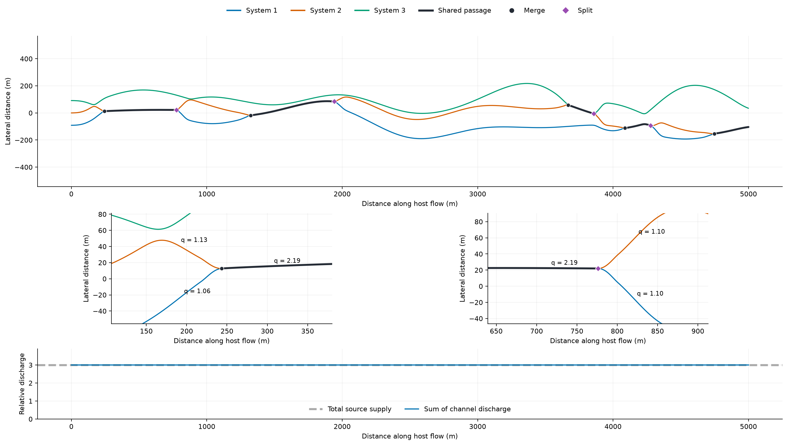

# Interacting tube systems

This page describes `network.topology.style = "general"` (the default). For a
compact shared gallery with local rock islands, see [dominant-gallery topology](trunk_topology.md).

Set `network.systems.count` above one to grow several arterial systems within a
single host field. Each starts at a separate source, with a named seed derived
from the candidate network seed and its system ID. A merge creates a real graph
junction and one shared downstream segment. A split creates separate downstream
segments, with either separate outlets or a later confluence.

This is an opt-in, host-conditioned procedural routing model. It is not a
time-dependent fluid simulation or evidence that a generated network reproduces
a surveyed cave. It supports one flow direction and one layer. Existing Stage-C
profiles, body-dependent dimensions and roof screening remain in use.

## Run and inspect

```bash
uv run --no-sync python scripts/generate_network_diagnostics.py \
  --config config/earth_interacting_systems.toml \
  --output outputs/systems_review --density-sweep ""

uv run --no-sync python scripts/validate_network_reproducibility.py \
  --config config/earth_interacting_systems.toml \
  --output outputs/systems_reproduction
```

These commands generate networks and cross sections, without meshing or rocks.
`stage_b_network.png` displays source systems, shared passages, merge/split
close-ups, and discharge across the network. Plot axes use metres and preserve
the plan's aspect ratio. `stage_b_network.json` includes interaction counts,
system seeds, graph connections and per-segment source history. The acceptance
report records rejected candidates as well as the selected candidate.

For a full tube mesh, use the same config with the normal command, choosing a new
output directory:

```bash
uv run --no-sync plume-generate --config config/earth_interacting_systems.toml \
  --output outputs/systems_full/stage_b_network.png
```



The Earth example with procedural seed 20260910 has three sources, five merges,
four splits and two outlets. Dark passages are stored once in the graph.
The lower panel sums the discharge across all channels at each flow station;
the combined supply remains constant. This is a generated Stage-B network,
checked with its Stage-C profiles, not a scanned cave or a completed mesh.
Junction labels round relative discharge to two decimal places.

## Controls

Add one table to an existing configuration; do not duplicate a TOML table.

```toml
[network.systems]
count = 3
source_spacing_widths = 12.0
lateral_variation_widths = 18.0
correlation_length_widths = 70.0
merge_distance_widths = 3.0
split_distance_widths = 8.0
minimum_shared_length_widths = 25.0
minimum_independent_length_widths = 30.0
split_confirmation_widths = 8.0
require_merge = true
require_split = true
```

Distances above multiply **twice the resolved `network.base_passage_radius`**.
They therefore follow the configured body's passage scale without applying a
second gravity multiplier. They are engineering controls, not measured collapse
limits. Final passage dimensions and stability are resolved downstream.

| Control | Meaning |
|---|---|
| `count` | 1 preserves the existing generator; 2–8 enables interacting systems with one source per system. |
| `source_spacing_widths` | Initial lateral distance between sources. The generator rejects sources that cannot fit in the host. |
| `lateral_variation_widths` | Amplitude of independently seeded, spatially correlated routing preferences. |
| `correlation_length_widths` | Approximate distance between preference control points; larger values yield longer changes in course. |
| `merge_distance_widths` | Capture distance between neighboring occupied fronts. |
| `split_distance_widths` | Separation required between route preferences inside a shared front; must exceed the capture distance. |
| `minimum_shared_length_widths` | Minimum shared passage length before another interaction. |
| `minimum_independent_length_widths` | Minimum separate passage length before another interaction. |
| `split_confirmation_widths` | Distance over which a release preference must persist; suppresses brief spikes. |
| `require_merge`, `require_split` | Require at least one event of that type. Absence rejects the candidate and advances the deterministic search. These do not require every system to participate. |

This mode requires `emplacement_backend = "internal"` and
`growth_model = "hybrid_lobe"`. When count exceeds one, it replaces the
single-system source fan and secondary lobe/braid/history grammar.
`source_count`, `network_density`, lobe opportunity controls, stacking and drained
pool controls do not change this mode. Use the systems table to tune its topology.
`source_flux` remains mean inlet discharge, making total supply
`count * source_flux`; values are relative procedural discharge, not calibrated
volume per second. A comparison with equal total supply must divide source_flux
by the number of systems.

## Generation and flow

1. Construct smooth independent routing preferences from named system seeds.
   Bias them toward lower host routing cost, within the host's actual bounds.
   Preserve lateral ordering so routes cannot silently pass through each other.
2. Advance the fronts along the host's flow direction. Only neighboring fronts
   may merge. Different capture and release thresholds, persistence distances,
   and split confirmation prevent repeated contact over short distances.
3. Emit a segment only when a front changes membership or reaches its outlet.
   A shared front produces one geometric segment; it does not superpose copies.
4. Smooth the directed graph and solve its flow once. Inlets provide a finite
   supply; incoming flow sums at confluences. Outgoing branches divide supply by
   relative carrying-capacity weights. Temperatures and travel ages mix by flux.
5. Generate body-dependent sections, check the resulting geometry, and repair
   or reject the candidate using the same bounded acceptance loop as other runs.

`system_ids` describes which routing fronts occupy a passage. It partitions at
a split. `contributing_system_ids` describes all upstream source identities that
contribute lava: after mixing, both downstream branches inherit that history.
It is a set of contributors, not a per-source concentration estimate.
`source_system_id` and `system_seed` identify each source. IDs in JSON are zero
based; figure labels start at one.

## Validation and reproduction

The existing morphology checks remain active, including bends, transverse
excursions, repeated loop arms, unmodeled crossings, actual section overlap and
junction floor continuity. Seven additional checks verify:

- exactly the requested source identities;
- consistent front membership at every connection;
- source history propagated through the directed graph;
- minimum shared and independent passage lengths after repairs;
- a merge when requested;
- a split when requested;
- equality of total source supply and outlet discharge.

The model allows multiple outlets. Every source must reach an outlet; the
dominant route selects the outlet with the strongest integrated transported-flow
score. Local conservation and acyclic flow checks still apply.

The host stays fixed during retries. Candidate seeds and all system sub-seeds
derive from the requested seed with named labels. Selection accepts the first
passing candidate, not the quickest worker. Identical code, dependencies,
configuration and host input reproduce the network and sections. Exhausting
the search stops generation; no rejected network is exported as a fallback.

Automated acceptance catches defined construction defects. Visual inspection
and comparison with field surveys remain necessary before calling a result
geologically representative. No new full multi-system mesh or engine-import
validation is implied by a successful Stage-A–C preview.

The repeatable count/seed matrix is available through:

```bash
uv run --no-sync python scripts/validate_network_systems.py \
  --config config/earth_interacting_systems.toml --output outputs/system_validation
```

It defaults to two, three and four systems with three seed labels each, keeps
the host fixed, and reports every acceptance or exhausted search. These labels
derive case-specific network seeds; they do not replace the host seed. The
script returns a nonzero status if any case exhausts its search.

The [10 September validation record](network_systems_validation_2026-09-10.md)
documents nine accepted count/seed cases, the targeted regression tests, and
two independent reproductions of the example.
