# Network generation

[← Project overview](../README.md) · [Architecture](architecture.md) · [Configuration](configuration.md#regional-network-controls) · [Evaluation](evaluation.md#regional-network-campaign)

Several source systems share one host field. Their passages can remain parallel,
merge, split and reconnect. Optional layers add explicit elevations and descending
ramps; a crossing in plan connects only when its geometry and graph are compatible.

| Start with | Result | Command |
|---|---|---|
| [Earth survey network](../config/earth-survey-network.toml) | Three aligned inlets, one outlet; measured Earth width scenario | `plume-network` |
| [Multiple outlets](../config/multi-outlet-network.toml) | Six irregular inlets, three termini, one connected network | `plume-network` |
| [Branching layers](../config/branching-layers.toml) | Six inlets, three levels and sparse extra connections | `plume-network` |
| [Single-layer full cave](../config/earth-survey-full.toml) | Sections, mesh, textures, exports and maps; no rocks | `plume-generate` |
| [Multi-layer full cave](../config/branching-layers-full.toml) | The layered network carried through the full pipeline; no rocks | `plume-generate` |

## Effect of inlet count

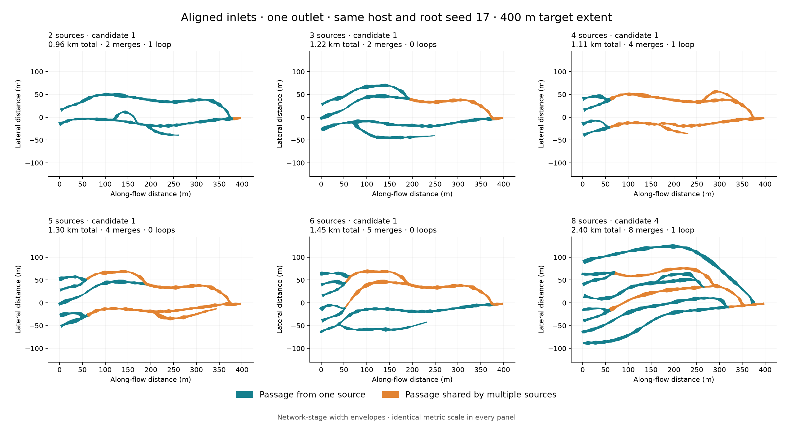

*2, 3, 4, 5, 6 and 8 sources · root seed 17 · one layer · 400 m downstream target.
Every panel has the same metric scale. Teal denotes a passage supplied by one
source; orange denotes shared source ancestry. Widths are network envelopes,
not final cross-sections.*

Only `network.systems.count` changes. The host, root seed, quality budgets,
source-spacing rule and single axial outlet remain fixed; staggering and lateral
jitter are disabled. More sources also widen the inlet band because spacing is
fixed in passage-width units. This is not a fixed-band or fixed-total-discharge
experiment. Bounded candidate selection can choose a different network seed;
the panel identifies which candidate passed.

Adding inlets creates more opportunities for parallel passages and shared reaches.
It does **not** guarantee a monotonic increase in length or loops: routes compete
for the same host corridors and must pass clearance and bend checks. The common
outlet is a boundary condition of this comparison, not a requirement for every
PLUME network. Use the multiple-outlet or retained-layer recipes above for other
boundary conditions. [Repeat this comparison](evaluation.md#source-count-comparison).

## Regional network growth

`regional_growth` is an opt-in network model for exploring larger, more
connected networks. The existing multi-network model remains the default.
Single-layer routes can continue through the full pipeline: Stage C uses host
surface elevations to determine burial and screens the resulting profiles before
meshing. Layered runs preserve their explicit network elevations through sections
and meshing. Optional `network.detail` refinement remains network-only.

```bash
uv run plume-network --config config/regional-network.toml --compare
```

This writes `outputs/regional-network/network.json`, `quality.json`, a resolved
configuration, a progress trace, a top-down comparison and an offline 3D viewer. Both models receive
**the same host and initial network seed**; each quality report records any
candidate seed selected by its bounded search. No sections, meshes, rocks or
simulator exports are generated by this command. Use a full-run recipe from the
table above with `plume-generate` to continue through geometry and export.

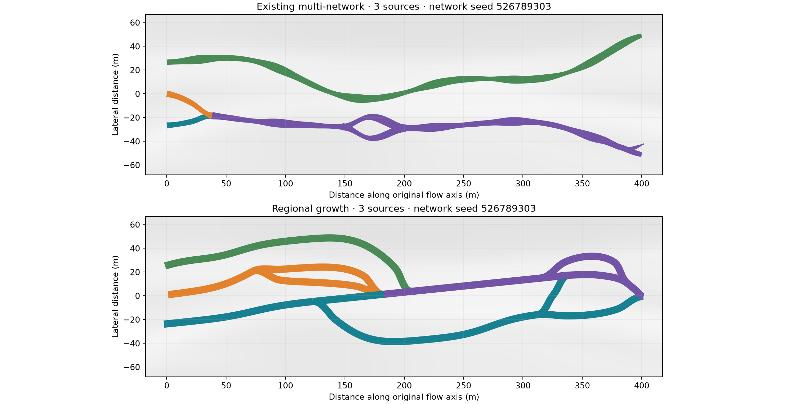

*Stage-B width estimates at equal metric scale. Colours indicate transported
source ancestry; purple passages carry contributions from multiple sources.
These are network envelopes, not final cross-section footprints.*

| Step | What changes | Guard |
|---|---|---|
| Regional routing | A sparse directed graph samples the 2D host, including substrate and uphill grade between grid cells | Cell budget, host bounds and blocked-edge checks |
| Source feeders | Least-cost routing uses a correlated seeded preference field and temporary separation costs | Sources inject discharge once; another route cannot pass through a source |
| Branch growth | Comparison mode routes to a fixed rejoin; front mode follows local host cost, heading and potential without a destination chosen at birth | Minimum independent length, discovered compatible merges and finite birth/travel budgets |
| Local repair | Front mode searches a failed bend or clearance window using position and heading; comparison mode retains smoothing repair | Rebuild derived state and recheck the entire graph; no threshold relaxation |
| Acceptance | Keep valid branches; record rejected proposals and their reasons | Bounded candidate search, repeatable seeds and complete quality report |

The outlet potential is a **routing cost**, not hydraulic pressure. Its strict
ordering prevents directed flow cycles while allowing split-and-rejoin loops.
Unlike the existing station-based model, routes can turn across the original
flow axis to negotiate the host. Smoothing preserves graph direction and is
checked against the host again.

Optional source staggering and lateral jitter break the regular inlet layout.
A downstream band lets routed host cost select terminal positions. With
`outlet_count > 1`, a bounded greedy selection chooses separated termini,
prioritizing source reachability and lower routing costs. Feeder routes descend
one shared potential: cost to the nearest reachable terminus. This avoids the
conflicting flow directions that separate outlet potentials could introduce.

Nearest-terminal routing can separate feeders into different outlet groups.
After inspecting feeder geometry, a connectivity stage identifies those groups
and joins them using sustained downstream connections on the same host graph.
It considers interior sites away from inlets, outlets and crowded junctions,
then searches position-and-heading states toward compatible receiving passages.
Connections create actual split and merge nodes and preserve the original
passages and termini. Existing metric routes are preserved when a junction is
inserted. Every proposed connection passes width, bend and host checks before
being kept; a rejected proposal leaves the accepted passages unchanged and the
search tries another site. Each join reduces the component count by one;
searches stop at explicit site, attempt and expanded-state limits.

Nearest-terminal routing can also funnel every feeder to one cheap corridor.
For otherwise unused termini, the generator adds host-routed downstream forks.
It screens up to 64 fork sites per terminus for sustained length, departure
angle, separation and crowding around existing junctions, then applies the
same metric inspection and repair as other feeders. Final checks require the
requested number of supplied terminal sinks, **one connected component**,
directed reachability and flux conservation. Physical connectivity ignores
flow-arrow direction; the directed flow graph remains acyclic. A blocked host
or exhausted repair budget rejects the candidate instead of creating an
unchecked shortcut. The termini represent model boundaries, not inferred
skylights or observed eruption outlets.

The existing single-outlet algorithm remains available with `outlet_count = 1`.
Multiple lateral termini currently require one layer; retained multi-layer
trunks still select separate exits per layer. Positive cover, competence, host
thickness and grade constraints continue to apply.

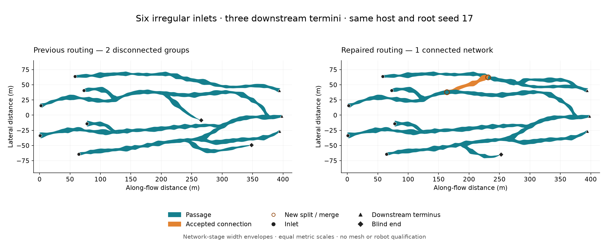

*Six irregular inlets and three downstream termini, one layer, root seed 17.
The earlier result on the left has two disconnected groups. On the right, an
approximately 83 m connection joins the groups without removing an outlet.
Triangles mark downstream termini; diamonds mark blind ends. These are Stage-B
width envelopes, not a generated mesh.*

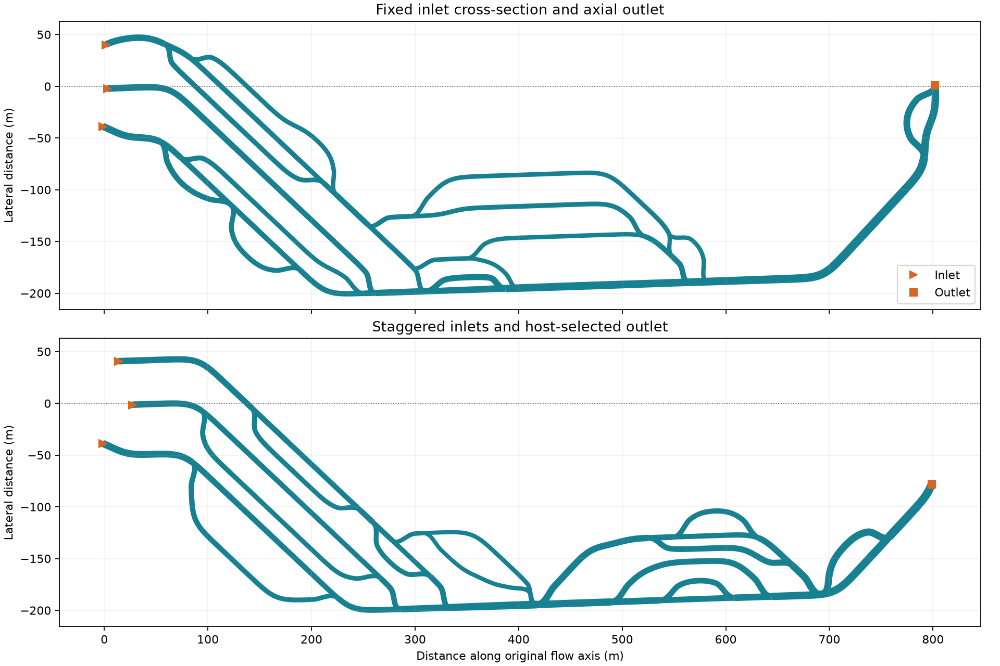

*Same host and accepted network seed, root seed 0, three sources and one layer.
Both use the current repair and inspection rules. Only the source stagger
(0 → 30 m) and exit-band width (0 → 160 m) change.*

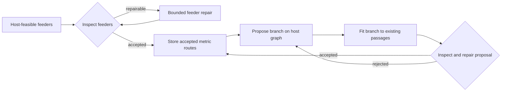

Both repair and proposal loops have configured limits. Exhausted feeder repair
advances to the next recorded candidate seed; exhausted branch proposals retain
the accepted network and report the achieved branch count. Adding a branch cuts
the accepted receiving polyline at its attachment, preserving its geometry.
The new branch fits that passage's direction. Repairs of branch proposals target
the segments identified by inspection, followed by a full network check.

Clearance uses sampled local widths and bounded distances along connected
passages. Degree-two graph subdivisions share the same local junction region;
they do not turn a legitimate junction into a collision. Unrelated passages and
remote approaches of connected arms still require separation. Pair checks run
in bounded batches. These reference envelopes do not replace later surface or
structural validation.

By default this model uses one layer and one regional outlet, simplified
reference discharge and a coarse planning grid. The grid can miss a viable corridor narrower than
its spacing; the generator reports failure rather than silently coarsening it.
Branch density is a requested opportunity budget, not a guaranteed number of
loops. Phase feedback into regional routing is not implemented yet. Stage-B
acceptance does not establish mesh quality, robot clearance or geological validity.

See [regional controls](configuration.md#regional-network-controls) and the
[network-only evaluation campaign](evaluation.md#regional-network-campaign).

### Optional connected layers

Use [regional-multilayer.toml](../config/regional-multilayer.toml) to enable two
levels in the same host. The source count is **total across the stack**, with at
least one source on each level. Each level has separate seeded routing
preferences. By default, routes converge on the deepest level’s outlet;
`preserve_layer_trunks = true` retains a separate outlet on every level.
Ordinary regional generation still defaults to one level.

```bash
uv run plume-network --config config/regional-multilayer.toml --output outputs/multilayer
```

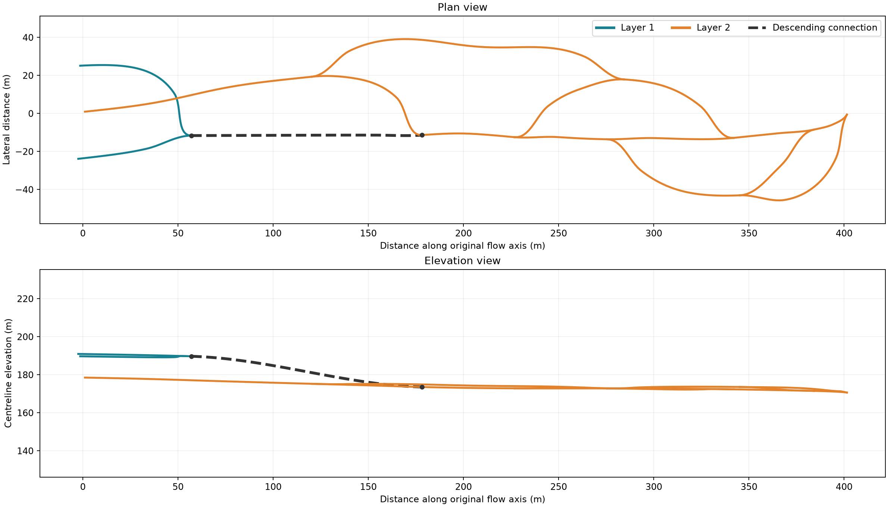

*Colours identify levels; dashed connections descend between adjacent levels.
Both views show the same network. Current plots include estimated width envelopes
in plan and labelled inlets/outlets; elevation uses a separate vertical scale.
These are network routes with a reference height, not meshed passages.*

| Layer operation | Inspection |
|---|---|
| Lift host routing into separate levels | Planning-cell budget includes every level; reference passages must fit inside local emplacement thickness |
| Offer sparse descending connections | Sample host and grade along each candidate ramp; reserve the space along existing ramps during later routing |
| Smooth a connection into its receiving route | Recompute its depth transition over the smoothed route and check slope and junction elevation continuity |
| Cross another passage in plan | Accept only with sufficient actual vertical rock separation; layer labels alone never authorize a crossing |
| Repair and accept | Recheck the whole network after branch edits or smoothing; record failed candidates and selected seeds |
| Retain a layer trunk | Require a same-level source-to-exit route, not merely an exit labelled with that level |
| Join disconnected layer groups | Search the existing host graph for a descending connection between adjacent levels; preserve all original inlets/outlets and validate the resulting XYZ geometry |

Layer connectivity repair samples the swept volume of existing ramps when
screening clearance. A reverse host-cost search guides a bounded heading search
toward feasible ramps; it cannot invent a connection across a forbidden host
region. The first and last cells attach to interior, same-level passage runs.
Each proposal is rebuilt against the already inspected metric routes and checked
before being kept. The audit records its start/end layers, ramp count, rejected
proposals and search work. A bridge joins components but does not by itself add
a graph cycle; additional split-and-rejoin passages create loops.

For greater variety, [branching-layers.toml](../config/branching-layers.toml) uses
six staggered sources, narrower passages and coherent width variation. The
comparison below keeps the same host and root seed in each pair; candidate seeds
can differ because each recipe must pass its own bounded inspection. It compares
complete recipes, rather than isolating the effect of source count alone.
This paired recipe comparison uses `extra_connections = 0` on both sides.

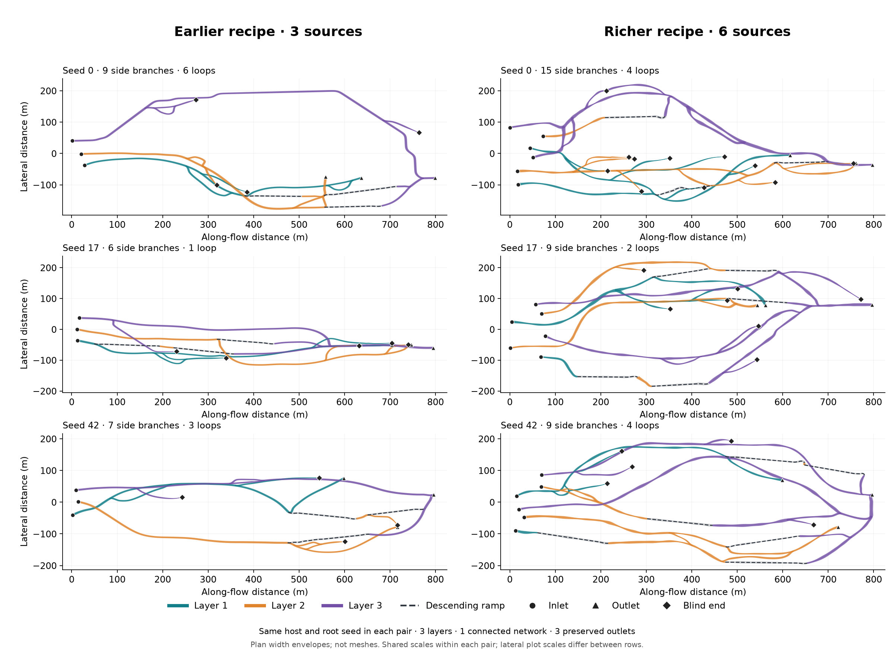

The richer recipe retained more side branches in these three examples. Loop
count did not increase in every case. Large smooth arcs remain a consequence of
the regional routing scale; these results do not establish geological realism.

The richer recipe allows two **optional extra connections** after ordinary
branch growth. It first looks for an additional descending ramp, then a same-level
link between different passage chains. Searches rotate across chains and use
swept-volume penalties to avoid existing ramps. Each link must pass full geometry
and flow inspection while preserving the existing routes and ports. Unavailable
links are skipped; the requested count is not a density target. Each accepted
link adds one independent loop to the connected passage graph while its flow
direction remains acyclic.

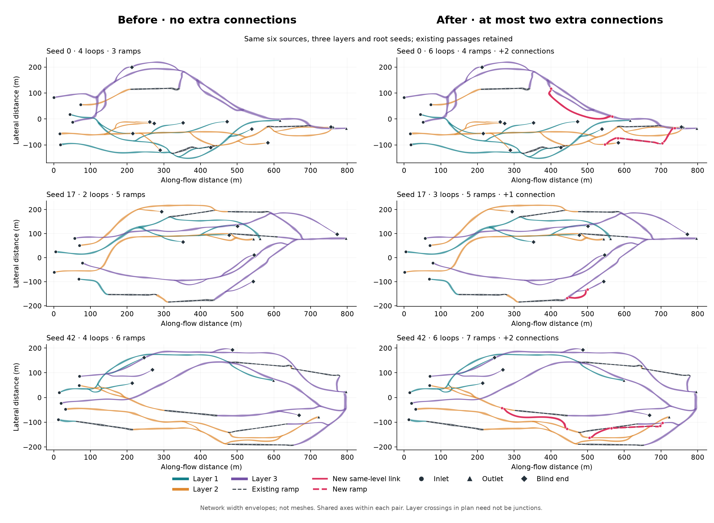

For root seeds 0, 17 and 42, the two-slot allowance retained 2, 1 and 2 extra
links respectively. Seeds 0 and 42 gained a ramp; seed 17 kept only a same-level
link after its ramp search exhausted the bounded budget. The three cases replayed
exactly, retained all six inlets and three outlets, and added approximately
8.7%, 1.4% and 6.9% to their respective passage lengths.

Layer depths follow the host surface. This extends a 2.5D host into a simplified
stack; it does **not** model measured 3D stratigraphy, geological faults, vertical
shafts or pressurized upward flow. The configured passage height and rock gap
are Stage-B screening envelopes, not structural or robot qualification. A short
or thin host may not fit the requested stack and ramp slopes; generation reports
that failure instead of reducing the layer count or relaxing the limits.

The extra `layers.png` shows plan and elevation. Layered `network.json` files
include `centerline_xyz_m` for each segment. The existing `CavePoint.elevation`
still denotes the host reference surface; explicit centreline elevation is
that surface minus the interpolated layer depth. As with other Stage-B
networks, stored station lengths are plan distances.

For full geometry, [branching-layers-full.toml](../config/branching-layers-full.toml)
uses the accepted XYZ path directly in Stage C. Every network station survives
section sampling. Profiles are fitted inside the network's width and reference
height; their frames follow the actual ramp, and shared graph nodes receive the
same floor and roof without moving the centreline. Section inspection rejects
flattened layers, enlarged envelopes, insufficient roof and nonlocal overlap.
Meshing then uses these 3D profiles with the ordinary topology and export checks.
Cover-based depth placement and centreline wobble apply only to the
single-layer section path. Additional `network.detail` refinement remains
network-only.

### Localized network morphology

[varied-network.toml](../config/varied-network.toml) is an experimental Stage A–B
recipe for endpoint-free multi-source networks. It uses an 800 m route target;
800 m is the downstream extent, not the summed length of all passages.

```bash
uv run plume-network --config config/varied-network.toml --output outputs/varied-network
```

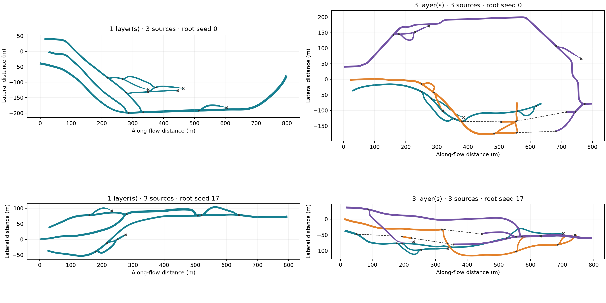

*Network width estimates, not meshes. Three sources in every case; roots 0 and 17
with and without optional layers, using endpoint-free front growth. A root seed identifies the complete
bounded candidate search; the accepted seed is recorded in each quality report.
Colours distinguish levels, dashed lines show ramps, dots mark junctions and
crosses mark blind ends. These examples use the 30 m inlet stagger and 160 m
host-routed exit band; the smaller comparison recipes retain axial outlets.*

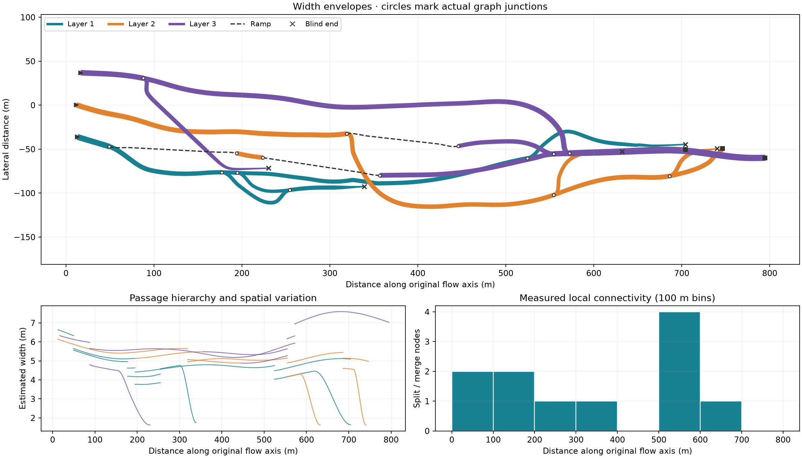

Circles identify actual graph junctions. Crossings without a circle can be
vertically separated passages. Dashed routes are descending ramps; crosses are
blind ends. Widths are Stage-B estimates, not stability-qualified cross sections.

| Observation motivating the model | Current implementation | Scope of the interpretation |
|---|---|---|
| Simple reaches alternate with complicated areas | Seeded local branch zones; every proposal still uses host routing and clearance checks | A morphology prior, not a measured cave-frequency distribution |
| Passage importance and widths differ | Stable per-route capacity preferences, conserved reference allocation and bounded width response | No fluid-dynamics or erosion solver |
| Some side routes stop without rejoining | Fronts stop at their seeded travel budget or when growth is blocked; comparison mode uses blind prefixes of detours | Formation-supply proxy; no inferred collapse or cooling event |
| Overlapping levels need not have equal extent | Shorter optional upper footprints and unequal, host-bounded vertical gaps | Levels still begin in the source region and follow the host; no arbitrary 3D stratigraphy |
| A plan-view hole has several possible explanations | Explicit route and ramp labels; graph junctions require shared nodes and compatible elevations | Independent bypasses are not automatically labelled pillars |

The [Catacombs survey](https://npgallery.nps.gov/GetAsset/bb069f42-57b9-4582-9403-e94fa8a81828/original.png),
[Etna plans and longitudinal sections](https://www.frontiersin.org/journals/earth-science/articles/10.3389/feart.2024.1448187/full),
and [TubeX observations of Valentine and Skull caves](https://ntrs.nasa.gov/api/citations/20205000768/downloads/Young_Esmaeilietal2019JE006138R2FINALSUBMITTED%20Corrected.pdf)
motivate these distinctions. Their topology has not been digitized into
calibration or held-out graph targets. The separate
[Earth width calibration](evaluation.md#earth-network-width-calibration) uses
PDC v2 sections and Valentine LiDAR to fit width statistics and a reference-specific
spatial scale. It does not calibrate these branching or layer rules.

The default regional branch method remains `detour`; front growth is opt-in.
A front can exhaust its birth and repair budgets without producing a required
split, in which case the candidate is rejected. This mode is not a claim of
better acceptance rates or geological realism for every host.

The varied recipe uses **endpoint-free fronts**. A birth chooses a departure,
then advances along viable directed host edges. A local forward cone can discover
a receiving passage only after the front meets the independent-length rule.
At that point a short look-ahead search considers alternative approaches instead
of steering greedily toward a cell. It checks both arrival and receiving headings.
Each proposal permits at most four searches of 256 position/heading states. A
successful capture may finish beyond the sampled supply lifetime, but travels no
more than six passage widths and stays within the maximum coarse branch length.
Accepted earlier branches can themselves produce later branches. A log-distributed
travel budget permits blind ends without first designing a closed loop.
The birth count is sampled once; failed births do not create an unlimited search
for a prescribed number of successful branches.

Before fitting, new same-level routes can move off the coarse lattice toward
lower routing cost. A continuous elastic-path objective balances the integrated
cost field with bending. Displacement is bounded by two passage widths and tapers
to zero at fixed junctions; optimization is limited to 40 iterations with a capped
line search. The proposal must lower that objective and pass dense substrate and
uphill checks. Accepted existing routes and inter-level ramps are preserved.
This is a local correction to graph routing, not a continuous global optimum.
The full network must still pass clearance, curvature, layer and flow inspection.

Front-mode fitting uses a shorter smoothing scale (1.2 passage widths, compared
with 2 in the comparison model). A failed bend or clearance window gets a bounded
position/heading search with circular steps and an anchored terminal curve.
It searches at most 1,200 states for each of at most four windows per repair pass,
with a shared candidate budget of `2400 × repair_passes` states, including rejected
proposals. After that budget is spent, only direct anchored curve fits are tried.
A repair keeps graph nodes fixed and retains the geometry outside its window.
The whole network is inspected again; a proposal must remove failure witnesses
without introducing new failed checks or witnesses. An unsuccessful search keeps
the previous geometry and records its reason. Junction relocation and a global
continuous-direction routing solver are not implemented. The coarse feeder graph,
fixed anchors and domain boundaries can still produce long aligned reaches or
exhaust the repair budget. Reducing grid alignment is a numerical improvement;
it does not by itself establish geological realism.

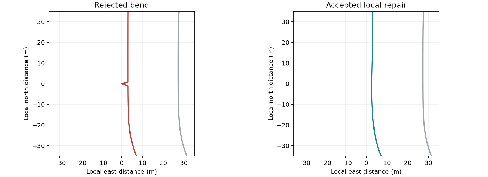

*Regression fixture: a 3 m lateral perturbation was inserted into an accepted
route. Local repair restores an acceptable bend while keeping the graph nodes
and surrounding passages fixed. This demonstrates a repair contract, not a
geological measurement.*

Routes are added in reproducible construction order, recorded in `growth_events`.
That order is not an eruption chronology. Existing passage locations influence
later proposals through occupancy and separation checks; the input host remains
immutable. Thermal feedback, deposition-driven host evolution, coalescing roofs,
pits and pillar cavities require additional models.

A blind end is a sink in the reference formation allocation. Inlet allocation
equals the sum reaching exits and blind ends; it does not represent steady lava
flow into a sealed cave. Robot accessibility is not assessed by this experiment.

`network.json` includes route semantics, layer depths, XYZ centrelines and
uncalibrated morphology descriptors: physical segment lengths, estimated widths,
sinuosity, loop rank, blind ends and junction counts in 100 m bins. Additional
diagnostics measure branch lengths, the fraction aligned within 3° of the routing
grid directions, and the longest reach spanning at most 5° of heading change.
These are descriptive measurements, not geological acceptance thresholds.
`morphology.png` makes those distinctions visible; `layers.png` adds the
[elevation view](figures/readme/refined_front_network_layers.png). Uphill and grade reports use passage elevations when layers are enabled.

The simpler [regional-network.toml](../config/regional-network.toml),
[regional-multilayer.toml](../config/regional-multilayer.toml) and denser
[complex-network.toml](../config/complex-network.toml) remain reproducible comparison
recipes. New morphology controls default to zero variation and full layer extent.
See [configuration](configuration.md#regional-network-controls) and
[network evaluation](evaluation.md#regional-network-campaign) for the controls and
bounded validation procedure.

### Earth survey width profile

The optional [Earth survey recipe](../config/earth-survey-network.toml) uses a
spatial log-width field instead of the original repeating two-wave width pattern.
The field is shared in physical XY coordinates within each level: splitting an
edge or changing its sample density does not create a new random pattern.
Distinct levels use distinct reproducible fields. Only the Earth single-level
width scenario has survey support; layers remain optional procedural structure.

Before geometric limits, width is `W = W₀ × exp(σG)` with any configured supply
response applied separately. `G` uses 128 seeded spectral modes to approximate
Gaussian covariance `C(r) = exp(−r² / (2L²))`. There is no single repeated
wavelength. This is a statistical model of spatial width variation, not a fluid,
erosion or collapse model. Temporary arrays are bounded to 1,024 query points.

The fitter includes the same width bounds and gradient limiter used by generation.
Routing, junction and overlap checks still run afterwards; widths can therefore
change which branch proposals survive. A local distribution fit alone does not
guarantee a similar distribution on every accepted graph. The
[evaluation campaign](evaluation.md#earth-network-width-calibration) measures
that difference, preserves unsuccessful cases and checks deterministic replay.

This profile leaves the sparse detail stage disabled to avoid adding uncalibrated
width perturbations after fitting. Other recipes keep their existing behavior.
The measured recipe and the varied/detail recipes are different experimental
scenarios, not successive geological quality levels.

### Optional network detail

The optional detail stage adds **local variety to an accepted regional network**:
irregular bends, constrictions, wider pockets and elevation changes. It retains
existing routes, sources and outlets, and connects compatible new encounters.

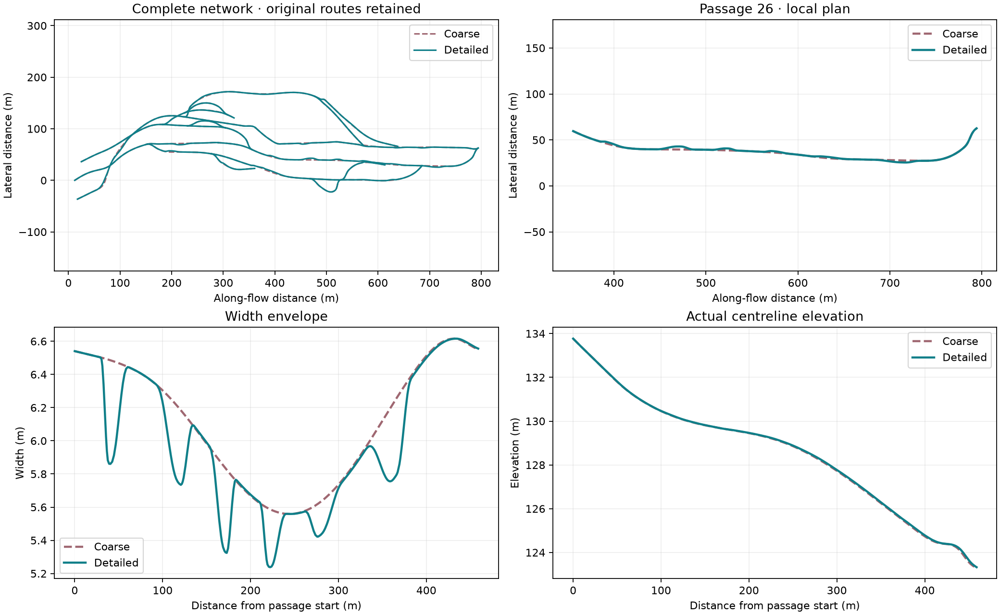

Three-source, three-layer example, root seed 107. Complete plans and a selected
passage use the same physical coordinates. Width and elevation profiles expose
the local variation. These are network envelopes, not meshed caves.

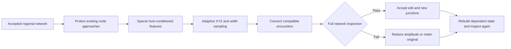

| Operation | What it does | What limits it |
|---|---|---|
| Feature placement | Unequal feature lengths and quiet gaps; local host contrast biases feature peaks | Physical distances, seeded route catalogue, protected old approaches |
| Plan variation | Deflects toward the lower-cost side of a host probe; only small seeded bends in uniform conditions | Capped displacement, host bounds and curvature checks |
| Width envelope | Local roof competence and growth-cost anomalies bias constrictions or pockets | Shares the bend’s support; existing width limits and gradient checks |
| Layer elevation | Local roof weakening can request extra burial over the same feature | No independent vertical noise; rock thickness and connection grades still apply |
| Encounter connection | Splits two touching/crossing routes at a shared node and rebuilds their flow allocation | Compatible direction, same layer and close actual elevations, no directed cycle |
| Adaptive sampling | Retains detail around changing XYZ and widths | Dense-reference error tolerance, sample budget and maximum 2 m station spacing |

Features have compact, asymmetric profiles: outside their supports the accepted
plan and width are retained. Higher-supply trunks receive broader features than
small branches. Lengths and gaps vary, rather than placing an oscillation along
every passage. The feature catalogue is generated before modifying geometry;
plan, width and burial are accepted or reduced together in one transaction.

Host contrast biases peak placement. Cross-corridor growth costs guide bends;
competence and along-route cost anomalies guide width changes. Where signals
are weak, bounded seeded variety remains. Extra burial is a **heuristic response
to roof weakening**, not a structural calculation or a prediction of lava erosion.
The unchanged host and full inspection remain the constraints.

Feature profiles are independent of query order and sample density. Stable route
identifiers and the seed reproduce the catalogue; repartitioning the original
graph can change it. Adaptive sampling preserves feature boundaries and original
vertices in quiet stretches, preventing interpolation from spreading a local edit.

A plan crossing is not automatically a collision. For a compatible encounter,
PLUME inserts an explicit shared node, subdivides the two directed routes and
recomputes source lineage, discharge, junctions and the dominant route. Width
envelopes can touch even when their centre lines do not intersect; nearby arms
are eased into the same point. Each proposal can add at most eight junctions.

| Encounter | Treatment |
|---|---|
| Local crossing or touching envelopes in one layer | Connect, then inspect the complete result |
| Overpass with sufficient vertical rock separation | Keep the passages separate |
| Different layers, a ramp, or centreline elevation mismatch over 0.5 m | No automatic detail junction; explicit layer routing handles connections |
| Opposed flow, a directed cycle, or contact in an existing node approach | Retain the original geometry if no smaller valid edit is found |
| Long overlapping reach still conflicting beyond a junction | Do not hide it with a point junction; the local edit backs off |

Each edit gets at most three amplitudes: full, half and quarter. All checks keep
the coarse-generation thresholds. Failure restores the original local geometry,
without deleting a route or choosing another seed. A failed final inspection
restores the entire coarse network. The audit records accepted and rejected
encounters, added nodes, preserved original routes, sample counts and fingerprints.

Explicit vertical offsets stay separate from substrate elevation and are included
in exported XYZ and replay fingerprints. Finite sampling remains an approximation.
Extended coalescence into a shared corridor, junctions inside ramps and geological
calibration are outside this local stage; it does not replace regional topology
growth or constitute a lava-flow simulation.
