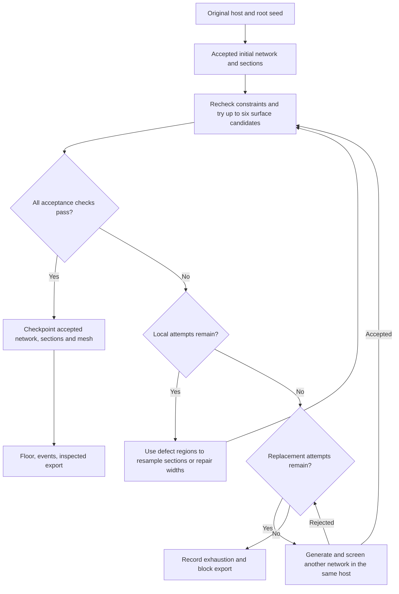

# Reliability, testing and simulation budgets

The [upstream recovery implementation and validation](reviews/upstream-recovery-2026-09-13.md) records automatic section/width repair, deterministic replacement networks in the same host, and a complete passing cold replay of the earlier seed-1 failure.

The [13 September inspection and repair batch](reviews/inspection-repair-batch-2026-09-13.md) records nine full passes, one unresolved mesh rejection, exact replay evidence and the collider-reporting correction.

The [preset catalog](config-presets.md) lists the maintained scenarios and their effective sizes.

The [12 September implementation and evaluation report](reviews/reliability-cleanup-2026-09-12.md) records the tested cases, actual failures and fixes, exported sizes, and verification limits.

PLUME screens a bounded sequence of network candidates before expensive meshing. A seed identifies a repeatable candidate sequence, not a promise that any physically impossible configuration can succeed. Acceptance uses the shared host field and the generated cross sections. It retains the first passing candidate, records rejected candidates and repairs, and never silently disables quality checks.

Repairs enforce the configured width-gradient bound using the repaired physical distances, so smoothing cannot create arbitrarily abrupt changes in tube width. Terminal tapering uses an absolute envelope rather than compounding at every repair.

Gallery routing bounds correlated lateral variation smoothly, so increasing route length does not introduce arbitrarily large random excursions. Blind breakouts screen other passages and host bounds before being added. The trunk-dominated style forms local split/rejoin islands after source confluence; the interconnected style retains compound parallel interactions. Empty island labels do not count as islands. Local gallery junction transitions span at most four base widths, avoiding long premature fusions between arms.

When a route already passes network screening but its sections overlap, repair preserves that route and reduces conflicting width envelopes within the configured minimum passage radius. It then repeats the section, topology and flow checks. This avoids smoothing a valid island closed while trying to repair its clearance. Rejected candidates and earlier failed campaigns remain evidence; thresholds are not relaxed to make a seed pass.

A bad candidate caused by numerical or geometric degeneracy can advance to the next deterministically derived seed. A host that cannot fit the requested tube scale fails immediately with a domain-size explanation. Programming errors, missing inputs and resource exhaustion remain errors; retrying them as random morphology would conceal defects.

## Embedded pipeline acceptance

Evaluation, inspection and bounded repair run inside ordinary `plume-generate`.
No separate campaign, assistant or inspection switch is needed. Checks occur at
the stage that can repair the defect, then again after mesh preparation and
serialization. Compatible stage checkpoints do not bypass export inspection.
Keep `network.quality.enabled = true` for production: disabling it explicitly
omits network acceptance and the graph-derived base-surface genus constraint.
The shared export mesh/content checks still run.

| Boundary | Evaluation and inspection | Bounded response |
|---|---|---|
| Host, network and sections | Host feasibility, configured morphology, flow, section overlap and sampling resolution | Existing deterministic candidate/repair sequence; input profiles with fewer than eight voxels across their smallest dimension are flagged for convergence inspection |
| Base surface | Roof constraints, route centres, closed oriented triangles, components and expected graph genus; vertical intersections measured against actual triangles | Existing immutable-density candidates reduce relief, vary closing, and finally try one-voxel opening; every candidate repeats the gates |
| Upstream feedback after base rejection | Locate handle patches, detached surfaces, bad edges and blocked route samples; associate them with sections/junctions | Locally resample sections, then try bounded width clearance repair; finally try deterministic replacement networks in the unchanged host |
| Final event surface | Actual mesh invariants and sampled floor/roof intersections | Reject failures; intentionally obstructed secondary routes are reported, while protected route points remain mandatory |
| Prepared visual mesh | Recheck the actual float32 surface after smoothing, UV splitting and displacement | Try half displacement, zero displacement and finally no smoothing/displacement when applicable; retain the first passing candidate |
| Collision mesh | Components, genus and sampled route containment after simplification | Retain the inspected original collider when simplification fails; file/triangle budgets still apply |
| Serialized package | Portable GLB geometry, material and shading checks; GLB, OBJ and PLUME ASCII USD geometry compared with inspected arrays | Reject a damaged package before replacing an existing export; no generic retry for a broken serializer |
| Run completion | Inspection evidence, serialized file hashes and unchanged pipeline inputs/source | Write the quality report and measured-passage figure, then mark the manifest complete |

The root seed stays fixed. Density and export repairs keep their input network;
if density repair is exhausted, the upstream recovery stage below can repair
sections/widths or explicitly replace the network within the same host.
Every attempt is recorded, and acceptance thresholds are never lowered. Unknown programming errors
propagate instead of being disguised as another seed attempt. If no candidate
passes, normal generation records a failed manifest and quality report.

Every completed ordinary run writes:

- `pipeline_recovery.json`: original and accepted identities, host identity, bounded
  local repairs, explicit network replacements, failed checks and localized regions.
- `section_resolution_report.json`: per-profile resolution measurements.
- `pipeline_quality_report.json`: overall result, warnings, repair history and
  final/export mesh inspection, including measured floor/roof distances.
- `pipeline_inspection.png`: route samples colored by measured passage height
  and a comparison before and after visual preparation. Sample order is not
  distance along one uninterrupted route.
- `pipeline_inspection.json` inside each target package: preparation attempts,
  accepted surface settings, collision result and serialized-file checks/hashes.

The quality figure is always generated, including when
`run.render_diagnostics = false`. Those optional diagnostics control the larger
stage gallery. `progress.jsonl` and the terminal include inspection and repair
work within the twelve overall stages. Texture loading and EXR conversion name
the file and size limit being processed. Material checks require the configured
maps; an intentionally partial material is supported, while a missing configured
binding fails inspection.

These gates measure numerical invariants and sampled cavity containment. They
do not certify geological appearance, continuously traversable rover clearance,
all triangle self-intersections or native engine/shader behavior. GLB content
checks do not render textures; OBJ/USD comparisons cover PLUME's own geometry
schema, and the separate continuous-material bundle still needs native-engine
inspection. Structural events can intentionally change topology, so the original
network genus is imposed on the base mesh, not indiscriminately on post-event
geometry. Visual preparation and collision simplification must preserve the
final mesh's topology.

## Upstream recovery and deterministic regeneration

Both `plume-generate` and `plume-check --scope full` use the same recovery coordinator.
It runs before base-floor sampling, events and export. Each surface build retains
its existing maximum of six density/detail candidates. After these are exhausted:

1. Diagnose the last failed mesh using overlapping open surface patches, detached
   components and invalid edges, and associate the measured regions or obstructed
   centres with nearby section envelopes and junctions. Patch boundaries must
   themselves be manifold before the local Euler/genus formula is used. The slab
   count and region count are bounded for large models. Localization is partial;
   an observed handle in a cyclic graph can be intentional. When no region maps
   to a section, under-resolved junction profiles are labelled as hypotheses.
2. Halve the section sampling intervals on the affected segments. Regenerate from
   the same section seed and keep unaffected segment fields. Recheck the network,
   sections, host bounds, roof constraints, all newly sampled centres and actual
   mesh topology. Also inspect **every original input section centre** against
   the repaired mesh, so moved samples cannot conceal a lost original passage.
3. Independently try the existing width-clearance repair on the original network:
   target a 15% reduction on affected widths, within the configured minimum width
   and width-gradient limits. It retains graph nodes and edges, resamples the same
   routes and rebuilds host samples, flow bookkeeping, junctions and sections.
   The same complete acceptance gates, including original route centres, apply.
4. If local repair fails or localization is inconclusive, generate a new network
   in the **same host object**, using
   `derive_subseed(original_network_stage_seed, "pipeline-mesh-recovery-v1", retry)`.
   Retry starts at 1. Each replacement uses the unchanged network constraints and
   its existing bounded morphology search. The root seed, section/geometry seeds,
   material, gravity, physical limits, resolution and export budgets stay fixed.



Local and replacement budgets are shared across the loop, so no transition
restarts them. Domain errors and programming/resource failures stop immediately.

Set the budgets in the existing geometry table:

```toml
[geometry]
recovery_local_attempts = 2    # 0..2; global budget, not renewed for replacements
recovery_network_attempts = 2  # 0..8 additional network searches in the same host
```

The defaults permit **five base builds at most**: original, two local candidates,
and two replacement networks, each with at most six surface candidates. Screening
failures, identical candidates and unavailable local targets skip meshing. Setting
both values to zero disables upstream recovery, retaining ordinary surface repair
for diagnosis of the original network. Disabling network quality also disables
upstream retries. Recovery does not automatically increase resolution or memory;
use the campaign worker timeout/memory limit to bound expensive runs further.

`pipeline_recovery.json` distinguishes `unchanged`, `locally_repaired` and
`regenerated` outcomes. It retains the original failure and every attempted action,
not just the successful result. If all candidates fail, it records `exhausted` and
blocks downstream generation. Programming errors, missing inputs, resource errors
and host-domain errors stop immediately; they are not morphology retries.

A single checkpoint contains the accepted network, sections, base geometry and
recovery journal. Downstream checkpoint names include that realization's identity.
The final stage-B/C artifacts, plots, resolution report and quality report are
published from this accepted triple. Restoring the checkpoint republishes its
journal. This prevents a repaired mesh being exported beside figures or floor
maps from the original failed network. Failure journals are also written atomically;
an interrupted attempt may be recomputed on resume, within the same finite sequence.

The retained seed-1 regression recipe is versioned independently of disposable
outputs. Run its complete repair, export and cold replay with:

```bash
uv run --no-sync plume-check \
  --configs tests/fixtures/recovery/seed1_multi_250m.toml \
  --seeds 1 --scope full --timeout 3600 --memory-limit-mib 8192 \
  --output outputs/recovery_seed1
```

It uses a 250 m target, three systems, 12 cm voxels and neutral materials without
rocks. This is a computational regression configuration, not a texture showcase.

Full campaign cold replays compare the deterministic recovery journal as well as
host/network/section identities, exact mesh arrays and GLB bytes. Retain failed
cases as regressions. This is bounded numerical recovery, not a guarantee that
arbitrary seeds or impossible physical configurations will succeed.

## Routine verification

Install the test dependencies, including those used by the paper evaluation tests:

```bash
uv sync --locked --group dev --extra rocks --extra paper
uv run --no-sync ruff check src scripts tests
uv run --no-sync mypy src/plume_advanced
uv run --no-sync pytest -q --cov=plume_advanced --cov-report=term-missing
```

The suite includes corrupt/stale checkpoint rejection, invalid numeric input, bounded retries and exhaustion, deterministic repairs, conserved flow and graph topology, dense/sparse mesh agreement, stability and floor checks, export round trips, texture bindings, shading-frame reference comparisons, provenance, and file/triangle budgets. Performance tests use broad limits to catch large regressions rather than rank machines.

## Seed campaigns

The supported `plume-check` command runs this campaign engine. See the
[self-service guide](self-service.md) for preflight, offline reports, integrity-checked
resume, failure categories and the ten-case recipe. Existing older campaign
folders remain evidence; they cannot be resumed under the new plan schema.

Full campaign cases now also call the same final inspection used by ordinary generation. They retain `pipeline_quality_report.json`, `pipeline_inspection.png`, the package inspection and their hashes in the run manifest. Failed workers retain a failed quality report as well as their diagnostic result; a caught failure is not counted as a successful repair.

The campaign runs each case in a fresh process. A timeout or native crash is retained as a failed case, and later cases still run. Successful cases are replayed with a different `PYTHONHASHSEED`. Stages A–C compare semantic identities; full cases additionally compare raw mesh array hashes and GLB bytes.

A network and section sweep across short and long Earth configurations:

```bash
uv run --no-sync python -m plume_advanced.evaluation.reliability \
  --configs config/earth_short_single.toml config/earth_short_multi.toml \
    config/earth_short_interconnected.toml config/earth_long_single.toml \
    config/earth_long_multi.toml config/earth_long_interconnected.toml \
  --output outputs/seed_campaign --timeout 600
```

The default seed list includes zero, small integers, a dated inspection seed, and the maximum unsigned 32-bit seed. Each root seed derives all stage seeds, so the host is varied as well. Use `--seeds` for a different list. `--no-replay` reduces runtime but explicitly omits the cross-process repeatability check.

A compact full pipeline campaign:

```bash
uv run --no-sync python -m plume_advanced.evaluation.reliability \
  --configs config/earth_short_single.toml config/earth_short_interconnected.toml \
  --scope full --seeds 0 17 --voxel-size 0.22 --timeout 600 \
  --output outputs/full_seed_campaign
```

`--voxel-size` is an explicit study override, recorded in each resolved configuration. Coarser meshes cost less, but their measurements need separate resolution/convergence checks. Full cases use each preset's event and material settings, perform both floor-map passes, generate the mesh, export it, and validate the portable asset. They do not imply that rocks were enabled or that every application imported the asset.

For other bodies, use a host configuration that scales with the body:

```bash
uv run --no-sync python -m plume_advanced.evaluation.reliability \
  --configs config/project.toml --bodies mars moon --seeds 0 1 17 4294967295 \
  --output outputs/body_campaign --timeout 600
```

The explicitly dimensioned `earth_short_*` presets retain their Earth-sized host when the body is overridden. Larger planetary tube scales may not fit that field. Widen the host or choose a body-scaled preset; do not treat a failed domain constraint as evidence that more seeds will fix it.

A fresh campaign creates a new directory; `--resume` verifies its saved plan and files before reusing any result. It records `summary.json`, per-case configuration, quality report, progress trace, timings, and worker log. Full cases retain their exports. The process address-space ceiling defaults to 8192 MiB on Linux (`--memory-limit-mib`); other platforms record that this limit is unavailable. The wall-time limit applies on all platforms. A finite passing sample is evidence about the tested cases, not proof for every integer seed or geological validation.

Keep source and dependencies unchanged during a campaign. The summary includes their identities and fails its overall pass flag if production source changes during the run. Timings from concurrent campaigns are not controlled performance benchmarks.

## Detailed progress

Normal generation shows twelve overall stages, plus the current work unit. Long steps report host layers, candidate/repair decisions, section segments, voxel tiles, relief, mesh chunks, floor-raycast/revalidation work, surface orientation, UV-chart batches, shading-frame triangle batches, collision preparation, serialization and checkpoint work. Operations with unknown work counts show elapsed time without a fabricated percentage or ETA.

`progress.jsonl` beside the run outputs preserves the events for diagnosing a slow or failed run. It is an operational trace, not part of the geometry's deterministic identity. Checkpoints use schema v2 and verify configuration, inputs, executing source, lockfile where available, dependency versions, Python version and payload integrity. Historical pickles must be reopened with their historical code.

## Simulation exports

Exports include `export_size_report.json`, covering visual triangle count, vertices after UV seams, mesh-buffer bytes, collision triangles, individual file sizes and the package total. Engine allocations, decoded textures and mipmaps add runtime memory beyond those figures.

Optional limits fail before publishing an oversized package:

```toml
[export]
target = "unity"
format = "glb"
generate_collision = false
max_visual_triangles = 5000000
max_asset_bytes = 350000000
```

Zero disables a limit. Triangle limits are checked before UV and material preparation; file-size limits are checked inside the atomic staging directory. Disabling collision also skips the collision-generation work. PLUME does not automatically decimate a narrow cave merely to meet a file-size budget: that could change traversability. Choose a suitable extent, texture size and verified mesh resolution.

Shading calculations run in bounded triangle batches. Material revisions reuse the existing UV buffer rather than retaining a second unused copy. Neutral tube-only exports use the same surface preparation as normal generation. Diagnostic mesh figures cap their displayed triangle sample without modifying the exported mesh.

Atlas output is checked at its exported float32 precision. Collapsed UV
triangles receive isolated metric charts before tangent calculation, preserving
their spatial corners and all healthy charts. Spatially degenerate triangles
still fail explicitly. The [short full-resolution inspection](reviews/short-full-generation-2026-09-12.md)
records the seed that exposed this case and the remaining surface-topology defect.

## Unresolved surface pockets

Surface filtering can isolate an air pocket that is thinner than one voxel.
After filtering, cleanup closes isolated air specks (at most eight samples)
and isolated sheets that are one sample thick and span at most 16 samples
on each axis. It preserves resolved cavities, components touching the domain
boundary, and components containing accepted route centres. Solid-speck
cleanup retains its eight-sample limit. Dense and tiled grids use matching
neighbourhoods, including across tile seams. The full-resolution seed 20260912
regression retains the actual density crop that exposed this defect.

This bounded repair runs before roof stability and does not delete whole
disconnected routes or override a physical collapse. The embedded mesh/export
gates then check components, topology and sampled passage containment; network
screening alone cannot catch every meshing artifact.

## Native Blender regression and inspection

```bash
PLUME_BLENDER_BINARY=/path/to/blender uv run --no-sync pytest -q tests/test_blender_material.py
blender --background --python scripts/create_blender_inspection.py -- outputs/my_run --quality standard
```

The optional native test imports embedded maps, checks shader connections and linear data-map color spaces, packs the images, and renders a controlled two-color fixture with Cycles. It catches grey/missing-map regressions but does not prove that every cave is free of UV seams or shading defects. It is skipped when Blender is not configured. Unity and Unreal native imports still require their respective application checks.

Inspection presets offer `preview` (32 samples), `standard` (256) and `high` (1024), with denoising enabled. Material Preview remains the saved textured startup view. Existing user-edited Blender scenes are not rewritten by the test suite.

To validate an intentionally untextured file, use `plume-validate ASSET --material-profile neutral`. The default `textured` profile requires the PBR maps. Both profiles check geometry, normals, UVs and provenance. The selected asset must be an exact recorded output or a verified material revision linked to that output; a nearby successful run is insufficient.

## Surface acceptance after network acceptance

Network acceptance alone cannot certify the meshed cave. With network quality
screening enabled, the base surface is now polygonized and checked before floor
sampling or export. Its connected-component count and genus must match the
accepted connected graph (`edges - nodes + 1`). Every refined section centre
must still lie in the carved void, both in the density field and in vertical
intersections with the actual polygonized surface. Structural events may intentionally change
surface topology; they retain the manifold check and their separate event and
route safeguards rather than inheriting the event-free genus requirement.

Relief uses clearance from the same vertical air run, avoiding a large adjacent
gallery's clearance being applied to a thin branch. Unsupported detached air
regions are removed before fissure closing; all regions containing section
centres are retained, so disconnected real branches still fail validation.

If detail changes topology or obstructs sampled centres, the generator retries
from the **same immutable swept volume** at relief scales 1, 0.5, 0.25 and 0.
When closing was requested, a candidate also omits closing. If these fail,
one final candidate removes grid-scale air bridges with a one-voxel grayscale
opening after the requested closing. Opening can only shrink the air volume;
every centre, component, genus and roof check still has to pass. It never
changes the root seed or selects another network during this repair. The first
passing candidate is used. The direct geometry API raises `SurfaceTopologyError`
on exhaustion; normal generation and full evaluation then invoke upstream recovery. The
geometry report records every attempt, its rejection reason, the selected
relief scale and actual closing/opening radii (at most six candidates). A zero relief scale omits added
accretion; it does not remove the cross-section morphology or material detail.
This is a bounded geometric safeguard, not a physical optimization model.

The accepted base mesh is reused when structural events do not change density,
avoiding a second polygonization. This also means a quality-enabled base-volume
checkpoint now contains its verified mesh. Cached pre-change runs are invalidated
by the production source fingerprint.

The packaged smoke configuration now uses a 20 cm lattice and a short validated
layout. Its former 2 m lattice could erase a complete Earth passage's rock
island. It is more expensive than the former coarse preview.

Campaign seed overrides now enter the TOML loader **before** host parameter
ranges are resolved, matching an ordinary production run with that seed edited
into its configuration. The scientific `for_seed()` helper still intentionally
reseeds an already resolved configuration; use the loader override for complete
fresh-host campaigns.

## Ten short inspection cases

The [ten-case review](reviews/ten-short-generations-2026-09-12.md) records the
failures found, bounded repairs, delivered assets and verification scope.

To check one short case using the current full pipeline and a cold replay:

```bash
uv run --no-sync plume-check \
  --configs config/earth_short_single.toml --seeds 17 --scope full \
  --timeout 3600 --memory-limit-mib 8192 \
  --output outputs/inspection_single_17
```

Use `config/earth_short_interconnected_full.toml` for the interconnected preset.
The configuration controls route length, resolution, clearance requirements and
textures; the single-source preset is neutral, while the full interconnected
preset requires its configured maps. See [the self-service guide](self-service.md)
for preflight and inspection. The old paired checkpoint/completion scripts were
retired after the validated snapshot `c5d8922`; they are no longer a generation
entry point. Historical outputs and their evidence remain unchanged.

The September ten-case inspection uses root seeds 0, 17, 42, 20260912 and
4294967295 in each mode. Full fresh-process geometry replays are separate from
portable export checks and actual Blender imports; their results must not be
reported as native Unity/Unreal testing or as ten byte-identical GLB replays.
Interior inspection cameras use +3 EV exposure to make dark rock surfaces
readable; exterior previews use zero exposure. The section survey checks the
imported mesh at all saved centres and remains a sampled, not continuous, test.

## Recovery campaign, 13 September 2026

The [recovery campaign](reviews/recovery-campaign-2026-09-13.md) completed ten
250 m Earth cases (five single-source and five three-source systems) and ten
cold replays. All passed with identical host, network, section, mesh, GLB and
recovery identities. A separate audit passed 220 checks, including artifact
receipts, preserved hosts, source counts, parallel-passage requirements and
distinct original designs. Frozen recipes and the compact audit are archived
with the report so they survive clearing `outputs`.

Six cases needed surface repairs, and one also needed a replacement network.
Two accepted cases omitted the added accretion relief; every case retained its
full collider after simplification failed inspection. Narrow sampled clearances
and resolution warnings remain. This neutral-material campaign has no rocks or
native application render tests, and its multi-source cases do not cover closed
split-and-rejoin loops. The report includes actual exported-mesh projections,
per-case recovery decisions, resource costs and reproduction commands.

## All-repair campaign, 13 September 2026

The [all-repair campaign](reviews/all-repairs-campaign-2026-09-13.md) adds textured
exports, deliberately damaged materials and packages, actual displacement/width
repair tests, and native Blender material inspection. Six full Earth cases and
24 network/section cases passed their cold replays. A separate audit verified
691 checks and 900 artifact receipts; the test suite passed 777 tests plus 59
subtests. A USD float32 serialization defect found by the campaign was corrected
before restarting every generation under the final source fingerprint.

The report distinguishes repairs triggered naturally from controlled fault tests
and records actual texture resolution: five full cases use 4K maps and one uses
the inherited 1K limit. Four cases retain resolution warnings and all six retain
full colliders. Native Unity/Unreal execution was not part of that campaign. Frozen recipes,
test results, audit data, figures and reproduction commands are archived with
the report; the generated models and complete case journals remain in `outputs`.

## Native Unity and Unreal follow-up

The [native-engine follow-up](reviews/native-engines-2026-09-13.md) tests one newly
generated 80 m cave in installed Unity 6000.6/URP 17.6 and Unreal 5.8.2. It reuses
the same GLB throughout editor checks, rather than generating more networks. The
Unreal material adapter's transform-pin connections were corrected after a real
editor failure. The inspection also detected Unreal's automatic Nanite fallback
reduction, which is disabled for source-geometry/collision comparisons.

Use [the native inspection command](materials.md#native-engine-inspection) for
opt-in GPU checks. Ordinary seed campaigns retain their portable checks without
launching commercial editors. Native renders and collision checks complement
those campaigns; they do not expand their seed, body or topology coverage.

## Textured campaign, 13–14 September 2026

The [textured campaign](reviews/textured-campaign-2026-09-13.md) completed three
single-source and three multi-source Earth cases with a 250 m route target and
4K maps. All six cold replays matched exactly, and all six originals passed
Unity and Unreal import, material and sampled-passage checks. The independent
audit passed 474 checks and verified 516 generated artifact receipts; 24 final
interior captures were also reviewed. Initial incompatible 150 m setup trials
remain recorded separately.

This campaign exposed a false positive in the native image check: strong
contrast could hide an overexposed floor. The inspection fixtures now place the
light at a verified air sample and retain bounded exposure trials; the runner
rejects excessive white clipping. Every native case was repeated under the
revised inspection protocol. Production generation and material shaders stayed
fixed throughout the campaign.

Normal-map repair ran in every case, surface-detail reduction in three, and
upstream replacement in one. The report distinguishes natural repairs from
fault-injection test coverage. Low clearances, under-resolved profiles and full
colliders remain; the native multi-source cases contain no closed loops. The
passing sample does not certify arbitrary seeds, every view, walkability or
simulation performance. Unity and Unreal also retain different lighting and
tone-mapping appearances.


## Required clearance and bounded geometry repairs

The [14 September campaign](reviews/mobility-repair-campaign-2026-09-14.md)
completed six textured originals and six exact cold replays with these controls.
Every original passed Unity and Unreal inspection. Its 1,603-check audit retains
the precision and path-placement failures found in earlier revisions, measured
collider reductions, all six cases' resolution warnings and inspection links.

A passage containing its centreline is not necessarily wide enough for inspection.
Set both `geometry.required_route_height_m` and `required_route_width_m` to specify
an upright capsule (height must be at least its diameter/width). The packaged
default, general project scenario and full short/long interconnected presets use
**0.5 m × 0.5 m**, with a **0.02 m** safety margin. Other study configurations
retain their explicit settings or the library's disabled default.
Setting both to zero explicitly disables this requirement for geological-only
studies. The dominant route is required; optional side branches can stay narrow.
Sealed terminal caps are inset by one body width plus both margins. Shared-node
connectors are checked, while unrelated branches are never connected by an
artificial straight sweep.

Required section envelopes may enlarge about their existing centres, subject to
width/aspect limits, host bounds, roof cover and roof stability. No physical
threshold is relaxed. Actual floor/roof intersections position a capsule within
the cavity; continuous triangle-distance checks cover the volume swept between
stations. This catches an obstacle between clear stations. The check runs on the
base mesh, final visual mesh and collider. It describes a geometric corridor, not
wheel contact, traction, slope handling, or a robot dynamics simulation.

The initial capsule follows the midpoint between the measured floor and roof.
A sudden change in that midpoint can collide with a step even when a usable
lower or higher corridor exists. Before altering the surface, the inspection
tries seven vertical positions at nearby stations, preserving every XY position
and the path endpoints shared with junctions. Dynamic programming selects a
connected path only through edges that pass continuous capsule/triangle checks.
The complete repaired path is swept again independently before acceptance.
The chosen centres and repair measurements are saved in the inspection report.

`route_placement_repair_attempts` defaults to three local search windows of
increasing extent (maximum four); `route_placement_max_sweeps` defaults to 20,000
additional search queries shared across all required paths in an inspection
(maximum 200,000). Zero disables the corresponding search budget. This finite
height-band search is not a complete path planner: failure means no route was
found within its budget, not proof that no possible route exists. Failed searches
return the unchanged path to the existing geometry repair stages. They never
reduce the required body or approve an unchecked partial path.

The sweep's broad phase excludes triangles provably outside the required body.
A null `minimum_axis_distance_m` means no nearby triangle needed a distance
evaluation on that path; it does not mean the sweep was omitted. Distances are
clearance-test evidence, not a complete nearest-wall survey beyond the body.

`route_inspection_spacing_m` controls the maximum centreline station interval
(default 0.25 m), and `route_repair_attempts` bounds extra local envelope attempts
(default two). Local repair preserves the root seed, host and graph; the existing
bounded network replacement stage remains the final fallback. The report records
which realization was accepted. A physically impossible clearance is rejected.

Surface failures first try `surface_local_repair_attempts` local attenuation masks
(default two) around diagnosed defects. Masks blend in world coordinates and
leave distant relief at full strength. If no local candidate passes, existing
bounded global relief/filter candidates remain available. Every candidate starts
from the immutable base density and repeats the acceptance checks.

### Optional resolution convergence

Set `resolution_refinement_attempts = 2` to permit at most two grid halvings.
A profile with fewer than eight samples across its smallest dimension triggers
this study. It uses one consistent resolution across each candidate, preserving
tile agreement. Floor and roof positions are compared separately on identical
world-space probe lines; equal total height cannot conceal a shifted cavity.
Acceptance requires their maximum change to be at most
`resolution_convergence_m` (default 0.03 m), unchanged topology, and all ordinary
mesh and required-route checks. This is sampled floor/roof convergence, not a
proof of convergence at every surface point.

The study stops at `resolution_min_voxel_size_m` (default 0.03 m),
`resolution_max_allocated_voxels` (default 160 million retained samples including
halos), or its attempt limit. A budget failure is retained as a rejection. It is
never converted into a passing convergence report. Refinement defaults to zero
because halving a voxel size can substantially increase memory, time and output
triangles. The separate export triangle/file-size limits still apply.

### Collision fidelity and native inspection

Collision reduction uses deterministic quadric edge collapses, starting with
`collision_target_reduction = 0.8`. Up to `collision_repair_attempts` candidates
(default four) halve that reduction target. Each candidate must preserve topology,
measured floor/roof distances, required capsule routes and a bidirectional sampled
surface error of at most `collision_max_error_m` (default 0.03 m). The surface
samples include every vertex and face centre in both directions; this is not an
exhaustive Hausdorff bound. If no smaller mesh passes, the full triangulation
is checked and retained when safe. Triangle reduction is an objective, not a
reason to loosen clearance.

Before these acceptance checks, both metre and centimetre float32 encodings
must preserve every triangle's orientation and nonzero area. A tiny triangle
can be valid in double precision yet collapse on engine import. Local neighbour
relaxation tries three deterministic fractions, each starting from the same
candidate, with movement bounded by the smaller of 1 mm and one tenth of the
collision error budget. Quantization displacement is recorded separately in the
total vertex-change measurement. No triangles are deleted to pass this check.
The resulting quantized coordinates undergo the full clearance, topology and
surface-error checks and round-trip exactly through the collision OBJ. The full
triangulation fallback uses the same precision checks; an unrepresentable mesh
fails export instead of publishing an unsafe fallback.

The native adapter requires a verified collision OBJ serialization receipt,
converts that exact mesh to a textureless GLB, verifies the conversion, and checks
it independently in Unity/Unreal. The saved inspection scene uses the dedicated
collider with visual-mesh collision disabled. Editor import/setup, fixed ray-query
workloads and process peak memory are recorded; these measurements do not predict
an application's frame rate. Native material views cover every segment near both
ends and at 30 m intervals, in opposing floor/roof directions. Exceeding the
explicit view budget fails instead of silently dropping branches. Every planned
capture is required, though finite camera coverage cannot inspect every texel.
