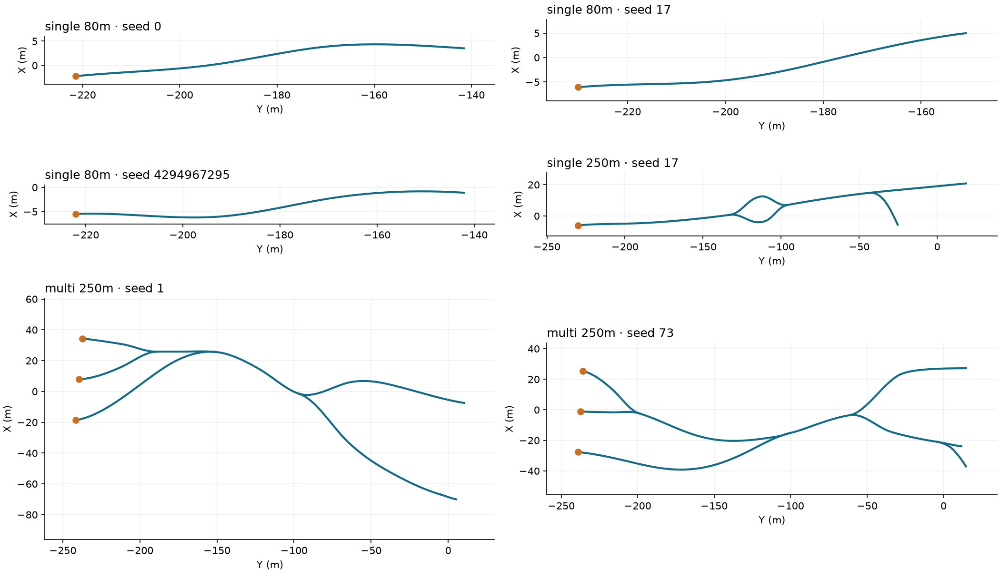
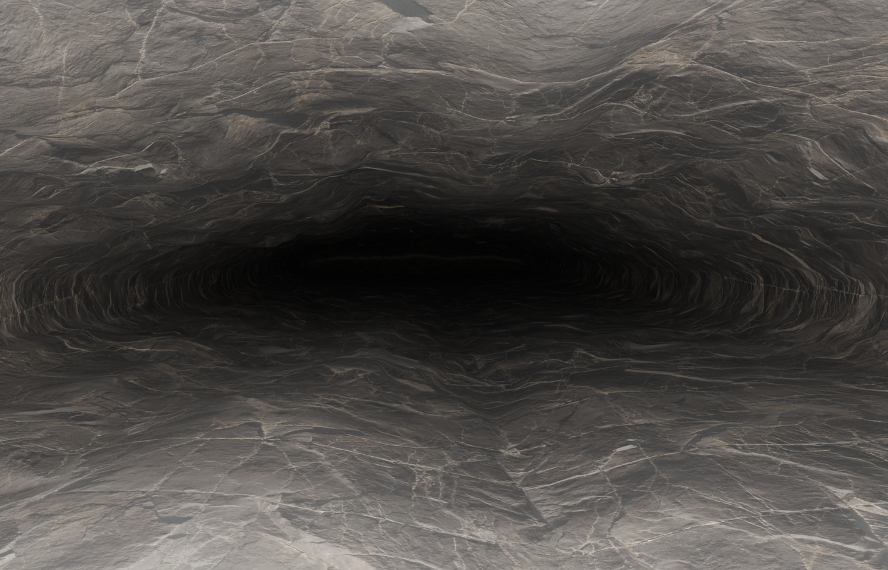

# All-repair evaluation campaign — 13 September 2026

**Final campaign: six full cases and their six cold replays passed; 24 network/section cases and their 24 cold replays passed.** The full test suite passed **777 tests plus 59 subtests**, with 18 optional skips and three separately marked performance/paper tests deselected. The independent evidence audit passed **691/691 checks**, verifying **900 artifact receipts**.

This campaign found and corrected a USD coordinate-serialization defect. The first version's failed and interrupted evidence was retained. Every planned generation was restarted under the corrected source version; final results come only from `outputs/all_repairs_campaign_20260913/final/`.

A later [native Unity/Unreal follow-up](native-engines-2026-09-13.md) uses the newly installed editors. Its one-cave results and adapter fix are separate from this campaign's frozen generation evidence.

## Scope and method

Full cases use Earth, fixed 12 cm voxels, reusable diffuse/normal/roughness maps, collision export and no rocks/events. Five full cases use 4096×4096 maps; the 250 m single-source recipe inherited the 1024×1024 default despite its `4k` filename. That frozen recipe is retained and reported as a 1K case, not counted as 4K validation. All source maps are 8192×8192. Three 80 m single-source cases exercise seeds 0, 17 and 4294967295. The 250 m cases are single-source seed 17 and three independently growing sources at seeds 1 and 73. These are six designs, each generated twice. Targets specify the dominant route; summed lengths include branches.

The broader screen uses the 250 m single and multi presets at seeds 0, 1, 2, 3, 7, 17, 42, 73, 101, 255, 65535 and 4294967295. It stops after network/sections and must not be counted as 24 additional fully meshed caves.

Each original uses Python hash seed 11; its fresh process replay uses 37, with no checkpoint reuse. Host, network, sections, raw mesh, GLB bytes, upstream recovery and texture-recovery identities must match. All source, material and configuration fingerprints remained fixed within the final campaign. The audit also checks distinct accepted designs, source counts, parallel-passage requirements, retained hosts, repair budgets, replacement-seed derivation, published B/C identities, exported genus and package integrity.

## Defect found and fixed

The existing USD writer used eight significant digits. This could change float32 vertex values, and the inspection gate also used a fixed decimal tolerance that did not model USD's declared `point3f` precision correctly. The cross-platform integration run stopped with `Serialized USD points differs from the inspected surface`, preserving the prior export.

The writer now uses nine significant digits. Inspection converts serialized positions to their declared float32 representation and requires exact equality with the approved visual surface. It does not increase the tolerance. A new regression covers distant and tiny coordinates and rejection of a single-float-step corruption. The full export-consistency integration now passes for Blender, Unity, UE5, Gazebo and Omniverse packages.

[Retained failure](all-repairs-evidence-2026-09-13/pre_fix_export_consistency_failure.json) · [Focused fix test](all-repairs-evidence-2026-09-13/usd_fix_tests.log)

Five new parametrized regression cases were added: two actual displacement-reduction cases, two local-width outcomes after real stamping, and the USD round-trip/corruption case. The first width test assumed synthetic elevations matched its host; the route-preservation guard correctly rejected it. The corrected test explicitly verifies both rejection of that inconsistent fixture and acceptance of a host-sampled fixture. No repair gate was weakened.

## Full-run results

Every row below passed both its original run and exact cold replay. “Unchanged” describes upstream network/sections, not an absence of surface or texture repair.

| Case | Root seed | Summed passage m | Upstream outcome | Surface attempts / added-relief multiplier | Repaired maps | Map pixels | GLB MB |
|---|---:|---:|---|---:|---:|---:|---:|
| [single 80m](../../outputs/all_repairs_campaign_20260913/final/single_full/case_0000/attempt_0000/pipeline_quality_report.json) | 0 | 80.3 | unchanged | 1 / 1 | 1 | 4096² | 72.8 |
| [single 80m](../../outputs/all_repairs_campaign_20260913/final/single_full/case_0001/attempt_0000/pipeline_quality_report.json) | 17 | 80.3 | unchanged | 1 / 1 | 1 | 4096² | 71.6 |
| [single 80m](../../outputs/all_repairs_campaign_20260913/final/single_full/case_0002/attempt_0000/pipeline_quality_report.json) | 4294967295 | 80.3 | unchanged | 1 / 1 | 1 | 4096² | 73.9 |
| [single 250m](../../outputs/all_repairs_campaign_20260913/final/single_full/case_0003/attempt_0000/pipeline_quality_report.json) | 17 | 324.6 | unchanged | 3 / 0.25 | 1 | 1024² | 34.5 |
| [multi 250m](../../outputs/all_repairs_campaign_20260913/final/multi_full/case_0000/attempt_0000/pipeline_quality_report.json) | 1 | 540.0 | regenerated | 6 / 0 | 1 | 4096² | 109.9 |
| [multi 250m](../../outputs/all_repairs_campaign_20260913/final/multi_full/case_0001/attempt_0000/pipeline_quality_report.json) | 73 | 560.4 | unchanged | 2 / 0.5 | 1 | 4096² | 103.5 |

Natural full runs triggered surface repair in 3/6 cases and upstream regeneration in 1/6. Local upstream repair was accepted in 0/6 natural cases; its successful resampling and width paths are exercised with controlled failures followed by actual meshing in integration tests. UV repair was observed in progress records for 0/6 cases. Visual smoothing/displacement repair occurred in 0/6 natural cases and is independently exercised by fault tests and real height-map baking.

All 6 textured cases required normal-vector repair. Package rebuilding occurred naturally in 0/6; damaged map/binding/adapter tests exercise that path deliberately. These observations separate naturally reached repairs from injected failures.

## Accepted network shapes

These are the accepted network centrelines, not mesh silhouettes. Orange dots mark sources. Coordinates are shown with Y horizontally and X vertically to make the predominantly downstream routes readable; each panel retains equal metre scales on its two axes. The repaired multi-source case uses its final accepted replacement network.

## Repair coverage

| Repair or safety boundary | Evidence exercised |
|---|---|
| Network candidate search, route smoothing, width projection, preserved topology/flow | 24 seed cases with replays; 106 related regression tests. 16 cases rejected intermediate variants, 5 accepted repaired routes, and 13 required a later candidate. Categories overlap. |
| Surface relief reduction, air/solid speck cleanup, voxel closing/opening, detached void removal | 32 surface-related tests, retained thin-branch/merge-neck fixtures, and full meshing. Route centres and intended topology remain mandatory. |
| Local section resampling and width/clearance repair | Forced earlier failure followed by real stamping and real route checks; inconsistent original elevations rejected; unchanged inputs and deterministic replay checked. |
| Upstream replacement networks | Difficult multi-source seed 1; bounded replacements in the same host, with accepted network/sections republished to downstream stages. |
| Collapsed UV charts | Four tests, including float32 collapse, unchanged healthy charts, metric reconstruction and repeatability. |
| Visual smoothing and baked displacement | Full scene gates; real height map exercises half-amplitude and zero-amplitude acceptance; unsafe smoothing disabled; exhaustion preserves prior output. |
| Collision simplification fallback | Wrong genus/passage detection and full-collider fallback; fallback remains visible in reports and size measurements. |
| Texture source preparation | Forty dedicated texture tests cover normal normalization, declared DirectX conversion, roughness precision, bounded resolution, partial maps, unchanged originals and shared event maps. Missing, corrupt or undefined sources fail without invented replacement imagery. |
| Texture package repair | Missing/stale copies, incorrect GLB bindings/samplers, damaged shader/settings and bounded rebuild from the same prepared mesh. Exhaustion keeps the previous export intact. |
| Serialized assets and publication | GLB/OBJ/USD geometry checks; configured GLB/OBJ materials; Blender/Unity/Unreal adapter integrity; resource and export-budget failures do not publish partial success. |
| Resume, receipts and error classification | Interrupted runs, damaged artifacts/checkpoints, stale inputs, exact replay and finite exhaustion; programming/domain/resource errors do not become arbitrary seed retries. |
| Event/rock placement | Seventeen event tests include recovery of rejected family slots as micro-debris, placement constraints and route protection. Full campaign caves intentionally contain no rocks. |

The 24-case screen rejected **399 intermediate variants** before acceptance; these are candidate/repair variants, not that many distinct requested seeds. [Test-to-repair mapping](all-repairs-evidence-2026-09-13/repair_coverage.json) names the tests; it is not a line-coverage percentage.

## Blender material inspection

The native Blender 4.0.1 import retained 239,274 triangles, bounds within 2 mm, unit scale, and all three packed 4096×4096 images. Base color is sRGB; normal and roughness data are non-color. All 72 saved profile-centre roof/floor ray checks passed. Two 32-sample denoised interiors were rendered with the continuous projection material; no obvious floor chart seams were visible in these two views.

The rendered GLB is byte-identical to the final seed-0 80 m export, and its Blender material adapter is unchanged by the USD-only fix. [Native evidence](all-repairs-evidence-2026-09-13/native_verification.json) links hashes, checks and rendered files. [Packed inspection scene](../../outputs/all_repairs_campaign_20260913/native_blender/export_blender/plume_continuous_inspection.blend).

The ordinary GLB still uses UVs; the continuous material is an explicit native shader. This is not a promise that every viewpoint is free from seams, aliasing, lighting noise or geological appearance problems. Native Unity/Unreal editors and optional shader compilers were unavailable; 17 shader compiler cases were skipped. The other skip is the optional Manim test collection. USD material rendering was not tested with a native OpenUSD renderer.

## Resources and retained warnings

| Case / seed | Triangles | Original / replay min | Peak RSS MiB (larger of pair) | Import package MB | Under-resolved profiles |
|---|---:|---:|---:|---:|---:|
| single 80m / 0 | 239,274 | 5.2 / 5.1 | 1162 | 230.5 | 0/72 |
| single 80m / 17 | 208,788 | 4.6 / 4.5 | 1140 | 224.3 | 0/79 |
| single 80m / 4294967295 | 264,188 | 5.3 / 5.3 | 1201 | 236.3 | 10/79 |
| single 250m / 17 | 804,012 | 6.4 / 6.2 | 2076 | 175.1 | 26/321 |
| multi 250m / 1 | 1,217,552 | 19.5 / 18.9 | 3215 | 432.9 | 110/541 |
| multi 250m / 73 | 1,046,832 | 10.5 / 10.4 | 3110 | 398.6 | 220/557 |

MB is decimal. Import-package size includes alternate formats, collision and material support files, not checkpoints or the replay copy; a simulator does not load every alternate format at once. Full workers were limited to 3600 seconds and 8192 MiB of address space (different from measured resident memory), with at most two full workers concurrently. Visual budgets remained five million triangles and 350 MB per primary asset. These timings are campaign measurements, not isolated benchmarks or simulator frame-rate tests.

6/6 cases retained the full collider. 4/6 cases retain the eight-voxel resolution warning; 1/6 accepted cases omitted the added accretion layer. The smallest measured clearance at a required sampled centre was 0.294 m. Numerical acceptance is not a guarantee of passage for a person or a chosen robot. Reports keep these warnings instead of converting them into silent success. The main follow-up priorities are a simulator-specific minimum-clearance requirement, a lighter collider that preserves passages, and a finer-resolution convergence study for the flagged profiles.

The natural multi-source cases have no closed split-and-rejoin cycles; single-source full runs and topology fixtures exercise loops. This limits the topology coverage of this finite sample. The campaign does not establish every seed/body combination, exhaustive self-intersection absence, continuous traversability or geological realism.

## Evidence and reproduction

- [Final single-source report](../../outputs/all_repairs_campaign_20260913/final/single_full/report.html), [multi-source report](../../outputs/all_repairs_campaign_20260913/final/multi_full/report.html), [seed-screen report](../../outputs/all_repairs_campaign_20260913/final/seed_screen/report.html).
- [Archived audit](all-repairs-evidence-2026-09-13/audit.json), [protocol](all-repairs-evidence-2026-09-13/protocol_final.json), [test results](all-repairs-evidence-2026-09-13/tests.log), [run counts](all-repairs-evidence-2026-09-13/campaign_counts.json).
- [Commands and retained earlier attempts](all-repairs-evidence-2026-09-13/execution.md). Cold replay is enabled by default. Recheck a group using `plume-check --output <group> --resume --report-only`; this does not regenerate models.

Final source SHA-256: `07c063f95f21234ad8c563381d0053e8192fc95803d04fa34cb9f6c8fd1978fc`. Lint passed and mypy checked 104 source files without errors. An optional coverage-instrumentation attempt failed during NumPy import; its diagnostic is retained, the final suite ran without that instrumentation, and no code-coverage percentage is claimed.
