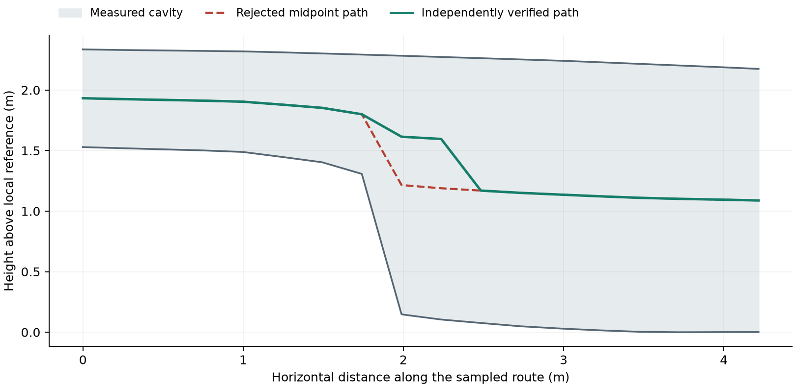
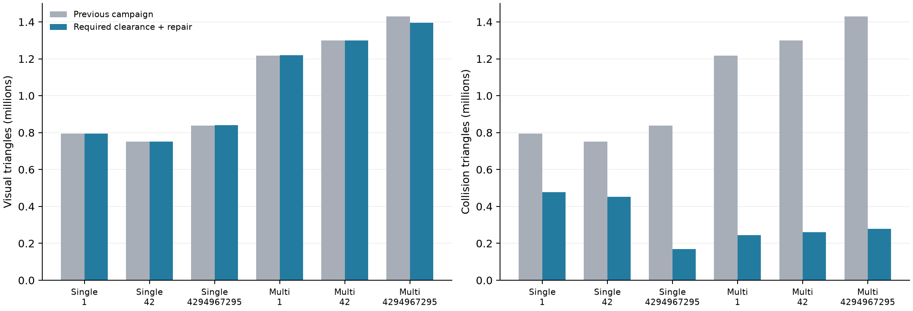
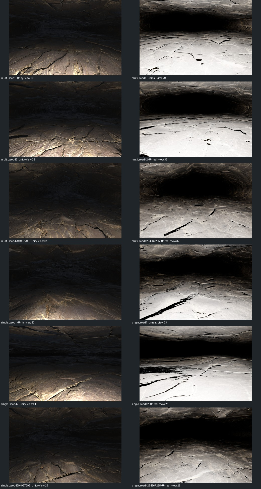

# Required clearance and repair evaluation — 14 September 2026

**Completed:** all six textured originals, all six cold replays and both native engines passed the frozen V3 protocol. Earlier failed revisions remain preserved.

The requested inspection clearance is 0.5 m high × 0.5 m wide. PLUME represents
this as an upright capsule with 0.02 m additional margin on the dominant route.
Optional passages may remain narrower. A geometric body corridor does not
establish wheel contact, slope handling, traction or robot dynamics.

## What changed

- Required cross sections can enlarge within the existing host, width/aspect,
  roof-cover and stability limits. Impossible enlargement is rejected.
- Continuous capsule/triangle checks cover the spaces between stations on the
  base surface, final visual surface and dedicated collider.
- Before changing geometry, a bounded local search can move the body vertically
  around a step while preserving its XY route and junction endpoints. Every
  proposed path is independently swept again in full.
- Local surface-relief attenuation preserves distant detail. Bounded global
  candidates and deterministic upstream recovery remain available when needed.
- Optional consistent-grid refinement checks floor and roof convergence
  separately and rejects exhausted resolution or allocation budgets.
- Collision simplification tries progressively smaller reductions, with topology,
  clearance and bidirectional vertex/face-centre distance checks. Both metre and
  centimetre float32 representations must preserve every triangle. Small local
  precision repairs are re-inspected; full triangulation cannot bypass the gate.
- Native inspection imports the dedicated collider independently, checks all
  planned branch material views, and retains source receipts, timings and memory.

The controls and their limits are documented in
[the reliability guide](../reliability.md#required-clearance-and-bounded-geometry-repairs).

## Why earlier runs were retained

V1 exposed two lost collider triangles during Unreal import. Both simplified and
full double-precision meshes could contain triangles that collapsed or inverted
when encoded as float32. Production now repairs only localized precision damage
within a bounded displacement, then rechecks the complete candidate. The native
triangle-count check remains strict.

V2 completed four originals and four cold replays, with both editors passing for
those originals. Multi-source seed 42 then failed all seven upstream candidates.
Diagnosis reconstructed exactly the rejected zero-relief surface hash and found
a valid vertical corridor through the unchanged mesh. Midpoint-only body placement
caused the rejection. The production repair verified every required path through
that mesh with 129 additional search queries; an independent repeat matched
exactly. The other unfinished multi-source case was stopped and is not counted
as completed. Failed and interrupted V1/V2 artifacts remain separate from V3.

Measured floor/roof heights and body-centre paths along a short section of the
seed-42 route. The red midpoint path brings the finite body into the step. The
green path delays its descent and passes the exact three-dimensional capsule
sweep. This plot shows centre positions, not the full swept volume. No cave
vertices or body dimensions change in this repair. The open local regression
fixture and the complete diagnostic report are preserved with the evidence.

## Campaign protocol

V3 repeats the earlier six textured designs: Earth, a 250 m dominant-route target,
single and three-source networks, seeds 1, 42 and 4294967295. It uses the original
12 cm production grid, reusable 4K PBR maps tiled every 4 m, no rocks/events and
no baked image displacement. Each original has a cold replay with a different
Python hash seed. The hosts are compared with the previous campaign.

Three independent seed groups run concurrently, with one native editor at a time.
Each generation/replay worker is limited to 3600 seconds and 8192 MiB address
space. Timings under concurrent load are observations, not isolated benchmarks.
All accepted originals are checked in Unity 6000.6 and Unreal 5.8.2. Each segment
has planned floor/roof views near both ends and at 30 m intervals; missing views
fail the native check.

[Frozen protocol](mobility-repair-evidence-2026-09-14-v3/protocol.json) ·
[Reproduction and preserved failures](mobility-repair-evidence-2026-09-14-v3/execution.md) ·
[Test inventory](mobility-repair-evidence-2026-09-14-v3/test_inventory.txt)

## Measured results

All **six originals and six cold replays passed**. Every original passed both native engines: **340 planned views and 2845 floor/roof probe locations per engine**. Each probe location tests both floor and roof. Exact replay checks include semantic identities, raw mesh/GLB identities, collider bytes and collider inspection records.

The independent audit passed **1603 checks** and verified **516 generated artifact receipts**. [Complete audit](mobility-repair-evidence-2026-09-14-v3/audit.json)

| Case | Visual triangles | Collider triangles | Reduction | Max sampled collider error | GLB |
|---|---:|---:|---:|---:|---:|
| Single 1 | 795,804 | 477,482 | 40% | 3.36 mm | 93.7 MB |
| Single 42 | 751,680 | 451,008 | 40% | 2.71 mm | 92.0 MB |
| Single 4294967295 | 840,100 | 168,018 | 80% | 27.32 mm | 95.5 MB |
| Multi 1 | 1,219,312 | 243,862 | 80% | 7.62 mm | 109.7 MB |
| Multi 42 | 1,299,078 | 259,814 | 80% | 16.08 mm | 113.0 MB |
| Multi 4294967295 | 1,395,610 | 279,120 | 80% | 5.94 mm | 116.5 MB |

Comparison with the preceding textured campaign. Its colliders retained the full visual triangulation. Visual detail and required clearance remain independently checked; reducing collider triangles does not imply an equivalent reduction in rendered triangles.

5/6 colliders needed local precision repair on 4–11 vertices each. The largest total vertex change was 0.118 mm. All then passed the full mesh/clearance/error checks and both native imports with the exact expected triangle counts. Per-case measurements remain in the audit.

| Case | Upstream candidates | Accepted global relief scale | Local relief regions | Repaired required paths | Views per engine |
|---|---:|---:|---:|---:|---:|
| Single 1 | 1 | 1 | 6 | 0 | 46 |
| Single 42 | 1 | 1 | 6 | 1 | 40 |
| Single 4294967295 | 1 | 1 | 5 | 0 | 58 |
| Multi 1 | 6 | 0 | 0 | 0 | 58 |
| Multi 42 | 1 | 0.25 | 0 | 1 | 66 |
| Multi 4294967295 | 1 | 0 | 0 | 0 | 72 |

Relief scale zero means the procedural accretion layer was removed in the accepted candidate; it does not remove the underlying section shape or texture detail. Local masks can also reduce relief near defects. The raw repair journals preserve every rejected candidate. The multi-source seed-1 case uses the first deterministic replacement network in the same host; seed 42 is repaired on its original network. Source normal-map normalization ran in every case; no missing-source recovery is claimed by these naturally occurring cases.

| Case | Original / cold replay | Peak worker RAM | Combined network length | Input profiles below eight voxels |
|---|---:|---:|---:|---:|
| Single 1 | 10.7 / 11.0 min | 2.35 GiB | 352.8 m | 67/357 |
| Single 42 | 11.3 / 11.9 min | 2.23 GiB | 325.5 m | 109/325 |
| Single 4294967295 | 12.1 / 12.2 min | 2.54 GiB | 388.8 m | 87/393 |
| Multi 1 | 31.3 / 29.7 min | 3.31 GiB | 540.0 m | 110/541 |
| Multi 42 | 15.7 / 16.3 min | 3.82 GiB | 605.1 m | 174/595 |
| Multi 4294967295 | 16.5 / 16.5 min | 3.69 GiB | 648.4 m | 108/620 |

6/6 cases retain input-profile resolution warnings. Those are not failed capsule checks: the continuous route tests apply to the actual triangles, while the eight-voxel screen asks whether finer geometric detail needs a separate convergence study. Passing this campaign does not resolve those warnings.

Recorded editor peak memory ranged from 2.64–2.71 GiB in Unity and 4.50–5.81 GiB in Unreal. These include editor/import workloads; they are not minimum runtime requirements. Cooking, import and query timings remain in the native records and do not establish comparable engine frame rates.

One predetermined middle floor-direction view per case and engine; views were not selected by appearance. Complete contact sheets and these full-size images were reviewed. Materials are visible and the inspected views show no obvious rectangular floor-projection seams. Unreal is substantially brighter; passing image guards does not establish matched appearance. [Review scope and image identities](mobility-repair-evidence-2026-09-14-v3/visual_review.json)

### Inspect the generated assets

| Case | Portable asset | Native Unity scene | Native Unreal project |
|---|---|---|---|
| Single 1 | [GLB](../../outputs/mobility_repair_campaign_20260914_v3/seed_1/case_0001/attempt_0000/export/plume_cave.glb) | [Scene](../../outputs/mobility_repair_campaign_20260914_v3/native/single_seed1/unity_project/Assets/PLUME_Inspection.unity) | [Project](../../outputs/mobility_repair_campaign_20260914_v3/native/single_seed1/unreal_project/PLUMENative.uproject) |
| Single 42 | [GLB](../../outputs/mobility_repair_campaign_20260914_v3/seed_42/case_0001/attempt_0000/export/plume_cave.glb) | [Scene](../../outputs/mobility_repair_campaign_20260914_v3/native/single_seed42/unity_project/Assets/PLUME_Inspection.unity) | [Project](../../outputs/mobility_repair_campaign_20260914_v3/native/single_seed42/unreal_project/PLUMENative.uproject) |
| Single 4294967295 | [GLB](../../outputs/mobility_repair_campaign_20260914_v3/seed_4294967295/case_0001/attempt_0000/export/plume_cave.glb) | [Scene](../../outputs/mobility_repair_campaign_20260914_v3/native/single_seed4294967295/unity_project/Assets/PLUME_Inspection.unity) | [Project](../../outputs/mobility_repair_campaign_20260914_v3/native/single_seed4294967295/unreal_project/PLUMENative.uproject) |
| Multi 1 | [GLB](../../outputs/mobility_repair_campaign_20260914_v3/seed_1/case_0000/attempt_0000/export/plume_cave.glb) | [Scene](../../outputs/mobility_repair_campaign_20260914_v3/native/multi_seed1/unity_project/Assets/PLUME_Inspection.unity) | [Project](../../outputs/mobility_repair_campaign_20260914_v3/native/multi_seed1/unreal_project/PLUMENative.uproject) |
| Multi 42 | [GLB](../../outputs/mobility_repair_campaign_20260914_v3/seed_42/case_0000/attempt_0000/export/plume_cave.glb) | [Scene](../../outputs/mobility_repair_campaign_20260914_v3/native/multi_seed42/unity_project/Assets/PLUME_Inspection.unity) | [Project](../../outputs/mobility_repair_campaign_20260914_v3/native/multi_seed42/unreal_project/PLUMENative.uproject) |
| Multi 4294967295 | [GLB](../../outputs/mobility_repair_campaign_20260914_v3/seed_4294967295/case_0000/attempt_0000/export/plume_cave.glb) | [Scene](../../outputs/mobility_repair_campaign_20260914_v3/native/multi_seed4294967295/unity_project/Assets/PLUME_Inspection.unity) | [Project](../../outputs/mobility_repair_campaign_20260914_v3/native/multi_seed4294967295/unreal_project/PLUMENative.uproject) |

Open each Unity scene within its corresponding `unity_project`. The native projects already contain the blended material and dedicated collider. The adjacent export package includes a Blender importer and material setup instructions. In Blender, import the GLB (or run `plume_cave_import_blender.py`), then run `continuous_material/apply_blender_material.py` to install the blended projection. These campaign exports are not saved `.blend` projects. No rocks were generated.

## Automated regression coverage

The frozen V3 source passed **899 tests and 59 subtests**, with 20 optional
checks skipped in the general suite (862.75 seconds). A separate material run
passed **25 checks**, including two actual Blender tests and 15 Unity URP shader
variants; its two glslang checks were unavailable. These runs overlap, so their
counts should not be added as unique tests. Focused clearance/path/collision/
resolution tests passed 97 checks. Type checking passed across 110 source files;
lint and whitespace checks passed. [Logs and identities](mobility-repair-evidence-2026-09-14-v3/test_results.json)
record the exact scope.

| Area | Positive and failure checks |
|---|---|
| Required clearance | Narrow height/width, between-station obstruction, missing routes, shared junctions and optional passages |
| Path placement | Real rejected seed, closed stepped cavity, taller capsule, immutable XY/endpoints, exact replay, solid wall, finite shared budgets and an incorrect search-success injection |
| Host and stability | Envelope repair preserves inputs; impossible clearance cannot weaken roof limits |
| Surface recovery | Local air pockets, tile seams, unintended handles, route preservation, local relief continuity and exhausted retries |
| Resolution | Actual 20 m refinement; separate floor/roof comparison; insufficient convergence and allocation rejection; exact cold replay |
| Collision | Actual decimation, surface drift, topology change, progressive retries, float32 face damage, unchanged source, exact replay and unsafe full-mesh fallback rejection |
| Textures | Normal-vector/convention repair, size bounds, corrupted or missing sources, package rebuild without geometry changes, receipts and exhausted repair budgets |
| Native engines | Real imports, required captures, overexposure guards, collider face counts, floor/roof queries and strict rejection of failed engine reports |

## Limits of the evidence

The campaign covers six Earth designs, not every seed or celestial body. Rejection
after finite budgets remains a valid outcome; a failed local path search is not
proof that no possible route exists. The search changes vertical placement only,
uses seven height bands and preserves its anchors.

Production still uses 12 cm voxels and can retain under-resolution warnings.
The separate real 20 m study exercises 20 cm → 10 cm convergence; an earlier
250 m study was interrupted at its expensive 3 cm candidate and supports no
convergence claim. Local repair can still fall back to global relief reduction.

Collider distance checks sample every vertex and face centre in both directions;
they are not an exhaustive Hausdorff proof. Native collision checks use rays,
while the continuous capsule checks operate on source mesh triangles. Finite
rendered views do not inspect every texel or certify geological realism. Editor
timing and memory measurements do not establish application frame rate, and
Unity/Unreal lighting and tone mapping remain different.

Standard GLB materials carry portable PBR maps, but cannot carry the blended
projection shader. Use the supplied material adapters or the validated native
projects when inspecting seam-free projection; importing only the bare GLB does
not install that shader. See [material setup](../materials.md).
