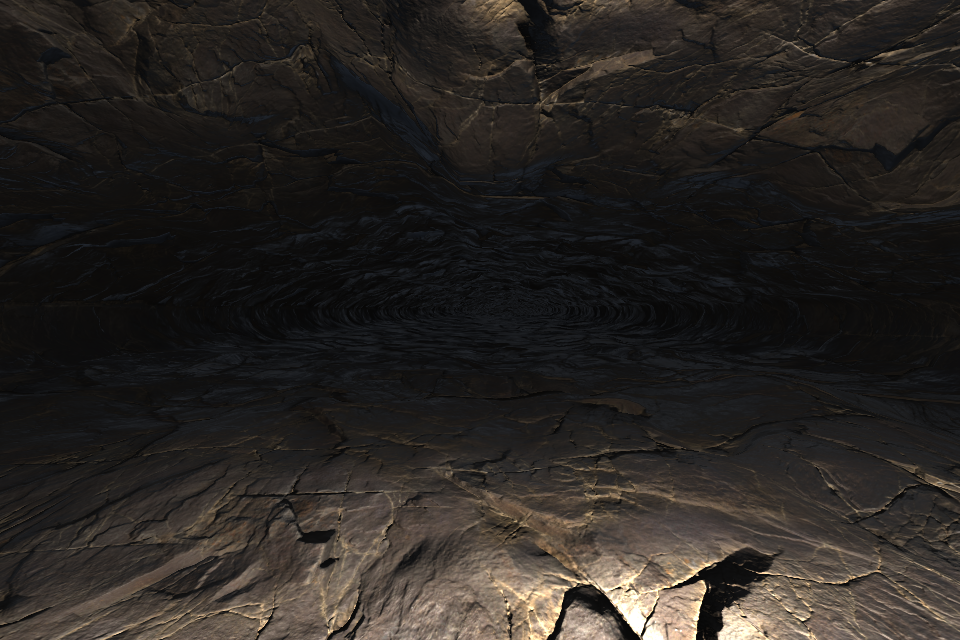
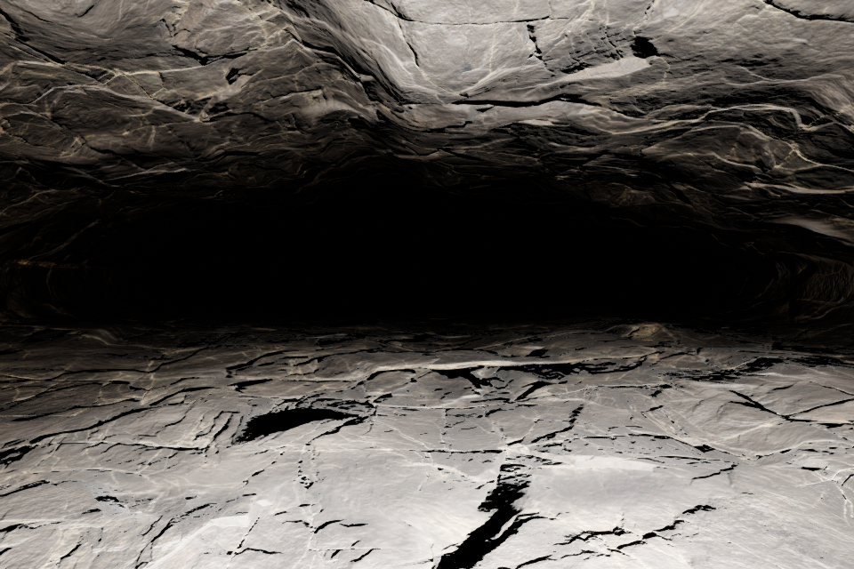

# Native Unity and Unreal validation — 13 September 2026

**Unity 6000.6.0f1 and Unreal 5.8.2 passed native import, material, rendering and passage-collision checks on one newly generated 80 m Earth cave.** The checks found and corrected an Unreal material-adapter error. Both engines then passed a complete run from fresh projects using the repeatable inspection command.

[Final combined report](native-engines-evidence-2026-09-13/native_summary.json) · [Input and fixture identities](native-engines-evidence-2026-09-13/native_input_receipt.json) · [Evidence hashes](native-engines-evidence-2026-09-13/evidence_manifest.json)

## Scope

One rock-free, single-source cave was generated with seed **0**, the frozen `single_80m_4k.toml` recipe, and 12 cm voxels. Its summed passage length is **80.275 m**, with **239,274 triangles**, **127,358 source vertices**, and three **4096 × 4096** maps. The GLB is **72.79 MB**. Generation took 298 seconds and reported approximately 1,157 MiB peak resident memory. Normal-vector repair ran; collider simplification was rejected and the full collider was retained. Network replacement was unnecessary.

All editor attempts reused that same GLB. They are import/material test iterations, **not additional generated tubes**. This follow-up does not add multi-source, other-body, new-seed or cold-generation-replay coverage to the [earlier repair campaign](all-repairs-campaign-2026-09-13.md).

The source GLB SHA-256 is `86845760c4f4261c14477e224a1af41d6d4612b6b73c43b56b6af2f62305cd00`. Its generation used package fingerprint `07c063f95f21234ad8c563381d0053e8192fc95803d04fa34cb9f6c8fd1978fc`. Native bundles were refreshed after the adapter fixes, under fingerprint `dabac227d7a865fc160ceb5ec39d86ff5df0ff0f50c63a51d6eadad882f984c9`. The geometry and source GLB were not edited. Original generation receipts are preserved separately from the refreshed material settings.

## Native results

Hardware was an NVIDIA GeForce RTX 3070 on Linux. Both engines used Vulkan; Unreal compiled its SM5 shader path. Unity used URP **17.6.0** and glTFast **6.20.0**, with resolved packages archived.

| Check | Unity | Unreal |
|---|---:|---:|
| Imported triangles | 239,274 | 239,274 after disabling Nanite |
| Imported vertices | 127,358 | 127,359 |
| Passage samples passing | 75 / 75 | 75 / 75 |
| Maximum floor/roof distance error | 0.00769 mm | 0.00904 mm |
| Vertex/bounds comparison | All vertices: exact | Bounds: maximum 0.00244 mm error |
| Native material compilation | Supported, no shader errors | 16 compiled shaders |
| Texture dimensions and color spaces | Three 4K maps, correct | Three 4K maps, correct |
| Changed UV render control | Exactly unchanged | Not independently exercised |
| Normal-off image change, mean absolute RGB | 0.07390 | 0.11027 |
| Inspection images | Two interiors | Two interiors |

Clearance comparisons use **the final exported visual surface**, after surface processing. Each sample checks both floor and roof with the engine's actual triangle collision. Acceptance tolerances are 1 cm for ray distances and 2 mm for vertices/bounds. The observed smaller errors do not establish geometry accuracy beyond the source mesh's resolution. Unreal's additional imported vertex is reported rather than treated as full vertex identity: Unreal was checked through triangle counts, bounds and collision rays, not every vertex position.



Unity's shipped continuous material, with a local inspection light. Altering every UV coordinate leaves the image unchanged, while disabling the normal map visibly removes fine relief.



Unreal's Default Lit material using the same tile. Lighting/exposure are independent from Unity, and the recipe uses normal strength 2. These high-contrast views test material behavior; they are not a matched photometric comparison or evidence of geological calibration.

## Problems found and corrected

1. **Unreal material graph:** the adapter attempted to connect transform nodes through a pin named `Input`. Unreal's scripting API exposes these as unnamed first inputs, so the real editor rejected the connection. All three transform connections now use the supported input. The builder also raises an error if native compilation returns errors. The shared HLSL did not need changing.
2. **Unreal import defaults:** UE 5.8 enabled Nanite and generated a **1,410-triangle fallback**. This was a fallback representation, not evidence that the source GLB had lost triangles. Because fallback geometry also affects complex collision, the inspection explicitly disables Nanite and rebuilds the full mesh before comparison. Nanite remains a separate optimization decision for a simulation project.
3. **Capture readiness:** Unity needed synchronous shader compilation and camera warm-up before accepting the first screenshot. Unreal's immediate captures used coarse streamed mips; the isolated inspection project now disables texture streaming and reads back initialized captures. Runtime streaming settings in user projects are untouched.
4. **Test reference:** an intermediate clean-project run compared against raw mesh measurements and reported up to 6.47 mm difference. The final runner uses `export_inspection.visual`, avoiding a comparison between different processing stages. A regression covers this distinction.

The initial Unreal attempts also exposed differences between commandlet and full-editor APIs: editor subsystems were unavailable in commandlet mode, and collision-hit data must be unpacked using the reflected struct API. These were fixture-development errors. The final command uses the full editor offscreen and checks the JSON result even if Unreal exits with status zero after a script error.

Seven development-attempt reports and compressed logs are retained in the evidence folder, including failed graph construction. The intermediate raw-baseline report is clearly separated from final acceptance. No failure was replaced with a different seed.

## Repeat the checks and inspect the projects

From the repository root, with the PLUME environment installed:

```bash
uv run --no-sync python scripts/check_native_engines.py \
  outputs/native_engines_20260913/generation/case_0000/attempt_0000 \
  --output outputs/my_native_check \
  --unity /home/gabriel/Unity/Hub/Editor/6000.6.0f1/Editor/Unity \
  --unreal /home/gabriel/Downloads/Linux_Unreal_Engine_5.8.2/Engine/Binaries/Linux/UnrealEditor
```

The corrected Unreal path contains the installation directory once; the originally supplied path repeated it. Choose a new output directory for each run. The command needs an installed/licensed editor, GPU/display access, and Unity registry access on its first launch. Either engine can be omitted. It runs engines sequentially and limits each invocation to 30 minutes by default. The focused fixture requires one rock-free primitive, three 4K maps and at least 50 passage samples.

The accepted native projects are in `outputs/native_engines_20260913/final/`:

- Unity: add `unity_project` through Unity Hub, then open `Assets/PLUME_Inspection.unity`.
- Unreal: open `unreal_project/PLUMENative.uproject`. Its startup map is `/Game/PLUME_Run01/PLUME_Inspection`; the saved viewport faces the interior.
- Final JSON, editor logs, two views and normal-off controls accompany the projects. Unity also includes its changed-UV control.

The original source run can be recreated with the archived [recipe](native-engines-evidence-2026-09-13/single_80m_4k.toml) or the earlier campaign's identical recipe. The native command does not regenerate geometry. New generations package the corrected adapter automatically; archived older bundles retain their original adapter bytes and should be refreshed before use.

## Automated tests and limits

The focused regression run passed **60 tests**, with **18 optional Blender/HLSL/compiler checks skipped because their environment variables were not set**. Unity and Unreal native execution above is separate from those pytest totals. Twelve tests cover the native runner, including blank/missing captures, editor failures, timeouts, preserving existing directories, rejecting failed generation, failed JSON despite exit zero, and selecting the exported visual baseline. Ruff passed for the runner, fixtures and changed Unreal adapter; mypy passed for the runner.

This verifies one small cave and the shipped Unity URP/Unreal Default Lit adapters. It does not validate HDRP, Unreal Nanite rendering, all renderer permutations, mobile hardware, packaged builds, arbitrary imports or large-network frame rates. Both inspection scenes use the full visual mesh for collision. Texture compression, reduced colliders, Nanite fallback error and streaming behavior need separate target-project profiling. The portable pipeline continues to inspect packaging; it does not silently launch commercial editors for every seed.
