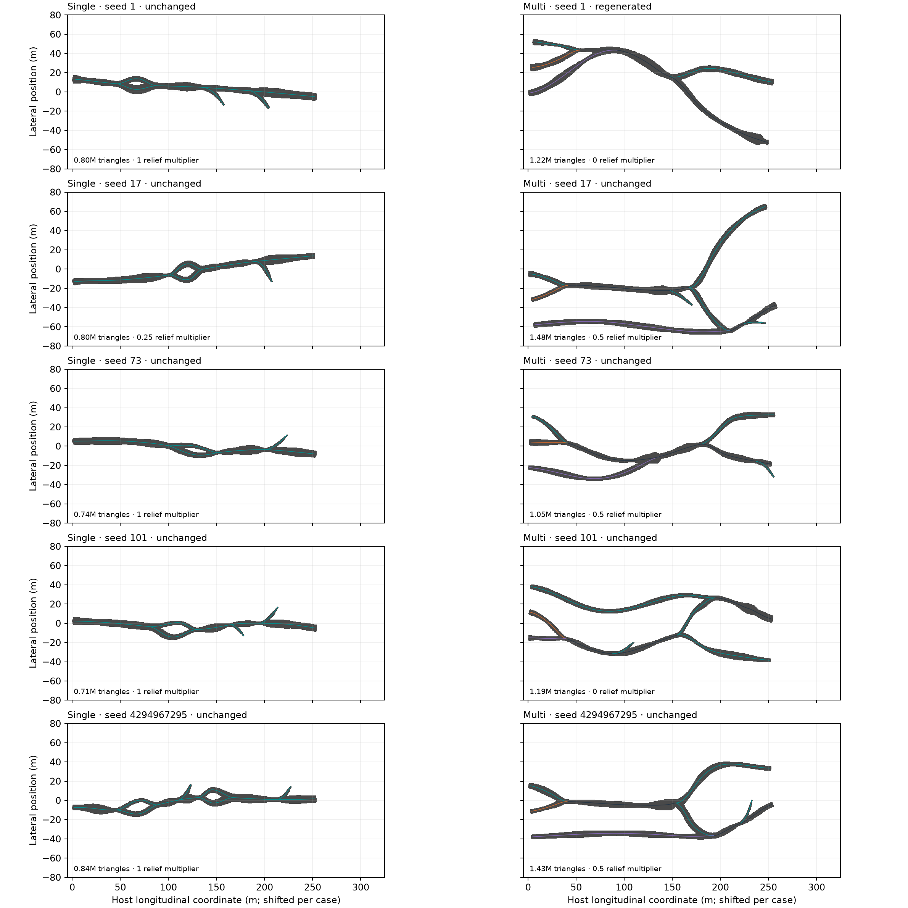

# Recovery test campaign — 13 September 2026

**10/10 cases passed, including their cold replays.** The separate evidence audit passed (220/220 checks).

Ten newly executed short Earth cases use five root seeds in each of two modes: one source with a trunk-dominated layout, and three independently growing sources that share a host and can merge/split. Seeds 1 and 17 retain earlier problem cases; 73, 101 and 4294967295 extend coverage. These are ten original cases plus a fresh checkpoint-free replay of each passing original, not twenty distinct cave designs.

The dominant route target is 250 m; combined passage length includes all branches. The campaign uses fixed 12 cm voxels, neutral materials, no rocks/events, and collision export. Recipes were checked against the retained baseline before launch. No production code, recipe, requested root seed, resolution or acceptance threshold was changed during execution. Recorded replacement-network seeds follow the fixed recovery policy.

## Results

| Mode | Root seed | Result | Upstream outcome | Surface tries on accepted network | Added relief multiplier | GLB MB |
|---|---:|---|---|---:|---:|---:|
| single | [1](../../outputs/recovery_campaign_20260913/single/case_0000/attempt_0000/result.json) | Pass + exact replay | unchanged | 1 | 1 | 29.9 |
| single | [17](../../outputs/recovery_campaign_20260913/single/case_0001/attempt_0000/result.json) | Pass + exact replay | unchanged | 3 | 0.25 | 30.2 |
| single | [73](../../outputs/recovery_campaign_20260913/single/case_0002/attempt_0000/result.json) | Pass + exact replay | unchanged | 1 | 1 | 28.3 |
| single | [101](../../outputs/recovery_campaign_20260913/single/case_0003/attempt_0000/result.json) | Pass + exact replay | unchanged | 1 | 1 | 26.6 |
| single | [4294967295](../../outputs/recovery_campaign_20260913/single/case_0004/attempt_0000/result.json) | Pass + exact replay | unchanged | 1 | 1 | 31.9 |
| multi | [1](../../outputs/recovery_campaign_20260913/multi/case_0000/attempt_0000/result.json) | Pass + exact replay | regenerated | 6 | 0 | 46.0 |
| multi | [17](../../outputs/recovery_campaign_20260913/multi/case_0001/attempt_0000/result.json) | Pass + exact replay | unchanged | 2 | 0.5 | 55.9 |
| multi | [73](../../outputs/recovery_campaign_20260913/multi/case_0002/attempt_0000/result.json) | Pass + exact replay | unchanged | 2 | 0.5 | 39.7 |
| multi | [101](../../outputs/recovery_campaign_20260913/multi/case_0003/attempt_0000/result.json) | Pass + exact replay | unchanged | 4 | 0 | 45.4 |
| multi | [4294967295](../../outputs/recovery_campaign_20260913/multi/case_0004/attempt_0000/result.json) | Pass + exact replay | unchanged | 2 | 0.5 | 54.0 |

`unchanged` means the network and sections accepted by the normal network-screening stage stayed unchanged during mesh recovery; surface-level repairs may still have reduced relief or adjusted voxel filters. `locally_repaired` means section/network adjustments passed without replacing the graph. `regenerated` means the bounded replacement search selected another network in the original host.

6 accepted networks required more than one surface attempt; 4 passed their first surface attempt. Upstream recovery was required in 1 case(s). The per-case journals retain rejected surface candidates, local repairs and replacement searches.

## What the campaign checked

- Production network and cross-section acceptance, followed by actual mesh topology, orientation, finite geometry, route-centre containment and floor/roof intersection checks.
- The accepted network/section realization propagates to exported B/C artifacts, floor data, final geometry, export inspection and provenance.
- GLB container, geometry, normals/tangents, UV quality, scene completeness, collision-sidecar checks and exact exported-surface topology against the accepted graph.
- Independent original/replay workers use different Python hash seeds (11 and 37). Host, network, sections, mesh arrays, GLB bytes and complete recovery journals must agree.
- Every delivered artifact receipt is verified after completion; source and input identities must remain frozen. The audit checks host preservation and finite recovery budgets.

## Recovery evidence

### Multi seed 1

- `original`: rejected; 6 surface candidates — No surface candidate realizes the accepted network after 6 attempts.
- `local_section_resampling`: rejected; 6 surface candidates — No surface candidate realizes the accepted network after 6 attempts.
- `local_width_clearance`: rejected; 0 surface candidates — Network morphology rejected before meshing: sustained_uphill_sections.
- `network_regeneration`: accepted; 6 surface candidates.

[Full recovery journal](../../outputs/recovery_campaign_20260913/multi/case_0000/attempt_0000/pipeline_recovery.json)

## Topology coverage

Accepted graph loop counts represented by this batch: single-source [1, 2]; multi-source [0]. The final exported surface has the matching genus in every passing case.

The multi-source examples exercise parallel passages, merges and splits, but no closed split-and-rejoin loop. This is a coverage limitation: this batch does not establish recovery of cyclic multi-source networks.

## Exported geometry overview



Grey silhouettes are raster projections of the actual GLB cave-wall triangles. Thin lines show accepted network centres, coloured by source identity; shared segments are dark. Each case is shifted for comparison at a common metric scale. Overlapping passages at different elevations can overlap in this plan view. This is a geometry overview, not a native renderer or an interior-surface inspection.

## Resource costs and remaining warnings

| Mode | Seed | Combined passage m | Triangles | Original / replay min | Peak RSS MiB (max of pair) | Import package MB | Under-resolved profiles |
|---|---:|---:|---:|---:|---:|---:|---:|
| single | 1 | 352.8 | 795,184 | 7.1 / 6.9 | 2047 | 160.7 | 67/357 |
| single | 17 | 324.6 | 804,012 | 6.0 / 6.1 | 2098 | 162.6 | 26/321 |
| single | 73 | 329.1 | 742,474 | 6.6 / 6.5 | 1934 | 151.5 | 97/319 |
| single | 101 | 352.5 | 705,224 | 5.9 / 6.0 | 1858 | 143.1 | 144/354 |
| single | 4294967295 | 388.8 | 838,408 | 7.6 / 7.6 | 2188 | 170.7 | 87/393 |
| multi | 1 | 540.0 | 1,217,552 | 16.2 / 16.1 | 3067 | 249.1 | 110/541 |
| multi | 17 | 697.2 | 1,477,056 | 12.5 / 12.5 | 3547 | 302.7 | 101/636 |
| multi | 73 | 560.4 | 1,046,832 | 7.8 / 7.5 | 2611 | 214.7 | 220/557 |
| multi | 101 | 649.8 | 1,187,966 | 6.5 / 6.5 | 2966 | 245.0 | 269/637 |
| multi | 4294967295 | 648.4 | 1,429,988 | 11.8 / 11.5 | 3528 | 292.5 | 108/620 |

MB means decimal megabytes. Import-package size includes the primary GLB, collision OBJ, optional fallback OBJ/material and support reports/scripts; it excludes campaign checkpoints and the replay copy. The package contains alternative imports and is not all loaded into a simulator at once. Timings were measured with up to two concurrent campaign runners and are not an isolated performance benchmark.

Each worker had a 3600-second deadline and an 8192-MiB address-space ceiling (distinct from measured resident memory). The configured primary-asset budget is 5 million visual triangles and 350 MB; no budget was relaxed.

10/10 passing cases retain warnings. The eight-voxel section-resolution rule is a screening heuristic, not a convergence proof. A zero added-relief multiplier omits the extra accretion layer while retaining section shape and stamped roughness. Rejected collider simplification retains the full collider and may be expensive for simulation. Every warning is retained in `audit.json`.

The smallest measured vertical clearance at a sampled centre is 0.203 m. Numerical mesh acceptance therefore does not mean every passage is traversable by a person or a given rover; those dimensions need their own explicit route-clearance criterion.

Passing these checks does not certify all possible seeds, geological realism, continuous clearance for a rover, exhaustive triangle self-intersection detection, or Blender/Unity/Unreal rendering. Textures, rocks and native simulator imports were deliberately outside this geometry-recovery campaign.

## Evidence and reproduction

- [Archived audit](recovery-evidence-2026-09-13/audit.json), [single recipe](recovery-evidence-2026-09-13/single_250m.toml), [multi recipe](recovery-evidence-2026-09-13/multi_250m.toml) survive clearing generated outputs.
- [Combined audit](../../outputs/recovery_campaign_20260913/audit.json)
- [Single-source campaign](../../outputs/recovery_campaign_20260913/single/report.html)
- [Multi-source campaign](../../outputs/recovery_campaign_20260913/multi/report.html)
- [Recipes, scope and commands](../../outputs/recovery_campaign_20260913/README.md)

Frozen generation package SHA-256: `fecc526b8227139505506ef35c75584e85612fe38e9ebc94c7961cb67858cbd7`.

Run with the recorded version and dependencies, using a fresh output directory:

```bash
OPENBLAS_NUM_THREADS=1 OMP_NUM_THREADS=1 MPLCONFIGDIR=/tmp/plume-mpl \
  .venv/bin/plume-check \
  --configs docs/reviews/recovery-evidence-2026-09-13/single_250m.toml \
            docs/reviews/recovery-evidence-2026-09-13/multi_250m.toml \
  --seeds 1 17 73 101 4294967295 --scope full \
  --timeout 3600 --memory-limit-mib 8192 --output outputs/recovery_campaign_repeat
```

Cold replay is enabled by default. The archived preflight records dependency versions. This combined command runs cases sequentially; the recorded campaign ran one isolated runner per mode concurrently. It must produce the same deterministic identities.
