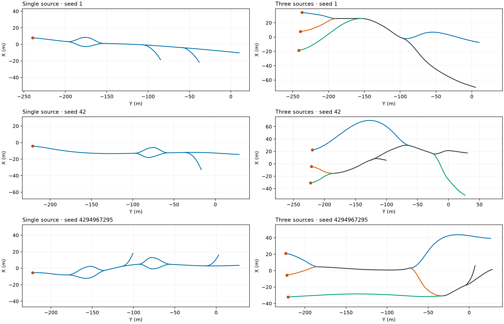
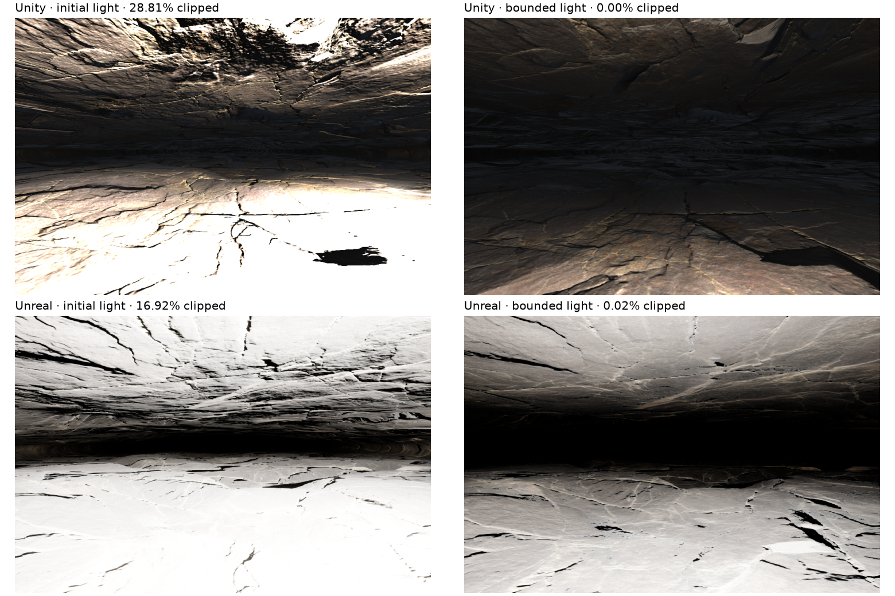
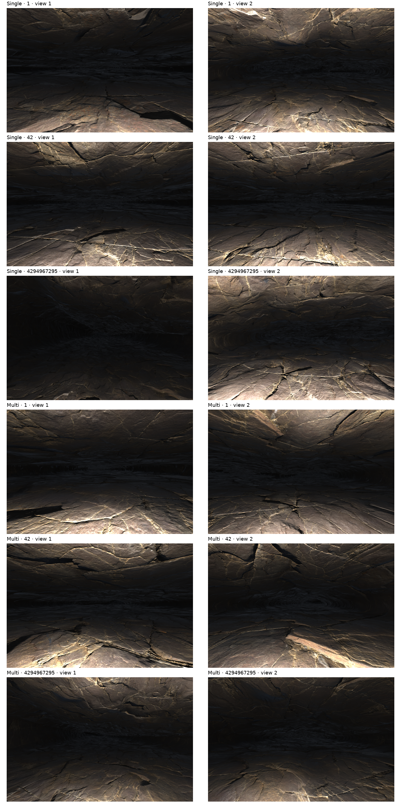
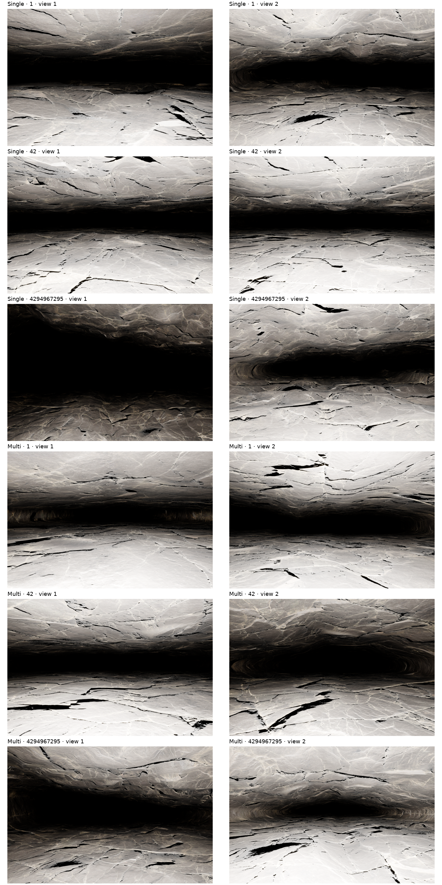

# Textured evaluation campaign — 13–14 September 2026

**6/6 originals passed, 6/6 cold replays matched exactly, and 6/6 originals passed both Unity and Unreal inspection.** The final independent audit passed **474/474 checks**, verifying **516 generated artifact receipts**. These are six designs, each built twice; the native engine checks use the six originals.

The campaign started on 13 September and completed on 14 September; paths retain the start date.

This campaign found an **inspection-lighting acceptance gap**: a high-contrast image could pass while its floor was badly overexposed. The native inspection now keeps its light at a verified air sample, uses bounded intensity adjustments, retains exposure trials, and rejects excessive clipping. No generation algorithm or source material was changed during this campaign.

## Protocol and retained failures

Both groups use Earth, a 250 m dominant-route target, fixed 12 cm voxels, no rocks/events, and three reusable **4096×4096** PBR maps at a **4 m tile size** with normal strength **1**. Baked height-map displacement is disabled; surface relief comes from the geometry stages and normal mapping. Each group uses seeds **1, 42 and 4294967295**. Multi-source cases grow three systems in the same host field. Seed 1 deliberately revisits the difficult multi-source regression; the sample is not six previously unseen seeds.

Successful originals are regenerated from scratch under Python hash seeds 11 and 37. Host, network, section, raw-mesh, GLB, upstream-recovery and texture-recovery identities must all match. Original/replay pairs use no shared checkpoints. Generation source, recipe content and dependency fingerprints remain fixed. Two full workers run concurrently with per-worker limits of 3600 seconds and 8192 MiB address space. Native editor jobs run sequentially on an RTX 3070.

The initial single-source trial shortened the existing recipe to 150 m without reducing its required loops and side branches. All three seeds rejected that incompatible configuration before meshing. The corrected protocol restores 250 m and keeps all seeds. These three setup rejections are retained separately in `single/`; they are not counted as repaired 250 m cases or silently removed. See the [initial protocol](textured-campaign-evidence-2026-09-13/protocol.json), [final protocol](textured-campaign-evidence-2026-09-13/protocol_v2.json), and [execution record](textured-campaign-evidence-2026-09-13/execution.md).

## Generation and repair results

| Case / seed | Summed length (m) | Upstream recovery | Surface attempts / accepted relief scale | Triangles | GLB MB |
| --- | ---: | --- | ---: | ---: | ---: |
| Single / 1 | 352.8 | unchanged | 1 / 1 | 795,184 | 93.7 |
| Single / 42 | 325.5 | unchanged | 1 / 1 | 751,584 | 92.1 |
| Single / 4294967295 | 388.8 | unchanged | 1 / 1 | 838,408 | 95.7 |
| Multi / 1 | 540.0 | regenerated | 6 / 0 | 1,217,552 | 109.9 |
| Multi / 42 | 605.1 | unchanged | 3 / 0.25 | 1,298,406 | 112.9 |
| Multi / 4294967295 | 648.4 | unchanged | 2 / 0.5 | 1,429,988 | 117.8 |

The summed length includes all branches; it can exceed the 250 m route target. The surface-attempt count describes the accepted upstream realization; the complete recovery journal also preserves earlier rejected realizations.

Natural runs accepted a refined network candidate in **1/6 cases**, normal-vector repair in **6/6**, surface-detail reduction in **3/6**, and upstream network replacement in **1/6**. Accepted local upstream repair occurred in **0/6**, UV repair in **0/6**, visual export retry in **0/6**, and texture-package rebuilding in **0/6**. A zero count means that path was not naturally needed in this sample; the fault-injection tests exercise those paths separately.

For the shared normal map, preparation repaired **472,092 nonunit vectors** and reported zero remaining vectors outside its tolerance after quantization. Color and roughness were retained without a repair. Both the prepared-map and repair-journal identities participate in cold replay. Missing or corrupt source images remain errors; texture repair does not invent a replacement tile or change the network seed.

These panels show accepted centrelines, not mesh silhouettes. Y is horizontal, X vertical, and each panel uses equal metre scales. Orange dots mark sources. Distinct colours indicate source contributions and dark lines indicate shared passages. The audit checks source counts, parallel coverage, graph/mesh topology and preserved host identity.

## Native texture inspection

Every accepted original was imported into **Unity 6000.6.0f1 / URP 17.6 / glTFast 6.20** and **Unreal 5.8.2**, using Vulkan and the shipped continuous projection material. Each editor produced two interior captures plus a normal-disabled control. Both retained three 4K maps with the expected color spaces and passed the normal-map influence check. Unity additionally compared all imported vertices and rendered again after deliberately corrupting the UVs. Unreal checked mesh bounds and compiled shaders. Floor/roof measurements were compared with the final exported visual surface.

| Case / seed | Unity samples passed | Max ray-distance error (mm) | Unreal samples passed | Max ray-distance error (mm) |
| --- | ---: | ---: | ---: | ---: |
| Single / 1 | 357/357 | 0.0132 | 357/357 | 0.0052 |
| Single / 42 | 327/327 | 0.0082 | 327/327 | 0.0134 |
| Single / 4294967295 | 393/393 | 0.0088 | 393/393 | 0.0058 |
| Multi / 1 | 541/541 | 0.0086 | 541/541 | 0.0099 |
| Multi / 42 | 597/597 | 0.0087 | 597/597 | 0.0102 |
| Multi / 4294967295 | 630/630 | 0.0106 | 630/630 | 0.0064 |

The initial seed-1 single-source view clipped **28.81%** of pixels in Unity and **16.92%** in Unreal. The old blank/contrast check accepted them. The new fixture halves light intensity for at most eight trials, targets no more than 0.5% white-clipped pixels, and rejects final captures above 1%. It preserves the rejected trial images and records the chosen intensity. The first view now clips approximately **0.00016%** in Unity and **0.0249%** in Unreal. A regression test verifies that a half-white, half-black image fails despite high contrast. This is inspection exposure control, not a change to the rock material or generated mesh.

The original native receipt is retained as [version 1 evidence](textured-campaign-evidence-2026-09-13/native_campaign_v1.json). All final native checks were repeated with the [version 2 inspection protocol](textured-campaign-evidence-2026-09-13/native_protocol_v2.json); the final audit rejects changed fixture hashes.

Manual review found the rock tile present on floor and roof without obvious triangular chart boundaries in the captured views. Several views show very low, broad passages, and Unreal is noticeably brighter and paler than Unity. [Image fingerprints and observations](textured-campaign-evidence-2026-09-13/visual_review.json) identify the reviewed captures.

The two engines use separate light and tone-mapping implementations; these images are not a calibrated photometric comparison. The ordinary GLB retains its UV material. The continuous native material must be applied explicitly; a passing continuous-material test does not prove the portable UV material is seam-free.

## Tests and resource limits

The full suite passed **787 tests and 59 subtests**, with 20 optional skips and three performance/paper tests deselected. Seventeen of those optional tests were subsequently executed successfully: two native Blender material/import tests and 15 Unity shader-compiler variants. After adding the clipping guard, all **13 native-runner regression tests** passed. The remaining unavailable checks are two glslang compiler tests and the optional Manim module. Lint passed and mypy checked 104 source files.

[Material-test inventory and results](textured-campaign-evidence-2026-09-13/test_coverage.json) include 40 texture-recovery cases, four UV-repair cases, projection tests and native-runner failure handling. They cover missing/stale maps, damaged bindings/settings/shaders, normal conventions, bounded retries, preservation of previous exports, and exact repair replay. This inventory is not a code-coverage percentage.

| Case / seed | Original / replay min | Larger peak RSS MiB | Under-resolved profiles | Smallest sampled clearance (m) | Whole export package MB |
| --- | ---: | ---: | ---: | ---: | ---: |
| Single / 1 | 10.2 / 10.9 | 2252 | 67/357 | 0.257 | 344.8 |
| Single / 42 | 9.6 / 9.9 | 2135 | 109/325 | 0.369 | 336.5 |
| Single / 4294967295 | 10.7 / 11.2 | 2562 | 87/393 | 0.323 | 354.7 |
| Multi / 1 | 20.0 / 19.4 | 3222 | 110/541 | 0.488 | 432.9 |
| Multi / 42 | 12.2 / 13.0 | 3389 | 174/595 | 0.362 | 449.8 |
| Multi / 4294967295 | 14.4 / 14.7 | 3662 | 108/620 | 0.307 | 476.4 |

All primary assets remain subject to the unchanged five-million-triangle and 350 MB limits. Package sizes include alternative formats, collision and material support files; they exclude checkpoints and native editor project caches. Timings include concurrent evaluation load and are not isolated performance benchmarks.

**Remaining limitations:** 6/6 cases retain profiles below the eight-voxel sampling recommendation; 6/6 retain the full collider because simplified collision failed inspection. In 1/6 cases the added accretion layer was omitted to preserve topology. Very low passages can pass numerical inspection: acceptance does not guarantee clearance for a person or a particular robot. The engine checks verify import and sampled collision, not simulator frame rate, complete navigation, every triangle intersection, every camera location, or geological realism. None of the full multi-source cases contains a closed split-and-rejoin loop; the single-source cases and regression fixtures provide loop coverage. The finite sample covers one body, one resolution and one shared texture tile. Unreal validation disables Nanite and uses full visual-mesh collision; production Nanite, streaming and simplified-collider performance require separate evaluation.

## Inspect and reproduce

| Case / seed | Portable asset | Unity | Unreal | Pipeline evidence |
| --- | --- | --- | --- | --- |
| Single / 1 | [GLB](../../outputs/textured_campaign_20260913/single_250/case_0000/attempt_0000/export/plume_cave.glb) | [Unity scene](../../outputs/textured_campaign_20260913/native_v2/single_250_seed1/unity_project/Assets/PLUME_Inspection.unity) | [Unreal project](../../outputs/textured_campaign_20260913/native_v2/single_250_seed1/unreal_project/PLUMENative.uproject) | [Quality report](../../outputs/textured_campaign_20260913/single_250/case_0000/attempt_0000/pipeline_quality_report.json) |
| Single / 42 | [GLB](../../outputs/textured_campaign_20260913/single_250/case_0001/attempt_0000/export/plume_cave.glb) | [Unity scene](../../outputs/textured_campaign_20260913/native_v2/single_250_seed42/unity_project/Assets/PLUME_Inspection.unity) | [Unreal project](../../outputs/textured_campaign_20260913/native_v2/single_250_seed42/unreal_project/PLUMENative.uproject) | [Quality report](../../outputs/textured_campaign_20260913/single_250/case_0001/attempt_0000/pipeline_quality_report.json) |
| Single / 4294967295 | [GLB](../../outputs/textured_campaign_20260913/single_250/case_0002/attempt_0000/export/plume_cave.glb) | [Unity scene](../../outputs/textured_campaign_20260913/native_v2/single_250_seed4294967295/unity_project/Assets/PLUME_Inspection.unity) | [Unreal project](../../outputs/textured_campaign_20260913/native_v2/single_250_seed4294967295/unreal_project/PLUMENative.uproject) | [Quality report](../../outputs/textured_campaign_20260913/single_250/case_0002/attempt_0000/pipeline_quality_report.json) |
| Multi / 1 | [GLB](../../outputs/textured_campaign_20260913/multi/case_0000/attempt_0000/export/plume_cave.glb) | [Unity scene](../../outputs/textured_campaign_20260913/native_v2/multi_seed1/unity_project/Assets/PLUME_Inspection.unity) | [Unreal project](../../outputs/textured_campaign_20260913/native_v2/multi_seed1/unreal_project/PLUMENative.uproject) | [Quality report](../../outputs/textured_campaign_20260913/multi/case_0000/attempt_0000/pipeline_quality_report.json) |
| Multi / 42 | [GLB](../../outputs/textured_campaign_20260913/multi/case_0001/attempt_0000/export/plume_cave.glb) | [Unity scene](../../outputs/textured_campaign_20260913/native_v2/multi_seed42/unity_project/Assets/PLUME_Inspection.unity) | [Unreal project](../../outputs/textured_campaign_20260913/native_v2/multi_seed42/unreal_project/PLUMENative.uproject) | [Quality report](../../outputs/textured_campaign_20260913/multi/case_0001/attempt_0000/pipeline_quality_report.json) |
| Multi / 4294967295 | [GLB](../../outputs/textured_campaign_20260913/multi/case_0002/attempt_0000/export/plume_cave.glb) | [Unity scene](../../outputs/textured_campaign_20260913/native_v2/multi_seed4294967295/unity_project/Assets/PLUME_Inspection.unity) | [Unreal project](../../outputs/textured_campaign_20260913/native_v2/multi_seed4294967295/unreal_project/PLUMENative.uproject) | [Quality report](../../outputs/textured_campaign_20260913/multi/case_0002/attempt_0000/pipeline_quality_report.json) |

Open each Unity project through the editor/Hub and load its saved scene. Each Unreal project starts at `/Game/PLUME_Run01/PLUME_Inspection`. These isolated projects contain the continuous material. The [execution record](textured-campaign-evidence-2026-09-13/execution.md) contains the generation and native-inspection commands. The [independent audit](textured-campaign-evidence-2026-09-13/audit.json), [native summary](textured-campaign-evidence-2026-09-13/native_campaign.json), [test logs](textured-campaign-evidence-2026-09-13/tests.log), and [archive manifest](textured-campaign-evidence-2026-09-13/archive_manifest.json) preserve compact evidence if bulky outputs are later removed.

Frozen production source: `dabac227d7a865fc160ceb5ec39d86ff5df0ff0f50c63a51d6eadad882f984c9`. The inspection-runner and fixture revisions are tracked separately in the native protocol.
