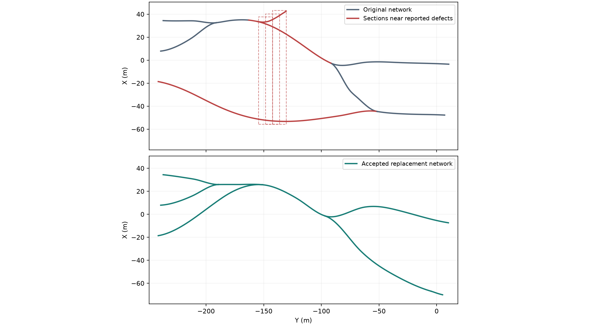

# Upstream repair and recovery — 13 September 2026

The base-mesh pipeline now feeds rejected surface evidence back into section and
network generation. Normal generation, full reliability workers and the short
inspection helper share this recovery stage. It runs automatically before floor
sampling, events and export.

The original host and root seed remain fixed. Local repairs retain the graph and
must contain every original input section centre as well as every newly sampled
centre. A replacement network is an explicit, separately recorded outcome. It
must satisfy the unchanged host, morphology, flow, section and geometry gates.

## Bounded policy

The existing surface loop tries at most six independent density/detail candidates.
After it is exhausted, the default upstream policy tries:

1. Denser section sampling on segments near measured defective regions.
2. The existing width-clearance repair, with a 15% target reduction bounded by
   configured width and gradient limits, followed by rebuilt junctions/sections.
3. At most two replacement network searches using a versioned derivation from
   the original network-stage seed, against the same host object.

The two local attempts are a global budget, not renewed for every replacement.
The default ceiling is five base builds and thirty surface candidates; rejected
section checks, unavailable targets and duplicate candidates skip meshing. No
resolution, memory, roof-strength, gravity or export budget is silently changed.
Programming/domain/resource errors escape immediately instead of becoming retries.

Diagnostics use overlapping mesh patches with manifold boundaries to measure
local genus, along with detached components, bad edges and obstructed centres.
The spatial regions are coarse suspects, not a minimal set of defective triangles;
patches may cover nearby unrelated passages and handles may be intentional in a
cyclic network. Full acceptance checks determine whether an attempted repair is
usable. If localization fails, under-resolved junctions are labelled as hypotheses.

## Artifact and resume consistency

`pipeline_recovery.json` retains the original failure, local targets, attempted
changes, rejected checks, replacement seeds and final identities. It is written
atomically. One checkpoint holds the accepted network, sections, base geometry
and journal. Downstream checkpoint names include the accepted realization's
identity. Final B/C data, plots, resolution report and exports use that triple.
Restoring it republishes the same recovery journal.

A real CLI integration test forces initial rejection and verifies the final
network/section artifacts, successful export, manifest hashes, accepted-checkpoint
reuse, and byte-identical GLB after resume. The saved-stage renderer and topology
checker were updated for the new checkpoint names and tested against a run whose
provisional network checkpoint was deliberately corrupted; both use the accepted
realization correctly. Separate tests verify finite exhaustion,
duplicate skipping, same-host seed derivation, lost-route rejection, local sampling,
width bounds, actual mesh localization and immediate propagation of unsafe errors.

## Verification

- 35 recovery tests passed, including two integration tests and the retained-recipe
  check. One integration test runs actual stamping after section resampling; the
  original failure is injected to exercise that branch independently of future
  improvements to the original geometry generator.
- Broader suite: 722 passed, 18 skipped, 12 deselected; 59 subtests passed.
  Seventeen skips require external HLSL/Unity compiler configuration; the remaining
  skip is an optional native test collection. These are not native-engine passes.
- Focused suite: 230 passed and 50 subtests passed, including ordinary CLI completion.
  These counts overlap the broader suite and recovery tests; do not add them.
- Repository-wide Ruff passed. Mypy passed across 103 production source files.
- An initial end-to-end test rejected a source edit made while it was running.
  The test was rerun successfully with production source frozen.

Evidence is retained under `outputs/recovery_validation_20260913`. The generation
package source, frozen throughout the full campaign, is
`fecc526b8227139505506ef35c75584e85612fe38e9ebc94c7961cb67858cbd7`.
Diagnostic checkpoint consumers were updated and integration-tested separately;
they are not executed by the campaign worker. The earlier development probe changed
source during execution and is explicitly excluded from reproducibility evidence.

## Retained seed-1 failure

This is one regression case plus one cold replay, not a new ten-cave campaign.
It uses the earlier 250 m, three-system, 12 cm configuration, with neutral maps,
collision enabled and no rocks. The original host/network/section identities
match the previously failing batch exactly.

| Attempt | Result |
|---|---|
| Original network | All six surface candidates rejected |
| Local section resampling | All six candidates still rejected |
| Local width clearance | Rejected before meshing: sustained uphill sections on segment 8 |
| First replacement network search | Accepted after the existing inner network screening and six surface candidates |

The replacement search starts with network seed `2493477688`; its fifth inner
network candidate is selected with seed `3355024306`. Root seed 1 and the host
remain unchanged. The accepted network has eight segments and 540.03 m combined
passage length for the 250 m route target.

The first full worker passed generated-mesh inspection, prepared/serialized export
inspection and portable validation. Its mesh is a single closed component with
genus 0 matching the graph, 1,217,552 triangles and 541 inspected route centres.
The GLB is 46,049,524 bytes. Export/collision budgets were unchanged.

**The full case and cold replay passed.** Host, network, section, exact mesh-array
and GLB identities match; the complete recovery journals also match exactly.
Both runs retained the original failure and rejected the same local candidates.
The final campaign reports unchanged generation source and inputs, and a separate
report-only audit verified both sets of saved-file receipts.

The original worker took 1,012.71 seconds and used about 3,009 MiB peak resident
memory. The replay took 966.77 seconds. Both stayed within their configured
3,600-second and 8,192-MiB worker limits; the memory limit is an address-space
ceiling, distinct from measured resident memory.

| Identity | SHA-256 |
|---|---|
| Host | `18b72cf859d0c6c9ca4744553e9126b19d0bedd19c5dc41656b5f3f802e4c329` |
| Accepted network | `8b5b2303e93a9e2628254f6ba2054b9d2ad075ee9705ea93db5c8fcbbc4321c2` |
| Accepted sections | `72a1d1237e217651ccb0a4ddd67de6f6c52862d52bb1a4cb0038493873e45925` |
| Mesh arrays | `ca9998017baf7e49da2cfc1edae14cbd439f63efd633a2d4ead98d937ff13fcf` |
| GLB bytes | `e9e2944b0ee2e76f84fa09d13f89bf030af38d1bfa7b9f640c9a088b20a041bc` |
| Recovery journal identity | `a3cd9c85039ba1c2680660ef88bbacd9b22870dbe1642d2b09547ad2b0cd5072` |

[Full campaign report](../../outputs/recovery_validation_20260913/multi_seed1/report.html)
· [Final verification summary](../../outputs/recovery_validation_20260913/verification_summary.json)


The accepted surface uses relief scale 0 with one-voxel closing and opening.
This omits the added accretion layer; it does not erase the underlying section
shape and stamped roughness. The original collider is retained because its
simplification fails inspection. There are 110/541 input profiles below the
8-voxel resolution heuristic. These warnings remain in the report.



Centre lines only, not actual mesh silhouettes. Red sections intersect the coarse
reported defect regions. The replacement satisfies the same configuration; it is
not presented as a local repair of the original graph.

## Reproduce without disposable outputs

```bash
uv run --no-sync plume-check \
  --configs tests/fixtures/recovery/seed1_multi_250m.toml \
  --seeds 1 --scope full --timeout 3600 --memory-limit-mib 8192 \
  --output outputs/recovery_seed1
```

Use a fresh directory. The recipe contains no required external maps or rocks. Its active resolved
configuration was verified to match the retained batch recipe exactly; only
disabled rock-provider paths differ.
The default includes a fresh-process replay without checkpoints. Recovery journals,
mesh/GLB hashes and source/input identities must all match. These checks do not
certify geological realism, continuous rover clearance, exhaustive triangle
self-intersections or Blender/Unity/Unreal shader rendering.
