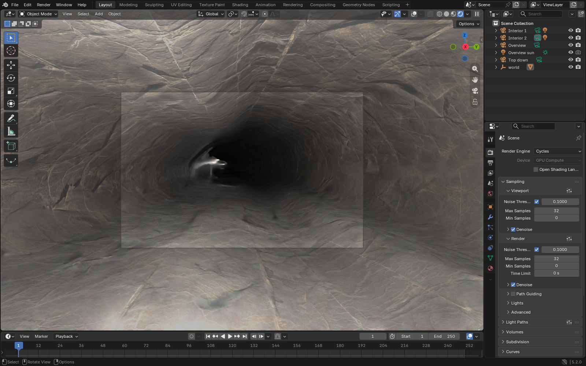
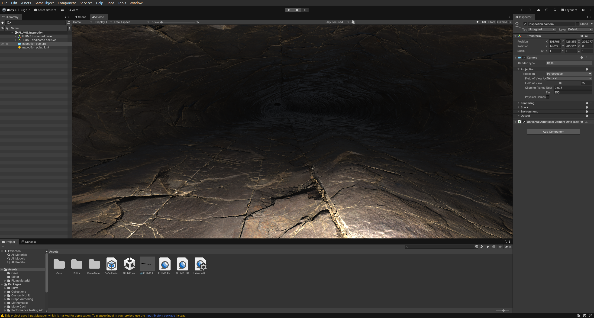
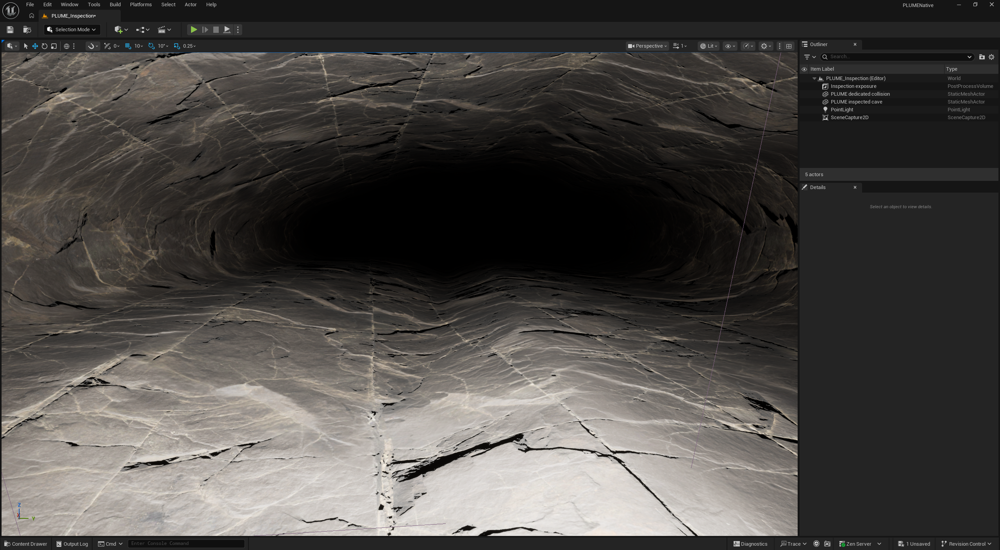

# Simulator imports

[← Project overview](../README.md)

These examples show **the application interfaces**, not just detached renderer output.
The UI captures use the same 120 m route-target, single-source, rock-free cave
with 4K maps. Cameras and lighting differ between applications.

| Application | Automated import check | UI capture |
|---|---|---|
| Blender | 4.0.1 / Cycles | 5.2.0 LTS |
| Unity | 6000.6.0f1 / Vulkan | 6000.6.0f1 / OpenGL |
| Unreal Engine | 5.8.2 | 5.8.2 |
| Gazebo Harmonic | Sim 8.15.0 | Sim 8.15.0 |
| NVIDIA Isaac Sim | 6.1.0-rc.26, source build | 6.1.0-rc.26, source build |

The automated checks cover imports, textures and selected collision probes;
they do not certify ground-robot traversability. [Evaluation](evaluation.md#native-engine-qualification)
describes the separate qualification workflow.

Screenshots and their [capture index](simulators/ui/gallery.json) live under
`docs/simulators/`, so clearing `outputs/` does not remove them. The older raw
render evidence remains in the [render index](simulators/gallery.json).

## Prepare an export

Start with [a small textured cave](usage.md#textured-caves). In the instructions
below, `export_all/` refers to that run's export directory. Keep each package and
its texture files together. Install only the simulator you want to use.

## Blender



*Blender 5.2 editor with the cave, scene hierarchy and render settings visible.
[Earlier Cycles render](simulators/2026-09-16/blender.png) ·
[Blender 4.0.1 import measurements](simulators/2026-09-16/blender.json).*

For an ordinary import, choose **File → Import → glTF 2.0** and open
`export_all/blender/plume_cave_scene.glb`. Its embedded UV textures are visible
in Material Preview or Rendered shading. To create the illuminated inspection
scene with the native material and interior views, run from the repository root:

```bash
/path/to/blender --background --python-exit-code 1 \
  --python scripts/create_blender_inspection.py -- outputs/textured_cave \
  --mapping triplanar --quality standard --interior-only
```

Open `export_all/blender/plume_continuous_inspection.blend` inside that run.
The script packs the maps into the scene. Use `--mapping uv` to inspect the
portable GLB material instead. The same script also accepts a Blender-only
generation with its `export_blender/` directory.

## Unity



*Unity's Game view, hierarchy, project assets and camera inspector.
[Earlier native render](simulators/2026-09-13/unity.png) ·
[Recorded native measurements](simulators/2026-09-13/unity.json).*

Use the GLB and separate collision mesh from `export_all/unity/`, together with
the supplied `continuous_material/unity/` installer and shader. Follow the
exported `README_IMPORT_UNITY.txt` and `continuous_material/SETUP.txt` for the
render-pipeline setup. The GLB alone carries the portable UV material; it cannot
install the native shader. The [native qualifier](evaluation.md#native-engine-qualification)
creates and tests a Unity project for a new simulation delivery.

## Unreal Engine 5



*Unreal's level viewport, actor outliner and editor controls.
[Earlier native render](simulators/2026-09-13/unreal.png) ·
[Recorded native measurements](simulators/2026-09-13/unreal.json).*

Use `export_all/ue5/` and follow its `README_IMPORT_UE5.txt`; the material builder
is in `continuous_material/unreal/`. Retain the separate static collision mesh
and verify the import settings before enabling Nanite or changing mesh reduction.
Use the [native qualifier](evaluation.md#native-engine-qualification) to validate a new cave
with the supplied Unreal adapter. The screenshot is a visualization example,
not evidence that an arbitrary new seed is simulation-ready.

## Gazebo Harmonic


*Gazebo's world view, entity list and simulation controls.
[Earlier Ogre2 camera output](simulators/2026-09-16/gazebo.png) ·
[Recorded contact measurements](simulators/2026-09-16/gazebo.json).*

Gazebo receives separate visual and static triangle-collision meshes in metres,
with Z up. Explicit SDF PBR bindings carry base color, normal and roughness maps.
Collider normals are exported because Harmonic's DART/ODE mesh path requires
them. Keep the complete model directory together.

```bash
# Uses Gazebo's system Python bindings (gz.transport13, gz.msgs10) and Pillow.
/usr/bin/python3 scripts/check_gazebo.py \
  outputs/textured_cave/export_all/gazebo/plume_cave_scene \
  --view docs/simulators/2026-09-16/view.json \
  --output outputs/textured_cave/gazebo_native
```

For interactive use, follow `README_RUN_GAZEBO.txt` in the export directory.
The checker adds an interior camera, point light and contact probe to its own
`inspection.world.sdf`; it does not modify the exported cave. Its renderer uses
[Gazebo's headless Ogre2 path](https://gazebosim.org/api/sim/8/headless_rendering.html).

## NVIDIA Isaac Sim


*Isaac Sim's viewport, stage tree and simulation controls.
[Earlier RTX camera output](simulators/2026-09-16/isaac.png) ·
[Recorded PhysX measurements](simulators/2026-09-16/isaac.json).*

Use `export_all/omniverse/plume_cave_scene.usd` (or `export.target = "omniverse"`)
and keep its texture directory beside it. The stage declares metres and Z up,
uses repeated UV textures, and marks the hidden static collider with
`PhysicsMeshCollisionAPI` and `approximation = "none"`. Convex-hull collision
would fill the cave interior.

```bash
ISAAC_SIM_DIR=/path/to/isaacsim/_build/linux-x86_64/release
"$ISAAC_SIM_DIR/python.sh" --no-ros-env scripts/check_isaac_sim.py \
  outputs/textured_cave/export_all/omniverse/plume_cave_scene.usd \
  --view docs/simulators/2026-09-16/view.json \
  --output outputs/textured_cave/isaac_native
```

The checker loads the USD in Isaac Sim, checks texture resolution and material
binding, simulates a small dropped box with PhysX, and saves an RTX camera image.
It requires a working Isaac runtime and GPU access; ordinary Python tests do not
launch either simulator.

Open the checker's `isaac_native/inspection.usda` to inspect its camera, light
and probe interactively. The original exported cave has no inspection lighting.
The supplied `view.json` belongs to `config/simulator-check.toml` with its default
seed; select a new interior position and floor height when checking a different cave.

If SDL fails while building Isaac Sim from source because it discovers optional
host text/input libraries, see the [recipe patch used for this build](simulators/2026-09-16/isaac-sdl.patch).
Allow enough disk space for dependencies, extension unpacking and build artifacts.

Both adapters currently use their portable **UV materials**. The blended
projection shaders supplied for Blender, Unity and Unreal do not automatically
transfer to Gazebo or Isaac Sim, so UV-chart seams and differences in lighting
can remain visible. The screenshots show those actual results.
