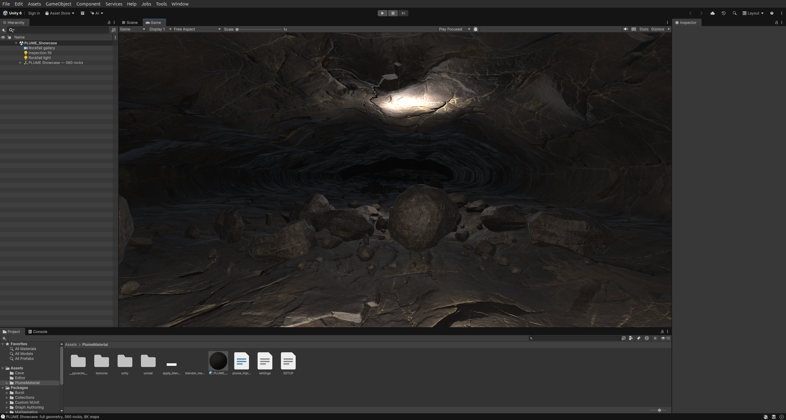
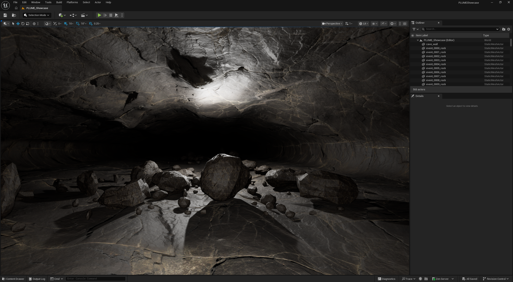

# Simulator imports

[← Project overview](../README.md) · [Generate a cave](usage.md) · [Evaluate an import](evaluation.md#native-engine-qualification)

## Prepare an export

Generate a [small textured cave](usage.md#textured-caves) for your first import,
or use the [showcase recipe](usage.md#showcase-generation) for detailed terrain
and rocks. Both export packages for all five applications.

The paths below are relative to a generation's `export_all/` directory:

| Application | Open or import | Version used for the showcase preview |
|---|---|---|
| Blender | `blender/plume_cave_scene.glb` | 5.2.0 LTS |
| Unity | `unity/plume_cave_scene.glb` | 6000.6.0f1 / URP |
| Unreal Engine | `ue5/plume_cave_scene.glb` | 5.8.2 |
| Gazebo Harmonic | `gazebo/plume_cave_scene.world.sdf` | Sim 8.15.0 / Ogre2 |
| NVIDIA Isaac Sim | `omniverse/plume_cave_scene.usd` | 6.1.0-rc.26, source build |

Keep the whole export directory, including textures, colliders and import
instructions. All-target packages share one material bundle at
`export_all/continuous_material/`, alongside the application folders.
A [re-export](usage.md#retry-an-export-without-regenerating) writes
these application folders directly into its destination and uses the basename
`plume_cave`. Use the actual paths in the package's manifest and import guide.

**Rendering and simulation are separate checks.** The screenshots show the full
visual showcase: three systems, a 300 m downstream target, 560 rocks and boulders,
8K textures and 15.57 million visual triangles. They share a rockfall viewpoint,
with lighting and framing adjusted per renderer. They do not certify collider
performance or robot traversability. The [evaluation guide](evaluation.md#native-engine-qualification)
describes those checks.

## Blender


*Cycles rendered viewport with the native continuous cave material and textured rocks.*

1. Choose **File → Import → glTF 2.0** and import the GLB.
2. Switch to **Material Preview** to inspect its embedded textures. Add interior
   lighting before using Rendered shading or producing a camera render.
3. For the continuous cave material, open the package's
   `continuous_material/apply_blender_material.py` in the Scripting workspace
   and run it. It updates `cave_wall`, packs its images and leaves the rocks intact.
   Save your scene as a `.blend` file.

For a **rock-free** generation, the inspection helper can create a lit scene
and select interior cameras automatically:

```bash
/path/to/blender --background --python-exit-code 1 \
  --python scripts/create_blender_inspection.py -- outputs/textured_cave \
  --mapping triplanar --quality standard --interior-only
```

Open `export_all/blender/plume_continuous_inspection.blend` inside that run.
The helper expects a single cave-wall mesh; use the manual import steps above
for a showcase containing rock objects.

## Unity



*URP Game view with the scene hierarchy and assets visible.*

1. Create or open a URP project and activate its render-pipeline asset **before**
   importing the GLB. Use a glTF importer such as the supplied harness's glTFast.
2. Import the complete visual scene, then copy the `continuous_material/` bundle
   under `Assets/`.
3. Choose **Tools → PLUME → Create continuous rock material (URP)**, select the
   bundle's `settings.json`, and assign the material to the cave renderer.
   Rocks keep their imported PBR materials.
4. Follow `README_IMPORT_UNITY.txt` for the separate static collider. Verify its
   scale and alignment before adding a robot.

If you switch render pipelines after import, reimport the GLB. Allow shader
compilation to finish and resolve Console errors before assessing the material.

## Unreal Engine 5



*Level viewport with the actor outliner and editor controls.*

1. Import the GLB with Interchange, following `README_IMPORT_UE5.txt`.
2. Enable **Python Editor Script Plugin**. Choose **Tools → Execute Python Script**
   and run the bundle's `continuous_material/unreal/create_material.py`.
3. Assign the generated material to the cave mesh; keep the rocks' PBR materials.
4. Import and configure the separate static collider as described in the package.
   Initially disable **Build Nanite** so a reduced fallback does not silently
   change collision geometry. Validate any later reduction in your simulation.

Allow texture streaming and shader compilation to finish before assessing the view.

## Gazebo Harmonic


*Ogre2 world view with the entity list and simulation controls.*

Open the generated world using `README_RUN_GAZEBO.txt`. It explains how to set
`GZ_SIM_RESOURCE_PATH` to the model's parent directory and start `gz sim`.
Keep `model.sdf`, meshes and textures together. Add interior lighting and place
the camera inside a passage; the export does not include the preview's lighting.

Gazebo uses separate visual and static triangle-collision meshes in metres,
with Z up. The SDF binds the color, normal and roughness maps. Its portable UV
material can show chart seams; some rocks also show darker facets in this preview.
Run the [Gazebo import/contact check](evaluation.md#gazebo-and-isaac-import-checks)
before using the package for simulation.

## NVIDIA Isaac Sim


*RTX viewport with the stage tree and simulation controls.*

Open the exported USD and retain its adjacent texture directory. The stage
declares metres and Z up. Add interior lights and a camera, saving inspection
changes in a separate stage or session layer to preserve the export.

The hidden static collider uses triangle-mesh collision with
`approximation = "none"`. A convex hull would fill the cave interior. A successful
visual import does not establish that PhysX can cook a very large collider;
run the [Isaac import/contact check](evaluation.md#gazebo-and-isaac-import-checks)
before starting a robot simulation.

## Materials and inspection

| Material path | Applications | Behavior |
|---|---|---|
| Portable UV PBR | All five | Travels with the export; texture chart seams can remain visible |
| Native blended projection | Blender, Unity, Unreal | Reuses the same maps across three blended projections; install from `continuous_material/` |

GLB import cannot install a custom native shader. The bundle's `SETUP.txt` is
the detailed material reference, including data-map import settings and shader
limitations. Gazebo and Isaac use portable UV materials.

| Symptom | Check |
|---|---|
| Plain grey cave | Use a textured recipe and material/rendered shading; the first-cave recipe deliberately has a neutral material |
| Missing or pink materials | Retain texture files, check the importer/render pipeline, and inspect shader errors |
| Dark interior | Add lights inside the passage and adjust exposure |
| Persistent bright speckles | Check lighting and normal strength; allow enough samples and enable denoising where supported |
| Visible floor seams | Apply the native blended material where available; it does not repair mesh defects |

The showcase images, [capture record](simulators/ui/gallery.json) and
[camera coordinates](simulators/ui/view.json) live under `docs/simulators/ui/`.
They remain available when `outputs/` is cleared. Camera coordinates belong to
this specific showcase and must be reselected for another cave.
