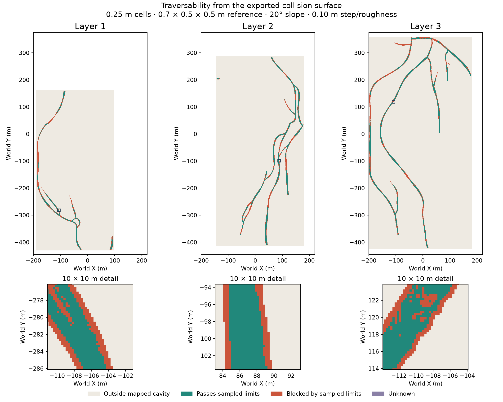
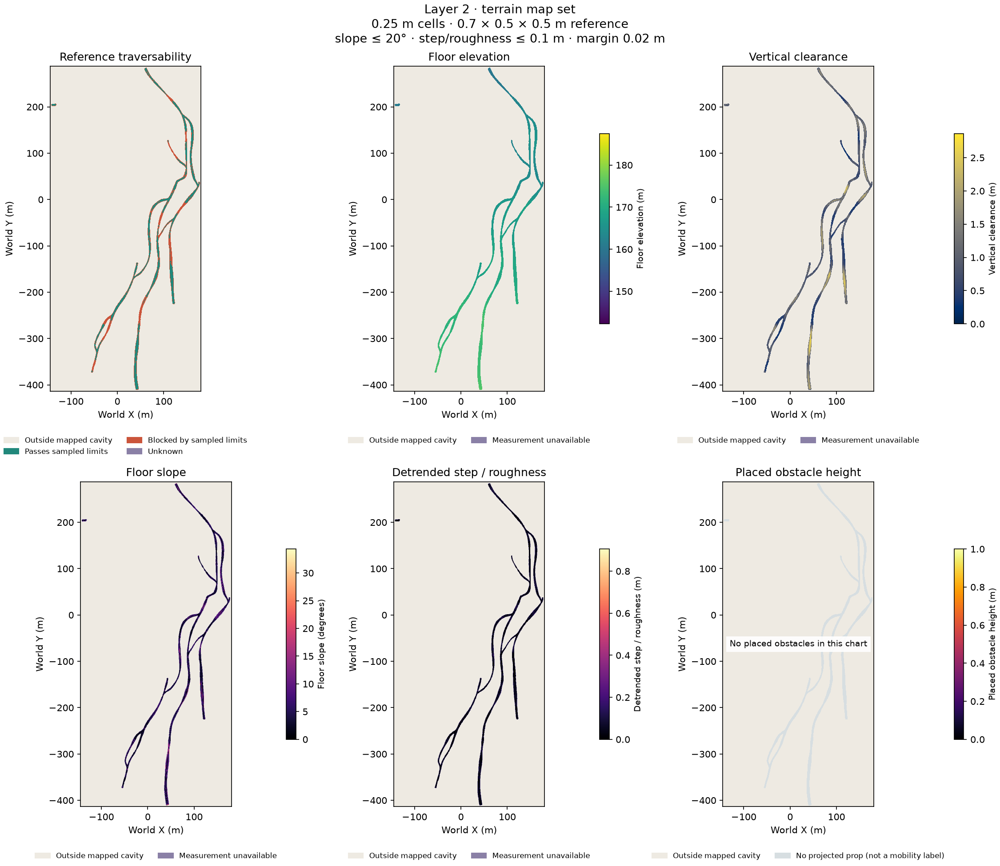

# Traversability maps

[← Project overview](../README.md) · [Generation](usage.md) · [Configuration](configuration.md#traversability-maps) · [Evaluation](evaluation.md#traversability-map-checks)

Every full generation exports **one map set per declared layer**, plus separate
sets for ramps connecting layers. A single-layer cave produces one set. Each set
separates physical measurements, reference traversability and rejection reasons. Maps use
the final exported **collision surface**, including conservative obstacles for
placed rocks. If collision export is disabled, the manifest explicitly records
that the visual surface was used instead.



*Three layers from [branching-layers-full.toml](../config/branching-layers-full.toml),
seed 42, with no rocks. The mesh and maps both use 0.25 m spacing. Green passes the
sampled reference limits; orange fails them. The inset shows individual cells.
These are static geometric classifications, not robot qualification or simulated
driving results. Narrow passages require a resolution study for quantitative use.*

## Different maps answer different questions

Open `layer_0_overview.png` for a first look. Individual images retain the full
chart extent and show axes, units and legends. Each layer and ramp has nine views:

| View / filename suffix | Question answered | Interpretation |
|---|---|---|
| `.png` | Where does the reference envelope pass the sampled limits? | Combined classification; not universal robot qualification |
| `_floor_elevation.png` | How does the ground elevation change? | Absolute world Z, metres |
| `_ceiling_elevation.png` | Where is the roof? | Absolute world Z, same datum and colour scale as the floor |
| `_clearance.png` | What is the local floor-to-ceiling gap? | Vertical ray clearance, metres; independent of footprint size |
| `_slope.png` | How inclined is the supporting floor? | Fitted-plane slope over the reference footprint, degrees |
| `_step_roughness.png` | Where are abrupt steps or uneven patches? | Detrended floor variation over the footprint, metres |
| `_body_headroom.png` | How much room remains over the whole footprint? | Minimum ceiling minus maximum floor, metres |
| `_obstacles.png` | Where are placed rocks or other props? | Conservative projected height above the floor; not a terrain drivability label |
| `_reasons.png` | Why is a cell rejected or uncertain? | Six panels: support, slope, roughness, headroom, props and uncertainty; several can apply |



*Six-view overview of one layer. All panels use the same world coordinates.
The remaining views—ceiling elevation, body headroom and rejection reasons—are
separate files in the same map set. This example has no placed rocks.*

**Colour scales are shared across all layers and ramps within an export**, with
linear physical units and no clipping of finite values. Both absolute elevation
views share a common Z range. The manifest records each scale and measured range;
different exports can have different ranges. Missing measurements are marked
explicitly, never painted as zero slope or zero roughness. In the reasons view,
“not flagged” can mean unevaluated, rather than passed.

These images are views of the same NPZ data. They do not add measurement resolution
or change classifications. Use the numeric arrays for experiments rather than
recovering values from a colour image.

## Find or regenerate the maps

New runs save maps in `export_<target>/traversability/`; an all-target export shares
one set at `export_all/traversability/`. They are included in the run's output
hashes. The network-only command cannot produce terrain maps because it has no
surface to measure.

| File | Contents |
|---|---|
| `layer_0_overview.png`, … | Six-panel entry point for each layer; file indices start at zero |
| `layer_0.png`, `layer_0_slope.png`, … | Separate classification and measurement views listed above |
| `layer_0.npz`, … | Numeric ground-truth arrays, reference classification and rejection reasons |
| `layer_0_occupancy.png`, … | Aligned, unannotated raster; 0 occupied/excluded, 254 passes reference limits, 205 unknown |
| `ramp_<segment_id>.*` | The same data for each inter-layer connection |
| `manifest.json` | Configuration, coordinates, portals, `views` mapping filenames to NPZ fields, shared `display_scales`, hashes, surface identity and limitations |

To add maps to an existing completed run, without regenerating the cave:

```bash
uv run plume-traversability --source outputs/first_cave
```

This saves a separate `outputs/first_cave/traversability/` directory, verifies the
saved geometry and section hashes, and leaves the original run unchanged. It
requires a neutral, Blender, Unity or Unreal **GLB package and its collision OBJ**
when collision was enabled. New full generations produce maps for every export
target, including Gazebo and Omniverse.

Use `--config config/my_recipe.toml` to select different `[traversability]`
settings, `--resolution 0.1` to change cell size, or `--output` to retain another
map revision. Changing map limits never changes the mesh, retries a seed or
turns robot qualification on. The default is 0.25 m cells; a finer map samples
the existing mesh more closely but cannot recover missing geometric detail.

## Numerical ground truth

Load NPZ files with `numpy.load(path, allow_pickle=False)`. All distances are
metres and angles are degrees. Keep **raw terrain measurements** as ground truth;
choose the classification limits for the robot used in each experiment.

| Array | Meaning |
|---|---|
| `floor_z_m`, `ceiling_z_m` | Absolute world heights at each cell centre; NaN where no cavity was selected |
| `vertical_clearance_m` | Ceiling minus floor at that ray |
| `slope_deg` | Inclination of a fitted floor plane over the reference footprint |
| `step_m` | Peak-to-peak floor residual after removing that plane; a combined step/roughness measure |
| `body_clearance_m` | Minimum ceiling minus maximum floor over the reference footprint |
| `obstacle`, `obstacle_height_m` | Conservative placed-prop occupancy and its upper height relative to the floor |
| `status` | 0 outside mapped cavity, 1 passes sampled limits, 2 blocked, 255 unknown |
| `reason_bits` | Bit mask: 1 incomplete support, 2 slope, 4 step/roughness, 8 headroom, 16 prop, 32 uncertain surface |
| `component_id` | Four-connected regions of passing cells within this chart; zero elsewhere |
| `origin_xy_m`, `resolution_m` | Grid registration, stored with every NPZ |

Slope, step and body-clearance fields depend on footprint size and are NaN where
the full footprint lacks sampled floor support. Floor and ceiling arrays do not
depend on the robot dimensions. Placed rocks remain obstacles rather than
climbable floor surfaces. Their projected triangle bounding boxes conservatively
cover sub-cell rocks, but may overestimate their footprint and height.

## Coordinates and connections

Arrays use `[row_y, column_x]`, with **row zero at the south edge**. `origin_xy_m`
is the southwest grid corner, not the centre of the first cell:

```python
x = origin_xy_m[0] + (column + 0.5) * resolution_m
y = origin_xy_m[1] + (row + 0.5) * resolution_m
z = floor_z_m[row, column]
```

The unannotated PNG is vertically flipped: its first row is at the **north** edge.
The labelled preview is for reading, not pixel indexing. Charts can have different
origins and extents, but share the same resolution and world-aligned lattice.
Coordinates use PLUME's right-handed Z-up metre frame. Apply the asset's simulator
import transform, including any scene placement, to align robot poses with these
maps; do not treat GLB's Y-up coordinates as map XY.

**XY overlap does not connect layers.** Each ramp chart records its layer IDs,
network endpoint nodes and 3D centreline. Each chart's `portals` list records its
neighbouring chart, endpoint XYZ, cell index, sampled status and component ID.
These describe topological connections, not certified driving transitions. A
planner must inspect the ramp and both endpoints; component IDs are local to a
chart and must not be equated across files.

## Classification and limits

The default reference is **0.7 × 0.5 × 0.5 m**, with 0.02 m margin, 20° maximum
slope and 0.10 m maximum detrended step/roughness. A circumscribed horizontal disk,
expanded by half a cell diagonal, conservatively represents the rectangular
footprint without choosing a heading. Each passing cell needs supported floor,
sufficient headroom, acceptable slope/roughness and no overlapping prop.

Maps are sampled geometric ground truth for the exported surface, not friction,
traction, suspension, steering, sensor noise or dynamics models. Narrow features
between ray samples can be missed. The declared layers plus ramp charts separate
stacked passages; an undeclared overpass within one chart still has only one
selected vertical interval per cell. Assess both mesh and map resolution for
experimental claims. A green region is not a guarantee of an executable route.

The map grid has an explicit allocation budget. If it is exceeded during a full
export, the cave is retained, a warning is reported, and the map manifest says
`status: "not_generated"`. Increase the explicit map budget or map a smaller run,
then use `plume-traversability`; an absent map is never represented as a success.
