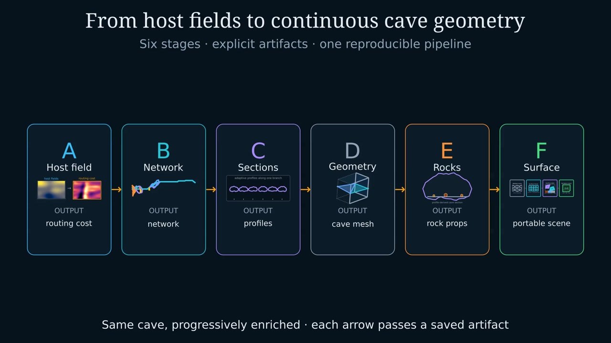

# PLUME-Advanced Manim video project

This project renders scientific animation from saved, hash-bearing PLUME stage
artifacts. Rendering never invokes cave generation.

## Watch the complete animation

[](../../../docs/media/FullPipeline.mp4)

[Open or download FullPipeline.mp4](../../../docs/media/FullPipeline.mp4)
— 3 min 36 s, 1920 × 1080 at 30 fps, with seven chapter markers.
This documentation copy remains available without generating the local renders.

The compilation contains the overview followed by A, B, C, D, E, and F.
Stage E shows grounded rocks and boulders only; Stage F's surface styles are
schematic, not exported texture channels. Individual videos remain independent.

## Setup

Install the optional video dependencies:

```bash
.venv/bin/pip install -e '.[video]'
```

FFmpeg must be available on `PATH`. Manim may also require platform packages
for Cairo, Pango, and LaTeX depending on the scenes being rendered.

## Prepare one frozen hero run

```bash
.venv/bin/python scripts/prepare_manim_assets.py \
  --config config/project.toml \
  --body earth
```

The command runs only Stages A-C and writes frozen host-field JSON/NPZ,
network JSON, section JSON/NPZ, and a provenance manifest to
`paper/media/video/assets/hero/`. It
refuses to replace existing prepared inputs unless `--force-overwrite` is
provided.

## Render the prototype

Fast development render:

```bash
.venv/bin/python scripts/render_manim_video.py --quality low
```

1080p review render:

```bash
.venv/bin/python scripts/render_manim_video.py --quality high
```

All wrapper renders use 30 fps. A successful render writes a provenance JSON
beside the video with the Manim version, exact command, source hashes, selected
hero segment, and output hash. Render products and Manim's partial-movie cache
are local artifacts ignored by Git.

All scenes use `PresentationText`, which shapes glyphs at 32x size before
scaling their vector paths down. This avoids uneven letter spacing caused by
small-font Pango advance rounding; keep this shared renderer for new labels.

The `GraphToGeometryPrototype` scene tracks the same highlighted segment from
the Stage-B network through Stage-C profiles into a schematic Stage-D carved
volume. The rendered frame includes abbreviated semantic hashes for the input
network and section field.

Use `--hero-segment ID` to select a scientifically important branch or
junction after inspecting `stage_b_network.json`. Without the option, the
loader chooses the segment with the most Stage-C samples.

## Render standalone stage assets

```bash
.venv/bin/python scripts/render_manim_video.py --all-stages --quality high
```

This produces an overview followed by six independent stage videos. These
links become available locally after rendering:

- [PipelineOverview.mp4](renders/video/PipelineOverview.mp4) introduces the complete A-to-F pipeline and ends with
  aligned artifact thumbnails showing the same cave being progressively enriched;
- [StageAHostField.mp4](renders/video/StageAHostField.mp4) reveals the frozen host fields, preserves one shared
  map marker, and identifies the saved routing-cost handoff;
- [StageBSemanticFlow.mp4](renders/video/StageBSemanticFlow.mp4) begins with the Stage-A elevation and routing-cost
  handoff, resamples the cost field into the network's exact rotated world
  frame, then draws directed segments according to propagated lava age;
- [StageCAdaptiveSections.mp4](renders/video/StageCAdaptiveSections.mp4) uses the same rotated plan view as Stage B and
  links each moving sample to its profile while reporting normalized distance;
- [StageDMarchingCubes.mp4](renders/video/StageDMarchingCubes.mp4) explains profile-SDF stamping, voxel
  classification, Lewiner marching-cubes triangulation, and cross-chunk vertex
  welding while retaining a persistent five-step progress rail.
- [StageEGeologicalEvents.mp4](renders/video/StageEGeologicalEvents.mp4) compares the Stage-D cave surface before and
  after surface-aware grounding of separately editable rock and boulder props;
- [StageFSurfacePreparation.mp4](renders/video/StageFSurfacePreparation.mp4) explains the implemented smoothing,
  displacement, UV/tangent, PBR packaging, and portable export path, then
  illustrates those steps on a rotating profile-backed representative asset.
  The ending uses schematic surface styles, not exported texture channels;
  an actual final-mesh turntable requires a prepared mesh and its textures.

An individual asset can be rendered with `--scene`, for example:

```bash
.venv/bin/python scripts/render_manim_video.py \
  --scene StageCAdaptiveSections \
  --quality high
```

## Assemble the complete video

After rendering the individual assets, join the overview and Stages A–F:

```bash
.venv/bin/python scripts/assemble_manim_video.py
```

This creates `renders/video/FullPipeline.mp4` with seven navigable chapters.
It copies the existing video streams without re-encoding, preserving the
corrected typography, timing, and image quality. Individual assets are unchanged;
legacy prototypes and old copies are not included. A provenance JSON records
chapter boundaries and input/output hashes. Use `--force-overwrite` to refresh
an existing compilation after re-rendering stages.

### Refresh the README video

The curated documentation copy is separate from ignored working renders.
After reviewing a new compilation, refresh it and its overview-frame preview
from the repository root:

```bash
cp paper/media/video/renders/video/FullPipeline.mp4 docs/media/FullPipeline.mp4
ffmpeg -hide_banner -loglevel error -y -ss 39 \
  -i docs/media/FullPipeline.mp4 -frames:v 1 \
  -vf scale=1280:-2 -q:v 2 docs/media/full_pipeline_preview.jpg
```

If scene timings change, choose a new overview recap frame and update the
main README's chapter guide from `FullPipeline.provenance.json`.
The clickable thumbnail and direct MP4 link work without depending on an
inline-video extension in the Markdown viewer. Include both `docs/media`
files when sharing the README; no external video upload is required.

## Design boundary

Manim owns explanatory animation, annotations, and result-plot composition.
The final textured cave fly-through remains a separate renderer shot. This
prototype intentionally represents Stage D schematically; it does not claim
to render the exported surface mesh.
